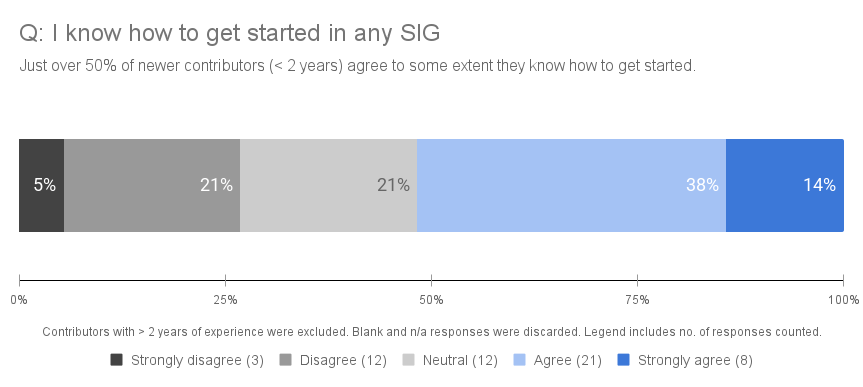
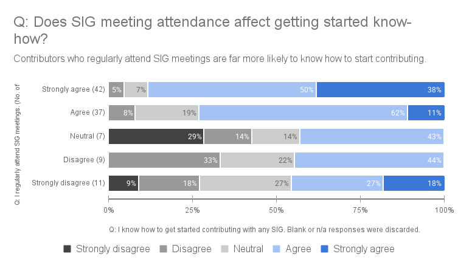
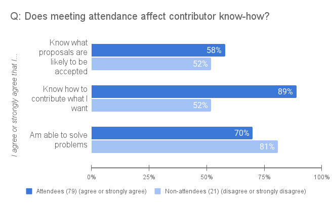
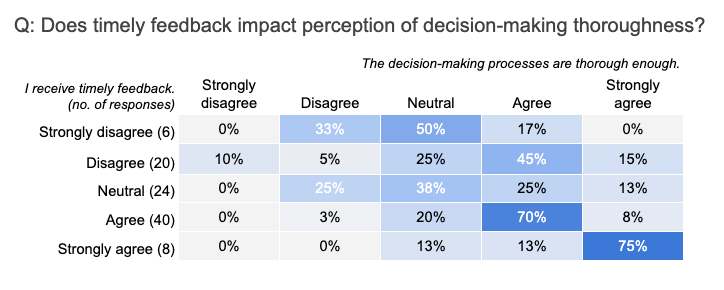
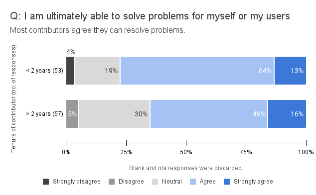
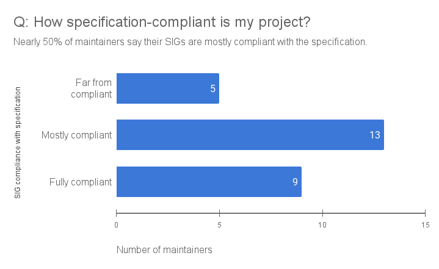
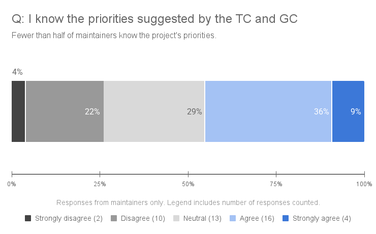
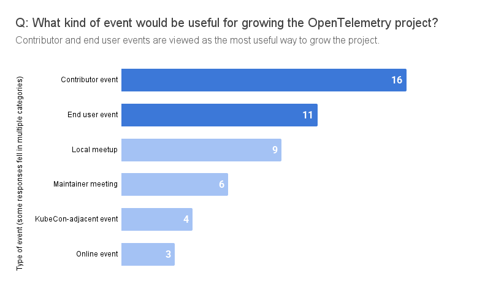
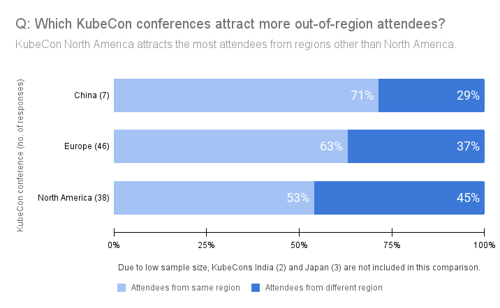
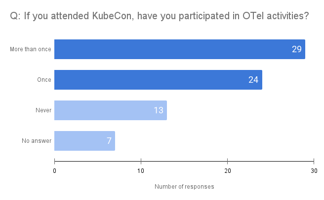

The OpenTelemetry Contributor Experience SIG
[recently surveyed](../contribex-survey/) the community to learn what it's like
to contribute to the project and what we can do to improve the contributor
experience. The Contributor Experience Survey asked contributors for their
thoughts about the project's organization, SIG contributions, leadership
committee interactions, and event attendance. We received 120
[responses](https://github.com/open-telemetry/sig-end-user/tree/main/end-user-surveys/contributor-experience)
and heard from all 47 Special Interest Groups (SIGs). We'll use this feedback to
make contributing to OpenTelemetry easier and more rewarding. A big thank you to
everyone who participated in the survey! Let's review the results.

## Key takeaways

We conducted this survey to learn what the project can do better. Here are the
key things we learned, along with areas we can improve for contributors:

- **Getting started**: 48% of newer contributors don't confidently know how to
  get started. Intra- and inter-SIG communication and contributing guides need
  improvement.
- **SIG meetings**: 82% of contributors find SIG meetings useful. Meeting
  attendance correlates to greater knowledge about navigating and contributing
  to the project, but some dislike the synchronicity meetings require.
- **Workflows**: More than half of contributors do not receive timely feedback
  on their contributions. They also experience project tooling headaches and
  gatekeeping bottlenecks.
- **Project and subproject priorities**: Less than half of maintainers can
  confidently say they know the priorities of OpenTelemetry's leadership
  committees. Contributors also say that it's difficult to find subproject
  priorities.
- **Events**: Contributors want more in-person events that are focused on
  collaboration rather than talks.

## Detailed insights

With a total of 42 questions, this survey covered the breadth of the
OpenTelemetry contributor experience. In this section, we analyze the responses
and summarize what we learned.

In some categories, the sample size is quite small and therefore the margin of
error is high. We have included the number of responses in parentheses wherever
possible.

For our analysis, we treated self-reported data as true and combined “agree”
with “strongly agree” responses, as well as “disagree” with “strongly disagree.”
So when we say, for example, “contributors who attend SIG meetings are far more
likely to know how to begin contributing in any SIG,” what we mean is that
contributors who _agreed or strongly agreed_ that they regularly attend SIG
meetings are more likely to _agree or strongly agree_ that they know how to get
started contributing.

### About the respondents

We heard from 120 contributors, including 45 maintainers and at least one
contributor from each SIG. Here's more about our respondents:

- 63% work for an observability vendor.
- 20% have been contributing for less than six months.
- 86% live in North America (45%) or
  [EMEA](https://en.wikipedia.org/wiki/Europe,_the_Middle_East_and_Africa)
  (41%). These numbers roughly match our calculations of 39% and 43%
  respectively, after classifying the
  [devstats country statistics](https://opentelemetry.devstats.cncf.io/d/50/countries-statistics-in-repository-groups?orgId=1)
  into regions.
- 43% contribute on their own time.
- 71% are members of the OpenTelemetry organization.

### Project organization

We asked contributors to tell us how they feel about organizational and
operational aspects of the OpenTelemetry project. Do they know how to get
started? Can they solve problems on their own? Are SIG meetings useful?

Knowing how to get started in a large open source project like OpenTelemetry is
challenging. We focused on our newest contributors, those who've participated in
the project for less than two years, to see how the project's onboarding
processes stand up. Of the 56 respondents in this category, just over half know
how to get started in any OpenTelemetry SIG. But that leaves 48% of newer
contributors who do not confidently know how to get started. Work is underway to
[improve contributing guidelines](https://github.com/open-telemetry/sig-contributor-experience/issues/31)
across the project, but there is clearly room to improve the OpenTelemetry
contributor onboarding experience.

One way we can potentially improve the onboarding experience is to encourage new
contributors to attend SIG meetings. Of respondents who answered the question,
**82% find SIG meetings useful**. Further survey analysis confirmed the
usefulness of meetings.

For example, we found that contributors who regularly attend SIG meetings are
far more likely to know how to begin contributing in any SIG.

Attendance at SIG meetings might have other benefits as well. Those who attend
are more likely to know which proposals have a greater chance of being accepted
and how to contribute what they want.

### Contributing to a SIG

Contributing to open source projects like OpenTelemetry takes time: both from
the contributor and the reviewer. To assess how the project is doing in its
effort to provide timely feedback, we asked survey respondents about their
experience. Less than half of those who answered (48 of 98 responses or 49%)
receive timely feedback. When we compare those answers to how contributors feel
about the thoroughness of the project's decision making, we get the following
heat map. We can loosely conclude that when contributors get timely feedback,
they are more likely to find decisions thorough enough. But analyzing this data
raises an important point: we don't know what a reasonable baseline is for
timely feedback in open source projects. We encourage other open source projects
to run contributor surveys so we can compare their contributors' experience with
that of OpenTelemetry contributors.

The survey asked contributors whether they were ultimately able to solve
problems for themselves and their users. We compared those answers to the tenure
of the contributors. The results show that a greater percentage of newer
contributors, those whose tenure is under 2 years, can resolve problems: 77% of
newer contributors v. 65% of experienced contributors.

We received
[many thoughtful responses](https://github.com/open-telemetry/sig-end-user/blob/main/end-user-surveys/contributor-experience/otel-contributor-experience-survey-free-form-questions.csv)
to our open-ended questions:

> "Do you have any additional comments regarding project organization or your
> experience contributing? Is there anything you'd like to see added to or
> changed about the OTel contributor experience?"

The answers fell loosely into four categories: tooling, communication and
documentation, meetings, and workflows.

#### Tooling

- Repositories need more automation.
- Build processes should be consistent across SIGs and repositories.
- The CI process in some repositories is painful and needs to be run over and
  over when approvals are slow.
- A single source of truth is needed for tracking code changes instead of
  combing through release notes.

#### Communication and documentation

- All SIGs should align with SIG Comms to make the official docs the go-to spot
  for all reference and instructional material.
- Most contributing guides need work.
- There are no good "getting started" materials for contributing components to
  the Collector.
- New contributors are unsure how to be helpful and add value because subproject
  priorities are unclear and repository issues are numerous and hard to find and
  understand. Some contributors choose to create a fork instead of contributing
  upstream.
- It is unclear which SIG should be approached for a proposal, resulting in
  contributors being passed from SIG to SIG.

#### Meetings

- Some people are unable to attend or uncomfortable attending SIG meetings.
- Meetings shouldn't be required to advance issues or PRs that are
  straightforward, but often it seems that's the only way to move the work
  forward.
- For those who prefer asynchronous work, meeting-driven decision-making is
  problematic.

#### Workflows

- Overburdened subprojects or components should add maintainers. Keeping the
  contribution experience as positive and welcoming as possible is a good way to
  recruit new project leaders.
- Overburdened repositories should consider adjusting write permissions.
- Reviews and discussions are painfully slow and perhaps too thorough.
- Gatekeeping by a few SIG leaders makes progress slow.

### Maintainers, Technical Committee, and Governance Committee

OpenTelemetry maintainers made up 37.5% of our total survey respondents. We
asked them to report on their experiences contributing in a leadership role. How
autonomous do they feel? Do they have a lot of work to do to make their SIG
specification-compliant? Are they supported by the Technical and Governance
Committees?

Maintainers report feeling a high level of autonomy. On a scale of 1 (low) to 5
(high), none rated their autonomy lower than a 3, and 89% rated their autonomy 4
or 5.

Of the 43 maintainers who answered the question about their SIG's compliance
with the OpenTelemetry specification, 16 said their SIG does not implement the
specification. The remaining 27 rated their SIGs as far from, mostly, or fully
compliant. Nearly 50% say their projects are mostly compliant.

Two-thirds of maintainer respondents (29 of 44) have interacted with the
Technical Committee or Governance Committee, but fewer than half of them know
the leadership committees' priorities.

The responses to other questions relating to the Technical and Governance
Committees are being compiled and analyzed separately from this blog post. We
plan to present the results to OpenTelemetry maintainers and the committees in
public channels in the near future.

### Events

We asked respondents to tell us in their own words what kind of event would be
useful for growing the project. Thirty-two contributors responded and nearly all
of them said they want more in-person events. Many also specified that they'd
rather use the time to collaborate with each other than listen to talks. We
grouped the responses loosely into six categories. Some responses fell in
multiple categories.

We also asked contributors about their past and future attendance at
[KubeCon + CloudNativeCon](https://www.cncf.io/kubecon-cloudnativecon-events/),
the flagship conference for cloud native technologies. With the inaugural
[KubeCon Japan](../kubecon-japan/) being held in June 2025, there are now 5
KubeCon conferences: China, Europe, India, Japan, and North America. Here's what
we learned about the attendance of OpenTelemetry contributors at KubeCon events.

More than half of respondents in each region of the world have attended KubeCon
in the past or plan to in the future.

> **Percentage of respondents who have attended or plan to attend any KubeCon
> event** _By region of residence_
>
> | Asia, Pacific Islands, Australia and New Zealand (14) | Central America, the Caribbean and South America (7) | Europe, Africa and the Middle East (65) | North America (56) |
> | :---------------------------------------------------: | :--------------------------------------------------: | :-------------------------------------: | :----------------: |
> |                          71%                          |                         57%                          |                   71%                   |        64%         |

We were interested to learn which KubeCon conferences attract larger numbers of
OTel attendees from outside the conference region. A total of only 5 respondents
reported attendance for the KubeCon conferences in India and Japan, so we didn't
include them in the following comparison. But it is interesting to note that all
5 respondents were from regions other than APAC. Of the 3 remaining conferences,
KubeCon North America has the greatest share of OpenTelemetry contributors
traveling from other regions.

Among those respondents who have attended a KubeCon event or plan to in the
future, there is overwhelming interest in a separate, dedicated OpenTelemetry
contributors-only event in their region: 63 of 73 or 86% would attend such an
event. By contrast, those respondents who haven't and don't plan to attend
KubeCon have marginally less interest in attending a dedicated contributor event
in their region: 34 of 46 or 74% say they'd attend.

We analyzed one final event question: If you have attended KubeCon +
CloudNativeCon, have you participated in OpenTelemetry activities, including the
OpenTelemetry Observatory, Contribfest or the maintainer track session? Of the
73 respondents who have attended or will attend a conference, 53 or 73% say they
have also attended an OTel-specific event at least once.

### Survey feedback

Finally, we asked respondents to give us feedback on the survey itself. One of
the answers we received multiple times is that respondents would like a way to
answer questions or give feedback about specific subprojects. We will
investigate offering future surveys to address this request.

## Learn more

For detailed results, see the anonymized
[survey responses](https://github.com/open-telemetry/sig-end-user/tree/main/end-user-surveys/contributor-experience).

## Your feedback is essential

Thanks again to everyone who participated in the survey! Your feedback is
crucial for guiding the future development of OpenTelemetry and ensuring it
continues to meet your evolving needs. Stay connected and learn about upcoming
surveys through the following channels:

- [#otel-contributor-experience Slack channel](https://cloud-native.slack.com/archives/C06TMJ2R0SK)
- [#otel-sig-end-user Slack channel](https://cloud-native.slack.com/archives/C01RT3MSWGZ)
- [End user resources page](/community/end-user/)
