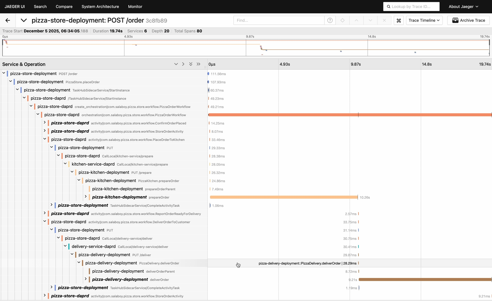

This post tells the story of how contributors from across the cloud native
community worked together to enhance [Dapr](https://dapr.io/)'s OpenTelemetry
integration, particularly around asynchronous workflows. It also highlights the
ongoing effort to align Dapr with the OpenTelemetry semantic conventions using
[OpenTelemetry Weaver](https://github.com/open-telemetry/weaver), and explores
how this collaboration can serve as a useful example for other CNCF projects.
None of this work started as a formal initiative. It emerged through discussion,
experimentation, and a shared goal of making telemetry easier to understand and
more consistent across the ecosystem.

## The challenges of propagating traces throughout complex orchestrations

[Dapr's workflow engine](https://docs.dapr.io/developing-applications/building-blocks/workflow/workflow-overview/)
provides a straightforward way to implement long-running, synchronous and
asynchronous orchestrations. The workflow orchestration runs inside the Dapr
sidecar, while workflow and activity code run inside the application using Dapr
SDKs. Communication between them happens over a long-lived gRPC stream.

This is efficient, but it makes W3C trace context propagation difficult. HTTP
and unary gRPC calls naturally carry traceparent and tracestate headers with
each request. A long-lived stream does not. Once the stream is open, workflow
steps cannot attach new metadata. This means the workflow engine may create
spans with correct context inside the sidecar, but activity messages arrive in
the application with no parent context. Outbound calls in the activity then
create their own traces.

The result is fragmentation: workflow spans, activity spans, and user-level
spans appear in the tracing backend, but they do not form a coherent hierarchy.

This diagram illustrates the problem: even though the workflow engine is
producing spans, the context breaks at the gRPC streaming boundary, so the
activity code cannot attach itself to the workflow’s trace.

## The complexities of a typical workflow orchestration

Workflows look simple on the surface, but once we start tracing them, the number
of moving parts becomes obvious. A workflow is not a single request. It is a
long-lived sequence of decisions and state transitions, each of which may
interact with different downstream systems. Some of these interactions are
synchronous, for example when an activity calls an external service and waits
for the result. Others are asynchronous, such as scheduling work, waiting on
external signals, or pausing until a timer fires. These differences matter
because they change how requests flow through the system, and they shape what
the trace should look like.

Every workflow also carries its own identity. The workflow instance ID ties all
of its steps together conceptually, even when they are separated in time. A
workflow might run for seconds or hours. It may be rehydrated after a failure or
resumed after a server restart. Durable execution means the workflow engine
persists state, replays events, and advances the workflow when external
conditions change. From a tracing perspective, this is very different from an
ordinary request or background job. A single workflow execution can span many
network calls, periods of waiting, retries, and partial progress.

Tracing a workflow therefore means capturing both the synchronous calls that
execute immediately and the asynchronous boundaries where the workflow engine
schedules or resumes work. It means relating user code running in one process to
orchestration logic running in another. And it means keeping context intact
across durable boundaries, so that the trace reflects the actual lifecycle of
the workflow instead of a series of isolated operations.

These characteristics make workflow tracing challenging. They also make it
valuable. When the trace accurately represents the orchestration, it becomes a
powerful tool for understanding how the workflow behaves over time and how its
steps influence each other.

## Restoring context across the workflow boundary

Addressing this required coordinated changes across several repositories. The
first step was enabling
[durabletask-go](https://github.com/dapr/durabletask-go), a library used to keep
track of the workflow orchestrations, to serialize W3C context into workflow
activity messages before sending them across the stream.

By
[embedding traceparent and tracestate](https://github.com/dapr/durabletask-go/pull/57)
directly inside activity messages, the workflow engine can propagate context
without relying on per-message gRPC metadata.

On the application side, the
[durabletask-java SDK](https://github.com/dapr/durabletask-java/pull/46) was
updated to read this context and restore it before running activity code. A
version of this can be seen in the
[exploratory branch](https://github.com/kaspernissen/pizza/tree/agentic-workflows)

With context restored in the application, OpenTelemetry's automatic
instrumentation for Java becomes effective. Because the OpenTelemetry Java agent
sees a valid parent context, it can automatically instrument outbound HTTP calls
and other operations. No application code needs modification.

The OpenTelemetry Operator played an important role during these experiments by
automatically injecting the Java agent into workflow application containers.
This allowed us to focus on understanding and improving context propagation
without manually configuring instrumentation.

Finally, the Dapr runtime was refined to prioritize clear parent–child
relationships between workflow spans, with the goal of improving developer
clarity. Further work is still needed to evaluate where span links may better
represent certain asynchronous relationships.

## A new picture in Jaeger

Once these pieces were in place, the improvement was very clear when viewed in
Jaeger. Previously, the inbound request, the workflow orchestrator, and each
activity's outbound calls appeared as separate traces.

After the changes, the Jaeger waterfall shows a single, continuous trace. The
inbound request spans the top. The workflow orchestrator span appears beneath
it. Each activity is nested under the workflow span. Outbound calls appear under
the corresponding activity.

The workflow finally reads as one coherent lifecycle.

The continuous waterfall makes not only the structure but also the pacing of the
workflow easy to understand. Waiting periods, retries, state transitions, and
long-running operations appear exactly where they belong.

## From trace continuity to semantic alignment

Once Dapr workflows produced complete traces, new questions emerged: What should
these spans represent? And how should they be named? Dapr interacts with many
components such as timers, state stores, pub or sub brokers, bindings, secrets,
and configuration APIs. Without stable semantics, different SDKs or runtime
components may represent similar operations differently.

To address this, Dapr is in the process of adopting OpenTelemetry Weaver, which
lets projects store semantic conventions in a machine-readable format.
[This initial PR](https://github.com/dapr/dapr/pull/9213) introduces Weaver to
Dapr.

Weaver provides a single place for Dapr to define telemetry attributes for
workflows, state interactions, component calls, pub or sub deliveries, and more.
This helps unify behavior across SDKs and aligns Dapr with the broader
OpenTelemetry semantic model. This is just the beginning of this adoption, and
there's still work to be done aligning the rest of Dapr interactions.

## Better modeling of asynchronous behavior

As we reviewed the improved workflow traces, we also began exploring how Dapr
might better represent asynchronous execution using span kinds. Historically,
the workflow engine has emitted nearly all workflow-related spans as client
spans. This reflects the fact that the engine is invoking operations, but it
does not clearly express the difference between scheduling work and actually
running it. That distinction becomes more important once workflow traces form a
continuous, readable hierarchy.

In asynchronous systems, producer semantics often provide a clearer signal when
work is being scheduled, while consumer semantics can represent the point where
that work is executed. Outbound calls made inside activity code would remain
client spans, and internal workflow transitions would stay internal spans. This
approach can help tracing tools convey workflow behavior more naturally.

None of these changes are part of Dapr today. This is early exploration sparked
by the tracing improvements, and a direction we have started discussing with the
Dapr maintainers. The goal is not to redesign Dapr's telemetry, but to begin
shaping a model that more accurately reflects asynchronous behavior and aligns
with OpenTelemetry's semantic guidance. We expect this work to evolve
collaboratively as more contributors participate.

## Why this work matters across the cloud native ecosystem

Although this collaboration focused on Dapr, the underlying challenges are
present across many cloud native projects. Proxies, service meshes, event
routers, workflow engines, and controllers often wrestle with similar questions:
how to propagate W3C context through sidecars or non-HTTP paths, how to define
semantic conventions, how to model asynchronous behavior, and how to ensure SDKs
remain consistent.

Cross-project collaboration helps solve these problems. Similar refinement
efforts have happened with Linkerd and Traefik. Each new project that aligns
with OpenTelemetry semantics improves the overall experience for operators who
rely on signals from multiple components.

## Looking ahead

With OpenTelemetry adoption increasing across the CNCF landscape, it may be time
for a broader discussion in the OpenTelemetry community about how best to
support project maintainers. Many want to improve their telemetry but are not
sure where to start. Others need guidance on topics such as span kinds, adopting
Weaver, or modeling asynchronous operations.

This discussion does not need to begin as a formal working group. Even an
informal space could help projects compare approaches, share best practices, and
avoid reinventing patterns already solved elsewhere. The work between Dapr and
OpenTelemetry contributors shows how far collaboration can go when communities
work together.

If you maintain or contribute to a CNCF project and want to strengthen its
OpenTelemetry integration, we invite you to join the conversation. Shared
telemetry helps create distributed systems that are more predictable, more
interpretable, and easier to operate.
