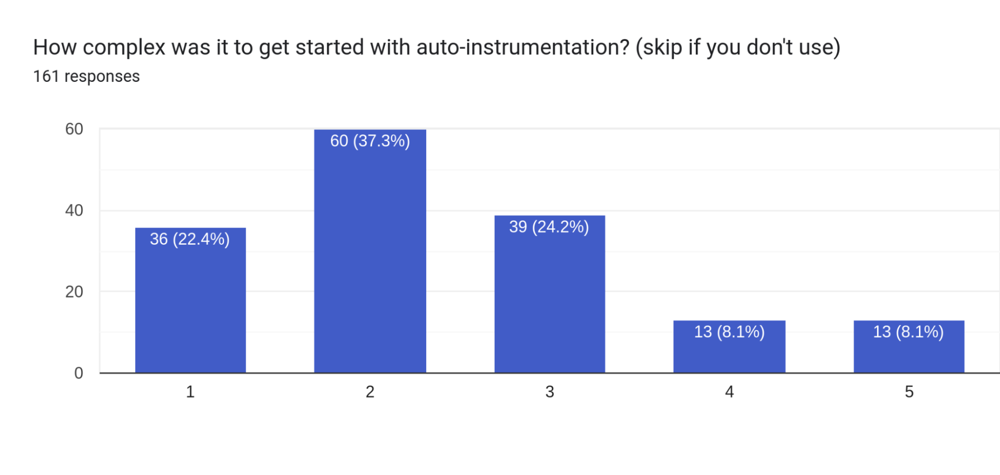

The OpenTelemetry Developer Experience SIG recently surveyed the community to
better understand where the SIG could have the most impact on improving the
developer experience. We received 218 responses, which we will use to guide our
prioritization of work within the SIG. This post summarizes our findings and
where we will focus in the near term.

Thank you to all those who participated in the survey! If you are interested in
joining us in these efforts or providing additional insights on where you think
the developer experience of OpenTelemetry can be improved, please don’t hesitate
to reach out. Contact information for the SIG can be found in the Community
repo’s list of
[Cross-Cutting SIGs](https://github.com/open-telemetry/community/?tab=readme-ov-file#cross-cutting-sigs),
and we have a
[repository](https://github.com/open-telemetry/sig-developer-experience) of our
own on GitHub.

## Key Takeaways

The survey responses highlight the need for improved documentation, more
in-depth examples and more substantial guidance on debugging, configuring and
deploying OpenTelemetry in Production. Below are the main areas of concern:

- Documentation:
  - Documentation is difficult to navigate, requiring users to switch between
    the OpenTelemetry website and GitHub repositories. Many users report having
    to piece together information from various sources.
  - Lack of examples of production usage for both the SDKs and Collector.
- Local debugging:
  - It's difficult to know why exporting isn't working, and if the SDK is
    dropping data. Better tooling for local debugging would help with
    troubleshooting.
- SDK configuration:
  - Overall complexity (both configuration and concepts)
  - SDK configuration is complex, and many users have pointed out that
    troubleshooting the exporter is the most painful part.
- Collector operations:
  - Debugging guidance on the Collector configuration and its components is
    needed. OTTL was mentioned a couple of times for being difficult to
    troubleshoot.

## Detailed Insights

### General Information about Respondents

The survey responses came from users, of whom the majority use OpenTelemetry in
production (83%) and do not work for a vendor (77.4%). 82% consider their
organization to be at an intermediate or advanced phase of their journey with
observability.

The platforms used leaned towards Kubernetes (68.2%) and AWS
(34.6%), with bare metal still making up a respectable percentage (12%).

Programming language usage was split between the usual suspects of Go, Java,
JavaScript, Python and .NET, but had a wide spread and even languages without
official API/SDK implementations, as shown in the second graph below.

While those working on backends or operations were the majority of respondents,
mobile and browser were represented as well, see the third graph:

### Documentation

Results showed that, by far, people were getting their day one information when
getting started with OpenTelemetry from the website and GitHub repositories for
languages, 75.1% and 43.8%, while 25.1% were starting from their vendor’s
documentation. However, unclear documentation took the top spot in the three
questions related to getting started with manual instrumentation, auto
instrumentation and setting up the SDK. In the Collector's case, it took second
place to “configuring the processors”.

More details on the user experience with documentation can be found in the
survey results of the [survey](/blog/2024/otel-docs-survey/) conducted by the
End User SIG.

### Collector Usage

Getting started with the Collector was shown to lean towards the fairly easy,
though based on results for the question asking for problems with operating the
Collector and the overall experience question, it seems clear there is a gap between
getting started and operating with more complex pipelines or in larger deployments.
More on this in the Future Plans section.

Interestingly, _collector-contrib_ had a large percentage of the responses to
the question, “Which collector do you use?”. Sadly, it is unclear if this is due
to being unaware of OCB
([https://github.com/open-telemetry/opentelemetry-collector/tree/main/cmd/builder](https://github.com/open-telemetry/opentelemetry-collector/tree/main/cmd/builder))
for building custom images, disinterest in using it or a lack of adequate
documentation around its use.

### SDK and Instrumentation

Manual instrumentation and getting started with the SDK leaned slightly toward
being more difficult. On the other hand, auto-instrumentation was solidly
towards being easier to get started with. Despite getting started with
auto-instrumentation being relatively straightforward, the results showed that
enriching that telemetry was more difficult.

### Debugging

A common theme in the responses to the final question on the survey, “What could
be changed to improve the developer experience?”, is the desire for an easier to
setup local environment – one you can see all the telemetry coming out of a
running application locally – along with more information from SDKs, both during
development and in production, when something is wrong, like data being dropped
or an exporter being misconfigured.

## Future Plans

The results from those who responded are invaluable resources as we work to
improve the OpenTelemetry developer experience. We will now direct some of this
feedback to the respective SIGs, work on prototyping some solutions and follow
up with the other teams.

Thank you again to all those who participated in the survey! Even though the
survey is now over, we do still welcome feedback. Feel free to reach out to us
on [Slack, or during our weekly
meetings](https://github.com/open-telemetry/community/?tab=readme-ov-file#cross-cutting-sigs)
if you want to provide additional informations, or want to join us.

