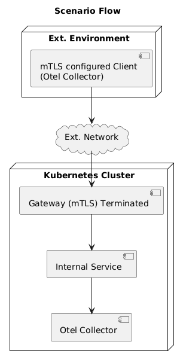

The goal of this blog post is to demonstrate how you can expose an OpenTelemetry
(OTel) Collector running inside Kubernetes to the outside world securely, using
the [Kubernetes Gateway API](https://gateway-api.sigs.k8s.io/) and
[mutual TLS (mTLS)](https://www.buoyant.io/mtls-guide) for authentication and
encryption.

As observability becomes increasingly critical in modern distributed systems,
centralizing telemetry data via OTel Collectors deployed in one or many
Kubernetes clusters is common practice. Often, services or agents running
_outside_ your Kubernetes cluster need to send data _to_ these Collectors.
Exposing internal services requires careful consideration of security and
standardization. This is where the Kubernetes Gateway API and mTLS shine.

Typically this kind of a setup is useful when you have applications or workloads
that are external to the cluster, and you need to collect their telemetry data.
Some examples:

- **Hybrid Cloud/On-Premises Environments:** Applications or servers running in
  a traditional data center, or a different cloud or external to your Kubernetes
  cluster need to forward their metrics, traces, or logs to your central
  observability solution.
- **Multi-Cluster Telemetry Aggregation:** In a setup that might run on multiple
  Kubernetes clusters, you might designate one cluster to host the primary OTel
  Collector deployment. Collectors in other "spoke" clusters would act as
  clients, exporting data to this central collector via its external endpoint.
  For example, in a multi-cluster service mesh setup, workloads may require tail
  sampling to be performed centrally. In this case, a central collector
  configured with the
  [tail sampling processor](https://github.com/open-telemetry/opentelemetry-collector-contrib/tree/v0.127.0/processor/tailsamplingprocessor)
  and exposed via a Gateway aggregates spans from all clusters to make sampling
  decisions.
- **Edge Computing / IoT:** Devices deployed at the edge often need to send
  operational data back to a central platform.
- **Serverless Functions / PaaS:** Applications running on serverless platforms
  (like AWS Lambda, Google Cloud Functions) or Platform-as-a-Service offerings
  outside your cluster may need to export OTLP data.
- **External Monitoring Agents:** Third-party agents or locally running
  development instances needing to connect to a shared collector within the
  cluster.
- **Client-Side Monitoring:** Telemetry coming in from external clients like
  browsers and mobile applications. While mTLS may not be used for
  [exporting telemetry from browsers](/docs/languages/js/getting-started/browser/),
  the collectors must ultimately be made available.

## Prerequisites

Before we start, ensure you have the following:

1.  **A Kubernetes Cluster:** Minikube, Kind, Docker Desktop, Gardener or a
    cloud provider's managed Kubernetes service will work.
2.  **`kubectl`:** [Configured](https://kubernetes.io/docs/reference/kubectl/)
    to interact with your cluster.
3.  **`helm`:** [Configured](https://helm.sh/) to install Helm charts.
4.  **A Gateway API Implementation:** We'll use
    [Istio](https://istio.io/latest/docs/overview/what-is-istio/) in this
    example. Other implementations like Contour, NGINX Gateway Fabric, etc.
    would also work with potentially minor configuration adjustments.
5.  **`openssl`:** The OpenSSL
    [CLI](https://github.com/openssl/openssl/wiki/Binaries) for generating
    certificates.

{}

Since certain parts of the Gateway API are still in alpha/beta phase, the
support for specific aspects may vary or may not be enabled by default. Please
refer to the documentation of the Gateway implementation that you are using. For
example, at the time of writing, if you are using Istio, ensure that
`PILOT_ENABLE_ALPHA_GATEWAY_API` is enabled during the install.

{}

## What is the Kubernetes Gateway API?

The [Kubernetes Gateway API](https://gateway-api.sigs.k8s.io/) is an evolution
of the older Ingress API. It provides a more expressive, role-oriented, and
flexible way to manage inbound traffic to your cluster. The
[GAMMA initiative](https://gateway-api.sigs.k8s.io/mesh/gamma/) defines the
Gateway API implementation. It was introduced for the following reasons:

- **Limitations of Ingress:** The Ingress API, while useful, became limiting. It
  lacked standardization across implementations and also limited routing
  capabilities that varied widely across different implementations.
- **Role Separation:** Gateway API separates concerns:
  - `GatewayClass`: Defines a _type_ of load balancer (e.g., Istio, GKE LB).
    Managed by Infrastructure Admins.
  - `Gateway`: Represents an instance of a load balancer requesting a specific
    `GatewayClass`. Defines listeners (ports, protocols, TLS). Managed by
    Cluster Operators. They can be shared across namespaces as well.
  - `HTTPRoute`, `GRPCRoute`, `TCPRoute`, `TLSRoute`, etc.: Define
    application-level routing rules, attaching to a `Gateway`. Managed by
    Application Developers/Owners.
- **Portability:** Standardized API definition aims for greater portability
  across different underlying gateway/service mesh implementations.
- **Expressiveness:** Natively supports advanced features like header
  manipulation, traffic splitting, mTLS configuration, gRPC routing, and more.

In essence, Gateway API offers a more robust and standardized model for managing
north-south traffic compared to the traditional Ingress API.

## mTLS - A brief introduction

Mutual TLS (mTLS) extends standard TLS by requiring _both_ the client and server
to present and validate certificates for mutual authentication.

Standard TLS (like HTTPS on websites) verifies the _server's_ identity to the
_client_. Mutual TLS (mTLS) goes a step further:

- The client verifies the server's identity (using the server's certificate).
- The server _also_ verifies the client's identity (using the client's
  certificate).

Mutual TLS is important because it provides strong authentication, ensures
end-to-end encryption, and aligns with Zero Trust security principles:

- Ensures _only_ trusted clients (those possessing a valid certificate signed by
  trusted Certificate Authority (CA)) can connect to your exposed service.

- All communication between the authenticated client and the server (such as a
  Gateway) is encrypted.

- It supports a Zero Trust model by requiring verification from both parties,
  never assuming trust by default.

## The Scenario

Here are the steps we'll follow to expose an OTel Collector deployment outside
the cluster.

- Deploy an OTel Collector inside Kubernetes configured with a simple OTLP/gRPC
  receiver.
- Generate a self-signed Root CA, a server certificate (for the Gateway), and a
  client certificate (for the external client).
- Configure a Kubernetes `Gateway` resource to listen on a specific port,
  terminate TLS, and require client certificates (mTLS).
- Configure a `GRPCRoute` to route incoming gRPC traffic from the `Gateway` to
  the internal OTel Collector service.
- Configure an external client (another OTel Collector) to export data via
  OTLP/gRPC, using the client certificate and trusting the Root CA.



## Setup

### Step 1: Install Gateway API CRD.

By default, the Gateway APIs do not come installed in the Kubernetes Cluster. At
the time of writing this blog, the latest version is
[v1.2](https://gateway-api.sigs.k8s.io/implementations/v1.2/). Install the
Gateway API CRDs if not present:

```bash
kubectl get crd gateways.gateway.networking.k8s.io &> /dev/null || \
kubectl apply -f https://github.com/kubernetes-sigs/gateway-api/releases/download/v1.2.1/standard-install.yaml

#To support GRPCRoute as of now. Would not be required once GRPCRoute CRD becomes GA.
kubectl kustomize "github.com/kubernetes-sigs/gateway-api/config/crd/experimental?ref=v1.2.0" | kubectl apply -f -
```

### Step 2: Generate Self Signed Certificates

In order to setup mTLS between the client and the server, we need a set of
certificates. For this demo scenario, we'll be using self-signed certificate. We
will be using the same CA for signing both clients and server in this demo.
We'll use `openssl` to create our certificates. Please refer to the `openssl`
documentation for configuration details.

```bash
# Variables (adjust domain/names as needed)
export ROOT_CA_SUBJ="/CN=MyDemoRootCA"
# Use a relevant CN/SAN for the server/gateway. If clients connect via IP, include it.
# For DNS, use the hostname clients will use (e.g., otel.example.com)
export SERVER_HOSTNAME="otel-gateway.example.com"
export SERVER_SUBJ="/CN=${SERVER_HOSTNAME}"
export CLIENT_SUBJ="/CN=external-otel-client"

# 1. Create Root CA certificate and key
openssl req -x509 -sha256 -nodes -days 365 -newkey rsa:2048 -subj "${ROOT_CA_SUBJ}" -keyout rootCA.key -out rootCA.crt

# 2. Create Server CSR & sign with Root CA
openssl req -newkey rsa:4096 -nodes -keyout server.key -out server.csr -subj "${SERVER_SUBJ}" \
  -addext "subjectAltName = DNS:${SERVER_HOSTNAME}" # Add SAN for hostname validation

openssl x509 -req -in server.csr -CA rootCA.crt -CAkey rootCA.key -CAcreateserial -out server.crt -days 365 -sha256 \
  -extfile <(printf "subjectAltName=DNS:${SERVER_HOSTNAME}") # Ensure SAN is in the final cert

# 3. Create Client CSR and sign with Root CA
openssl req -newkey rsa:4096 -nodes -keyout client.key -out client.csr -subj "${CLIENT_SUBJ}"

openssl x509 -req -in client.csr -CA rootCA.crt -CAkey rootCA.key -CAcreateserial -out client.crt -days 365 -sha256
```

{}

For production, never use self-signed certificates for external-facing endpoints
accessible from the public internet. Use certificates issued by a trusted public
CA (e.g., Let's Encrypt through cert-manager) or a managed internal PKI system.
The process of obtaining certs would differ, but the concepts of using them in
Kubernetes remain similar. Ensure the server certificate's Common Name (CN) or
Subject Alternative Name (SAN) matches the hostname clients use to connect.

{}

### Step 3: Create `otel-collector` namespace

We will deploy our OTel Collector setup in the given namespace. Further on,
depending on the Gateway/service mesh implementation you use, you may configure
the namespace accordingly. For example, with Istio, we can create the namespace
with `istio-injection:enabled` in order for Istio to automatically work with the
deployed workloads in the namespace.

`namespace.yaml`:

```yaml
# OpenTelemetry Collector Namespace
---
apiVersion: v1
kind: Namespace
metadata:
  name: otel-collector
  labels:
    istio-injection: enabled #Relavent only if you are using Istio.
```

Apply this configuration:

```bash
kubectl apply -f namespace.yaml
```

### Step 4: Deploying the OTel Collector (Server)

Let's create a simple OTel Collector deployment and service. In the given
configuration, the OTel collector will print the incoming telemetry data. This
configuration will change according to your use cases.

`otel-collector-server.yaml`:

```yaml
apiVersion: v1
kind: ConfigMap
metadata:
  name: otel-collector-conf
  namespace: otel-collector # Deploy collector in otel-collector namespace
data:
  config.yaml: |
    receivers:
      otlp:
        protocols:
          grpc:
            # Note: No TLS config here. TLS terminates at the Gateway.
            endpoint: 0.0.0.0:4317

    processors:
      batch:

    exporters:
      # For demo purposes, log to stdout
      debug:

    service:
      pipelines:
        traces:
          receivers: [otlp]
          processors: [batch]
          exporters: [debug]
        metrics:
          receivers: [otlp]
          processors: [batch]
          exporters: [debug]
        logs:
          receivers: [otlp]
          processors: [batch]
          exporters: [debug]
---
apiVersion: apps/v1
kind: Deployment
metadata:
  name: otel-collector-server
  namespace: otel-collector # Deploy collector in otel-collector namespace
spec:
  replicas: 1
  selector:
    matchLabels:
      app: otel-collector-server
  template:
    metadata:
      labels:
        app: otel-collector-server
    spec:
      containers:
        - name: otel-collector
          # Use a specific, recent version tag in production
          image: otel/opentelemetry-collector:latest
          ports:
            - containerPort: 4317 # OTLP gRPC
              name: otlp-grpc
          volumeMounts:
            - name: otel-collector-config-vol
              mountPath: /etc/otelcol
      volumes:
        - name: otel-collector-config-vol
          configMap:
            name: otel-collector-conf
---
apiVersion: v1
kind: Service
metadata:
  name: otel-collector-server-svc
  namespace: otel-collector
spec:
  selector:
    app: otel-collector-server
  ports:
    - name: grpc
      protocol: TCP
      port: 4317
      targetPort: 4317
```

Apply this configuration:

```bash
kubectl apply -f otel-collector-server.yaml
```

### Step 5: Storing Certificates as Kubernetes Secrets

The Gateway needs access to the server certificate/key and the CA certificate to
validate clients.

Create a secret with the server certificate, key. We will also store the ca
certificate used to sign clients In this demo, for ease, we place it in the
otel-collector namespace

```bash
kubectl create -n otel-collector secret generic otel-gateway-server-cert --from-file=tls.crt=server.crt --from-file=tls.key=server.key --from-file=ca.crt=rootCA.crt
```

### Step 6: Configuring the Kubernetes Gateway API Resources

We need two resources: `Gateway` and `GRPCRoute`. For simplicity, we keep the
resources in the same `otel-collector` namespace in this demo. This would change
depending on your deployment setup.

`otel-gateway-resources.yaml`:

```yaml
apiVersion: gateway.networking.k8s.io/v1
kind: Gateway
metadata:
  name: otel-gateway
  namespace: otel-collector
spec:
  gatewayClassName: istio
  listeners:
    - name: otlp-grpc-mtls
      port: 4317
      protocol: HTTPS
      hostname: 'otel-gateway.example.com'
      tls:
        mode: Terminate
        certificateRefs:
          - group: '' # Core API group for Secrets
            kind: Secret
            name: otel-gateway-server-cert # The certificates that were uploaded as secrets in the provious step.
        options:
          # This structure might vary  depending on the implementation of your Gateway/Service Mesh
          # Please refer  documentation of the implementation installed.
          # For Istio, we set tls termination mode here
          gateway.istio.io/tls-terminate-mode: MUTUAL
---
# GRPCRoute is generally preferred for OTLP/gRPC
# Ensure GRPCRoute CRD (v1alpha2 or v1) is installed
apiVersion: gateway.networking.k8s.io/v1
kind: GRPCRoute
metadata:
  name: otel-collector-grpcroute
  # Namespace where the backend service resides
  namespace: otel-collector
spec:
  # Link this route to our Gateway in the istio-system namespace
  parentRefs:
    - name: otel-gateway
      namespace: otel-collector # Namespace of the Gateway resource
      sectionName: otlp-grpc-mtls # Attach to the specific listener by name
  # Define routing rules for gRPC traffic
  rules:
    - backendRefs:
        - name: otel-collector-server-svc # Name of your internal OTel service
          namespace: otel-collector # Namespace of the backend service
          port: 4317 # Target port on the service
```

- In the `Gateway` CRD, we configure the `gatewayclass` and `listeners`. In this
  case we configure one `listener` with the necessary `port` and `hostname`. We
  also configure `tls` which gets terminated here. We use the certificates
  uploaded as secrets. The `options` block is used to configure
  `implementation specific` parameters if any.

- In the `GRPCRoute`, we choose a gateway and the specific `listener`. We also
  configure the backend to which the route forwards the requests. In this case,
  to the `otel-collector-server-svc`.

{} We make use of `options` in the gateway for
implementation-specific configuration of mTLS. Currently, the gateway API does
not explicitly have `Mutual TLS`
[mode](https://gateway-api.sigs.k8s.io/reference/spec/#tlsmodetype). Refer to
the latest documentation of Gateway API for updates. {}

Apply the Gateway configuration:

```bash
kubectl apply -f otel-gateway.yaml
```

At this point, the Istio (or other) Gateway should be configured to listen on
port 4317 (usually exposed via a LoadBalancer Service), require mTLS using the
specified server certificate and client CA, and route valid gRPC traffic to the
`otel-collector-server-svc`.

To get details of the Gateway, you can run the following:

```bash
# To get the Gateway hostname/IP
kubectl -n otel-collector get gateway otel-gateway -o jsonpath='{.status.addresses[0].value}'

# To get the port
kubectl -n otel-collector get gtw otel-gateway -o jsonpath='{.spec.listeners[?(@.name=="otlp-grpc-mtls")].port}'
```

You can also see the Kubernetes service created for your `Gateway`.

```bash
kubectl -n otel-collector get svc
```

### Step 7: Configuring the External OTel Collector (Client)

To test the setup, configure an OTel Collector _outside_ the cluster to send
data to the Gateway's external endpoint using mTLS.

For this demo, the client (OTel Collector) is run locally with Docker.

The following example `otel-client-config.yaml` is a simple configuration for
scraping CPU and memory metrics and sending them to the server:

```yaml
receivers:
  # Example: Receiver generating some data, e.g., host metrics
  hostmetrics:
    collection_interval: 10s
    scrapers:
      cpu:
      memory:
      # Add other scrapers as needed

processors:
  batch:

exporters:
  otlp/grpc:
    # IMPORTANT: Point to the Gateway's external IP/hostname and port
    # Replace <GATEWAY_EXTERNAL_IP_OR_HOSTNAME> with the actual address
    # It should match the hostname/SAN in the server certificate if using hostname
    # Use the hostname 'otel-gateway.example.com' if you have DNS configured at the gateway.
    endpoint: <GATEWAY_EXTERNAL_IP_OR_HOSTNAME>:4317

    tls:
      # We MUST enable TLS configuration for the client for mTLS
      insecure: false # Ensure server certificate is validated against the CA
      # Path to the CA certificate file to verify the server
      ca_file: /etc/cert/rootCA.crt
      # Path to the client's certificate file
      cert_file: /etc/cert/client.crt
      # Path to the client's private key file
      key_file: /etc/cert/client.key
      # Optional but recommended: Specify the server name for validation
      # Must match the CN or SAN in the server certificate (server.crt)
      # This is required if DNS is not configured at the Gateway and endpoint does not match the Gateway Hostname
      server_name_override: otel-gateway.example.com
service:
  pipelines:
    # Example sending host metrics
    metrics:
      receivers: [hostmetrics]
      processors: [batch]
      exporters: [otlp/grpc]
    # Add additional traces/logs pipelines if the client generates them
```

To run the client:

1.  Replace `<GATEWAY_EXTERNAL_IP_OR_HOSTNAME>` with the actual external IP
    address or DNS name of your Istio Gateway LoadBalancer service. If using the
    hostname (`otel-gateway.example.com`), ensure your client machine can
    resolve this hostname to the correct IP (e.g., via `/etc/hosts` for testing,
    or actual DNS).

2.  Use the `server_name_override` if the `endpoint` is different from the
    SAN/CN values in the server certificate.

3.  Place the generated `rootCA.crt`, `client.crt`, and `client.key` files in a
    directory accessible to the client collector. In this demo, we keep it in
    `certs` folder.

4.  Run the client collector (adjust paths and image tag as needed):

    ```bash
    # Running command assuming certificates and config are in the current directory.

    docker run --rm -v $(pwd)/certs:/etc/cert/ \
               -v $(pwd)/otel-client-config.yaml:/etc/otelcol-contrib/config.yaml \
               otel/opentelemetry-collector-contrib:0.119.0
    ```

We are running a container of `opentelemetry-collector-contrib` by mounting the
`otel-client-config.yaml` and the `certs` folder that contains the certificates.

### Step 8: Testing the Connection

1.  **Check Server Logs:** Look at the logs of the `otel-collector-server` pod
    inside Kubernetes. If the `debug` exporter is configured, you should see
    entries indicating it's receiving data batches.

    ```bash
    kubectl logs -n otel-collector -l app=otel-collector-server -f
    ```

2.  **Check Client Logs:** Look at the logs of the external client collector
    (e.g., the Docker container output). You should see messages like
    `Everything is ready. Begin running and processing data.` Any connection
    error message (e.g., `"certificate signed by unknown authority"`,
    `"bad certificate"`) or `connection refused` errors indicate a problem.
    Check:
    - Gateway IP/hostname reachability.
    - Firewall rules.
    - Correct certificates (`ca_file`, `cert_file`, `key_file`) used by the
      client.
    - Correct `server_name_override` matching the server certificate SAN/CN.
    - Correct mTLS configuration on the Gateway (including client CA
      validation).
    - Gateway controller logs (For e.g `istio-ingressgateway` pod logs in
      `istio-system`) for TLS errors.
3.  **Test Failure Case:**
    - Try running the client _without_ the `tls:` section in its `otlp/grpc`
      exporter configuration. The connection should be rejected by the Gateway
      (likely a TLS handshake failure or connection reset).
    - Try commenting out the `ca_file`, `cert_file`, or `key_file` in the client
      config. The connection should fail.
    - If you have another certificate signed by a _different_ CA, try using that
      as the client certificate. The Gateway should reject it during the mTLS
      handshake because it's not signed by the trusted CA.

## Caveats

In this walkthrough, certain steps were done in a specific way to make it easy
to run and understand the configuration and scenario. These must be taken care
of when configuring this setup during production:

- `Self-signed` certificates should **not** be used in production. Also, `CA`
  certificates used for clients are also generally different than the one used
  for signing the server certificates.
- The Kubernetes Gateway API is constantly evolving with more and more features
  coming into the spec. Many of these features are now in alpha/beta and will
  soon become generally available, for example, `GRPCRoute`. Refer to the latest
  Kubernetes documentation of the Gateway API.
- The Kubernetes Gateway API aims to make the configuration portable and
  implementation agnostic as much as possible. Ideally this would be the case
  once the spec is matured and evolved. Till then, certain aspects of the
  configuration will have minor changes between implementations. For example,
  the way mTLS is configured in the Gateway now.
- When running in production, you may want to use the `infrastructure` block of
  the `spec` to configure infrastructure-provider specific parameters, for
  example, `DNS`.
- Productive setups would have end-to-end encrypted communication. For example,
  when using Istio, all components running within namespaces managed by Istio in
  a cluster can be forced to communicate with each other. This is achieved with
  [PeerAuthentication](https://istio.io/latest/docs/reference/config/security/peer_authentication/).
  Similar concepts would be available for other service mesh implementations as
  well.
- When working with routes and gateways in multiple namespaces, you may need
  references of resources such as backend `services`, and other configurations
  from other namespaces. For details, refer to Gateway
  [ReferenceGrant](https://gateway-api.sigs.k8s.io/api-types/referencegrant/).

## Alternative Gateway Implementations

While we used Istio (`gatewayClassName: istio`), the core benefit of the Gateway
API is its potential for standardization. If you were using Contour, NGINX
Gateway Fabric, HAPROXY, etc., the `Gateway` and `GRPCRoute` resource
definitions would ideally look very similar. The main differences might be:

- The specific value for `gatewayClassName`.
- Minor variations in how implementation-specific features or options are
  configured (e.g., the exact syntax for specifying the client configuration in
  the `options` structure).
- How the underlying Gateway controller/proxy is deployed, managed, and exposed
  (e.g., the name and namespace of the LoadBalancer service).

Always consult the documentation for your specific chosen Gateway API
implementation, particularly regarding mTLS configuration details.

## Conclusion

The Kubernetes Gateway API offers a significant improvement over the legacy
Ingress API, providing a more powerful, portable, standardized approach. It is
more flexible, and role-oriented way to manage ingress traffic.

By combining the Gateway API with mutual TLS (mTLS), you can securely expose
internal services like an OpenTelemetry Collector, ensuring robust client
authentication and encrypted communication.
