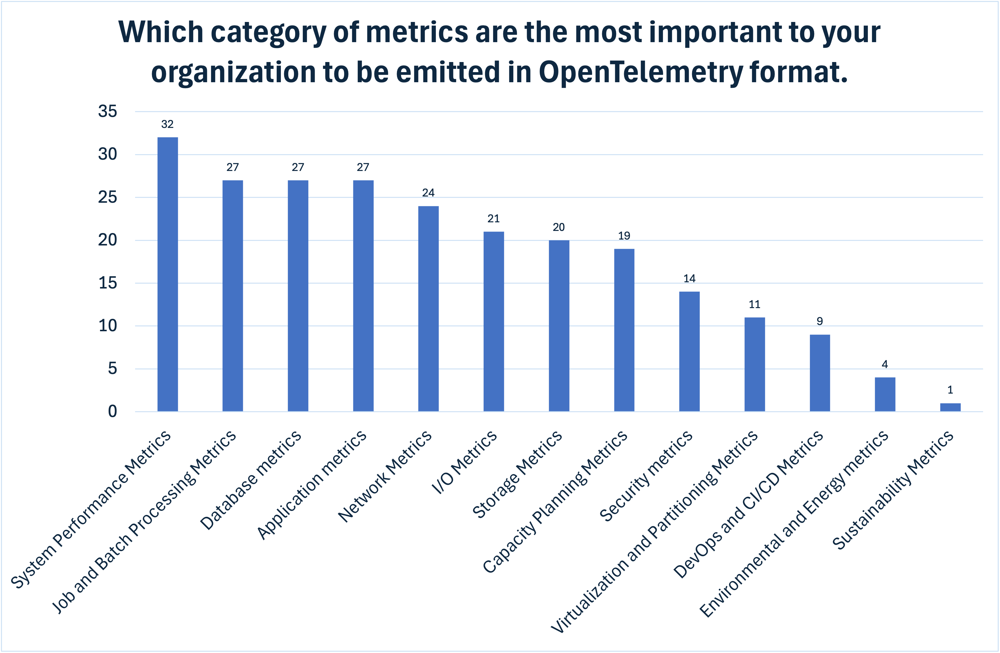

---
title:
  Exploring OpenTelemetry Priorities for Mainframes - Insights from Survey
  Responses
linkTitle: OpenTelemetry on Mainframes Survey Insights
date: 2025-10-10
author: '[Ruediger Schulze](https://github.com/rrschulze) (IBM)'
canonical_url: https://openmainframeproject.org/blog/exploring-opentelemetry-priorities-for-mainframes-insights-from-survey-responses/
issue: https://github.com/open-telemetry/opentelemetry.io/issues/7870
sig: SIG OpenTelemetry on Mainframes
cSpell:ignore: CICS HLASM IDMS REXX Ruediger Schulze VSAM
---

Which [OpenTelemetry](/) features are considered most important by users for
enhancing the observability of mainframes? Earlier this year, the
[OpenTelemetry on Mainframes Special Interest Group](https://github.com/open-telemetry/community/?tab=readme-ov-file#sig-mainframes)
(SIG) and the [Open Mainframe Project](https://openmainframeproject.org/)
conducted a [survey](/blog/2025/otel-mainframe-priorities-survey/) to address
this question. This blog presents a detailed overview of the survey’s findings.

## Background and purpose

The OpenTelemetry project aims to enable an effective observability by making
high-quality, portable telemetry available from any source to any target. The
project currently hosts 90 repositories
[on GitHub](https://github.com/open-telemetry/) covering specifications and
implementation. When the OpenTelemetry on Mainframes SIG was formed, it gave
itself the mission to enable the most important OpenTelemetry components for the
mainframe and focus on the three key areas: Semantic Conventions, programming
language SDKs and enhancements of the OpenTelemetry Collector. Considering the
broad scope of the OpenTelemetry project and the sophisticated architecture of
the mainframe, it soon became evident that a thorough understanding of user
priorities is essential for making the best use of the OpenTelemetry features on
the mainframe. With the results from the survey available now, the SIG will
prioritize and implement targeted activities to accelerate the adoption of
OpenTelemetry on the mainframe platform.

## Key insights

Here are the key insights for prioritizing mainframe SIG activities:

1. Enhance OpenTelemetry expertise within the mainframe community. Of 26
   beginners using OpenTelemetry, 21 have over a decade of mainframe experience,
   yet 11 report no knowledge of its features.
2. Prioritize Semantic Conventions for System Performance metrics, followed by
   Job Processing, Databases, and Applications. Among respondents, 30 want
   OpenTelemetry to focus on metrics first, and when asked about categories of
   metrics, about 32 highlight system metrics as the main priority.
3. Prioritize Java and Python SDKs for z/OS and develop a COBOL SDK. All
   respondents wanting Java (25) and Python (20) SDKs also require OpenTelemetry
   SDKs for z/OS. COBOL SDK was requested by 26, giving it a similar level of
   importance as the Java SDK.
4. Evaluate methods for collecting System Performance and Platform metrics using
   the OpenTelemetry Collector. According to responses, 30 participants
   indicated interest in having the OpenTelemetry Collector gather System
   Performance and Platform metrics when deployed as an agent. 28 identified
   Mainframe Operations as the main user, and 27 rated System Performance
   metrics in OpenTelemetry format as most important for their organization.

## Ways to contribute

We invite contributors and organizations to join the
[OpenTelemetry on Mainframes SIG](https://github.com/open-telemetry/community/?tab=readme-ov-file#sig-mainframes).
Take ownership of a survey priority and become a contributor to the
OpenTelemetry project. For example, engage in our code instrumentation and
porting initiatives:

- Support the integration of self-hosted GitHub action runners for linux/s390x
  to enable continuous integration and delivery, and automated verification of
  OpenTelemetry components on the s390x platform
- Expand the community support of SDKs on zos/s390x and linux/s390x: Ensure
  selected OpenTelemetry SDKs are fully supported and maintained across z/OS and
  Linux on s390x
- Implement SDK optimizations for the s390x platform: Contribute to performance
  and compatibility improvements, unlocking the full potential of OpenTelemetry
  on the mainframe
- Enable OpenTelemetry support for COBOL: Collaborate on the development of a
  robust COBOL SDK, empowering legacy applications with modern observability
  capabilities

## Methodology

The survey was structured in two sections. The first section gathered input
about the role and background of the respondent. The second section gathered the
priorities of the respondent’s organization for enabling OpenTelemetry on the
mainframe. In total, the respondents were asked to answer 20 questions. The
survey was open for two months from mid of January and promoted via the
OpenTelemetry and Open Mainframe Projects blogs and at mainframe conferences.
The survey received 45 responses. All responses are considered in the results.
Only minimal data cleansing was applied. With only 45 responses, the sample size
is too small for statistically representative results. Organizations should not
base decisions on them. Still, the survey offers initial insights on priorities,
which the mainframe SIG will use to inform some of its activities as described
above.

## Comprehensive responses

### Question 1: What is your primary role within your organization?

Responses were received from a diversified list of roles. More than half of the
responses (26) were from managers, IT and Software Architects and System
Programmers (including the response indicating multiple roles). Most of them
(22) have more than 10 years of experience in working with mainframes.

### Question 2: How many years of experience do you have in working with mainframe systems?

Most of the respondents (33) have more than 10 years of experience in working
with mainframes. Only four of them claimed expert or advanced knowledge in
OpenTelemetry. Conversely, out of the six respondents with less than four years
of mainframe experience, four of them self-identified as experts or advanced
practitioners in OpenTelemetry. Overall, a significant majority of responses
shows that the survey participants have a mainframe background.

### Question 3: Which is the primary industry of your organization?

A substantial majority of respondents came from the Financial Services sector
(22 out of 45 total responses). A smaller contingent originated from diverse
Logistics (in total 8). Thirteen respondents were primarily engaged in software
and IT related fields such as Software Development, Independent Software Vendors
(ISVs), Service Providers, IBM zStack Software, Observability and Information
Technology (IT).

### Question 4: Which of the following mainframe platforms do you work with?

z/OS is the mainframe operating system that is used by all respondents except of
one (who is focused on Linux for IBM Z). Linux on IBM Z is used by around one
third of the respondents (17). z/VM as virtualization platform was used at eight
of the respondents. One respondent claimed to use all the operating systems
including z/VSE and zTPF.

### Question 5: Which of the z/OS System Software do you work with?

Most of the respondents (38) work with one of the transaction processing
systems, CICS or IMS or both. Thirty-nine survey participants utilize Db2 and 31
make use of VSAM, while a notable subgroup of respondents also uses ADABAS,
IDMS, DVM or Datacom as data backend.

### Question 6: What is your level of familiarity with OpenTelemetry?

The beginners in OpenTelemetry adoption (26) made the largest group among the
respondents. Fifteen of them are not familiar with any of the OpenTelemetry
features or components. Only three self-identified as experts, while all
participants with intermediate knowledge also claimed familiarity with the
OpenTelemetry Collector.

### Question 7: What features and components of OpenTelemetry are you familiar with?

Approximately one half of the survey participants are familiar with
OpenTelemetry Metrics (24) and the OpenTelemetry Collector (22). In terms of
signal types, while metrics lead in respondent familiarity, logging (20) and
distributed tracing (17) follow closely. Context Propagation and Sampling as
complementing techniques related to Distributed Tracing are slightly less known.
Code instrumentation (zero-code and manual) are only known by around one-fourth
of the respondents. The same is true for Semantic Conventions and the API
Specification. Only a minority of participants exhibit familiarity with the
Kubernetes Operator and the Open Agent Management Protocol, and those
self-identify as having at least intermediate knowledge about OpenTelemetry if
not advanced or expert levels.

### Question 8: Are you a user of observability or performance monitoring tools?

Three fourth of the respondents claim to use observability or performance
monitoring tools (35). Most users have visibility to mainframe platforms (30).
From the group of respondents using tools for both distributed and mainframe
platforms (19), two-third claim to spend more than 20% of their time with
observability and monitoring activities (13), and five of them work almost
full-time on those activities (above 80% of their time).

### Question 9: How much of your time do you spend on observability or performance monitoring activities?

Around one-fourth of the respondents (11) dedicate more than 60% of their time
to observability and performance monitoring activities. Most of the survey
participants (19) are less than 20% involved in those of activities, which can
be attributed by the nature of their job roles. Twelve of them claim familiarity
with OpenTelemetry above the beginner level.

### Question 10: What are key characteristics of the observability strategy within your organization?

Real-time analysis (35) and end-to-end visibility (33) are primary objectives at
the organizations of the respondents, followed by Open Standards (26) and the
capacities that they enable: Context and Correlation (22), Flexibility in Choice
of Tools (19) and Unified Data Handling (19). Carbon account was explicitly
added by one respondent.

### Question 11: Which signal type do you need first to be supported on the mainframe in OpenTelemetry format?

Among the survey participants, metrics are the most important signal type (30)
to be support by OpenTelemetry on the mainframe, followed by the logs (20) and
traces (18).

### Question 12: Who in your organization will be primary users of mainframe telemetry in OpenTelemetry format?

The respondents view Mainframe Operations as the primary users for mainframe
telemetry in OpenTelemetry format. From the group of respondents prioritizing
Mainframe Operations, 80% have more than seven years of experience in working
with mainframe. Notable, 22 individuals can look back at more than a decade of
experience, indicating a strong preference for a simplified approach to consume
mainframe telemetry, even among those who are experienced users of the platform.
SREs (21) and Application Developers (19) form a second group of users that are
expected to benefit from mainframe telemetry in OpenTelemetry format, followed
by other roles across of various domains of an organization.

### Question 13: Which category of metrics are the most important to your organization to be emitted in OpenTelemetry format?

For most respondents, the OpenTelemetry support of System Performance Metrics
(32) in combination with various other workload and infrastructure related
metrics is most important. Job and Batch Processing (27), Database (27) and
Application (27) metrics are perceived as equally important by the survey
participants, followed by infrastructure metrics for Network (24), I/O (21),
Storage (20) and Capacity Planning (19). While the other metric domains received
fewer selections, the results highlight the substantial level of interest in
supporting those domains too. For example, multiple respondents voiced an
interest in DevOps and CI/CD metrics and Environmental, Energy and
Sustainability metrics.

### Question 14: What are the primary use cases of exporting mainframe telemetry in OpenTelemetry format in your organization?

After end-to-end visibility was already identified as an important objective of
organizations’ observability strategies, it is confirmed by the respondents when
listing the use cases for OpenTelemetry support of mainframe telemetry.
End-to-end visibility across landing zones (28) and an Improved Incident
Management (28) are seen as the primary use cases. The other use cases listed
are important to at least to one fourth of the survey participants, with some of
use cases such as Optimization of Application Performance (22) and Proactive
Problem Determination and Predictive Analytics (21) even relevant to almost half
of the respondents. Carbon Accounting appears with one vote, as it was added as
important use case by one respondent.

### Question 15: For which application deployment models do you need instrumentation with OpenTelemetry the most?

The survey participants would like to see OpenTelemetry instrumentation with
priority for Online Transaction Processing (30), followed by Batch Processing
(23), Database-centric Applications (19) and other application deployment
models. Instrumentation of the Analytics and AI workloads (10) and cloud native,
containerized workloads (7) are in focus for some of the respondents,
highlighting the growing use of newer application deployment models on the
mainframe.

### Question 16: For which of the existing OpenTelemetry SDKs does your organization require mainframe support?

Java (25) and Python (20) are the two programming languages which are
prioritized highest for the implementation of OpenTelemetry SDK support for the
mainframe platform. 20% of the respondents would like to have the SDK for C++ be
available on the mainframe platform.

### Question 17: For which additional languages does your organization require an OpenTelemetry SDK?

COBOL is the programming languages for the mainframe that most respondents (26)
would like to have an OpenTelemetry SDK developed for. The SDK for COBOL is
primarily requested by survey participants who have more than seven years of
mainframe experience but also by five respondents which have less than three
years of experience. More than 40% of the respondents asked in the survey
response for an SDK for REXX and JCL. Above one-fourth of the survey
participants asked for an OpenTelemetry SDK for HLASM, and 20% for a PL/1 and C
SDK. Three indicate an interest in an SDK for Metal C.

### Question 18: For which of the mainframe operating systems does your organization require the support of OpenTelemetry SDKs?

In accordance with the operating systems utilized by the respondents, they
express an interest in OpenTelemetry SDKs for these respective platforms. z/OS
as supported platform for the OpenTelemetry SDKs is most important to the
respondents (35), followed by Linux on IBM Z (13) and a single selection for
zTPF.

### Question 19: What functionality of the OpenTelemetry Collector is most interesting for your organization to enable the processing and distribution of mainframe telemetry?

The data collection functionality of the OpenTelemetry Collector is most
important to the survey participants. Collection local to the source using the
collector in an agent deployment (20) and from any system using receivers (19)
scored highest in the responses. In addition, data aggregation for metrics is a
high importance feature for the respondents (20). Data processing (15) and
export (16), trace sampling (14) and the gateway deployment (14) are of interest
for more than 30% of the respondents. Hardware-based compression and encryption
are important for nine of survey participants.

### Question 20: What use cases of system-level telemetry collection and processing do you envision for the OpenTelemetry Collector on the mainframe?

When evaluating the OpenTelemetry Collector, the respondents prioritize the
collection of system performance and platform metrics as the most important use
case (30). The collection of system logs and mainframe support of resource
detection are considered by around half of the survey participants as important.
Data collection from Kubernetes and container runtimes is in focus by some of
respondents and the use of the OpenTelemetry Collector for these use cases is of
interest for them.

### Summary

The survey outcomes reveal that most of the mainframe practitioners are new to
OpenTelemetry, prioritizing system performance metrics for adoption. There is a
demand for Java, Python and COBOL SDKs, alongside with collector support. These
findings highlight the necessity for education, semantic conventions, and
targeted efforts to port OpenTelemetry components to the mainframe platform.

Join the OpenTelemetry on Mainframe SIG to contribute to language SDKs,
instrumentation, and community expertise that will accelerate the OpenTelemetry
adoption on mainframes. Connect with members of the SIG via the Slack channel
[#otel-mainframes](https://cloud-native.slack.com/archives/C05PXDFTCPJ) or the
[SIG meeting](https://github.com/open-telemetry/community/?tab=readme-ov-file#sig-mainframes)
on Wednesday at 10:00 PT.

_A version of this article was [originally posted] on the Open Mainframe Project
blog._

[originally posted]: {}
