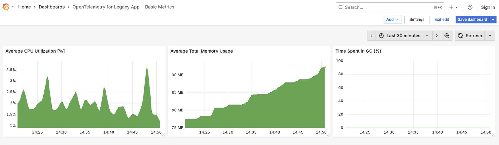
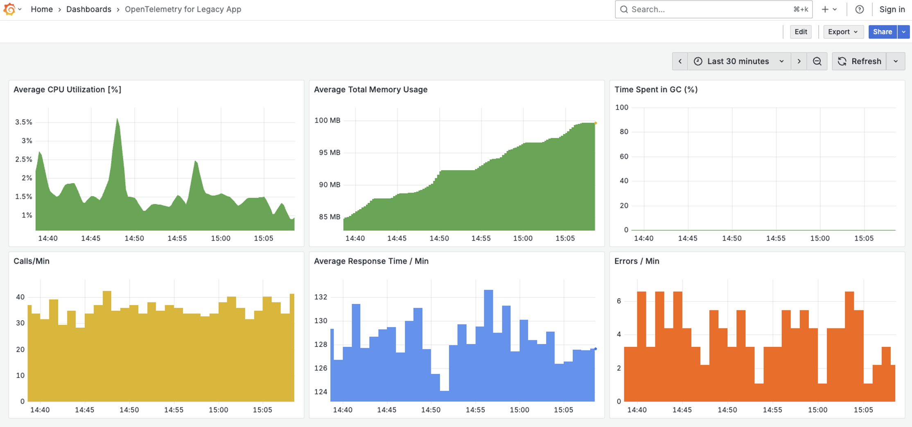

In almost every established enterprise, there's THAT one system. It’s the one
running in the corner, performing a critical function for years. It’s reliable,
but it’s also a complete black box. No one wants to touch it for fear of
breaking it, and the original developers are long gone. It could be a core
banking ledger from the 90s, a logistics routing engine in a warehouse, or a
data aggregator on a factory floor. You know it works because, well, it hasn't
failed... yet.

The end goal is clear: we need to rewrite or migrate this application to a
modern, scalable, and supportable platform. But a project like that takes
months, or even years. What do we do in the meantime? We can’t operate in the
dark.

While OpenTelemetry is often celebrated for its role in modern, cloud native
architectures, its value doesn't stop there. In fact, it provides a powerful,
often overlooked, solution for the very systems that aren't cloud native. It
acts as a bridge to modernization. By giving us some visibility into the legacy
application today, we can de-risk its operation, plan for its replacement, and
build the data-driven business case for its future. Let's walk through how to do
this with a simulated legacy app, all without changing a single line of its
code.

## OpenTelemetry: Modern observability for legacy code

To simulate a common legacy pattern, we've built a simple application. A core
executable written in C (simulating a system-level process) starts a Java
Virtual Machine (JVM) to handle a specific task, like processing a transaction
or a record.

The flow is:

```bash
C Application (legacy_app) -> starts JVM -> calls a Java method to process a task
```

When we run ./legacy_app, it works. But we can't answer critical questions: Is
it keeping up with business demand? Is it about to run out of memory and crash
during end-of-day processing? Is a slowdown in this app the root cause of last
week's customer complaints?

Let's find out.

### Stage 1: Basic health monitoring (Is the system stable?)

Our first goal is to get vital signs monitored for our application. We need to
see its CPU and memory usage to ensure it’s not about to fail. We can achieve
this with the OpenTelemetry Java agent by simply attaching it to the application
using the `-javaagent` flag in the JVM startup arguments. In our example, we can
do this using the `_JAVA_OPTIONS` environment variable.

#### Step 1: Set up the environment

In our terminal, we'll configure the agent without touching the application
itself.

```bash
# --- Part 1: Basic System Health Configuration ---

# 1. Give our service a descriptive name
export OTEL_SERVICE_NAME=legacy-part-processor

# 2. Enable ONLY the metrics exporter
export OTEL_METRICS_EXPORTER=otlp

# 3. Point the agent to the collector's gRPC endpoint
export OTEL_EXPORTER_OTLP_ENDPOINT=http://127.0.0.1:4317

# 4. Specify OTLP protocol
export OTEL_EXPORTER_OTLP_PROTOCOL=grpc

# 5. Enable runtime metrics for Java 8
export OTEL_INSTRUMENTATION_RUNTIME_TELEMETRY_JAVA8_ENABLED=true

# 6. Attach the OpenTelemetry Java agent
export _JAVA_OPTIONS="-javaagent:./opentelemetry-javaagent.jar"
```

#### Step 2: Run the unmodified application and confirm it's working

```bash
./legacy_app
```

First, let's verify that our legacy application is running. A quick look at the
terminal logs shows a steady stream of messages, confirming that our process is
alive and well:

```bash
[C Wrapper] Reading new Part ID from assembly line: 3035
[Java Processor] Received Part ID 3035. Fetching processing parameters...
[Java Processor] Part ID 3035 processed successfully.
[C Wrapper] Processing request for Part ID 3035 completed successfully.

[C Wrapper] Reading new Part ID from assembly line: 3036
[Java Processor] Received Part ID 3036. Fetching processing parameters...
[Java Processor] Part ID 3036 processed successfully.
[C Wrapper] Processing request for Part ID 3036 completed successfully.

[C Wrapper] Reading new Part ID from assembly line: 3037
[Java Processor] Received Part ID 3037. Fetching processing parameters...
[Java Processor] Part ID 3037 processed successfully.
[C Wrapper] Processing request for Part ID 3037 completed successfully.
```

The data from our application follows a standard path: the OTel agent sends
metrics to the OpenTelemetry Collector, which are then scraped by Prometheus for
storage. We then use Grafana to connect to Prometheus and visualize the data.
Since this is a common and well-documented setup, we'll skip the specific
configuration files and jump right into what this visibility allows us to see.

#### Step 3: Build basic monitoring dashboard

This is the moment it all comes together. We can now head over to Grafana, and
with just three simple queries, instantly build our first dashboard. And just
like that, we have basic monitoring for our application, covering average CPU
utilization, average memory consumption, and time spent in garbage collection.



Result: Foundational health metrics for our legacy application!

With this single change, we've established a foundational layer of
observability. Critical JVM metrics begin flowing to our backend immediately,
providing the data needed to answer key operational questions:

- Memory Usage: Is our application leaking memory? Will it crash during peak
  business hours?
- CPU Load: Is the process falling behind during high-volume periods?
- Garbage Collection: Are frequent "pauses" in the application causing cascading
  timeouts in other services?

We've moved from a complete black box to having a real-time health dashboard.

### Stage 2: Performance metrics (Is the system efficient?)

Health is one thing, but performance is another. After reviewing the code, we
can see our app's core logic is in a processTransaction() method. But static
code can't answer dynamic questions. How long does this take to execute under
real-world load? Is it a bottleneck?

#### Step 1: Update the environment

We add a few more environment variables to tell the agent to specifically
measure this method. For scenarios where you can't modify the application's
source code, OpenTelemetry's Java agent offers a powerful solution:
[otel.instrumentation.methods.include](/docs/zero-code/java/agent/annotations/#creating-spans-around-methods-with-otelinstrumentationmethodsinclude).
This setting allows you to instruct the agent to automatically create spans
around specific methods.

```bash
# --- Part 2: Application Performance Configuration ---

# 1. Enable traces exporters
export OTEL_TRACES_EXPORTER=otlp

# 2. Tell the agent which method to instrument
export OTEL_INSTRUMENTATION_METHODS_INCLUDE="LegacyJavaProcessor[processData]"
```

#### Step 2: Run the application and modify existing dashboard

The trace spans we're now collecting are the raw material for a much richer
dashboard. Our OTel Collector is configured to analyze these spans and generate
the "Golden Signals" of application monitoring. Let's head back to Grafana and
add charts for our three core metrics: calls per minute, average response time,
and errors per minute.



Result: Core business KPIs for our legacy application!

The OpenTelemetry agent now measures every single transaction. Using an OTel
Collector with the spanmetrics connector, we get crucial performance indicators:

- Latency (Processing Time): We finally know how long it takes to process one
  transaction. Is it fast enough? Are we meeting our SLOs?

- Throughput (Calls per Minute): We can see how many transactions we're
  processing per minute. Is our system keeping up with demand? Can it handle
  peak load?

- Error Rate (Quality of Work): We can now track the health of our business
  logic itself. What is our failure rate? Can we spot problems before they
  escalate?

### Summary and call to action

Sometimes, even limited visibility is far better than flying completely blind.
By instrumenting your legacy black box with just a few environment variables and
the OpenTelemetry agent, you gain actionable insights without risky code changes
or expensive overhauls. This is not just a technical win-it’s a strategic step
forward. Armed with real data, you can make smarter decisions, proactively
address potential issues, and build confidence as you plan for the future.

Even if your initial instinct is that your application is too legacy to benefit
from OpenTelemetry, it’s always worth verifying your tech stack. More often than
not, there’s a way to instrument it-even with zero code modification. The
ecosystem is constantly evolving, and many frameworks and platforms now support
agent-based or sidecar instrumentation, making it easier than ever to extract
valuable telemetry data from even the oldest systems.

Remember: every bit of visibility gained today buys you time, resilience, and
peace of mind until your modernization journey is complete.
