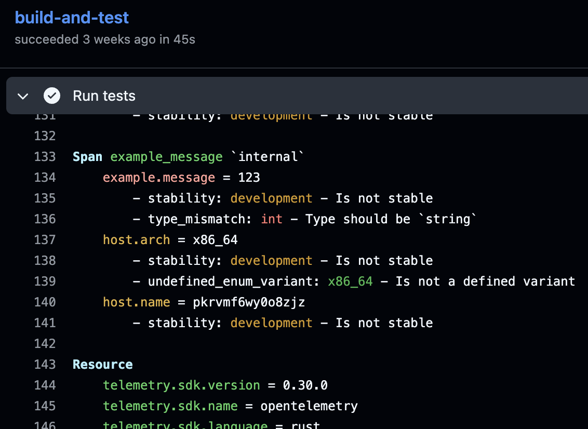

---
title:
  'Observability by Design: Unlocking Consistency with OpenTelemetry Weaver'
linkTitle: OTel Weaver
date: 2025-07-02
author: >-
  [Laurent Quérel](https://github.com/lquerel) (F5), [Jeremy
  Blythe](https://github.com/jerbly) (Evertz), [Josh
  Suereth](https://github.com/jsuereth) (Google), [Liudmila
  Molkova](https://github.com/lmolkova) (Microsoft)
sig: 'Semantic Conventions: Tooling'
cSpell:ignore: Evertz Liudmila Molkova promconv Quérel SDLC Suereth
---

{}

OpenTelemetry Weaver helps teams build observability by design, enabling
consistent, type-safe, and automated telemetry through semantic conventions.
With Weaver, you can define, validate, and evolve your telemetry schemas,
ensuring reliability and clarity across your systems.

{}

## Why consistency matters: Enter semantic conventions

Have you ever experienced…

- A deployment that breaks existing alerts or dashboards because a metric name
  changed?
- Writing overly complex queries because teams use different metric names for
  the same thing?
- Losing hours debugging production issues due to missing or unclear
  instrumentation?
- Teams struggling to interpret undocumented or inconsistent metrics?

If any of this sounds familiar, you're not alone. These are the symptoms of
treating telemetry as an afterthought, instead of an intentional part of your
software design. That’s where semantic conventions come in.

**Semantic conventions** are a set of rules and standard names for telemetry
data. Think of them as the "grammar" for metrics, traces, and logs, so everyone
and everything (including your tools) knows what you mean by
`http.request.method`, `db.system.name`, or `http.client.request.duration`.

The [OpenTelemetry Semantic Convention](/docs/specs/semconv/) is a massive, open
catalog with 900+ attributes and signals in over 70 domains, maintained by 9
special interest groups. This open catalog ensures:

- **Consistency**: One name, one meaning everywhere.
- **Interoperability**: Tools, teams, and vendors can understand each other.
- **Automation**: Machine-readable standards enable code and docs generation,
  static and live compliance checks, and more.

But maintaining and evolving such a registry across teams and tools isn't easy.
That's where [OTel Weaver](https://github.com/open-telemetry/weaver) comes in.

## Observability by design: A modern engineering approach

Observability by design means integrating observability into your software
development life cycle (SDLC) from the start. This is often called
"observability shift left" because it moves observability concerns earlier (to
the "left") in the development timeline—from post-deployment monitoring back to
the design and development phases:

1. **Set Clear Goals**: Define observability objectives up front. What signals
   do you need?
2. **Automate**: Use tools to generate code, docs, tests, and schemas from
   conventions.
3. **Validate**: Catch observability issues early, in CI/CD, not in production.
4. **Iterate**: Refine your telemetry based on real-world feedback and evolving
   needs.

In other words, **treat telemetry like a public API**. If you wouldn't break
your app's API between releases, don't break your telemetry either.

## OTel Weaver: Empowering semantic conventions and observability by design

**OTel Weaver** is the open source CLI and automation platform that helps you
manage, validate, and evolve semantic conventions and observability workflows.

What can Weaver do for you?

- **Define and version your semantic conventions**: Create your own conventions
  or build on top of OTel's. Version and share your schemas with your team or
  community.
- **Policy-based validation**: Enforce best practices-naming, stability,
  immutability, and more. Detect breaking changes and maintain quality. You can
  even define your own policies!
- **Live instrumentation checks**: Check that your application's telemetry
  matches your defined schema and best practices. Measure instrumentation
  coverage, similar to code coverage, to ensure your unit and integration tests
  are actually exercising all your instrumented code. Never miss critical
  signals in production again.
- **Code and docs generation**: Generate Markdown documentation and constants in
  many programming languages out of the box. We're also working on more advanced
  solutions to automatically generate type-safe instrumentation helpers (Go,
  Rust, ...) for even easier and safer integration.
- **Diff and evolution**: Safely evolve your telemetry schema with automatic
  diffs and upgrade/downgrade support.

> Definition: A registry is a collection of semantic conventions, which are
> standardized definitions that describe how telemetry data like metrics, logs,
> and traces should be named and structured. OpenTelemetry maintains the
> official semantic convention registry, but it’s possible for teams, projects,
> or vendors to define and publish their own custom registries to suit specific
> needs.

Weaver currently supports a basic form of multi-registry, allowing a custom
registry to import and override another registry (for example, extending the
official OTel semantic conventions). At present, only two levels are supported:
your custom registry and a single dependency. This covers many common cases, but
we know there's much more potential for flexibility and collaboration.

## Weaver in action: Key commands

Getting started with Weaver is easy: it's available as a pre-built binary CLI
(see releases [page](https://github.com/open-telemetry/weaver/releases)) and a
Docker [image](https://hub.docker.com/r/otel/weaver), ready to drop into any
CI/CD pipeline or local workflow.

### How the OTel Semantic Conventions community uses Weaver

The OTel semantic conventions community relies on Weaver as its primary tool for
building, validating, and evolving the official registry. Below are some
commands used by the community.

**Checking the Official OTel Registry:**<br/> Weaver ensures every change to the
registry is consistent, validated, and follows the core policies.

```bash
weaver registry check -r registry-path
```

The following lists provide a brief overview of the policies implemented for the
OTel registry.

| **Attribute Rules**                                     | **Naming & Structure**             | **Stability & Evolution**                    |
| ------------------------------------------------------- | ---------------------------------- | -------------------------------------------- |
| No attributes outside registry                          | Names must follow format rules     | No removal of elements                       |
| No requirement levels on attributes                     | IDs must match naming patterns     | No stability downgrades                      |
| No duplicate attributes in group                        | Attributes must be fully qualified | No type or unit changes                      |
| Attribute sets must be immutable                        | No namespace collisions            | Definitions require stability                |
| Experimental attributes in stable groups must be opt-in | No constant name collisions        | Enum values may not be changed, once defined |

**Generating Markdown documentation:**<br/> Weaver automatically produces the
human-readable docs you see at opentelemetry.io.

```bash
weaver registry update-markdown -r registry-path --target=markdown
```

**Generating code for instrumentation helpers:**<br/> Every supported
OpenTelemetry SDK benefits from auto-generated constants and code in their
native language, ensuring no typos or inconsistencies.

For example, the code generated from Weaver for the Go client SDK can be found
in this
[repository](https://github.com/open-telemetry/opentelemetry-go/tree/main/semconv).
The Weaver command used looks like:

```bash
weaver registry generate -r registry-path -t templates-root-dir go
```

Similarly, the code generated for the OpenTelemetry Semantic Conventions for
Java library is visible in this
[project](https://github.com/open-telemetry/semantic-conventions-java). Weaver
offers an embedded template system compatible with Jinja2, with a large number
of custom functions to facilitate code generation in different languages.

**Tracking changes and schema evolution:**<br/> Weaver tracks diffs between
registry versions to highlight breaking changes or improvements.

```bash
weaver registry diff -r current-version-registry-path --baseline-registry previous-version-registry-path
```

**Live instrumentation checks and coverage:**<br/> Users and maintainers can
leverage Weaver to
[live-check](https://github.com/open-telemetry/weaver/tree/main/crates/weaver_live_check#readme)
that their application correctly emits telemetry conforming to the official
semantic conventions, or a custom registry (see below).

```bash
weaver registry live-check --registry registry-path
```

This command generates a compliance report of the signals emitted by your
application against a registry.



Weaver `live-check` is not only useful for verifying your application's
compliance with semantic conventions, but it can also be applied to all the
libraries you link to it, directly in your CI/CD workflow! Beyond basic model
compliance, custom Rego policies enable organization-specific invariant and best
practice checks. Every attribute and signal is passed through the policy engine
as it's received. For example, you could define a policy for the range of a
metric's value, or that a particular attribute's string value matches some
regular expression. The policies are independent of the semantic convention
registry, so you can define application or library specific checks as needed.

**Simulating telemetry with `weaver emit`**<br/> Instrumenting your code and
building dashboards often happen at different times, and sometimes with
different people. This can slow down your observability efforts: frontend and
SRE teams can't build useful dashboards or alerts until the app emits real data
in a staging or production environment. Weaver solves this chicken-and-egg
problem with the `emit` command.

```bash
weaver registry emit --registry registry-path --endpoint http://localhost:4317
```

This command generates sample telemetry in OTLP format, which you can send
directly to your collector, backend, or visualization tool.

### Custom registries: Defining and checking your own telemetry schema

While Weaver powers the core OTel registry, you can also use it to define and
manage your own application's telemetry schema. This means you can reuse and
extend the official conventions while adding custom signals, attributes, and
events tailored to your domain, and you can both statically and live-check that
your app's telemetry is up-to-date and complete.

> Note: We are actively working on making custom registries even easier to use,
> with better onboarding, simpler configs, and more integrated code generation
> and documentation support. We’re looking for feedback and help in this area.

To help you get started, here's a quick example using a custom registry for a
“ToDo” app. First, create a `registry_manifest.yaml` file to specify your
registry:

```yaml
name: todo_app
description: OTel signals for my native ToDo app
semconv_version: 0.1.0
dependencies:
  - name: otel
    registry_path: https://github.com/open-telemetry/semantic-conventions/archive/refs/tags/v1.34.0.zip[model]
```

Import and extend existing conventions, and define your own signals and
attributes:

```yaml
imports: # import signals from the dependency registry, i.e. OTel semantic conventions
  metrics:
    - db.client.* # import all metrics with names starting with `db.client.`
  events:
    - app.*
    - exception # import the event named `exception`
  entities:
    - host
    - host.cpu

groups:
  - id: metric.todo.completion_time
    type: metric
    brief: Measures the time between the creation and completion of a ToDo item.
    metric_name: todo.completion_time
    instrument: histogram
    unit: s
    attributes:
      - id: todo.priority # define your own attribute
        type: string
        brief: The priority of the ToDo item.
      - id: todo.category
        type: string
        brief: The category of the ToDo item.
      - ref: user.id # reference an existing attribute from the imported registry
        requirement_level: required # refine the requirement level
    entity_associations:
      - os.name
      - os.version
  - id: event.todo.deleted
    type: event
    brief: Emitted whenever a ToDo item is deleted by the user.
    attributes:
      - id: delete.reason
        type: string
        brief: The reason for deletion.
      - id: todo.priority
        type: string
        brief: The priority of the deleted ToDo item.
      - ref: user.id
        requirement_level: required
    entity_associations:
      - os.name
      - os.version
```

## What's next for Weaver?

We're working hard to make Weaver even more powerful, flexible, and easy to
adopt:

- **Better docs & easier onboarding**: Expect more hands-on examples,
  step-by-step guides, and an improved focus on ease of use. We’re also creating
  templates and policies tailored for custom registries.
- **Multi-registry support**: Enhanced support for composing, layering, and
  managing multiple semantic convention registries, including conflict
  resolution. This will also enable library authors to easily publish and share
  their own registries.
- **Schema v2**: A new set of commands to package and publish resolved,
  self-contained telemetry schemas for applications and libraries. This
  standardization effort (telemetry schema v2) will make it easier for the
  entire observability ecosystem to build on top of semantic conventions and
  Weaver.
- **Type-safe semantic-conventions API generation**: Automatically generate
  strongly typed instrumentation libraries to reduce errors and accelerate
  development. An example of a Go type-safe client API for Prometheus is already
  in progress at [promconv](https://github.com/sh0rez/promconv/tree/main). A
  more general Go type-safe client API using Weaver is also being developed at
  [MrAlias/semconv-go](https://github.com/MrAlias/semconv-go)

Stay tuned, the next generation of semantic convention management is coming, and
Weaver will make it seamless for the whole community.

## Get involved!

- **Try Weaver**:
  [OpenTelemetry Weaver GitHub](https://github.com/open-telemetry/weaver)
- **Learn More**: [OTel Semantic Conventions](/docs/specs/semconv/)
- **Join the Conversation**: CNCF Slack:
  - [#otel-semantic-conventions](https://cloud-native.slack.com/archives/C041APFBYQP)
  - [#otel-weaver](https://cloud-native.slack.com/archives/C0697EXNTL3)
- **Contribute**: Your feedback and contributions help shape the future of
  observability!

Weaver is built to be highly extensible and configurable. You can create custom
registries, write policies with Rego, and design templates with Jinja2, all
using Weaver's built-in engines. If you want to get started or have questions,
join us in [#otel-weaver](https://cloud-native.slack.com/archives/C0697EXNTL3)
on Slack. We're happy to help and always interested in your ideas!

> Observability is not just a tool, it's a practice. Build it by design, with
> clear, consistent, and automated workflows powered by OpenTelemetry Weaver.
