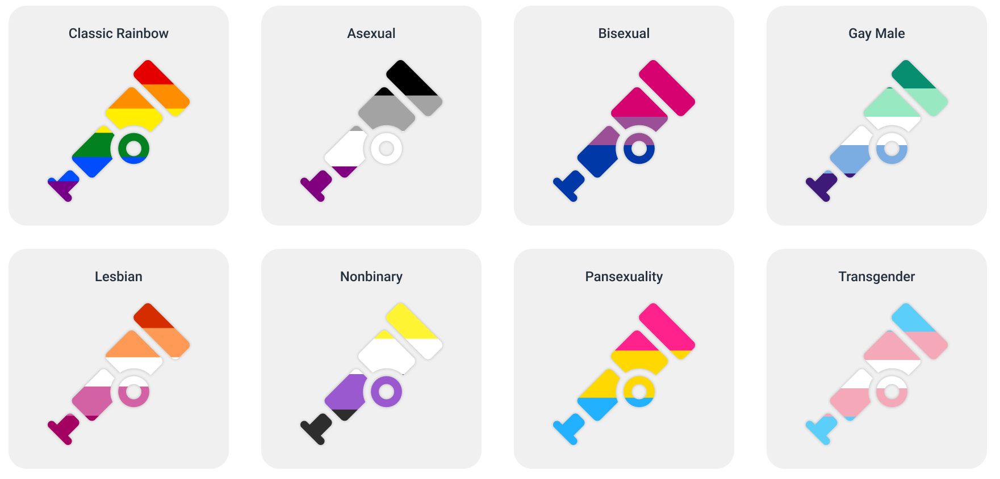

OpenTelemetry, like all open source projects, only exists thanks to the tireless
work of thousands of contributors and maintainers. To celebrate and recognize
[Pride Month](https://en.wikipedia.org/wiki/Pride_Month) in the United States,
we've created several variants of our iconic telescope logo for contributors to
use.

Happy Pride!

You can [download the files here.](./pride-logo-pack.zip)
