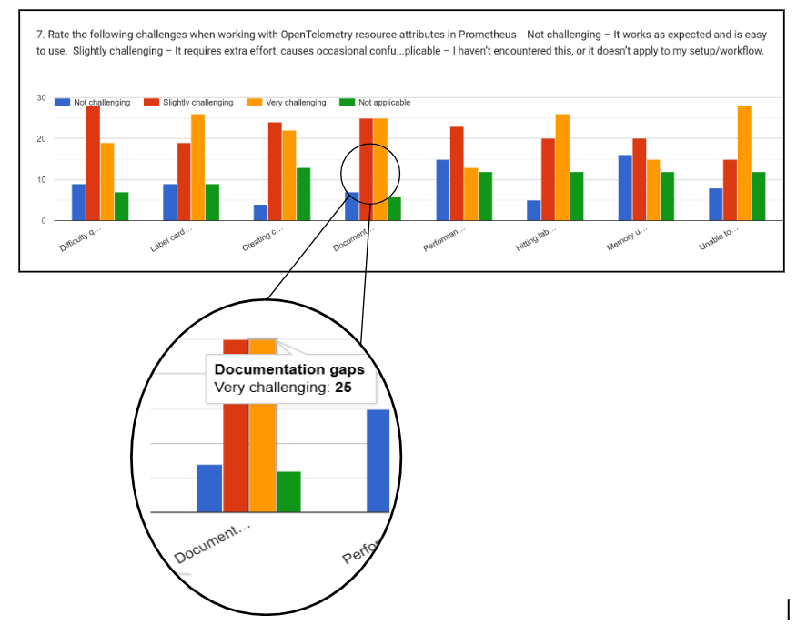

---
title:
  How Should Prometheus Handle OpenTelemetry Resource Attributes? - A UX
  Research Report
linkTitle: How Should Prometheus Handle OTel Resource Attributes?
date: 2025-07-22
author: >-
  [Victoria Nduka](https://github.com/nwanduka)
sig: End User
# prettier-ignore
cSpell:ignore: Beorn explorative Kiripolsky Nduka negotiables Rabestein Suereth sunsetting Volz
---

On May 29th, 2025, I wrapped up my mentorship with Prometheus through the
[Linux Foundation Mentorship Program](https://mentorship.lfx.linuxfoundation.org/project/36e3f336-ce78-4074-b833-012015eb59be).
My project focused on understanding how Prometheus handles OpenTelemetry
resource attributes and how that experience could be improved for users. My job
was to conduct user research to get the user perspective on this challenge. In
three months, I conducted user and stakeholder interviews, ran a survey, and
analyzed the findings.

In this article, I'll share how I conducted the research, what I uncovered and
where the communities involved could go from here.

## Project background

OpenTelemetry (OTel) has something called a
[resource](/docs/concepts/resources/) attribute, which is extra information
about the source of a metric, like the service, host, or environment that
generated it. Prometheus, a time-series database, uses labels to identify and
query metrics. If resource attributes are converted to labels, they can cause
what's known as "a cardinality explosion", essentially creating too many unique
combinations that overwhelm the system. This usually happens if the attributes
change often or include a lot of unique values, like user IDs or pod names.

Currently, there are three main approaches to handling this challenge:

- **Map all resource attributes to labels:** This creates cardinality explosion
  problems, especially for applications with large numbers of attributes or
  frequently changing attribute values.
- **Selective promotion:** Users manually choose which resource attributes are
  important enough to be converted to labels in Prometheus.
- **Target info pattern:** Put all resource attributes in a separate metric
  called `target_info`. When users need to query metrics involving specific
  resource attributes, they have to perform a "join" between the target info and
  their actual metrics.

These aren't bad solutions technically, but they don't make for the best user
experience. So, I conducted this research to understand what the Prometheus
maintainers might be missing about the user experience.

The research objectives were:

- Understand how engineers currently use OpenTelemetry resource attributes with
  Prometheus
- Identify pain points in the current integration
- Discover user expectations for how resource attributes should be represented

## Research approach

My research approach was a mix of qualitative and quantitative research. I
started with stakeholder interviews to understand the historical context and
assess how open stakeholders were to changes that might result from my research.
The stakeholders I spoke to represented a range of roles, from project founders
and co-founders, to long-time maintainers with historical context, and others
more directly involved in the ongoing challenges around resource attribute
handling.

Next, I conducted user interviews to hear directly from people actually using
these tools. Finally, I followed up with a survey to reach a broader audience
and validate what I heard in interviews.

## Stakeholder interviews insights

I spoke to 6 stakeholders—3 from each project:

**Prometheus stakeholders:**

- [Julius Volz](https://github.com/juliusv) – Prometheus Co-founder
- [Beorn Rabestein](https://github.com/beorn7) – Prometheus long-time maintainer
- [Richard Hartmann](https://github.com/RichiH) – OpenMetrics co-founder and
  Prometheus maintainer

**OpenTelemetry stakeholders:**

- [Juraci Paixão Kröhling](https://github.com/jpkrohling) – OpenTelemetry
  Governance Committee member
- [Josh Suereth](https://github.com/jsuereth) – OpenTelemetry Technical
  Committee member
- [Austin Parker](https://github.com/austinlparker) – OpenTelemetry co-founder
  and Governance Committee member

My conversations with stakeholders brought several interesting discoveries to
light:

- The Prometheus and OpenTelemetry communities hadn't always communicated well
  and that prevented them from collaborating early on.
- Much of the interoperability issues that exist now stem from the different
  philosophical and technical foundations on which each of the projects is
  built.

  > "If we think about exploratory situations or use cases, then we can justify
  > a lot of the design decisions behind OpenTelemetry. And if we think about
  > metrics and scaling, monitoring, for huge infra, then the design decisions
  > for Prometheus are justified as well. So both have very good arguments." —
  > _Juraci Paixão Kröhling_

  <!-- test -->

  > “I think one of the biggest [interoperability issues] is the difference
  > between push and pull.” — _Julius Volz_

  Julius later elaborated that his concern goes beyond the delivery mechanism
  itself. In his words:

  > "One of the biggest downsides of using OTLP to push metrics to Prometheus is
  > that you end up throwing away one of the core features of Prometheus as a
  > monitoring system: its pull-based metrics collection model that is based on
  > dynamic service discovery information (so Prometheus always knows which
  > targets should currently exist), and the resulting automatic target health
  > monitoring via the synthetic ‘up’ metric that is generated for each target
  > scrape.”

- There’s a shared recognition of the importance of putting user needs first,
  even while maintaining some non-negotiables (for example, Prometheus keeping
  its pull model and not alienating existing users).

One key takeaway from the interviews for me was realizing that the current
interoperability problems are not failures, but natural consequences of
different communities solving different problems at different times. And it’s
good to see both projects are working together now to make user experience
better.

## User interviews insights

The user interviews were just as revealing as the stakeholder conversations. I
aimed to speak with about 10 users (admittedly ambitious) but managed to
interview 7, and they all shared incredibly helpful perspectives.

The most prominent pain point users shared was the complexity of performing
joins with the current integration. Another issue mentioned was the mismatch in
metric names caused by character set limitations, but I understand that has
since been addressed, as recent Prometheus releases now support UTF-8 characters
(though this introduces the need for the more cumbersome quoted selector syntax
in PromQL).

Regarding mental models, many users (both interviewees and survey respondents)
don’t distinguish between resource attributes and Prometheus labels. They tend
to think of them as the same thing.

> "I would expect resource attributes as a rule to be treated exactly the same
> way as the attributes attached to the tracer, the metric... I wouldn't draw a
> boundary between them." — _Interview Participant 1_

I also learned about the various workarounds people use to handle resource
attribute issues in their specific use cases. Some promote selected resource
attributes to labels, others handle the conversion at the
OpenTelemetry-Collector level to avoid dealing with it in Prometheus, and a few
convert all attributes, though usually only when the number of attributes is
small.

## Survey insights

The survey helped me quantify what I was hearing in interviews and reach a
broader audience. At the time of writing, we’ve had 134 responses, with 61 from
our target group—people who use OTel and Prometheus together.

Here are the key findings:

- Users don't conceptualize resource attributes as different from regular
  labels, yet current implementation treats them as separate metadata.
- Complex join syntax is a big barrier to adoption, with average developers
  unable to write basic queries accessing resource attributes.
- Manual attribute promotion creates operational overhead that scales poorly
  with team size and complexity.
- 78% of respondents find documentation gaps a challenge in their use of
  resource attributes.

The survey patterns were consistent with what emerged from my qualitative
research. For detailed results, see the
[anonymized survey responses](https://github.com/prometheus-community/ux-research/blob/main/prom-otel-research/survey-results.csv)

## What I didn’t expect to learn (but did)

I began this research to understand user pain points with resource attribute
handling, but I uncovered some unexpected and important findings.

One of the most surprising was the realization that
[OpenTelemetry’s Resource Detection feature](/docs/specs/otel/resource/#telescoping)
allows users to selectively retain or drop resource attributes based on
relevance using a conceptual pattern sometimes referred to as “telescoping.”
Despite its potential, many users and even some members of the Prometheus
community seem unaware of it. This lack of awareness may have contributed to the
adoption of the "join" pattern, which has since proven to be problematic.

This highlights a broader issue: documentation and education gaps are a major
barrier. In our survey, 78% of respondents cited documentation gaps as a
challenge.

Another key realization is that earlier integration decisions, like the reliance
on joins, were made without a full understanding of each tool’s capabilities, an
unavoidable consequence of the lack of early collaboration and communication
between the Prometheus and OpenTelemetry communities.

## Recommended solutions

Based on conversations with stakeholders and end users, here are some of the
proposed solutions, grouped by what's feasible in the short term vs. what's part
of a longer-term vision:

### Short-term solutions

- **Improved documentation for attribute handling** Since users find it easier
  to promote attributes than to join on target info, it may be worth
  de-emphasizing (or even sunsetting) documentation around joins, while making
  [attribute promotion docs](https://prometheus.io/docs/guides/opentelemetry/#promoting-resource-attributes)
  more prominent for those not yet aware of the option. The telescoping pattern
  of resource detection in OpenTelemetry also deserves more visibility and
  proper documentation. Additionally, users have suggested creating consolidated
  Prometheus–OpenTelemetry documentation that clearly explains how both systems
  handle resource attributes.

### Long-term vision

- **Entity framework** OpenTelemetry’s developing concept of entities could help
  Prometheus distinguish between identifying vs. descriptive attributes. This
  would guide which attributes become labels, and which are stored or filtered
  out.

- **Metadata storage** Stakeholders also discussed the idea of adding
  first-class metadata support to Prometheus itself. This would allow certain
  resource attributes to be stored as metadata (not labels), avoiding
  cardinality costs while keeping the information available for queries or
  joins.

- **Expanding for exploratory telemetry** This might be a stretch, but
  Prometheus could consider expanding its scope to better support exploratory
  telemetry use cases. Stakeholders showed openness to change, as long as
  Prometheus’s core architecture remains intact and existing users aren’t
  alienated. That suggests there may be room for evolution, especially if new
  capabilities can complement, rather than replace, current behavior.

  > I see OTel and Prometheus as coming from very different assumptions of how
  > telemetry should work in general. So, while Prometheus is very opinionated
  > on time series storage…OTel, on the other hand, comes from a tracing
  > background, meaning it's more explorative than Prometheus. So [with]
  > Prometheus, I kinda know upfront what I need. [With] OpenTelemetry, I don't
  > know what I might need, so I store everything. — _Juraci Paixão Kröhling_

- **Cross-signal correlation** Users mention using platforms that can ingest all
  telemetry types and correlate metrics, traces, and logs within a single
  system. While Prometheus will likely remain focused on just metrics, it could
  enable tooling that correlates metrics with telemetry stored in other
  databases. Prometheus currently supports
  [exemplars](https://prometheus.io/docs/specs/om/open_metrics_spec/#exemplars),
  which allow linking metrics to traces, but that’s about the extent of their
  scope. They rely on tracing being present, which makes them less useful in
  environments where traces aren’t available or instrumented.

  > "One of the key innovative things in OpenCensus was… you could divide CPU
  > usage by which requests were using CPU and get a metric that would say,
  > ‘here's CPU usage by request.’ That’s a thing you could accomplish in
  > OpenCensus because it was all contextual-based metrics." — _Josh Suereth_

There's still work to be done. The communities will need time to develop and
test solutions. But I'm proud that this research has provided a user-centered
foundation for that work.

If you're interested in the ongoing discussions, proposals, and feedback around
these ideas, you can check out the GitHub repository where everything is being
documented:
[OpenTelemetry Resource Attributes in Prometheus UX Research](https://github.com/prometheus-community/ux-research/tree/main/prom-otel-research)

## Acknowledgments

This post would be incomplete without acknowledging my incredible mentors:
[Amy Super](https://github.com/amy-super),
[Andrej Kiripolsky](https://github.com/AndrejKiri), and
[Arthur Silva Sens](https://github.com/ArthurSens) – thank you for trusting me
with this challenging project and caring so deeply about my professional
journey. You’re the real superstars.

To all the stakeholders and users who gave their time: thank you for engaging
with this work and trusting me with your honest feedback. Your insights made
this research meaningful.

## What's next for me

I’m excited to keep working at the intersection of UX and cloud native systems.
If you know of opportunities similar to this mentorship, I’d love to hear from
you! I’m a hard worker—just ask my mentors.
