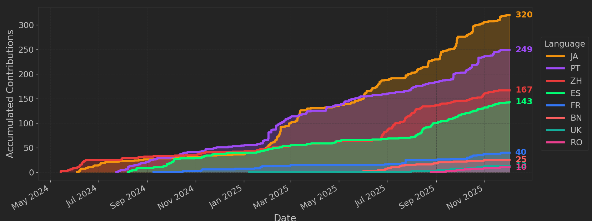

As 2025 has come to an end, we're taking a moment to look back at everything the
community accomplished across the website, documentation, and localization
efforts. The year was another exciting chapter for OpenTelemetry.io, and we are
thrilled to share some of the highlights with you.

## Highlights of 2025

Where 2024 introduced the foundation of multilingual documentation, 2025 is when
localization became a core pillar of OpenTelemetry.io. This means more
contributors, more translations, more supported languages, and more visibility
for localized content.

We also embarked on an innovative solution to one of the biggest challenges for
OpenTelemetry users. The Ecosystem Explorer project makes it easier to find and
understand all available options for configuring instrumentation and collecting
telemetry.

## Localization: A breakout year

[Localization] has been one of the standout achievements of 2025. Building on
the five locales introduced in 2024, this year we launched three new languages:

- [Bengali](/bn/) — May 16, 2025
- [Ukrainian](/uk/) — July 30, 2025
- [Romanian](/ro/) — September 11, 2025

This brings us to **eight supported locales**, marking a major milestone in
accessibility and global reach.

[Localization]: /docs/contributing/localization/

### Localization activity by the numbers

Across all locales, contributors delivered:

- **74,825 lines** of translated content
- **483 localized files**
- **523 localization-specific** commits
- **65 unique contributors** across languages

Taken together, these numbers show that localization has become one of the most
active and vibrant areas of contribution in the entire OpenTelemetry ecosystem.

### Translation completeness

Localizing an ever-changing documentation set requires significant time and
effort. Our localization teams have been working hard to add more translated
content every day. At year-end, the Japanese localization was in the lead with
28% coverage:

- Japanese — 28% (169 files)
- Chinese — 24% (147 files)
- Portuguese — 18% (109 files)
- Spanish — 13% (79 files)
- French — 9% (57 files)
- Bengali — 3% (17 files)
- Ukrainian — 1% (7 files)
- Romanian — 1% (4 files)

### Most active localization contributors

A few contributors played a major role in sustaining and expanding localized
documentation:

- Masaki Sugimoto ([@Msksgm](https://github.com/Msksgm)) — 127 commits
  (Japanese)
- Vitor Vasconcellos ([@vitorvasc](https://github.com/vitorvasc)) — 74 commits
  (Portuguese + cross-locale workflow improvements)
- Michael Yao ([@windsonsea](https://github.com/windsonsea)) — 49 commits
  (Chinese)
- Patrice Chalin ([@chalin](https://github.com/chalin)) — cross-locale
  maintenance, validation, and infrastructure

## Ecosystem Explorer: Unlocking the power of our metadata

Beyond documentation and localization, 2025 was also the year the
**OpenTelemetry [Ecosystem Explorer]** initiative took shape under the
Communications SIG.

As the OpenTelemetry ecosystem grows, it's become harder for users to answer
basic but critical questions:

- _Which libraries and technologies are instrumented?_
- _What telemetry (spans, metrics, attributes) do they emit?_
- _How does that telemetry change across versions and configurations?_

The existing [OpenTelemetry Registry] helps users discover components, but it
requires significant manual upkeep and doesn't always provide the depth of
information needed.

A proof-of-concept, the [Instrumentation Explorer], already shows what this can
look like for the Java agent: you can inspect instrumentations, see emitted
telemetry, and compare behavior across versions and configurations.

Special kudos to [Jay DeLuca (@jaydeluca)][Jay DeLuca] for driving this effort
and for the original Java Instrumentation Explorer prototype that inspired the
broader project.

[Ecosystem Explorer]: https://github.com/open-telemetry/community/pull/3000
[OpenTelemetry Registry]: /ecosystem/registry/
[Instrumentation Explorer]:
  https://jaydeluca.github.io/instrumentation-explorer/
[Jay DeLuca]: https://github.com/jaydeluca

## Year in numbers

In 2025, we saw tremendous growth not only across commits and files, but also in
our own team.

### Contributions

Comparing the periods [December 2023 to November 2024] and [December 2024 to
November 2025], we observed an upward trend in commits and files changed:

- **Commits** increased 43% from 1,340 to 1,913.
- **Files changed** increased 16% from 1,624 to 1,888.
- **PRs merged** grew 50% from 1,374 to 2,067.
- The only stat that declined was the **number of contributors**, which
  decreased from 106 to 73 (31%).

Since the repository’s inception in April 2019, the community has seen
remarkable growth, with:

- 5,966 merged pull requests (7,061 commits) by
- More than 1,000 contributors (1,002 to be exact!)

Thank you to every contributor for helping to build and improve the
OpenTelemetry website. Your efforts make a difference!

[December 2023 to November 2024]:
  https://github.com/open-telemetry/opentelemetry.io/compare/2023.12...2024.11
[December 2024 to November 2025]:
  https://github.com/open-telemetry/opentelemetry.io/compare/2024.12...2025.11

### Team spirit

The [Communications SIG], which manages Opentelemetry.io, also grew this year!
We added **two** new maintainers, **two** new approvers, and we created the
triager role where we welcomed **six** new triagers.

Our group of 15 is excited to continue our stewardship of the OpenTelemetry
website and documentation in 2026. We look forward to helping contributors, new
and experienced alike!

[Communications SIG]: https://github.com/open-telemetry/opentelemetry.io#roles

### Popular pages

Our public [analytics] shows data for page views and popular pages. According to
the data from December 1, 2024 to November 30, 2025, [opentelemetry.io](/) was
viewed more than **13 million** times across 5 million sessions (up from 12
million views and 4 million sessions in 2024).

Looking at the most visited documentation pages, a few sections stand out:

| Page/section      | Views | % of all views [^2] |
| ----------------- | ----: | ------------------: |
| [Collector]       |  790K |               ~6.0% |
| [Concepts]        |  725K |               ~5.5% |
| [Languages]       |  434K |               ~3.3% |
| [Getting Started] |  326K |               ~2.5% |
| [Demo]            |  298K |               ~2.3% |

[analytics]: https://lookerstudio.google.com/s/tSTKxK1ECeU
[Collector]: /docs/collector
[Concepts]: /docs/what-is-opentelemetry/
[Languages]: /docs/languages/
[Getting Started]: /docs/getting-started/
[Demo]: /docs/demo/

[^2]: Percentage of the site-total 13M views.

## Looking ahead

This year is shaping up to be another exciting year for the OpenTelemetry
project! As part of our preparation for the project's graduation from Cloud
Native Computing Foundation (CNCF) incubation, the Communications SIG will be
making some important website improvements, including a [redesign] of the
homepage and a complete [refactoring] of the Collector docs.

Whether you're an end user, a contributor, or simply enthusiastic about
OpenTelemetry, we invite you to get involved. You can [contribute] by raising
[issues], participating in [discussions], or [submitting PRs].

You can also join us:

- On the [CNCF Slack](https://slack.cncf.io/) at any one of the many
  `#otel`-prefixed channels.
- In [Comms meetings], held every other Tuesday at 9:00 AM Pacific time.

Let's make 2026 another amazing year for [opentelemetry.io](/)!

[redesign]:
  https://github.com/open-telemetry/opentelemetry.io/blob/main/projects/landing-page-redesign.md
[refactoring]: https://github.com/orgs/open-telemetry/projects/174/views/3
[Comms meetings]:
  https://docs.google.com/document/d/1wW0jLldwXN8Nptq2xmgETGbGn9eWP8fitvD5njM-xZY
[discussions]: https://github.com/open-telemetry/opentelemetry.io/discussions
[contribute]: /docs/contributing/
[issues]: https://github.com/open-telemetry/opentelemetry.io/issues
[submitting PRs]: /docs/contributing/pull-requests/
