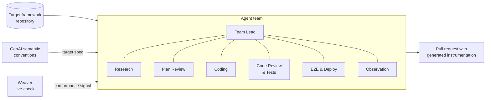
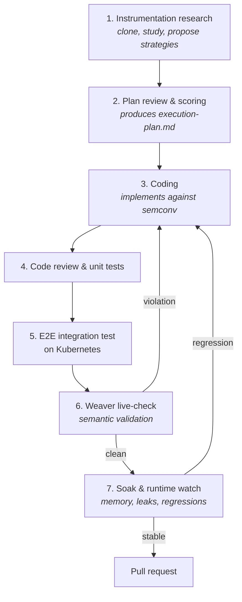
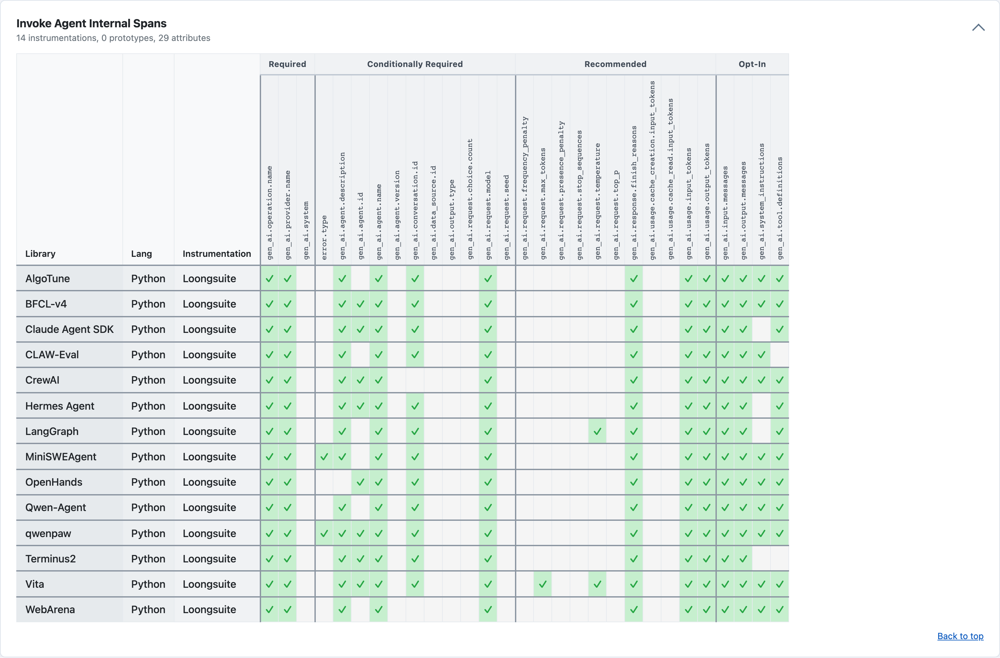

---
title:
  Building Agent Harness for OTel Instrumentation with GenAI Semantic
  Conventions and Weaver
linkTitle: An agent harness for GenAI instrumentation
date: 2026-08-20
author: >-
  [Huxing Zhang](https://github.com/ralf0131) (Alibaba Cloud), [Ziming
  Liu](https://github.com/123liuziming) (Alibaba Cloud)
issue: https://github.com/open-telemetry/opentelemetry.io/issues/11367
sig: 'Semantic Conventions and Instrumentation: GenAI'
# prettier-ignore
cSpell:ignore: BFCL crewai Dify genai Huxing inspectable loongsuite Rego Zhang Ziming
---

Writing instrumentation is the unglamorous half of observability. You have to
understand a framework's extension points, learn its data model well enough to
pick the right hooks, map every interesting object onto OpenTelemetry semantic
conventions, write the unit tests, package the plugin, and then keep it green as
the upstream framework evolves. Multiply that by every GenAI framework shipping
a new release each week, and the cost of "just adding observability" starts to
look prohibitive.

This post describes an experiment we have been running: letting a team of agents
write that instrumentation for us. The agents read the target framework, propose
an instrumentation plan, implement it against the
[OpenTelemetry Semantic Conventions for GenAI](/docs/specs/semconv/gen-ai/), and
then use [OpenTelemetry Weaver](https://github.com/open-telemetry/weaver) to
verify that what they emit actually conforms to the spec. The human's job is
reduced to reviewing the resulting pull request.

The interesting part is not that an LLM can write code. It is that
`weaver registry live-check` gives the loop a **machine-checkable termination
condition**, which is what separates this from a code generator that produces
plausible-looking telemetry.

## Why automate instrumentation?

Manually authored instrumentation has two recurring problems.

First, it is slow: even an experienced contributor needs days to instrument a
non-trivial framework correctly.

Second, it is drifty: every author makes slightly different choices about which
attributes to set, which units to use, and which operations deserve a span. The
result is telemetry that "looks like" OpenTelemetry but is hard to query
consistently across frameworks.

LLMs are now good enough at reading code to identify the right hooks in a
framework, and the GenAI semantic conventions are finally detailed enough to act
as a target spec rather than a suggestion. Put those two things together with a
tool that can mechanically check the output, and instrumentation becomes a
closed-loop generation problem rather than an open-ended writing task.

## The pieces

The system rests on two OpenTelemetry components, plus an orchestration layer.

The **GenAI semantic conventions** define the contract: span names, attribute
names, units, and which fields carry the model, the tokens, the messages, and
the tool calls. They are the ground truth that every generated plugin must
match.

**Weaver** is the validator. We rely on its
[live-check](https://github.com/open-telemetry/weaver/tree/v0.25.1/crates/weaver_live_check)
capability, which starts an OTLP listener, streams the telemetry emitted by a
running instrumentation through a set of _advisors_, and compares it against the
resolved semantic-convention registry. Built-in advisors cover the fundamentals
(`missing_attribute`, `type_mismatch`); the default OTel Rego policies add
naming and formatting rules, and you can supply your own with
`--advice-policies`. Every finding carries a level — `violation`, `improvement`,
or `information` — and Weaver exits non-zero when the report contains a
violation.

The **orchestration layer** turns an instrumentation request into a scheduled
run and posts the resulting pull request back to the requester. We currently run
this on a self-hosted multi-agent task platform, but nothing in the design
depends on it: any orchestrator that can check out a repository, run a team of
agents against it, and open a pull request will do. What matters is the loop
structure described below, not the runner.

## Architecture

The user-facing flow is intentionally narrow. You hand the system a framework
repository — for example [LangChain](https://github.com/langchain-ai/langchain)
— and you get back a pull request containing the instrumentation. Everything
between those two endpoints is delegated to agents.



## The agent team

Inside the orchestrator we organize the work as a small team of specialized
agents. Splitting responsibilities lets us isolate context windows, schedule
steps independently, and give the orchestrator a clean state machine to reason
about.

- **Team Lead Agent** — initializes the run, sequences the other agents, and
  owns the loop's state.
- **Instrumentation Research Agent** — clones the target framework, studies its
  architecture and extension points, surveys existing implementations, and
  produces a research report listing candidate instrumentation strategies.
- **Plan Review Agent** — scores the candidates on complexity, maintainability,
  and coverage, picks the best one, and writes a fine-grained
  `execution-plan.md` specifying which methods to wrap and where each attribute
  should come from. This is essentially a spec-generation step, and it is the
  natural point for a human to review.
- **Coding Agent** — implements `execution-plan.md` against the GenAI semantic
  conventions, using the shared GenAI utilities.
- **Code Review & Test Validation Agent** — reviews the generated code, writes
  unit tests, and ping-pongs with the Coding Agent until reviews are addressed
  and tests pass.
- **E2E Generation & Deployment Agent** — runs in parallel with coding,
  preparing the integration-test harness so it is ready when the plugin is.
- **Observation Agent** — runs the harness in Kubernetes, captures OTLP output,
  hands it to Weaver for semantic validation, and watches the workload over time
  for memory leaks and other runtime regressions.

## Loop engineering

We deliberately avoid hard-coding the order of steps. The Team Lead Agent owns
the high-level loop, and any agent can hand control back to it when something
needs to be replanned. The result feels less like a pipeline and more like a
long-running team conversation.



A typical run looks like this. The Team Lead activates the Research Agent, which
clones the target framework and proposes instrumentation strategies in a written
report. The Plan Review Agent scores those strategies and produces
`execution-plan.md`, the detailed implementation plan. The Coding Agent then
implements the plan, while the Code Review & Test Validation Agent reviews the
code and writes unit tests; the two iterate until every comment is resolved and
every test passes.

When the plugin is ready, we package the framework's own examples into container
images, inject the new instrumentation, and deploy the whole thing into a test
Kubernetes cluster. The running demos produce telemetry, which we pull through
OTLP and feed into Weaver. If Weaver reports a violation — a missing attribute,
a type mismatch, an off-spec name — control returns to the Coding Agent for a
fix and the pipeline re-runs. Once validation passes, we let the workload soak
so we can catch issues that only appear with time, such as memory leaks.
Anything that looks wrong goes back to the Coding Agent together with the
metrics that triggered it.

Because the whole thing is agentic, you can interrupt the Team Lead at any point
— to skip a step, to roll back, or to override the plan — without rewriting a
workflow definition.

## What the generated instrumentation looks like

Two design choices keep the generated code from drifting, and both of them are
constraints on the Coding Agent rather than instructions in a prompt.

The first is that `execution-plan.md` fixes the hook set before any code is
written. In the generated CrewAI plugin, that plan shows up as an explicit,
reviewable list of wrap targets:

```python
_CREWAI_UNINSTRUMENT_TARGETS = (
    ("crewai.crew", "Crew", "kickoff"),
    ("crewai.crew", "Crew", "kickoff_async"),
    ("crewai.flow.flow", "Flow", "kickoff"),
    ("crewai.flow.flow", "Flow", "kickoff_async"),
    ("crewai.agent", "Agent", "execute_task"),
    ("crewai.task", "Task", "execute_sync"),
    ("crewai.tools.tool_usage", "ToolUsage", "_use"),
)
```

A human reviewing the pull request can check that list against the framework's
own API surface without reading the whole diff — which is exactly the review
step we want humans spending time on.

The second is that the agents do not hand-write attribute names. Instead they
map framework objects onto the typed invocation objects from
[`opentelemetry-util-genai`](https://github.com/open-telemetry/opentelemetry-python-contrib/tree/v0.65b0/util/opentelemetry-util-genai),
and let that shared layer emit the spans, metrics, and events:

```python
return InvokeAgentInvocation(
    provider=CREWAI_PROVIDER,
    agent_id=_agent_id(agent),
    agent_name=role,
    agent_description=goal if capture_content else None,
    request_model=_agent_model(agent),
    response_model_name=_agent_model(agent),
    input_messages=(
        [InputMessage(role="user", parts=input_parts)] if input_parts else []
    ),
    system_instruction=(
        _message_parts(backstory) if capture_content else None
    ),
    ...
)
```

This matters more than it looks. An agent asked to "set the right GenAI
attributes" will invent attribute names that read plausibly and fail
conformance. An agent asked to populate `InvokeAgentInvocation` can only get the
_mapping_ wrong, not the _schema_ — and a wrong mapping is something Weaver can
see. Content capture stays behind the standard opt-in, so prompts and
completions are only recorded when the operator asks for them.

That shared layer is the GenAI utility package from OpenTelemetry Python Contrib
plus our own extensions, maintained as an open, deliberately additive fork at
[alibaba/loongsuite-python](https://github.com/alibaba/loongsuite-python). When
these plugins were written, upstream covered the single model call, so the
agent, tool, retrieval and memory types — `InvokeAgentInvocation` among them —
started out as ours. Upstream has since grown its own equivalents
(`AgentInvocation`, `ToolInvocation`, `WorkflowInvocation`,
`EmbeddingInvocation`), and converging on them is part of the upstreaming work
described below.

## Verifying the output with Weaver

The validation step is what makes this experiment worth talking about. Weaver
does not care which agent wrote the instrumentation, or whether a human wrote
it; it only cares whether the emitted OTLP matches the resolved
semantic-convention registry.

The Observation Agent does not call Weaver directly. It drives the run through
the conformance runner, which starts the scenario, points it at an OTLP
endpoint, and hands what it emits to `weaver registry live-check`. One of our
conformance directories, run as a gate:

```sh
otel-conformance scenarios/gen-ai/python/crewai/loongsuite-crewai
```

One line, because everything that decides what "conforming" means is declared in
the directory rather than passed on the command line. Its `conformance.yaml`
names the wrapper it wants:

```yaml
runner: genai-conformance
instrumented_library: crewai
instrumentation_library: loongsuite-instrumentation-crewai
```

That one key is where the semantic-convention registry pin and the advice
policies come from, which is the property we care about: the pin travels with
the conventions and the scenario, not with whoever typed the command. A run that
passed last week and fails today failed because the instrumentation changed, not
because someone resolved a different registry.

Each scenario then runs under its own live-check, and a violation fails the run.
That is the default; `--report-only` is the opt-out, and it downgrades semantic
findings to warnings while still failing on a scenario that crashed or produced
nothing to measure.

Each sample entity comes back augmented with findings:

```json
{
  "live_check_result": {
    "all_advice": [
      {
        "type": "PolicyFinding",
        "id": "span_status_ok_set_by_instrumentation",
        "context": { "status_code": "ok" },
        "message": "Span 'execute_tool ping' has status.code='ok'; instrumentations must leave status UNSET on success (OK is reserved for application code).",
        "level": "violation",
        "signal_type": "span",
        "signal_name": "execute_tool ping"
      }
    ],
    "highest_advice_level": "violation"
  }
}
```

That finding is worth reading closely, because nobody on our side wrote the rule
it came from. "An instrumentation must not set span status to OK" is one of the
domain-agnostic advice policies the runner ships, and the Coding Agent tripped
over it on a tool span. The exit code is the load-bearing part: it turns "does
this telemetry conform?" into something the loop can branch on, which is the
only reason the loop has a termination condition at all. Without it, we were
asking one model to grade another model's telemetry — a loop that always
converges, but not on correctness.

The same runner produces the other artifact we rely on. To see how much of the
GenAI spec a generated plugin actually covers, we use the
[semantic-conventions-conformance](https://github.com/open-telemetry/semantic-conventions-conformance)
project, whose reduction step turns a run into a coverage matrix: which
conventions a plugin satisfies, which it misses, and which it emits but
shouldn't. Coverage is measurement rather than gating, so those runs are the
`--report-only` kind — a missing attribute is recorded, not a build break.



The matrix is also how we notice the _opposite_ failure: attributes an agent
emitted that the registry does not define. We do not suppress those findings.
Accepting one means declaring it in `expected_violations` with its finding `id`
and a written reason — and because a declared violation that Weaver stops
reporting also fails the run, a suppression cannot quietly outlive the gap that
justified it. Coverage is scored only over registry-defined attributes, so an
extension can never inflate a plugin's number. Extensions that recur across
frameworks become candidates for upstream semconv proposals.

One of those extensions is a known deviation rather than a considered choice.
The CrewAI plugin currently emits its framework-specific attributes under
`gen_ai.crewai.*`, and the
[attribute naming guidance](/docs/specs/semconv/general/naming/) advises against
exactly that: reusing an existing OpenTelemetry namespace as the prefix for a
company- or framework-specific attribute risks a clash if OpenTelemetry later
uses the same name for something else. We would rather raise it than quietly
rename it, because the question underneath it is general — where should
framework-specific GenAI signals live, so that a reader can tell at a glance
which attributes are spec and which are ours? That is a question for the SIG,
and it is one our own generated plugins keep running into.

## What we've shipped so far

We have used this system to drive end-to-end instrumentation development for a
range of GenAI frameworks, agent SDKs, and agent benchmarks. The generated
plugins live in
[`instrumentation-loongsuite`](https://github.com/alibaba/loongsuite-python) in
Loongsuite Python, Alibaba's Apache-2.0 distribution of the OpenTelemetry Python
instrumentation, and each was reviewed by a human at the pull-request stage.
They currently cover frameworks and SDKs including CrewAI, LangChain, LangGraph,
LiteLLM, AutoGen, AgentScope, Dify, Google ADK, the Claude Agent SDK, the
Microsoft Agent Framework, MCP, and mem0, alongside agent benchmarks such as
BFCL-v4, WebArena, and MiniSWEAgent.

Because they are validated against the GenAI semantic conventions before
merging, the telemetry they produce is consistent across frameworks — which is
the property that makes cross-framework dashboards and queries possible at all.

We are also working to bring this instrumentation to the OpenTelemetry Python
GenAI project; the discussion is open in
[opentelemetry-python-genai#185](https://github.com/open-telemetry/opentelemetry-python-genai/issues/185),
with the first instrumentation pull requests now under review.

## What didn't work

The first version of the loop had no Weaver in it. We asked a reviewing model to
judge whether the emitted telemetry looked spec-compliant. It was brittle in a
specific way: the reviewer agreed with the implementer more often than the spec
did, so the loop terminated on consensus rather than conformance. Replacing that
judgment with a registry comparison and an exit code is the single change that
made the rest of the system trustworthy.

Some frameworks defeat the approach outright. The Claude Agent SDK was our
clearest failure: its Python package is a thin wrapper around the Claude Code
CLI, and the CLI — where the agent loop, the tool dispatch and the model calls
actually happen — is closed source. There are no extension points to wrap behind
that boundary, so no amount of research or planning gets the agents to the
attributes the conventions ask for. The plugin we ended up with reports what
crosses the process boundary and nothing about what happens inside it. The
lesson generalizes: this pipeline instruments code it can read, and a
framework's observability ceiling is set by how much of it is inspectable, not
by how good the agents are.

The other honest limitation is that the plan-review step is not a substitute for
expertise. In practice the agents rarely hit the right instrumentation strategy
on the first attempt: the first `execution-plan.md` is usually a
reasonable-looking plan that misses how the framework actually behaves, and
getting to a good one takes several rounds of back-and-forth with an engineer
who already knows the framework. The agents are much better at turning a sharp
plan into working code than at producing the sharp plan — which is why the human
review sits at the plan stage and not only at the pull request.

## What's next

Two things are clear from the runs so far.

The first is that **spec quality matters more than model quality**. The sharper
the GenAI semantic conventions get, the less the agents argue with each other
about edge cases, and the cleaner the resulting telemetry is. Every ambiguity in
the spec becomes a place where two agents can both be defensibly right and the
loop stalls.

Concretely: the conventions that generate the fewest disagreements are the ones
whose value has exactly one possible source — `gen_ai.tool.name` and
`gen_ai.tool.call.id` map one-to-one from the tool-call object, and
`gen_ai.usage.input_tokens` / `gen_ai.usage.output_tokens` are typed integers
the provider reports directly. The ones that generate the most are where the
spec names an intent and leaves the mapping to the author: which of a
framework's concepts counts as an `invoke_agent` operation (CrewAI alone has
crews, tasks, agents and flows to map onto it), and whether an agent invocation
is a `client` or an `internal` span — our own coverage matrix has plugins
landing on both sides of that choice.

The second is that **the mechanical conformance check is load-bearing**. Without
it, the loop has no termination condition and the agents drift toward telemetry
that looks right.

If you maintain a GenAI framework and would like instrumentation written this
way, or if you'd like to help improve the semantic conventions that drive it:

- File an issue on the
  [semantic conventions repository](https://github.com/open-telemetry/semantic-conventions)
  if you spot a gap our agents are likely to hit.
- Join the
  [GenAI Semantic Conventions and Instrumentation SIG](https://github.com/open-telemetry/community/blob/8b6c5060617ced1caf4c39ff5b7318aa2e9c7569/projects/gen-ai.md)
  discussions to help shape what gets standardized next.
- Try the generated plugins in
  [Loongsuite Python](https://github.com/alibaba/loongsuite-python) and tell us
  where they fall short.

The goal is not to remove humans from the loop, but to move them from writing
instrumentation to deciding what good instrumentation looks like.
