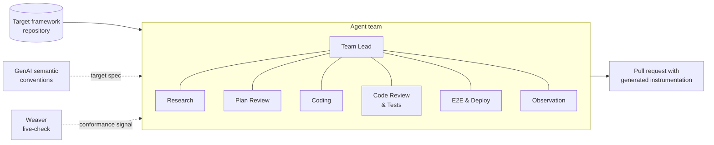
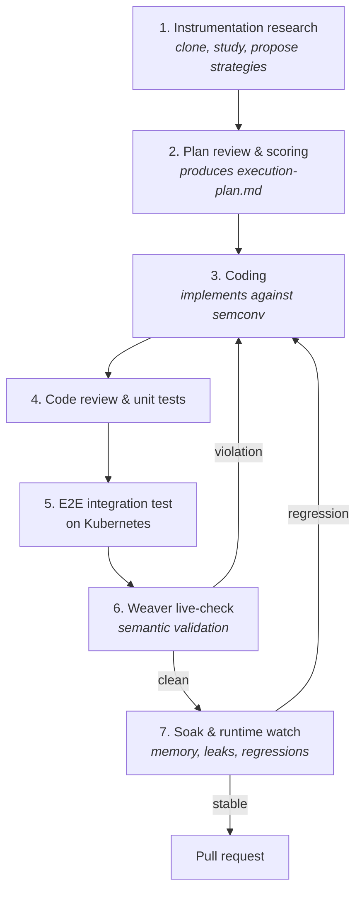

---
title:
  Building Agent Harness for OTel Instrumentation with GenAI Semantic
  Conventions and Weaver
linkTitle: An agent harness for GenAI instrumentation
date: 2026-08-20
author: >-
  [Huxing Zhang](https://github.com/ralf0131) (Alibaba Cloud), [Ziming
  Liu](https://github.com/123liuziming) (Alibaba Cloud)
issue: https://github.com/open-telemetry/opentelemetry.io/issues/11367
sig: 'Semantic Conventions and Instrumentation: GenAI'
# prettier-ignore
cSpell:ignore: BFCL crewai Dify genai Huxing kwargs loongsuite Rego Zhang Ziming
---

Instrumenting a GenAI framework means finding suitable extension points, mapping
its operations to OpenTelemetry semantic conventions, testing the result, and
maintaining it as the framework changes. Doing that for each new framework takes
substantial engineering time.

We have been testing whether a team of agents can do much of that work. The
agents inspect a framework, propose a plan, implement it against the
[OpenTelemetry Semantic Conventions for GenAI](/docs/specs/semconv/gen-ai/), and
use [OpenTelemetry Weaver](https://github.com/open-telemetry/weaver) to check
the emitted telemetry. Engineers review the plan and resulting pull request.

## Why automate instrumentation?

Even an experienced contributor can spend days instrumenting a framework.
Implementations can also differ in their choice of attributes, units, and span
boundaries, making telemetry harder to query across frameworks. Agents can help
with the repetitive investigation and implementation work; the GenAI semantic
conventions and Weaver provide a shared specification and a way to check the
output.

## The pieces

The system uses the GenAI semantic conventions, Weaver, and an orchestrator.

The **GenAI semantic conventions** define the contract: span names, attribute
names, units, and which fields carry the model, the tokens, the messages, and
the tool calls. Generated plugins should follow those definitions.

**Weaver** is the validator. We rely on its
[live-check](https://github.com/open-telemetry/weaver/tree/v0.25.1/crates/weaver_live_check)
capability, which starts an OTLP listener, streams the telemetry emitted by a
running instrumentation through a set of _advisors_, and compares it against the
resolved semantic-convention registry. Built-in advisors cover the fundamentals
(`missing_attribute`, `type_mismatch`); the default OTel Rego policies add
naming and formatting rules, and you can supply your own with
`--advice-policies`. Every finding carries a level — `violation`, `improvement`,
or `information` — and Weaver exits non-zero when the report contains a
violation.

The **orchestration layer** schedules the agents and posts the resulting pull
request. We use a self-hosted multi-agent task platform, but an orchestrator
only needs to check out a repository, run the agents, and open a pull request.

## Architecture

Given a framework repository, such as
[LangChain](https://github.com/langchain-ai/langchain), the system opens a pull
request with instrumentation for it.


```mermaid
flowchart LR
    repo[("Target framework<br/>repository")] --> team

    subgraph team["Agent team"]
        direction TB
        lead["Team Lead"]
        research["Research"]
        plan["Plan Review"]
        code["Coding"]
        review["Code Review<br/>& Tests"]
        e2e["E2E & Deploy"]
        observe["Observation"]
        lead --- research
        lead --- plan
        lead --- code
        lead --- review
        lead --- e2e
        lead --- observe
    end

    team --> pr["Pull request with<br/>generated instrumentation"]

    semconv["GenAI semantic<br/>conventions"] -.->|"target spec"| team
    weaver["Weaver<br/>live-check"] -.->|"conformance signal"| team
```

## The agent team

The orchestrator assigns separate agents to research, planning, coding, testing,
and validation.

- **Team Lead Agent** — initializes the run, sequences the other agents, and
  owns the loop's state.
- **Instrumentation Research Agent** — clones the target framework, studies its
  architecture, and looks first for public extension points such as hooks and
  callbacks. It surveys existing implementations and produces a research report
  listing candidate instrumentation strategies, considering method wrapping only
  when those extension points cannot observe the required lifecycle.
- **Plan Review Agent** — scores the candidates on complexity, maintainability,
  and coverage, picks the best one, and writes a fine-grained
  `execution-plan.md` specifying which extension points to use and where each
  attribute should come from. This is essentially a spec-generation step, and it
  is the natural point for a human to review.
- **Coding Agent** — implements `execution-plan.md` against the GenAI semantic
  conventions, using the shared GenAI utilities.
- **Code Review & Test Validation Agent** — reviews the generated code, writes
  unit tests, and ping-pongs with the Coding Agent until reviews are addressed
  and tests pass.
- **E2E Generation & Deployment Agent** — runs in parallel with coding,
  preparing the integration-test harness so it is ready when the plugin is.
- **Observation Agent** — runs the harness in Kubernetes, captures OTLP output,
  hands it to Weaver for semantic validation, and watches the workload over time
  for memory leaks and other runtime regressions.

## Loop engineering

The Team Lead Agent schedules each step. Other agents can return control to it
when a plan needs to change.


```mermaid
flowchart TB
    research["1. Instrumentation research<br/><i>clone, study, propose strategies</i>"]
    plan["2. Plan review & scoring<br/><i>produces execution-plan.md</i>"]
    code["3. Coding<br/><i>implements against semconv</i>"]
    tests["4. Code review & unit tests"]
    e2e["5. E2E integration test<br/>on Kubernetes"]
    check["6. Weaver live-check<br/><i>semantic validation</i>"]
    soak["7. Soak & runtime watch<br/><i>memory, leaks, regressions</i>"]
    pr["Pull request"]

    research --> plan --> code --> tests --> e2e --> check
    check -->|"violation"| code
    check -->|"clean"| soak
    soak -->|"regression"| code
    soak -->|"stable"| pr
```

After code review and unit tests, we package the framework's examples into
container images, add the instrumentation, and run them in a test Kubernetes
cluster. Weaver checks the emitted OTLP data. A violation sends the work back to
the Coding Agent; a passing run moves to a soak test for memory leaks and other
runtime regressions. An engineer can interrupt the Team Lead to change the plan
or repeat a step.

## What the generated instrumentation looks like

Two choices shape the generated code.

The first is that `execution-plan.md` fixes the instrumentation points before
any code is written. The Coding Agent is not told to wrap methods: the research
stage prefers public hooks and callbacks when they cover the required lifecycle.
For example, the OpenAI Agents SDK exposes lifecycle hooks, so that strategy
takes priority there. The CrewAI plugin shown here supports versions back to
0.80, where public callbacks did not expose the complete start/end lifecycle
needed for these spans, so its plan selected method wrapping. Newer CrewAI
releases provide a broader event-listener API; for those versions, that native
API should be evaluated first. The wrapping plan shows up as an explicit,
reviewable list of targets:

```python
_CREWAI_UNINSTRUMENT_TARGETS = (
    ("crewai.crew", "Crew", "kickoff"),
    ("crewai.crew", "Crew", "kickoff_async"),
    ("crewai.flow.flow", "Flow", "kickoff"),
    ("crewai.flow.flow", "Flow", "kickoff_async"),
    ("crewai.agent", "Agent", "execute_task"),
    ("crewai.task", "Task", "execute_sync"),
    ("crewai.tools.tool_usage", "ToolUsage", "_use"),
)
```

Reviewers can check those targets against the framework's API.

The second is that the agents map framework objects onto shared GenAI utilities
instead of writing attribute names themselves.
[`opentelemetry-util-genai`](https://github.com/open-telemetry/opentelemetry-python-genai)
now lives in the OpenTelemetry Python GenAI repository under
`util/opentelemetry-util-genai`. Its `handler.invoke_local_agent()` method
creates an `AgentInvocation` for an agent running in the same process.

The following minimal wrapper adapts our CrewAI example to that upstream API; it
is not an excerpt from the original generated plugin. Here, `wrapped` is the
original bound `Agent.execute_task` method, `instance` is the CrewAI agent, and
`args` and `kwargs` are the method's arguments. Wrapper registration and SDK
configuration are omitted:

```python
from opentelemetry.util.genai.handler import get_telemetry_handler


def wrap_execute_task(wrapped, instance, args, kwargs):
    handler = get_telemetry_handler()
    with handler.invoke_local_agent(agent_name=instance.role) as invocation:
        invocation.agent_id = str(instance.id)
        if invocation.should_capture_content:
            invocation.agent_description = instance.goal
        return wrapped(*args, **kwargs)
```

The utility starts an `INTERNAL` span, makes it current during the call, and
ends it when the context manager exits. If the wrapped method raises an
exception, the utility records the failure and lets the exception propagate. The
wrapper checks `should_capture_content` before copying the agent's goal, which
may contain user-provided instructions.

Shared utilities handle attribute names and telemetry lifecycle, but the
instrumentation still needs to map the framework's data correctly. We validate
those mappings with tests and human review as well as Weaver's registry checks.

The original generated plugins used our extensions to the earlier utility
package in
[alibaba/loongsuite-python](https://github.com/alibaba/loongsuite-python),
including the fork-specific `InvokeAgentInvocation` type. The example above uses
the upstream API so readers can start with OpenTelemetry's utilities. Migrating
the plugins to those APIs is part of the upstreaming work described below.

## Verifying the output with Weaver

Weaver compares emitted OTLP data with the resolved semantic-convention
registry.

The Observation Agent does not call Weaver directly. It drives the run through
the conformance runner, which starts the scenario, points it at an OTLP
endpoint, and hands what it emits to `weaver registry live-check`. One of our
conformance directories, run as a gate:

```sh
otel-conformance scenarios/gen-ai/python/crewai/loongsuite-crewai
```

The directory contains the conformance settings. Its `conformance.yaml` names
the wrapper:

```yaml
runner: genai-conformance
instrumented_library: crewai
instrumentation_library: loongsuite-instrumentation-crewai
```

The wrapper supplies the semantic-convention registry pin and advice policies,
so repeated runs use the same definitions.

Each scenario then runs under its own live-check, and a violation fails the run.
That is the default; `--report-only` is the opt-out, and it downgrades semantic
findings to warnings while still failing on a scenario that crashed or produced
nothing to measure.

Each sample entity comes back augmented with findings:

```json
{
  "live_check_result": {
    "all_advice": [
      {
        "id": "span_status_ok_set_by_instrumentation",
        "context": { "status_code": "ok" },
        "message": "Span 'execute_tool ping' has status.code='ok'; instrumentations must leave status UNSET on success (OK is reserved for application code).",
        "level": "violation",
        "signal_type": "span",
        "signal_name": "execute_tool ping"
      }
    ],
    "highest_advice_level": "violation"
  }
}
```

The runner's domain-agnostic advice policy flags an instrumentation that sets
span status to OK. The Coding Agent did that on a tool span. Weaver's non-zero
exit code sent the finding back for a fix.

The same runner produces the other artifact we rely on. To see how much of the
GenAI spec a generated plugin actually covers, we use the
[semantic-conventions-conformance](https://github.com/open-telemetry/semantic-conventions-conformance)
project, whose reduction step turns a run into a coverage matrix: which
registry-defined attributes a plugin emits and which it misses. Coverage is
measurement rather than gating, so those runs are the `--report-only` kind — a
missing attribute is recorded, not a build break.


Separately, Weaver live-check reports attributes an agent emitted that the
registry does not define as `missing_attribute` violations. When we temporarily
accept a known violation, we list its finding `id` and the reason in
`expected_violations`. The run also fails if Weaver stops reporting that
violation, telling us that the entry is stale and should be removed. Coverage
counts only registry-defined attributes, so custom extensions do not raise a
plugin's score. If several frameworks need the same attribute that the registry
does not define, we propose adding it to the GenAI semantic conventions.

The Coding Agent added `gen_ai.crewai.*` attributes to the CrewAI plugin for
details absent from the GenAI semantic conventions; because
[OpenTelemetry's naming guidance](/docs/specs/semconv/general/naming/) warns
that this prefix could clash with future standard attributes, future prompts
should require agents to emit only registry-defined GenAI attributes.

## What we've shipped so far

We have used this system to drive end-to-end instrumentation development for a
range of GenAI frameworks, agent SDKs, and agent benchmarks. The generated
plugins live in the `instrumentation-loongsuite` packages in Loongsuite Python,
Alibaba's Apache-2.0 distribution of the OpenTelemetry Python instrumentation,
and each was reviewed by a human at the pull-request stage. They currently cover
frameworks and SDKs including CrewAI, LangChain, LangGraph, LiteLLM, AutoGen,
AgentScope, Dify, Google ADK, the Claude Agent SDK, the Microsoft Agent
Framework, MCP, and mem0, alongside agent benchmarks such as BFCL-v4, WebArena,
and MiniSWEAgent.

Conformance checks help keep their telemetry consistent across frameworks.

We are also working to bring this instrumentation to the OpenTelemetry Python
GenAI project; the discussion is open in
[opentelemetry-python-genai#185](https://github.com/open-telemetry/opentelemetry-python-genai/issues/185),
with the first instrumentation pull requests now under review.

## What didn't work

The first version had no Weaver check. A reviewing model judged whether the
telemetry followed the spec, but it sometimes approved output that violated the
conventions. We replaced that judgment with a registry comparison and a non-zero
exit code for violations.

The Claude Agent SDK posed a different limit. Its Python package wraps the
closed-source Claude Code CLI, where the agent loop, tool dispatch, and model
calls happen. The plugin can report what crosses the process boundary, but
cannot capture details inside the CLI. Research and planning cannot recover data
that the framework does not expose.

Planning still needs framework expertise. The first `execution-plan.md` often
misses details of the framework's lifecycle, so an engineer familiar with it
reviews the plan before implementation. The agents are more reliable at
implementing a reviewed plan than choosing the instrumentation strategy alone.

## Where human review matters

Semantic conventions define attribute names and span kinds, but mapping a
framework's operations to them still requires judgment.

Some values have a direct source: `gen_ai.tool.name` and `gen_ai.tool.call.id`
come from the tool-call object, while `gen_ai.usage.input_tokens` and
`gen_ai.usage.output_tokens` come from the provider's usage data. Other mappings
need more judgment. CrewAI exposes crews, tasks, agents, and flows; the
instrumentation must decide which of their operations represent an
`invoke_agent` operation and which need a different span. That decision requires
human review.

If you maintain a GenAI framework and would like instrumentation written this
way, or if you'd like to help improve the semantic conventions that drive it:

- File an issue on the
  [GenAI semantic conventions repository](https://github.com/open-telemetry/semantic-conventions-genai)
  if you spot a gap our agents are likely to hit.
- Join the
  [GenAI Semantic Conventions and Instrumentation SIG](https://github.com/open-telemetry/community/blob/8b6c5060617ced1caf4c39ff5b7318aa2e9c7569/projects/gen-ai.md)
  discussions to help shape what gets standardized next.
- Contribute to
  [OpenTelemetry Python GenAI](https://github.com/open-telemetry/opentelemetry-python-genai)
  as the generated instrumentations move upstream.
