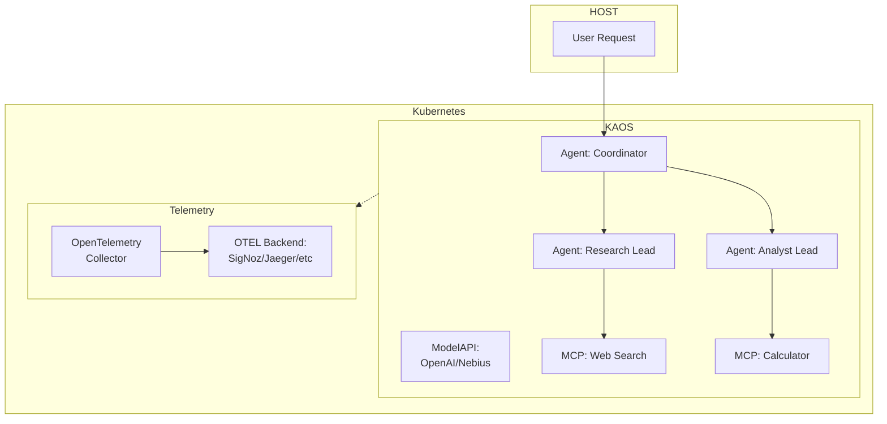

*A practical guide to adding production-grade observability to multi-agent AI systems*

---

You've built an AI agent that works in your laptop. It automatically chains tools together, delegates tasks to specialist sub-agents, and produces sound results.

Then you deploy it to production.

A user reports that a request "took forever".

Another says they got a strange response.

Your logs show the agent ran—but what happened inside those 45 seconds between request and response?

Welcome to the observability challenge of agentic systems.

In this article, we'll walk you through a complete end-to-end example of observability for agentic AI systems using OpenTelemetry.

We'll start by talking about the motivation of observability in agentic systems, then we'll set up a multi-agent system, and then we'll trigger a complex workflow that will allow us to diagnose and dive into the OTEL metrics from the system.


## Why Agentic Systems Need Different Observability

### It's Not Just a Request-Response

Traditional microservices have predictable patterns: a request comes in, some processing happens, a response goes out. Latency is relatively consistent, code paths are deterministic, and debugging usually involves tracing a single thread of execution.

Agentic systems break all of these assumptions:

| Traditional API | Agentic System |
|-----------------|----------------|
| Synchronous request-response | Iterative reasoning loops |
| Predictable latency (50-500ms) | Variable: 100ms to 60+ seconds |
| Deterministic code paths | Non-deterministic LLM decisions |
| Single service per request | Model calls + tool calls + delegations |
| Fixed cost per request | Cost varies by token usage |

**AI Agents 101: The Agentic Loop**

Consider the core loop of a multi-AI agent system — the deceptively simple pattern that has led to the current wave of innovation in AI systems:

```python
async def process_message(self, messages):
    for step in range(self.max_steps):
        # 1. Call the LLM
        response = await self.model.chat(messages)

        # 2. If the model wants to use a tool, execute it
        if response.has_tool_call:
            result = await self.execute_tool(response.tool_call)
            messages.append({"role": "tool", "content": result})
            continue

        # 3. If the model wants to delegate, call another agent
        if response.needs_delegation:
            result = await self.delegate_to_agent(response.delegation)
            messages.append({"role": "assistant", "content": result})
            continue

        # 4. Otherwise, we have our final answer
        return response.content
```

Each iteration of this loop may take a different path. The model might need one tool call or five. It might delegate to one sub-agent or chain through three. Traditional logging (e.g. "request started" ... "request completed") tells you almost nothing about what actually happened.

### The Three Pillars of Agent Observability

OpenTelemetry provides three types of telemetry data, each serving a distinct purpose for agentic systems:

**Traces** answer: "What path did this request take through my agents?"

```
HTTP POST /v1/chat/completions (15.2s total)
-> agent.agentic_loop
    -> agent.step.1 (3.1s)
        -> model.inference (3.0s)
    -> agent.step.2 (8.5s)
        ->model.inference (2.1s)
        -> tool.web_search (6.3s)   <- Here may be your bottleneck
    -> agent.step.3 (3.4s)
        -> model.inference (3.3s)
```

This trace hierarchy maps directly to what the agent did, capturing and connecting every hop across the journey.


**Metrics** answer: "How is my system performing overall?"

- How many tokens am I using per request?
- What's my tool success rate?
- What's my P99 latency for model calls?

**Logs** answer: "What did the agent 'think' at each step?"

```
2024-01-15 10:30:45 INFO [trace_id=abc123] Starting message processing
2024-01-15 10:30:47 DEBUG [trace_id=abc123] Model response: calling tool 'web_search'
2024-01-15 10:30:53 ERROR [trace_id=abc123] Tool execution failed: API rate limited
```

The magic happens when these three are correlated (aka connected).

This allows us to do things like "click on that ERROR log in your observability backend" and diagnose the exact span in the trace where the failure occurred.

### Multi-Agent Context Propagation

The real challenge comes with multi-agent systems. When Agent A delegates to Agent B, which delegates to Agent C, you want a single unified trace—not three disconnected ones.

This requires **context propagation**: passing trace context through HTTP headers using the W3C Trace Context standard. The result is a unified trace across all agents:

```
coordinator.agent.agentic_loop (trace_id: abc123)
-> coordinator.model.inference
-> coordinator.delegate.researcher
    -> researcher.agent.agentic_loop (trace_id: abc123)
        -> researcher.model.inference
        -> researcher.tool.web_search
-> coordinator.model.inference
-> coordinator.delegate.analyst
    -> analyst.agent.agentic_loop (trace_id: abc123)
        -> analyst.model.inference
        -> analyst.tool.calculator
```

## The Practical Use-Case: A Multi-Agent Research System

Let's now start building something concrete.

We'll use **KAOS** (Kubernetes Agent Orchestration System), an open-source framework I've been building that treats AI agents as first-class Kubernetes resources.

### What We're Building

Our use-case for observability consists of a complex multi-agent system that consist of a coordinator agent that delegates research and analysis tasks to specialist sub-agents:



Each component—agents, tools, and model APIs—sends traces, metrics, and logs to an OpenTelemetry collector, which forwards everything to your chosen backend for visualization and analysis.

### Prerequisites: Command Tools

Before we start, you'll need:

1. **KAOS CLI** installed: `pip install kaos-cli==0.2.1`
1. **An LLM API key** (Any provider like OpenAI, Nebius, etc)
1. **kubectl** configured with cluster access
1. **helm** configured with cluster access
1. **A Kubernetes cluster** (KIND, minikube, or a cloud cluster)

### Pre-requisites: Setup

First, let's install the KAOS operator with OpenTelemetry enabled and an observability backend. We'll use SigNoz as an open-source, OpenTelemetry-native option.

**Using the KAOS CLI** (recommended):

```bash
# Install the KAOS operator
kaos system install \
    --set logLevel=DEBUG \
    --monitoring-enabled # Enables monitoring setup

# Verify the installation
kaos system status

# Change context to use (+create) this current namespace for convenience
kaos system working-namespace kaos-hierarchy
```

<details>
<summary> Install using Helm directly</summary>

```bash
# Create namespace
kubectl create namespace kaos-system

# Install KAOS with telemetry enabled
helm repo add kaos https://axsaucedo.github.io/kaos
helm install kaos kaos/kaos \
    --version v0.2.1
    --set logLevel=DEBUG \
    --set telemetry.enabled=true \
    --set telemetry.endpoint="http://signoz-otel-collector.observability:4317"
    --namespace kaos-system \
```

We also set up the working namespace.

```bash
kubectl create namespace kaos-hierarchy
```

We then set the namespace as the default to simplify commands.

```bash
export KUBECTL_NAMESPACE=kaos-hierarchy
```
</details>

## The Agentic System to Monitor

We can now proceed to create the agentic system that we'll be monitoring; we'll be able to create all the respective resources.

We'll show you how you can do this with the UI as well as the CLI.

### Step 1: Deploy the ModelAPI

The **ModelAPI** resource in KAOS provides a unified interface for LLM access. It supports two modes:

- **Proxy Mode**: Routes requests through LiteLLM to external providers (OpenAI, Anthropic, Nebius, etc.)
- **Hosted Mode**: Pulls models into your cluster (via side-car) and runs it on the server for inference

For observability, the ModelAPI gives us visibility into model call latency, token usage, and error rates—critical metrics for understanding agent performance and controlling costs.

The ModelAPI can be deployed easily via CLI.

```bash
kaos modelapi deploy llm-proxy \
    --namespace kaos-hierarchy \
    --provider nebius \
    --api-key # When provided without value this prompts the key securely
```

Note that in order for our agents to use the model APIs we need to provide our authentication API Key. You can use one of the many providers like OpenAI, Nebius, or if preferred you can run your own hosted model.

<details>
<summary>Using kubectl directly</summary>

We can then create the secret directly.

```bash
kubectl create secret generic llm-api-key \
  --from-literal=api-key="your-api-key"
```

Create the modelapi.yaml.

```yaml
# modelapi.yaml
apiVersion: kaos.tools/v1alpha1
kind: ModelAPI
metadata:
  name: llm-proxy
  namespace: kaos-hierarchy
spec:
  mode: Proxy
  proxyConfig:
    models: ["*"]
    provider: openai  # alternatively nebius, anthropic, etc.
    apiKeySecretRef:
      name: llm-api-key
      key: api-key
```

And apply the resources.

```bash
kubectl apply -f modelapi.yaml
kubectl get modelapi -n kaos-hierarchy
# Wait for STATUS: Ready
```
</details>


### Step 2: Deploy the MCP Tool Servers

**MCP (Model Context Protocol) Servers** in KAOS provide tools that agents can use.

KAOS enables FastMCP native servers with ability to create and deploy your own images.

KAOS also supports multiple native MCP runtimes via a registry. The most commonly used are:

| Runtime | Description |
|---------|-------------|
| `python-string` | Define tools as inline Python functions for testing |
| `kubernetes` | Kubernetes CRUD operations |
| `slack` | Slack messaging integration |
| `custom` | Your own container image |

For our demo, we'll create a calculator server. In production, you'd connect to real APIs, databases, or external services.

We can use the python-string runtime for quick testing; for production-ready deployment use the [custom-image deployment](TODO: add custom image).

```bash
export ADD_TOOL='
def add(a: float, b: float) -> float:
    """Add two numbers together."""
    return a + b
'

export ECHO_TOOL='
def echo(message: str) -> str:
    """Echo back the message for testing."""
    return f"Echo: {message}"
'
```

And now we can deploy the MCP servers using the runtime:

```bash
kaos mcp deploy calculator \
    --runtime python-string \
    --params $ADD_TOOL \
    --wait

kaos mcp deploy echo-search \
    --runtime python-string \
    --params $ECHO_TOOL \
    --wait
```

And we can send a request to test the mcp.

```bash
# Run 2 + 2 on mcp calculator
kaos mcp invoke calculator --tool add -a 2 -a 2

# Run echo hello on mcp echo
kaos mcp invoke echo-search --tool add -a "Hello"
```

<details>
<summary>Using kubectl directly.</summary>

```yaml
# mcpservers.yaml
apiVersion: kaos.tools/v1alpha1
kind: MCPServer
metadata:
  name: calculator
  namespace: kaos-hierarchy
spec:
  runtime: python-string
  params: |
    def add(a: float, b: float) -> float:
        """Add two numbers together."""
        return a + b
---
apiVersion: kaos.tools/v1alpha1
kind: MCPServer
metadata:
  name: echo-search
  namespace: kaos-hierarchy
spec:
  runtime: python-string
  params: |
    def echo(message: str) -> str:
        """Echo back the message for testing."""
        return f"Echo: {message}"
```

Apply and verify:

```bash
kubectl apply -f mcpservers.yaml
kubectl get mcpserver -n kaos-hierarchy
```

</details>

### Step 3: Deploy the Agents

Now let's deploy our multi-agent system.

We'll build progressively:

#### 3a. The Researcher Agent

The **Agent** resource in KAOS represents an AI entity that can process requests, call models, execute tools, and delegate to other agents. Each agent:

- Exposes an OpenAI-compatible `/v1/chat/completions` endpoint
- Implements the agentic loop (model > tools > model > ...)
- Supports configurable memory for session state

The Researcher agent will specialise in gathering information:

```bash
kaos agent deploy researcher \
    --model "openai/gpt-4o" \
    --mcp echo-search \
    --description "Research specialist with web search capabilities" \
    --instructions "You research topics using web search and provide detailed findings." \
    --expose=true \
    --wait
```

Creating agent with the UI:

<details>
<summary>Using `kubectl` directly.</summary>

```yaml
apiVersion: kaos.tools/v1alpha1
kind: Agent
metadata:
  name: researcher
  namespace: kaos-hierarchy
spec:
  modelAPI: llm-proxy
  model: "openai/gpt-4o"
  mcpServers:
    - echo-search
  config:
    description: "Research specialist with web search capabilities"
    instructions: "You research topics using web search and provide detailed findings."
  agentNetwork:
    expose: true
```
</details>

For single-agent observability, we care about:
- **Model call latency**: How long does inference take?
- **Tool execution time**: Are tools responding quickly?
- **Step count**: How many iterations does the agent need?

Apply and verify:

```bash
kubectl apply -f researcher.yaml
kubectl get agent researcher -n kaos-hierarchy
# Wait for STATUS: Ready
```

#### 3b. The Analyst Agent

The Analyst agent focuses on data analysis and calculations:

```bash
kaos agent deploy researcher \
    --model "openai/gpt-4o" \
    --mcp calculator \
    --description "Data analyst with calculation capabilities" \
    --instructions "You analyze data and perform calculations." \
    --expose=true \
    --wait
```

<details>
<summary>Using `kubectl` directly.</summary>

```yaml
apiVersion: kaos.tools/v1alpha1
kind: Agent
metadata:
  name: analyst
  namespace: kaos-hierarchy
spec:
  modelAPI: llm-proxy
  model: "openai/gpt-4o"
  mcpServers:
    - calculator
  config:
    description: "Data analyst with calculation capabilities"
    instructions: "You analyze data and perform calculations."
  agentNetwork:
    expose: true
```

```bash
kubectl apply -f analyst.yaml
kubectl get agent analyst -n kaos-hierarchy
```
</details>

#### 3c. The Coordinator Agent

Finally, the Coordinator orchestrates the other agents. For multi-agent observability, we gain additional concerns:

- **Delegation patterns**: Which agents are called and how often?
- **Cross-agent latency**: How much time is spent in delegation vs. local processing?
- **Trace correlation**: Can we see the full request flow across agents?

```bash
kaos agent deploy researcher \
    --model "openai/gpt-4o" \
    --description "Coordinator that delegates to specialist agents" \
    --instructions "You are a coordinator. Analyze user requests and delegate to your analyst and researcher." \
    --sub-agent researcher \
    --sub-agent analyst \
    --wait
```

<details>
<summary>Using `kubectl` directly.</summary>

```yaml
apiVersion: kaos.tools/v1alpha1
kind: Agent
metadata:
  name: coordinator
  namespace: kaos-hierarchy
spec:
  modelAPI: llm-proxy
  model: "openai/gpt-4o"
  config:
    description: "Coordinator that delegates to specialist agents"
    instructions: |
      You are a coordinator. Analyze user requests and delegate to your analyst and researcher.
  agentNetwork:
    expose: true
    access:
      - researcher
      - analyst
```

```bash
kubectl apply -f coordinator.yaml
kubectl get agent -n kaos-hierarchy
# All three agents should show STATUS: Ready
```
</details>

---

## Putting It All Together: Monitoring KAOS

Now let's generate some traffic and see what observability gives us.

### Interacting with Agents

You can interact with agents in multiple ways:

```bash
# Invoke the coordinator agent directly
kaos agent invoke coordinator \
  --message "Research the current AI chip market and calculate the market share of the top 3 companies."
```

Activating the Chat through the User Interface:

<details>
<summary>Or example kubectl curl request.</summary>

**Using kubectl port-forward** (for direct API access):

```bash
kubectl port-forward svc/coordinator 8080:80
# Then use curl or any HTTP client
```

Then send request.

```bash
curl -X POST http://localhost:8080/v1/chat/completions \
  -H "Content-Type: application/json" \
  -d '{
    "messages": [
      {"role": "user", "content": "Research the current AI chip market and calculate the market share of the top 3 companies."}
    ]
  }'
```
</details>


Behind the scenes, this triggers a complex chain of operations:
1. Coordinator receives the request
2. Coordinator calls the LLM, which decides to delegate
3. Researcher agent is invoked for market research
4. Analyst agent calculates market shares
5. Coordinator synthesizes the final response

All of this—every LLM call, every tool execution, every delegation—is captured in our traces.

### Viewing Traces: Understanding Request Flow

For this section we will be using the UI; if you haven't opened it, you can do so via:

```bash
kaos ui --monitoring-enabled
```

**Why traces matter for agentic systems**: Unlike traditional request-response services, agents make multiple decisions per request. Traces let you see each decision point, how long it took, and what path the agent chose.

*The trace list shows all requests flowing through your agents. Each trace represents a complete user interaction.*

Click on a trace to see the full request flow:


*A single trace showing the coordinator delegating to researcher and analyst agents, with each span representing a distinct operation.*

This trace visualization answers questions that would otherwise require hours of log debugging:

- **Why did this request take 15 seconds?** The web_search tool took 8 seconds.
- **Which agents were involved?** Coordinator → Researcher → Analyst → Coordinator.
- **How many LLM calls were made?** 6 calls across the three agents.
- **Did any tools fail?** All tools completed successfully (green spans).

### Log Correlation: Understanding Agent Reasoning

Traces tell you *what* happened. Logs tell you *why*.

OpenTelemetry standarises how we correlate them automatically through `trace_id` and `span_id` attributes.

Every log entry includes these identifiers, enabling you to:
1. Click on a span in your trace
2. View all logs emitted during that span
3. Understand the agent's reasoning at each step

It is possible to see the view of the logs themselves as well as further details.


*Logs filtered by trace_id, showing exactly what happened during this span.*

Drill deeper into individual log entries:


*Detailed log view showing the agent's reasoning: "Delegating to researcher for market data..."*

Expand a log entry for full context:


*Full log context including all attributes, resource labels, and the complete message.*

### Exception Tracking: Finding Production Issues

In production we expect that agents will fail; it is a matter of when not whether.

OpenTelemetry captures exceptions as first-class citizens, attaching them to the span where they occurred.

Navigate to the Exceptions tab:


*Exception overview showing error types, frequency, and affected services.*

Click on an exception to see details:


*Stack trace, error message, and context about when and where this exception occurred.*

The key capability: click "View Trace" to jump directly to the trace where this exception happened:


*The trace showing exactly where in the request flow the exception was thrown.*

Zoom in on the failing span:


*The tool.web_search span marked as ERROR, with the exception attached as a span event.*

This correlation is only possible because we instrument with proper context propagation.

### Metrics: Operational Overview

While traces show individual requests, metrics show trends over time:


*Metrics dashboard showing request rates, latency percentiles, error rates, and token usage across all agents.*

Key metrics for agentic systems:

| Metric | What It Tells You |
|--------|-------------------|
| `kaos.requests` | Request volume by agent |
| `kaos.request.duration` | Latency distribution (P50, P95, P99) |
| `kaos.model.calls` | LLM API usage (cost indicator) |
| `kaos.tool.calls` | Tool execution frequency |
| `kaos.delegations` | Multi-agent coordination patterns |

These metrics enable alerting on production issues:
- Request latency > 30s
- Error rate > 5%
- Model call failures > 1%

---

## Summary

Instrumenting agentic AI systems with OpenTelemetry requires understanding the unique challenges these systems present:

1. **Iterative loops** need span hierarchies that map to logical operations
2. **Multi-agent delegation** requires explicit context propagation using W3C Trace Context
3. **Tool execution** benefits from dedicated spans with clear naming
4. **Log-trace correlation** requires emitting logs before span close
5. **Metrics** need low-cardinality labels to avoid storage explosions

OpenTelemetry gives you the visibility to operate multi-agent systems with confidence.

---


