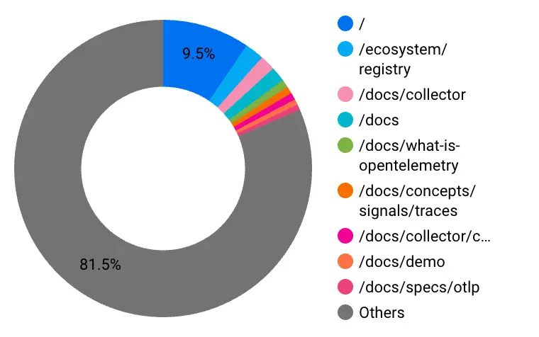

## Alternative approaches to contributing to OpenTelemetry

OpenTelemetry provides the tools and standards to collect metrics, logs, and
traces from applications and services. Getting started with contributions can
feel overwhelming, so here are some things we learned by getting hands on.

Most guides explain how to find a "good first issue," fork a repository, or join
a SIG meeting. That advice is useful. But contributing to OpenTelemetry is not
just about opening your first pull request. It is about understanding
ecosystems, community dynamics, and long-term engagement, especially if you come
from an underrepresented background in tech.

## Context and community

Before diving into a specific repository, explore the broader cloud native
ecosystem. What observability tools are evolving? Where are the gaps? Which
projects influence OpenTelemetry adoption? Strategic contribution starts with
context. Platforms like [CLOTributor](https://clotributor.dev/) help you
discover "good first issues" across cloud native projects, not just within one
organization. This allows you to position yourself where your skills are most
impactful.

Be aware that "good first issues" are highly competitive and often get claimed
within hours of being posted. If you can’t find one, shift your strategy:
instead of waiting for the perfect issue, become an active part of the community
through SIG calls and Slack discussions, and look for ad hoc tasks where you can
make yourself useful. There are also initiatives like
[Merge Forward](https://community.cncf.io/merge-forward/) that support
underrepresented groups in open source. These communities provide mentorship,
visibility, and access that many engineers lack in traditional corporate
environments. OpenTelemetry exists within this larger CNCF ecosystem that
actively works to lower participation barriers.

Contribution becomes more meaningful when you understand how projects and
communities connect.

## Contribution is more than code

 Graph
showing the most popular pages from the [OpenTelemetry.io](/docs/) website
starting with January 2026 up to March 2026

A pull request is not just a code change. It is discussion, feedback and
alignment with project direction. Maintainers, approvers, and SIG members guide
priorities. Reading issue threads and PR discussions teaches you how decisions
are made and where real friction exists. That awareness makes your contributions
stronger.

For engineers from underrepresented groups, visibility and sustained
participation matter. OpenTelemetry’s public Slack channels, SIG meetings, and
End User discussions are open entry points into real technical conversations.
These spaces allow contributors from different geographies, languages, and
backgrounds to participate in shaping observability standards.

Also, non-code contributions go beyond documentation and blogs. You can
volunteer for note-taking in SIG meetings, help organise community events like
the OpenTelemetry Community Day at KubeCon, or join the Contributor Experience
SIG, which focuses on making the project better for all contributors. Some
examples of these SIGs are: **otel-sig-end-user**, **otel-devex**,
**opentelemetry-new-contributors**, **otel-contributor-experience**,
**otel-docs-localization**. Your contribution track is also fluid, i.e.,
starting with documentation does not lock you in; you can switch to code
contributions as you learn more, or vice versa. All contributions count and are
welcome.

If you do not see people like you in the room, that is not a signal to withdraw.
It is an opportunity to participate.

## Tips for beginners

Start small. Documentation improvements, examples, test fixes, localization, and
developer experience feedback are valuable. The codebase evolves quickly, and
things change often. Do not be discouraged by that.

Your background is leverage. If you are an SRE, platform engineer, backend
developer, or DevRel professional, you understand production realities. You know
where documentation feels unclear and where automation breaks. That insight is
practical and needed. Community context matters as much as technical skill.

Let’s talk about a pain point that’s very common across most of CNCF’s Slack
channels. Not being able to get feedback or PR reviews. If you do not get
reviews right away, be patient. Most maintainers have a day job in addition to
maintaining the project, so delays are normal. You can always post a message in
the corresponding Slack channel with enough context so that anyone can pick up
the review. Use this time to review any other open PRs yourself and gain a
broader understanding of the codebase.

## Who to talk to

Engage with maintainers, SIG members, senior contributors and approvers. They
shape direction and review work. Observing their discussions accelerates
learning.

The End User SIG actively seeks practitioner feedback. Contributing through
interviews and discussions can influence the project beyond code. For many
contributors, especially those outside dominant tech hubs, these channels create
visibility and meaningful participation. Trust grows through consistency.

## Understand the pieces

OpenTelemetry includes SDKs in multiple languages, the Collector,
instrumentation libraries, and protocols such as OTLP, gRPC, and HTTP.
Understanding how these components interact gives you perspective.

Emerging initiatives like
[OTel Injector](https://github.com/open-telemetry/opentelemetry-injector) and
[OTel Weaver](https://github.com/open-telemetry/weaver) focus on automation and
simplifying telemetry configuration. Contributing to newer efforts can be
impactful because you influence adoption patterns early. Another domain is
language SDKs for PHP, Ruby, Erlang, and Rust, which often have only a couple of
maintainers and could use extra hands. The eBPF auto-instrumentation project
(OBI) is a newer frontier that allows capturing telemetry data at the kernel
level without modifying application code. If you are interested in low-level
programming or Linux kernel tech, this is a great place to contribute.

Thinking beyond a single repository strengthens your contribution strategy.

## Official documentation: a starting point

The official documentation provides the foundation. Contributing to clarity,
examples, and localization improves accessibility and adoption. Some specific
areas are currently under-resourced and could use more contributors.

[Documentation](/docs/contributing/localization/) localisation is a major need;
some language communities, like Japanese and Chinese, have been very active in
translating OpenTelemetry docs, but others have barely started. If you are
fluent in any language besides English, you can make a big difference by
contributing to localisation efforts. When documentation exists in more
languages and reflects real-world use cases, it expands who can participate.

## Setting up a local sandbox

Hands-on exploration builds confidence. Clone repositories, run tests, modify
instrumentation, and experiment with telemetry pipelines. Practical
experimentation complements community engagement.

## Expanding your knowledge

Structured learning deepens understanding. CNCF learning resources and courses
offer curated materials that guide learners through these concepts step by step.
In addition, the Linux Foundation
[OpenTelemetry Certification](https://training.linuxfoundation.org/certification/opentelemetry-certified-associate-otca/)
provides a practical way to validate your knowledge while reinforcing core ideas
about telemetry pipelines, instrumentation strategies, and observability
architecture across the ecosystem. Learning, contributing, and teaching
reinforce each other.

## Making contributions sustainable — an example

Starting is simple. Staying engaged is what creates impact. Sustainable
contribution means choosing an area of focus, attending SIG meetings, reviewing
work, mentoring newcomers, and sharing knowledge. It is not about one large code
change. It is about consistency.

This is also a major challenge faced today; many contributors drop off after a
couple of contributions. Consistency in open source comes from aligning your
contributions with what genuinely excites you. Set a realistic routine to
contribute weekly or monthly and stay connected by attending bi-weekly SIG
meetings (even just as a listener at first), tracking GitHub updates, or staying
active in Slack. When something triggers your curiosity and helps you learn, it
becomes easier to show up consistently and enjoy the journey.

That progression came from sustained involvement, not a single breakthrough
moment. OpenTelemetry offers a visible and structured pathway for growth. For
engineers from underrepresented groups, this matters. It provides credibility,
influence, and community recognition beyond traditional corporate hierarchies.

You do not need to be perfect. You need to participate. Be curious. Think
ecosystem. Use tools like CLOTributor to explore opportunities. Connect with
initiatives like Merge Forward if you need support. Diversify how you contribute
and stay consistent.

The ROI of contributing can also be significant, both personally and
professionally. You will gain a deeper understanding of how instrumentation,
tracing, and metrics work under the hood. You will interact with engineers from
companies across the industry, and these connections can lead to job
opportunities and collaborations. Many contributors also find fulfillment in
paying it forward to the open source community that has benefited them.

OpenTelemetry is a global collaboration. There is space in it for you.

## Resources

1. Diana Todea -
   [The Unofficial Guide to Contributing to OpenTelemetry — where to look and who to talk to!](https://medium.com/@dianatodea/the-unofficial-guide-to-contributing-to-opentelemetry-where-to-look-and-who-to-talk-to-9de04ae75fe0)
2. Elizabeth -
   [6 Things I Learned About OpenTelemetry Contribution (That the Docs Won't Tell You)](https://newsletter.signoz.io/p/6-things-i-learned-about-opentelemetry)
