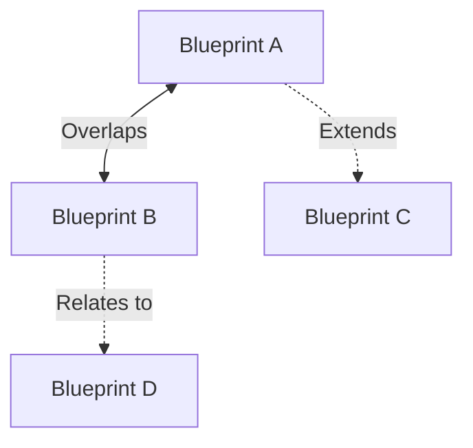
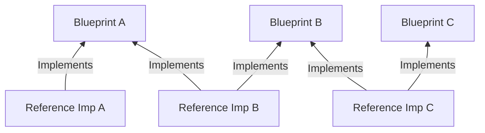

It's common for end users adopting OpenTelemetry to, at some point in their
journey, ask themselves: _"Why is this stuff so complex?"_. Full adoption
normally requires understanding the different ways of configuring SDKs, multiple
Collector deployments, data pipelines, instrumentation libraries, semantic
convention registries, APIs for manual instrumentation across many different
programming languages, and many, many other moving pieces.

In addition, these moving pieces don't operate in isolation. They need to work
well together as part of a consolidated solution to describe an organization's
software systems using standard, high-quality telemetry. Failing to do so risks
ending up with the very problem that OpenTelemetry was designed to solve:
disjointed telemetry with disparate semantic conventions in use across the
stack, lack of context propagated between services and signals, unnecessarily
high data volumes... In general, poor quality telemetry, the opposite of what we
want.

As the project evolved and stabilized, and as more end users adopted
OpenTelemetry in large-scale production environments, we kept hearing the same
feedback: end users want a prescriptive, opinionated way of "deploying
OpenTelemetry" (although this could mean very different things to different
people), as recommended by the project and its maintainers. They want to follow
a set of steps to configure the components _they_ need to solve _their_
observability challenges in the _simplest_ way, and not more.

You spoke, and we listened. I'm pleased to announce a new initiative driven by
the End User SIG in collaboration with the Developer Experience SIG: [Blueprints
and Reference Implementations][2].

### The source of complexity and the need for blueprints

Let's go back to that first question we asked: _"Why is this stuff so complex?_.
Using the terms described by Fred Brooks in his paper titled [_No Silver
Bullet—Essence and Accident in Software Engineering_][3], written back in 1986,
the complexity of adopting OTel is two-fold: _essential_ and, more frequently,
_accidental_.

#### Essential complexity

The _essential_ part of OTel's complexity, the one inherent in its design,
mostly comes down to its breadth and cross-cutting nature. OpenTelemetry touches
nearly all parts of the stack, from client-side (i.e. browser and mobile), to
applications, Kubernetes, infrastructure, databases, etc. Our documentation is
great at explaining how each of these individual components work, and new
developments like [Declarative Configuration][4] or the [Injector][5], and the
long-existing [OpenTelemetry Operator][6], have made it easier to apply a
consolidated set of configuration across all these components. However, the fact
remains that this is still a very large deployment surface in which one needs to
achieve consistency and, in most cases, cannot even handled by a single team.

OpenTelemetry is also designed to work with any backend, not limited to a single
solution. The old model of dropping a pre-built agent into your stack and seeing
data flow may be appealing, but it lacks the flexibility needed in modern
systems that need to remain data sovereign. OpenTelemetry's flexibility puts end
users in control of their own data, regardless of where that data is generated
and ultimately stored, but this flexibility paired with its breadth can add
further complexity.

In summary, OTel can be _essentially_ complex when applied at scale, but
normally for good reasons.

#### Accidental complexity

The _accidental_ part of OTel adoption complexity, as you may have guessed,
comes from humans. When multiple teams start to organically adopt OpenTelemetry
across different parts of an organization, without a shared strategy and vision,
and with no communication between groups, standards suffer. Some team may be
configuring their SDKs with a configuration that's incompatible with the
Collector Gateway deployed by another team, or they may be propagating context
in a different way than the dependencies they call, breaking context propagation
for both.

And then, of course, there's AIs. We have all heard stories of systems where
entropy and complexity has _accidentally_ grown uncontrolled as AI-assisted
development adds a new file here, a duplicated method there, or, in the case of
OTel, a new way of configuring and deploying a component. The result is a system
that's neither effective nor efficient at describing itself with high-quality
telemetry.

#### The role of blueprints in taming complexity

The reality is that, as Fred Brooks stated, there's no "silver bullet". We
cannot simply eliminate the _essential_ complexity of modern observability
tooling and just say _"this is the one and only way to deploy OTel"_, as every
environment and organizational structure is different. However, we can certainly
aim to make sense of the breadth of the project to help those navigating OTel
adoption, and together keep that _accidental_ complexity at bay!

This is where OTel Blueprints come in. The structure of these blueprints is
based upon best practices in strategic thinking. The primary focus is on
identifying the most critical challenges to solve in a particular environment,
and scope our solutions to those alone, removing any unnecessary complexity.

With OTel Blueprints, we aim to categorize the most common observability
challenges that organizations face across different environments, and propose a
set of general design patterns and best practices that have been proven to solve
them. For instance, there are many common challenges that end users aim to solve
by providing a consolidated SDK config and Collector Gateways in Kubernetes
environments, instrumenting infrastructure and applications in non-Kubernetes
environments, or monitoring Kubernetes clusters along with well-known control
plane workloads.

For end users (AI-assisted or not), blueprints will provide a set of common
scenarios and environments with which they can identify, and immediate,
actionable guidance on how to approach best practices across many components,
all working together as part of a consolidated strategy. Maintainers will also
be able to use blueprints as a way to identify any possible friction in adoption
which could be further simplified via improved tooling.

### What to expect from blueprints

OTel Blueprints will not rewrite existing documentation. You will not see a
blueprint that tells you how to configure an SDK, or how to deploy a Collector
in its different deployment patterns. That's already well covered within our
docs.

The goal of blueprints is to provide a holistic approach that readers can use to
inform their observability strategies, tying together different components,
solutions, and best practices, pointing to relevant documentation as necessary.

We will soon be publishing blueprints under the new [Blueprints][11] section of
our website. However, in the meantime, we can use our standard [blueprint
template][7] to illustrate what you can expect from the future blueprints that
will follow.

In essence a blueprint will have the following building blocks:

- **Summary**: As an end user, you will be able to quickly see if you may be the
  target audience for this blueprint, or if it applies to your environment.
- **Common Challenges**: This scopes the problems to solve in a particular
  environment. If something is not identified as a problem to solve, the
  blueprint will not propose a solution for it (although other blueprints may do
  so).
- **General Guidelines**: The best practices and design patterns that will solve
  the challenges in scope. You can expect architecture diagrams here, and a
  clear vision of how it all fits together.
- **Implementation**: The list of actions to implement the prescribed
  guidelines, pointing to relevant existing documentation.

We don't expect a single blueprint to solve everyone's needs. Instead, we want
to scope the problems to solve in actionable strategies that deliver tangible
value to end users, and connect between each other. Some expected relationships
include:

- **Overlaps**: Some blueprints may contain the same design pattern as needed in
  their guidelines, e.g. deploying a Collector Daemonset using the OpenTelemetry
  Operator.
- **Extends**: A blueprint may clearly call a specific problem to solve as out
  of scope, e.g. audit logging for a centralized observability platform, in
  which case another blueprint will extend it for that use case, and possibly
  others.
- **Relates to**: In general, blueprints may be related to each other, e.g. a
  blueprint for Kubernetes observability may assume a central Collector Gateway
  as proposed in another blueprint.

These types of relationships are represented in the diagram below:

Lastly, you can also expect blueprints to evolve over time. As tooling evolves,
the way to approach a specific problem may change, and blueprints will continue
to reflect the simplest and most efficient way of doing it.

### Grounding blueprints in reference implementations

Blueprints do not come out of the blue (seriously, no pun intended). They are
contributed by experts in the field, end users and solution/observability
architects that have experienced these challenges first hand and can share
design patterns that work at scale.

The nature of blueprints is to be useful to the largest group of individuals and
organizations as possible. As such, there needs to be a certain degree of
generalization, grouping experience from many end users into a single narrative.
However, we think it's crucial that blueprints are grounded on fact, and not
simply theoretical advice. From the start, we wanted to have blueprints backed
by evidence in the form of reference implementations.

Reference implementations are snapshots in time that show how real-world
organizations have approached OpenTelemetry adoption. They will naturally
implement some (or all) of the advice in one (or many) blueprints.

You may have already seen some of these reference implementations being
published as blogs on our website. [Mastodon][8], [Adobe][9], and
[Skyscanner][10] have already shared how they've approached OpenTelemetry
adoption across their environments. This work has been diligently driven by the
Developer Experience SIG, supporting those end users in sharing their stories,
and has cemented much of the way for OTel Blueprints to be successful. I would
like to personally thank the DevEx SIG for this effort!

These, and other reference implementations, will soon be published in the new
[Reference implementations][12] section in our website. We have also put
together a standard [template][13] to facilitate end users sharing their stories
in the future. The more, the merrier!

### Now more than ever, we want your input!

As you've seen, all this work would've not been possible without end users
giving us feedback, sharing their adoption journeys, contributing their
expertise to the project, and ultimately helping to shape the future of
observability.

However, end users, we are once again calling for your support. Firstly, to give
any feedback you may want to contribute on the three blueprints in progress,
which are the current focus of the End-User SIG: [instrumentation for
infrastructure and processes in non-Kubernetes environments][14], [Kubernetes
observability][15], and [centralized telemetry platform][16].

Secondly, and most importantly, to share your experience! We would like to have
many other reference implementations across different industries and
environments, and proposals for new blueprints helping other end users adopt
best practices in observability. You can see [how to contribute][17] to this
effort in our documentation.

This is your chance to make your end user journey a part of OpenTelemetry!

[2]: /docs/guidance/
[3]: https://en.wikipedia.org/wiki/No_Silver_Bullet
[4]: /docs/languages/sdk-configuration/declarative-configuration/
[5]: https://github.com/open-telemetry/opentelemetry-injector
[6]: /docs/platforms/kubernetes/operator/
[7]:
  https://github.com/open-telemetry/sig-end-user/blob/887e20c58849d583e2e25bc25ef93ea146ce1d78/architecture/blueprint-template.md?plain=1&from_branch=main
[8]: /blog/2026/devex-mastodon/
[9]: /blog/2026/devex-adobe/
[10]: /blog/2026/devex-skyscanner/
[11]: /docs/guidance/blueprints/
[12]: /docs/guidance/reference-implementations/
[13]:
  https://github.com/open-telemetry/sig-end-user/blob/c483a44b12e95c093e0a8b0d7542d470e82ff7fc/architecture/reference-implementation-template.md?plain=1&from_branch=main
[14]: https://github.com/open-telemetry/sig-end-user/issues/245
[15]: https://github.com/open-telemetry/sig-end-user/issues/247
[16]: https://github.com/open-telemetry/sig-end-user/issues/246
[17]: /docs/guidance/#how-to-contribute
