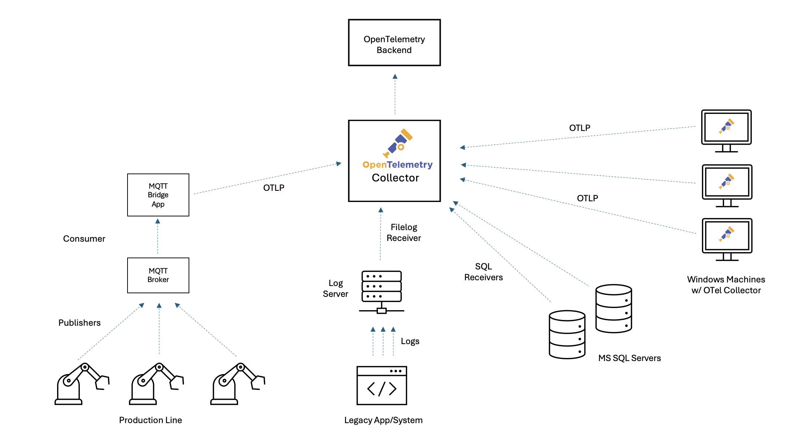
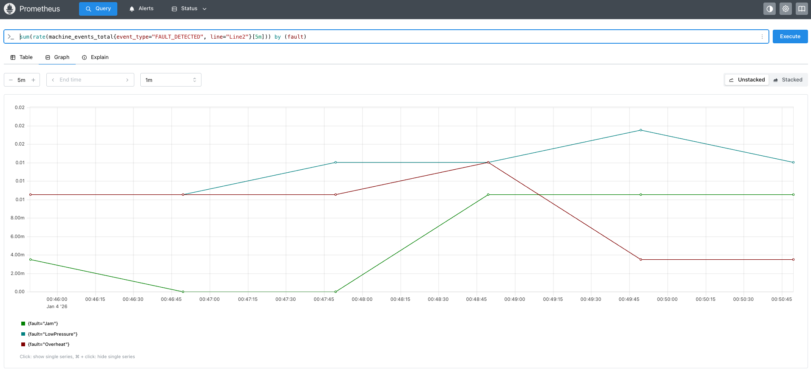
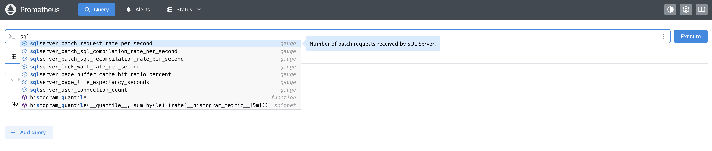
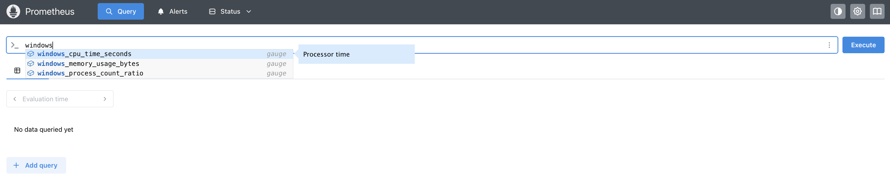

---
title:
  'Demystifying OpenTelemetry: Why You Shouldn’t Fear Observability in
  Traditional Environments'
author: '[Lukasz Ciukaj](https://github.com/luke6Lh43) (Splunk)'
linkTitle: OTel in Traditional Environments
date: 2026-01-13
issue: 8548
sig: End-User
cSpell:ignore: ciukaj lukasz
---

For decades, traditional technology environments, ranging from on-premises data
centers to legacy applications and industrial control systems, have powered the
core of many organizations. These systems are battle-tested and deeply woven
into business operations, but they also present unique challenges when it comes
to modernizing IT practices, especially observability.

**Challenges of implementing observability in traditional environments:**

- Noisy, unstructured logs make it hard to extract meaningful information.
- Siloed monitoring data across different tools or systems leads to fragmented
  visibility.
- Limited instrumentation in legacy apps and systems hinders collection of
  modern metrics and traces.
- Teams are often concerned about the potential performance impact from adding
  new observability tooling.
- Bridging legacy protocols or hardware with modern platforms can be difficult
  to integrate.

To make this practical, let’s follow a fictional manufacturing company with a
busy production line. Here, a fleet of robotic arms equipped with sensors
reports operational data via MQTT to a central broker. A legacy application logs
production events and errors to disk, while a collection of SQL Servers and
Windows machines support production, analytics, and inventory. Sound familiar?
This is the reality for many organizations trying to bridge the old and new
worlds.



Unlike cloud native environments where instrumentation is built-in, legacy and
industrial systems rely on inconsistent logs, limited metrics, and fragmented
tools. This leads to a lack of visibility that makes troubleshooting, tuning,
and maintenance slow and painful. As organizations look to improve reliability
and accelerate transformation, observability is no longer a “nice to have” -
it’s a strategic necessity. But the path to observability, and to standardizing
on OpenTelemetry, is often clouded by persistent myths. Let’s bust a few!

## Myth 1: Our systems just generate a bunch of useless logs – there’s no way observability can be done here.

Think about your legacy production systems: maybe you have old machinery or apps
that simply spit out line after line of plain text logs to a file. No JSON, no
structure, no API - just endless lines of text. It’s easy to assume there’s no
way to extract meaningful insight from that mess.

### Why this myth persists (legacy logs)

In many traditional environments, whether it’s a production line, a legacy
application, or an industrial control system, the only digital “signal” you
might see is a stream of raw, unstructured log files. To an Operations Manager,
these files are frustratingly opaque. She or he cares deeply about specific
faults; knowing whether Line 1 is down due to a "Jam" versus "LowPressure"
dictates immediate response and maintenance strategy. But when that critical
data is buried in unstructured text like **FAULT_DETECTED: Line1, Fault=Jam**,
it is invisible to standard monitoring dashboards. You can't graph text, you
can't alert on a string inside a file easily, and you certainly can't see trends
over time. This leads to the myth that these systems are closed to observers.
But with modern observability tools like OpenTelemetry, these “useless” logs can
become a goldmine of operational insight.

### Example legacy log lines

```console
2026-01-04 00:39:58 | PRODUCT_COMPLETED: Line1, Count=1
2026-01-04 00:40:00 | FAULT_DETECTED: Line2, Fault=LowPressure
2026-01-04 00:40:02 | MACHINE_START: Line2
2026-01-04 00:40:07 | FAULT_DETECTED: Line2, Fault=Overheat
2026-01-04 00:40:10 | MACHINE_START: Line2
2026-01-04 00:40:14 | PRODUCT_COMPLETED: Line1, Count=1
2026-01-04 00:40:18 | MACHINE_START: Line2
2026-01-04 00:40:21 | PRODUCT_COMPLETED: Line1, Count=1
2026-01-04 00:40:27 | SENSOR_READING: Line1, Temp=83.9
2026-01-04 00:40:29 | FAULT_DETECTED: Line1, Fault=LowPressure
2026-01-04 00:40:32 | SENSOR_READING: Line1, Temp=84.7
2026-01-04 00:40:34 | PRODUCT_COMPLETED: Line1, Count=1
```

### How to make this system observable

OpenTelemetry Collector can watch these files in real time, parse the events,
and, without requiring any code changes to the legacy application, transform
them into structured metrics.

#### Sample OpenTelemetry Collector config

```yaml
receivers:
  filelog:
    include: [/logs/legacy.log]
    start_at: end
    operators:
      # 1. Generic Parsing: Capture Timestamp, Event, Line, and put the rest in 'params'
      - type: regex_parser
        regex:
          '^(?P<timestamp>.+?) \| (?P<event_type>[A-Z_]+): (?P<line>Line\d+)(?:,
          (?P<params>.*))?'
        timestamp:
          parse_from: attributes.timestamp
          layout: '%Y-%m-%d %H:%M:%S'

      # 2. Specific Extraction: Look for "Fault=" only inside the 'params'
      - type: regex_parser
        regex: 'Fault=(?P<fault>\w+)'
        parse_from: attributes.params
        if: 'attributes.params != nil'

connectors:
  count:
    logs:
      machine_events_total:
        description: 'Count of manufacturing events by type, line, and fault.'
        attributes:
          - key: event_type
            default_value: 'unknown'
          - key: line
            default_value: 'unknown'
          - key: fault
            default_value: 'none' # Automatically applied if no fault is found

service:
  pipelines:
    logs:
      receivers: [filelog]
      exporters: [count]
    metrics/generated:
      receivers: [count]
      exporters: [prometheus]
```

#### How it works

- **Chained Parsing:** The filelog receiver first identifies the high-level
  event (for example, FAULT_DETECTED). It then runs a second, specific check
  just to extract the Fault type (like "Jam" or "Overheat"). This makes the
  configuration robust and easy to read.
- **Metric Generation:** The count connector converts these parsed logs into a
  metric called `machine_events_total`.

#### Result

With this configuration, your old text logs become a structured, queryable data
source. Your Operations Manager can now open a dashboard and see exactly how
many "Jam" faults occurred on "Line 1" in the last hour, fueling data-driven
decisions without changing a single line of code in the legacy app. Myth busted!

Sample dashboard in Prometheus:



## Myth 2: Our IoT devices publish telemetry to MQTT broker, so integrating with OpenTelemetry isn’t possible.

Our production line relies on robotic arms and sensors that send readings to a
message queuing telemetry transport (MQTT) broker, an industry standard for
internet of things (IoT), but not something OpenTelemetry natively understands.
Does that mean we’re stuck without modern monitoring?

### Why this myth persists (IoT and MQTT integration)

MQTT is the messaging backbone for countless industrial and IoT environments,
reliably ferrying sensor data from devices to brokers. However, since MQTT uses
its own lightweight protocol and ecosystem, many teams assume their sensor data
can’t be easily brought into modern observability pipelines. Some MQTT brokers
now natively integrate with OpenTelemetry, allowing direct export of metrics and
traces using the OTLP protocol. If you’re using a modern broker with this
feature, you can simply point your broker at your collector’s OTLP endpoint - no
additional code required.

If your broker does not support OTLP export, you’re still not blocked. You can
use a lightweight bridge service to subscribe to MQTT topics and forward
messages to the OpenTelemetry Collector.

### Example data sent from an IoT sensor

In our case a payload published by a robotic arm sensor to MQTT might look like:

```json
{
  "device_id": "robot-arm-7",
  "job_id": "abc123",
  "temp": 78.4,
  "humidity": 32.6,
  "job_start": "2025-12-19T12:00:02Z",
  "job_end": "2025-12-19T12:00:05Z"
}
```

This message tells us which device sent it, details about the job, and the
relevant sensor readings.

### Creating traces and spans in the MQTT bridge app

To gain real end-to-end visibility (not just metrics), you can create an
OpenTelemetry span representing the duration and context of each device job.
This allows you to correlate a specific device job with downstream processing,
latency, or errors, making it easier to analyze device behavior and performance
over time. In advanced scenarios, such as when processes do not communicate over
HTTP, OpenTelemetry lets you propagate trace context using environment
variables, so downstream processes can link their telemetry to the original job.
Learn more in the
[OpenTelemetry documentation on environment variable context propagation](/docs/specs/otel/context/env-carriers/).

The following snippet shows a sample MQTT bridge Python app that listens for
sensor messages, extracts job timing, and creates a span reflecting the job’s
duration:

```python
import json
import datetime
import paho.mqtt.client as mqtt
from opentelemetry import trace
from opentelemetry.sdk.trace import TracerProvider
from opentelemetry.exporter.otlp.proto.http.trace_exporter import OTLPSpanExporter
from opentelemetry.sdk.trace.export import BatchSpanProcessor

# OpenTelemetry tracing setup
trace.set_tracer_provider(TracerProvider())
tracer = trace.get_tracer(__name__)
span_processor = BatchSpanProcessor(OTLPSpanExporter(endpoint="http://collector:4318/v1/traces"))
trace.get_tracer_provider().add_span_processor(span_processor)

def on_message(client, userdata, msg):
    payload = json.loads(msg.payload.decode())
    job_start = datetime.datetime.fromisoformat(payload["job_start"].replace("Z", "+00:00"))
    job_end = datetime.datetime.fromisoformat(payload["job_end"].replace("Z", "+00:00"))

    span = tracer.start_span(
        "robotic_job",
        start_time=job_start.timestamp(),
    )
    try:
        span.set_attribute("device_id", payload["device_id"])
        span.set_attribute("job_id", payload["job_id"])
        span.set_attribute("temperature", payload["temp"])
        span.set_attribute("humidity", payload["humidity"])
        # ...additional processing...
    finally:
        span.end(end_time=job_end.timestamp())

# Set up MQTT client
client = mqtt.Client()
client.on_message = on_message
client.connect("mqtt-broker", 1883)
client.subscribe("production/robot-arms")
client.loop_forever()
```

Sample span in Jaeger:


#### What’s the trick here?

By explicitly specifying `start_time=job_start.timestamp()` (and optionally
`end_time`), the span precisely tracks the job’s real-world execution, even if
the message is processed later. This gives you accurate, queryable traces that
show exactly when each job occurred and how long it took across devices,
processing steps, and backends.

You have several options for translating IoT sensor data into metrics for
dashboards and alerts:

- **Emit metrics directly from your bridge app:** You can use OpenTelemetry’s
  metrics API to send custom metrics (such as temperature, humidity, or job
  duration) alongside or instead of spans.

- **Write a dedicated processor:** Build a custom OpenTelemetry Collector
  processor that derives metrics from incoming spans and then extracting values
  from span attributes.
- **Leverage your observability backend:** Many modern backends can generate
  metrics from span attributes, making it easy to turn your job telemetry into
  actionable, queryable metrics with minimal extra plumbing.

### Bottom line

If your MQTT broker supports OpenTelemetry, use native OTLP export for seamless
integration. If not, a simple bridge app can transform your sensor and event
streams into full observability data. Modern observability backends make it even
easier by allowing metrics to be derived from span attributes, so you can go
from IoT signal to meaningful insight with very little friction. And if you need
even deeper integration or custom processing, you can build a custom MQTT
receiver directly into your Collector - see the
[OpenTelemetry guide to custom receivers](/docs/collector/extend/custom-component/receiver/).
Myth busted!

## Myth 3: Windows and SQL Server environments are incompatible with observability.

Windows machines and SQL Servers are the backbone of our operations, running
everything from analytics to inventory. Yet many believe these platforms are
simply out of reach for modern, open observability tooling.

### Why this myth persists (Windows and SQL Server)

It’s a common belief that monitoring and observability are only possible in
cloud native or Linux-based systems, leaving classic Windows servers and SQL
Server workloads out of reach. In reality, OpenTelemetry Collector supports both
environments with dedicated receivers that require minimal configuration. Let’s
break it down.

### Observing SQL Server with the OpenTelemetry Collector

Many organizations rely on SQL Server databases for production, analytics, or
inventory. With the OpenTelemetry Collector’s
[sqlserver receiver](https://github.com/open-telemetry/opentelemetry-collector-contrib/tree/ab56dd4/receiver/sqlserverreceiver?from_branch=main),
you can scrape health and performance metrics directly, without needing agents
on your database hosts. The following is a sample configuration showing how to
set this up:

```yaml
receivers:
  sqlserver/sql1:
    collection_interval: 30s
    username: oteluser
    password: YourStrong!Passw0rd
    server: sql-server-1
    port: 1433

  sqlserver/sql2:
    collection_interval: 30s
    username: oteluser
    password: YourStrong!Passw0rd
    server: sql-server-2
    port: 1433

service:
  pipelines:
    metrics/regular:
      receivers: [sqlserver/sql1, sqlserver/sql2]
      exporters: [prometheus]
```

#### What this achieves for SQL Server monitoring

The Collector regularly scrapes key SQL Server metrics (connections, buffer
pool, locks, batch rates, and more), exposing them to observability backends.



### Observing Windows machines with the Windows performance counters receiver

Classic Windows hosts still drive many production and control environments. The
[Windows performance counters receiver](https://github.com/open-telemetry/opentelemetry-collector-contrib/tree/ab56dd4/receiver/windowsperfcountersreceiver?from_branch=main)
(part of the OpenTelemetry Collector Contrib distribution) lets you collect a
wide array of system, application, or custom metrics right from the Windows
registry using the native PDH interface. The following is a sample configuration
for a lightweight agent running on a Windows machine, forwarding its data to a
central collector:

```yaml
receivers:
  windowsperfcounters:
    collection_interval: 30s
    metrics:
      processor.time.total:
        description: Total CPU active and idle time
        unit: '%'
        gauge:
      memory.committed:
        description: Committed memory in bytes
        unit: By
        gauge:
    perfcounters:
      - object: 'Processor'
        instances: ['_Total']
        counters:
          - name: '% Processor Time'
            metric: processor.time.total
      - object: 'Memory'
        counters:
          - name: 'Committed Bytes'
            metric: memory.committed

exporters:
  otlp:
    endpoint: 'central-collector:4317'

service:
  pipelines:
    metrics:
      receivers: [windowsperfcounters]
      exporters: [otlp]
```

#### What this achieves for Windows machines

You can ingest CPU, memory, disk, and any custom Windows counters, turning even
decades-old systems into first-class observability citizens. The receiver is
robust: if a counter isn’t present, it logs a warning but continues scraping all
available metrics.



## Conclusion

OpenTelemetry Collector unifies data from legacy logs, MQTT streams, SQL Server
databases, and even classic Windows hosts, busting the myth that observability
is only for greenfield or cloud native systems. With the right configuration,
your entire environment, no matter how old or fragmented, can gain actionable,
real-time insights for reliability, troubleshooting, and performance
optimization.

The examples in this post show that it’s not just possible, but practical to
bring decades-old logs, industrial telemetry, and classic Microsoft
infrastructure into a modern observability stack. You don’t need to rip and
replace; you can build on what you already have, instrument incrementally, and
unlock new value from systems that used to be opaque.

By breaking down these myths, we see that every environment, no matter how
traditional or complex—has the potential to become observable, resilient, and
ready for digital transformation. OpenTelemetry offers a flexible, open standard
that grows with you, letting you modernize at your own pace.

All myths busted. Visibility achieved. Your traditional environment is ready for
the future. Now’s the time to turn insight into action!
