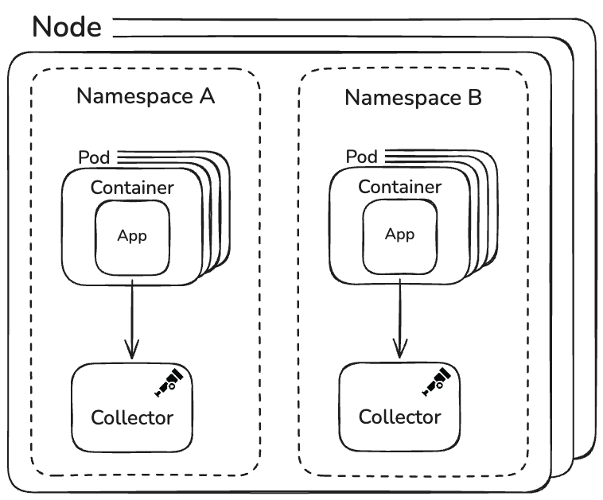
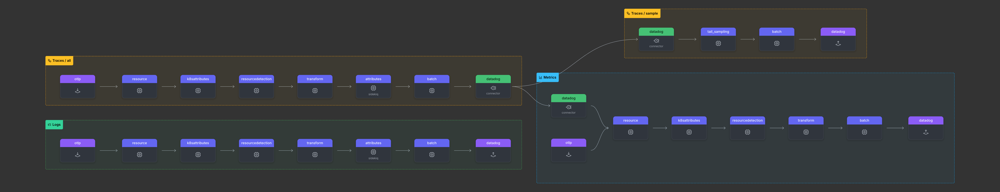

At the beginning of 2025, the OpenTelemetry Developer Experience SIG
[published the results of its first community survey](/blog/2025/devex-survey/).
One of the strongest themes was clear: teams want more real-world examples of
how the OpenTelemetry SDKs and the OpenTelemetry Collector are actually used in
production.

To help close that gap, the SIG began collecting stories directly from end
users—across industries, architectures, and company sizes. This post kicks off a
new series focused specifically on organizations' real world stories, starting
with a small but uniquely challenging case.

This first story features Mastodon, a non-profit organization operating at
global scale with a remarkably small team.

## Mastodon at a Glance

[Mastodon](https://joinmastodon.org) is a free, open source, decentralized
social media platform operated by a non-profit organization.

Decentralization is not a marketing term here; it is a core architectural
principle. Anyone can
[run their own Mastodon server](https://docs.joinmastodon.org/user/run-your-own/),
and those independently operated servers interoperate using open protocols as
part of what is called the _Fediverse_—a federated network of independent social
platforms that communicate with one another using standardized protocols such as
ActivityPub. Much like email, users can communicate across instances regardless
of who operates them.

This philosophy shapes not just Mastodon’s feature decisions, but also its
approach to observability.

### Organizational Structure

The entire Mastodon organization consists of around 20 people, and observability
infrastructure (including the OpenTelemetry Collector) is managed by a single
engineer.

Despite the small team size, Mastodon operates two large, production Mastodon
instances:

- [mastodon.social](https://mastodon.social)

  Runs on Kubernetes with autoscaling between 9 and 15 nodes (16 cores, 64 GB
  RAM each). Web frontend scale between 5 and 20 pods, while various Sidekiq
  worker pools scale between 10 and 40 pods. On average, mastodon.social has
  70–80 pods running at any given time. This platform handles up to **300,000
  active users** per day and approximately 10 million requests per minute.

- [mastodon.online](https://mastodon.online)

  Runs on Kubernetes with autoscaling between 3 and 6 nodes (8 cores, 32 GB RAM
  each). Web frontend scale between 3 and 10 pods, and Sidekiq pools scale
  between 5 and 15 pods, resulting in an average of 20–30 pods in total. This
  instance operates at a smaller but still substantial scale.

With such limited operational bandwidth, simplicity and reliability are
non-negotiable.

### OpenTelemetry Adoption: Freedom of Choice by Design

Because Mastodon is open source and designed to be run by others, the team
wanted a telemetry solution that preserved operator freedom.

OpenTelemetry became the default because it allows each Mastodon server operator
to decide how—or whether—telemetry is collected.

Using simple
[environment variable configuration](https://docs.joinmastodon.org/admin/config/#otel),
operators can choose to:

- Send telemetry directly to an observability backend (using only the Ruby SDK
  configuration)
- Route telemetry through an OpenTelemetry Collector
- Disable telemetry entirely

The core Mastodon organization does not track how external instances handle
observability. What matters is that the emitted telemetry adheres strictly to
**[OpenTelemetry semantic conventions](/docs/specs/semconv/)**, making it usable
everywhere.

This approach avoids vendor-specific data models and ensures compatibility with
the broader OpenTelemetry ecosystem—without Mastodon having to maintain its own
conventions.

## Collector Architecture: One Per Namespace, No More

Mastodon’s Collector architecture is intentionally minimal.

A single OpenTelemetry Collector per Kubernetes namespace handles all telemetry
signals: traces, metrics, and logs. There are no separate gateway and agent
tiers, no complex routing layers, and no custom deployment tooling.



Given the scale and traffic, this has proven more than sufficient.

During the interview, [Tim Campbell](https://github.com/timetinytim), Software
Engineer at Mastodon, shared that in the ~2 years they’ve been running the
Collector, they’ve _never had a single issue_ with it.

> “To my surprise, to my very pleasant surprise, I haven't run into a single
> issue. Because we're using a Kubernetes operator for it, if it ever does have
> any issue, it just restarts automatically. At least as far as the actual
> traces and logs go in Datadog, I haven't seen any gaps. Memory and
> process-wise, it's stayed perfectly happy within the limits that we've set.”

## Deployment and Lifecycle Management

To keep operational overhead as low as possible, Mastodon relies on:

- The [OpenTelemetry Operator](/docs/platforms/kubernetes/operator/) for
  Kubernetes
- Argo CD for Git-based deployments and promotion

Each Collector is defined as an `OpenTelemetryCollector` custom resource. From
there, Kubernetes handles reconciliation, restarts, and lifecycle management
automatically.

> “Basically we just need to create a yaml file for each
> `OpenTelemetryCollector` object we need to create, and Argo will automatically
> deploy/update what we need.”

This model provides:

- Declarative configuration
- Automatic recovery on failure
- Clear auditability through Git history

Notably, Mastodon does not enforce strict CPU or memory limits on Collector
pods. In practice, resource consumption has remained negligible compared to the
rest of the platform.

## Traffic Management Through Sampling

Rather than relying on resource limits, Mastodon controls observability overhead
primarily through tail-based sampling.

- On mastodon.social, successful traces are sampled at roughly 0.1%, resulting
  in only a few dozen traces per minute despite extremely high traffic.
- On mastodon.online, sampling is slightly more permissive but follows the same
  principles.
- All error traces are always collected, ensuring full visibility into failures.

This approach keeps data volume predictable while preserving high-value
diagnostic data.

## Configuration: Opinionated, but Minimal

Mastodon uses the OpenTelemetry Collector Contrib distribution, primarily for
convenience—it includes everything they need without requiring custom builds.

The configuration focuses on:

- OTLP ingestion for all signals
- Kubernetes metadata enrichment
- Resource detection
- Tail-based sampling
- Transformation for backend compatibility



A full production configuration is included below for reference (you can also
view it on [otelbin][otelbin-mastodon]):

```yaml
apiVersion: opentelemetry.io/v1beta1
kind: OpenTelemetryCollector
metadata:
  name: mastodon-social
  namespace: mastodon-social
spec:
  nodeSelector:
    joinmastodon.org/property: mastodon.social
  env:
    - name: DD_API_KEY
      valueFrom:
        secretKeyRef:
          name: datadog-secret
          key: api-key
    - name: DD_SITE
      valueFrom:
        secretKeyRef:
          name: datadog-secret
          key: site
  config:
    receivers:
      otlp:
        protocols:
          grpc:
            endpoint: 0.0.0.0:4317
          http:
            endpoint: 0.0.0.0:4318
            cors:
              allowed_origins:
                - 'http://*'
                - 'https://*'

    processors:
      batch: {}
      resource:
        attributes:
          - key: deployment.environment.name
            value: 'production'
            action: upsert
          - key: property
            value: 'mastodon.social'
            action: upsert
          - key: git.commit.sha
            from_attribute: vcs.repository.ref.revision
            action: insert
          - key: git.repository_url
            from_attribute: vcs.repository.url.full
            action: insert
      k8sattributes:
        auth_type: 'serviceAccount'
        passthrough: false
        extract:
          metadata:
            - k8s.namespace.name
            - k8s.pod.name
            - k8s.pod.start_time
            - k8s.pod.uid
            - k8s.deployment.name
            - k8s.node.name
          labels:
            - tag_name: app.label.component
              key: app.kubernetes.io/component
              from: pod
        pod_association:
          - sources:
              - from: resource_attribute
                name: k8s.pod.ip
          - sources:
              - from: resource_attribute
                name: k8s.pod.uid
          - sources:
              - from: connection
      resourcedetection:
        detectors: [system]
        system:
          resource_attributes:
            os.description:
              enabled: true
            host.arch:
              enabled: true
            host.cpu.vendor.id:
              enabled: true
            host.cpu.family:
              enabled: true
            host.cpu.model.id:
              enabled: true
            host.cpu.model.name:
              enabled: true
            host.cpu.stepping:
              enabled: true
            host.cpu.cache.l2.size:
              enabled: true
      transform:
        error_mode: ignore

        # Proper code function naming
        trace_statements:
          - context: span
            conditions:
              - attributes["code.namespace"] != nil
            statements:
              - set(attributes["resource.name"],
                Concat([attributes["code.namespace"],
                attributes["code.function"]], "#"))

          # Proper kubernetes hostname
          - context: resource
            conditions:
              - attributes["k8s.node.name"] != nil
            statements:
              - set (attributes["k8s.node.name"],
                Concat([attributes["k8s.node.name"], "k8s-1"], "-"))
        metric_statements:
          - context: resource
            conditions:
              - attributes["k8s.node.name"] != nil
            statements:
              - set (attributes["k8s.node.name"],
                Concat([attributes["k8s.node.name"], "k8s-1"], "-"))
        log_statements:
          - context: resource
            conditions:
              - attributes["k8s.node.name"] != nil
            statements:
              - set (attributes["k8s.node.name"],
                Concat([attributes["k8s.node.name"], "k8s-1"], "-"))
      attributes/sidekiq:
        include:
          match_type: strict
          attributes:
            - key: messaging.sidekiq.job_class
        actions:
          - key: resource.name
            from_attribute: messaging.sidekiq.job_class
            action: upsert
      tail_sampling:
        policies:
          [
            {
              name: errors-policy,
              type: status_code,
              status_code: { status_codes: [ERROR] },
            },
            {
              name: randomized-policy,
              type: probabilistic,
              probabilistic: { sampling_percentage: 0.1 },
            },
          ]

    connectors:
      datadog/connector:
        traces:
          compute_stats_by_span_kind: true

    exporters:
      datadog:
        api:
          site: ${DD_SITE}
          key: ${DD_API_KEY}
        traces:
          compute_stats_by_span_kind: true
          trace_buffer: 500

    service:
      pipelines:
        traces/all:
          receivers: [otlp]
          processors:
            [
              resource,
              k8sattributes,
              resourcedetection,
              transform,
              attributes/sidekiq,
              batch,
            ]
          exporters: [datadog/connector]
        traces/sample:
          receivers: [datadog/connector]
          processors: [tail_sampling, batch]
          exporters: [datadog]
        metrics:
          receivers: [datadog/connector, otlp]
          processors:
            [resource, k8sattributes, resourcedetection, transform, batch]
          exporters: [datadog]
        logs:
          receivers: [otlp]
          processors:
            [
              resource,
              k8sattributes,
              resourcedetection,
              transform,
              attributes/sidekiq,
              batch,
            ]
          exporters: [datadog]
```

### Staying Up to Date

Mastodon typically upgrades the OpenTelemetry Collector within a day or two of
each release.

> “Everything is documented, and all breaking changes are properly detailed,”
> Tim noted, praising the clarity of the release notes.

While frequent releases sometimes introduce breaking changes, the team views
this as a sign of healthy and active development—as long as you stay current.

### Lessons and pain points

The most challenging part of the journey was simply getting started.
Understanding how the Collector’s components fit together took time, especially
for a team without dedicated observability specialists. More recently, the
biggest complexity has come from advanced use of the transform processor,
particularly when adapting span attributes for backend-specific naming
requirements.

```yaml
transform:
  error_mode: ignore

  # Proper code function naming
  trace_statements:
    - context: span
      conditions:
        - attributes["code.namespace"] != nil
      statements:
        - set(attributes["resource.name"], Concat([attributes["code.namespace"],
          attributes["code.function"]], "#"))
```

In the transform processor rule above, they have configured a condition to set
`resource.name` (a Datadog specific attribute) to the value of
`code.namespace#code.function`. With that set, whenever the span arrived at the
backend, it was able to map to the name they had defined. Despite that learning
curve, the overall experience has exceeded expectations.

> “You can basically do anything you want. It went beyond my expectations.
> Everything works pretty well.”

That reliability and flexibility are the reasons why Mastodon continues to use
the OpenTelemetry Collector in production.

## Advice for Small Teams

Based on Mastodon’s experience, a few lessons stand out:

- **Keep the architecture simple**: one Collector can go a long way
- **Rely on Kubernetes operators** for lifecycle management
- **Use sampling** to control cost
- **Stick to semantic conventions** to avoid long-term lock-in
- **Upgrade frequently** to reduce the pain of breaking changes

## What’s Next

Mastodon’s story shows that even a very small team can successfully operate
OpenTelemetry Collectors in production—at global scale—without significant
operational burden.

This is just the first story in the series.

In upcoming posts, we’ll explore how medium and large organizations deploy and
operate the OpenTelemetry Collector, manage instrumentation across services, and
how their challenges—and solutions—change with scale.

If you’re running OpenTelemetry in production and want to share your experience,
join the CNCF [#otel-devex](https://cloud-native.slack.com/archives/C01S42U83B2)
Slack channel. We’d love to hear your story—and learn how we can keep improving
the OpenTelemetry developer experience together.

[otelbin-mastodon]:
  https://www.otelbin.io/?#config=receivers%3A*N__otlp%3A*N____protocols%3A*N______grpc%3A*N________endpoint%3A_0.0.0.0%3A4317*N______http%3A*N________endpoint%3A_0.0.0.0%3A4318*N________cors%3A*N__________allowed*_origins%3A*N____________-_*%22http%3A%2F%2F***%22*N____________-_*%22https%3A%2F%2F***%22*N*Nprocessors%3A*N__batch%3A_%7B%7D*N__resource%3A*N____attributes%3A*N______-_key%3A_deployment.environment.name*N________value%3A_*%22production*%22*N________action%3A_upsert*N______-_key%3A_property*N________value%3A_*%22mastodon.social*%22*N________action%3A_upsert*N______-_key%3A_git.commit.sha*N________from*_attribute%3A_vcs.repository.ref.revision*N________action%3A_insert*N______-_key%3A_git.repository*_url*N________from*_attribute%3A_vcs.repository.url.full*N________action%3A_insert*N__k8sattributes%3A*N____auth*_type%3A_*%22serviceAccount*%22*N____passthrough%3A_false*N____extract%3A*N______metadata%3A*N________-_k8s.namespace.name*N________-_k8s.pod.name*N________-_k8s.pod.start*_time*N________-_k8s.pod.uid*N________-_k8s.deployment.name*N________-_k8s.node.name*N______labels%3A*N________-_tag*_name%3A_app.label.component*N__________key%3A_app.kubernetes.io%2Fcomponent*N__________from%3A_pod*N____pod*_association%3A*N______-_sources%3A*N__________-_from%3A_resource*_attribute*N____________name%3A_k8s.pod.ip*N______-_sources%3A*N__________-_from%3A_resource*_attribute*N____________name%3A_k8s.pod.uid*N______-_sources%3A*N__________-_from%3A_connection*N__resourcedetection%3A*N____detectors%3A_%5Bsystem%5D*N____system%3A*N______resource*_attributes%3A*N________os.description%3A*N__________enabled%3A_true*N________host.arch%3A*N__________enabled%3A_true*N________host.cpu.vendor.id%3A*N__________enabled%3A_true*N________host.cpu.family%3A*N__________enabled%3A_true*N________host.cpu.model.id%3A*N__________enabled%3A_true*N________host.cpu.model.name%3A*N__________enabled%3A_true*N________host.cpu.stepping%3A*N__________enabled%3A_true*N________host.cpu.cache.l2.size%3A*N__________enabled%3A_true*N__transform%3A*N____error*_mode%3A_ignore*N*N____*H_Proper_code_function_naming*N____trace*_statements%3A*N______-_context%3A_span*N________conditions%3A*N__________-_attributes%5B%22code.namespace%22%5D_%21*E_nil*N________statements%3A*N__________-_set*Cattributes%5B%22resource.name%22%5D%2C*N____________Concat*C%5Battributes%5B%22code.namespace%22%5D%2C*N____________attributes%5B%22code.function%22%5D%5D%2C_%22*H%22*D*D*N*N______*H_Proper_kubernetes_hostname*N______-_context%3A_resource*N________conditions%3A*N__________-_attributes%5B%22k8s.node.name%22%5D_%21*E_nil*N________statements%3A*N__________-_set_*Cattributes%5B%22k8s.node.name%22%5D%2C*N____________Concat*C%5Battributes%5B%22k8s.node.name%22%5D%2C_%22k8s-1%22%5D%2C_%22-%22*D*D*N____metric*_statements%3A*N______-_context%3A_resource*N________conditions%3A*N__________-_attributes%5B%22k8s.node.name%22%5D_%21*E_nil*N________statements%3A*N__________-_set_*Cattributes%5B%22k8s.node.name%22%5D%2C*N____________Concat*C%5Battributes%5B%22k8s.node.name%22%5D%2C_%22k8s-1%22%5D%2C_%22-%22*D*D*N____log*_statements%3A*N______-_context%3A_resource*N________conditions%3A*N__________-_attributes%5B%22k8s.node.name%22%5D_%21*E_nil*N________statements%3A*N__________-_set_*Cattributes%5B%22k8s.node.name%22%5D%2C*N____________Concat*C%5Battributes%5B%22k8s.node.name%22%5D%2C_%22k8s-1%22%5D%2C_%22-%22*D*D*N__attributes%2Fsidekiq%3A*N____include%3A*N______match*_type%3A_strict*N______attributes%3A*N________-_key%3A_messaging.sidekiq.job*_class*N____actions%3A*N______-_key%3A_resource.name*N________from*_attribute%3A_messaging.sidekiq.job*_class*N________action%3A_upsert*N__tail*_sampling%3A*N____policies%3A*N______%5B*N________%7B*N__________name%3A_errors-policy%2C*N__________type%3A_status*_code%2C*N__________status*_code%3A_%7B_status*_codes%3A_%5BERROR%5D_%7D%2C*N________%7D%2C*N________%7B*N__________name%3A_randomized-policy%2C*N__________type%3A_probabilistic%2C*N__________probabilistic%3A_%7B_sampling*_percentage%3A_0.1_%7D%2C*N________%7D%2C*N______%5D*N*Nconnectors%3A*N__datadog%2Fconnector%3A*N____traces%3A*N______compute*_stats*_by*_span*_kind%3A_true*N*Nexporters%3A*N__datadog%3A*N____api%3A*N______site%3A_*S%7BDD*_SITE%7D*N______key%3A_*S%7BDD*_API*_KEY%7D*N____traces%3A*N______compute*_stats*_by*_span*_kind%3A_true*N______trace*_buffer%3A_500*N*Nservice%3A*N__pipelines%3A*N____traces%2Fall%3A*N______receivers%3A_%5Botlp%5D*N______processors%3A*N________%5B*N__________resource%2C*N__________k8sattributes%2C*N__________resourcedetection%2C*N__________transform%2C*N__________attributes%2Fsidekiq%2C*N__________batch%2C*N________%5D*N______exporters%3A_%5Bdatadog%2Fconnector%5D*N____traces%2Fsample%3A*N______receivers%3A_%5Bdatadog%2Fconnector%5D*N______processors%3A_%5Btail*_sampling%2C_batch%5D*N______exporters%3A_%5Bdatadog%5D*N____metrics%3A*N______receivers%3A_%5Bdatadog%2Fconnector%2C_otlp%5D*N______processors%3A*N________%5Bresource%2C_k8sattributes%2C_resourcedetection%2C_transform%2C_batch%5D*N______exporters%3A_%5Bdatadog%5D*N____logs%3A*N______receivers%3A_%5Botlp%5D*N______processors%3A*N________%5B*N__________resource%2C*N__________k8sattributes%2C*N__________resourcedetection%2C*N__________transform%2C*N__________attributes%2Fsidekiq%2C*N__________batch%2C*N________%5D*N______exporters%3A_%5Bdatadog%5D%7E
