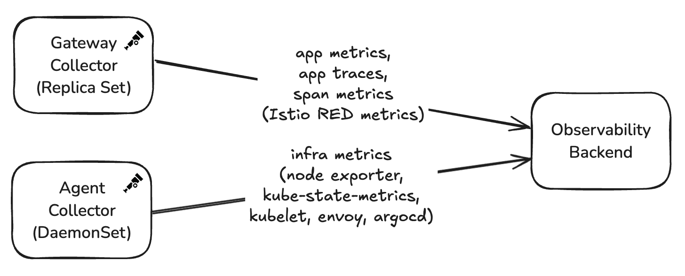
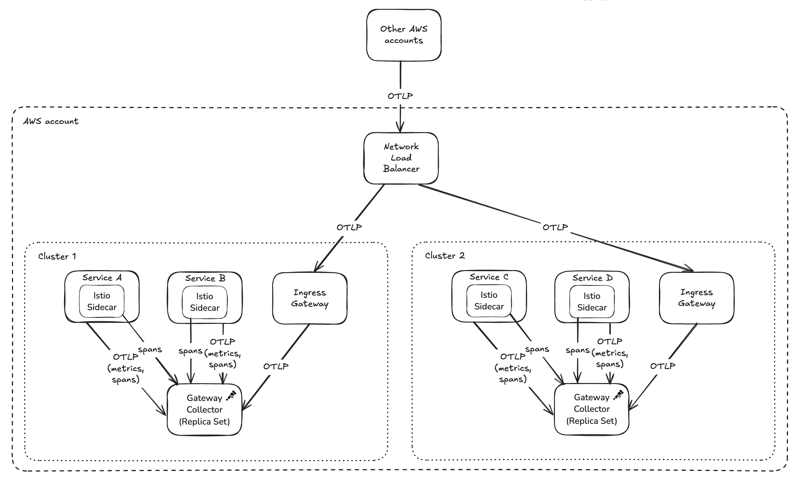

---
title:
  'How Skyscanner scales OpenTelemetry: managing collectors across 24 production
  clusters'
linkTitle:
  'How Skyscanner scales OpenTelemetry: managing collectors across 24 production
  clusters'
date: 2026-04-13
author: >-
  [Johanna Öjeling](https://github.com/johannaojeling) (Grafana Labs), [Juliano
  Costa](https://github.com/julianocosta89) (Datadog), [Tristan
  Sloughter](https://github.com/tsloughter) (community), [Neil
  Fordyce](https://github.com/neilfordyce) (Skyscanner)
sig: Developer Experience SIG
# prettier-ignore
cSpell:ignore: devex Fordyce kube kubelet rollouts Skyscanner Sloughter unsets Öjeling
---

The Developer Experience SIG is publishing a series of blog posts featuring
real-world OpenTelemetry deployments from companies across different industries
and scales. This post features [Skyscanner](https://www.skyscanner.net/), a
global travel search platform based in Edinburgh, Scotland.

With 1,400 employees worldwide running over 1,000 microservices across 24
production Kubernetes clusters, Skyscanner's journey with OpenTelemetry offers
valuable lessons for organizations operating at scale.

## Organizational structure

The Hubble team, consisting of six platform engineers, manages most of
Skyscanner's collectors. As part of the wider platform engineering organization,
they handle the compute platform that runs Skyscanner's primarily Java-based
microservices architecture.

Service teams themselves remain abstracted from the deployment and telemetry
collection infrastructure. For Java services, teams inherit a base Docker image
containing the pre-configured OpenTelemetry Java agent. For Python and Node.js
services, the platform team provides wrapper libraries that set sensible
defaults based on environment and resource attributes. These approaches minimize
boilerplate setup and give service teams observability out of the box without
requiring deep OpenTelemetry knowledge.

## OpenTelemetry adoption

Skyscanner's OpenTelemetry journey began in 2021. The company was migrating from
an internally built open source stack to a commercial vendor. However, they
wanted to avoid vendor lock-in.

> "We wanted to move to a vendor in a way that was vendor agnostic," explained
> [Neil Fordyce](https://github.com/neilfordyce), Software Engineer on
> Skyscanner's Hubble platform team.

This vendor-agnostic approach led them to adopt the OpenTelemetry Collector as
the central piece of their telemetry infrastructure.

## Architecture: centralized routing, distributed collection

Skyscanner's collector architecture features a central DNS endpoint with
Istio-based intelligent routing. Regardless of where services run globally or
which cluster they're in, they send telemetry to this single address. Istio
handles routing requests to the nearest available collector.

The deployment consists of two distinct collector patterns:

**Gateway Collector (Replica Set)**: Handles bulk OTLP traffic (traces and
metrics) from most services, where the majority of processing happens.

**Agent Collector (DaemonSet)**: Scrapes Prometheus endpoints from open source
and platform services that don't yet support OTLP natively.



## Configuration: start simple, evolve gradually

When Skyscanner first deployed collectors in 2021, their configuration was
minimal: memory limiter, batch processor, and an OTLP exporter for traces.

Over time, the configuration evolved organically: adding metrics pipelines,
integrating Istio span ingestion, implementing span-to-metrics transformation,
and adding filter processors to reduce noise and control costs.

### Turning Istio service mesh spans into platform metrics

One of Skyscanner's most innovative uses of the collector involves generating
metrics from Istio service mesh spans.

Istio's native metrics suffered from cardinality explosion issues that would
overwhelm their Prometheus deployment. Additionally, Skyscanner operates many
off-the-shelf services where they don't own the code but still need consistent
metrics.

Their solution: Configure Istio to emit spans (originally in Zipkin format,
though Istio now supports OTLP), ingest them through the collector with the
Zipkin receiver, transform them to meet semantic conventions, and use the
[span metrics connector](https://github.com/open-telemetry/opentelemetry-collector-contrib/tree/e8a502371ea1d2c3534235d623c1b1eb3b6b4b58/connector/spanmetricsconnector?from_branch=main)
to generate consistent metrics without any application instrumentation.

> "We can do that at a platform level without the application owners having to
> instrument their code at all," Neil noted.

The span metrics connector configuration extracts key dimensions from the spans:

```yaml
connectors:
  spanmetrics:
    aggregation_temporality: AGGREGATION_TEMPORALITY_DELTA
    dimensions:
      - name: http.status_code
      - name: grpc.status_code
      - name: rpc.service
      - name: rpc.method
      - name: prot
      - name: flag
      - name: k8s.deployment.name
      - name: k8s.replicaset.name
      - name: destination_subset
    dimensions_cache_size: 15000000
    histogram:
      exponential:
        max_size: 160
      unit: ms
    metrics_flush_interval: 30s
```

The collector then transforms these metrics to use semantic convention names
like `http.client.duration` and `http.server.duration`, aggregating them by
cluster, service name, and HTTP status code. This provides platform-level HTTP
metrics for every service without code changes, consistent naming adhering to
semantic conventions, and lower cardinality than native Istio metrics.

### The 404 error challenge

One notable challenge with the collector configuration involved cache services
that returned HTTP 404 to indicate that an entry did not exist in the cache. The
collector treated these 404s as errors, triggering 100% trace sampling for what
was actually normal, high-volume behavior.

The solution was adding a filter processor to unset the error status for these
specific 404 responses:

```yaml
processors:
  span/unset_cache_client_404:
    include:
      attributes:
        - key: http.response.status_code
          value: ^404$
        - key: server.address
          value: ^(service-x\.skyscanner\.net|service-y\.skyscanner\.net|service-z\.skyscanner\.net|service-z-\w{2}-\w+-\d\.int\.\w{2}-\w+-\d\.skyscanner\.com)$
      match_type: regexp
      regexp:
        cacheenabled: true
        cachemaxnumentries: 1000
    status:
      code: Unset
```

This processor matches spans with 404 status codes from specific cache services
and unsets their error status, preventing them from triggering error-based
sampling.

> "We'd have had higher-quality, easier-to-use traces if we had that filter
> processor from the start," Neil reflected.

However, Neil notes that with the recent introduction of OpenTelemetry SDK
[declarative configuration](/docs/languages/sdk-configuration/declarative-configuration/),
such filtering could now be configured in a decentralized fashion by the service
teams themselves, rather than requiring changes to the central collector
configuration.

### Configuration deep dive

Skyscanner has shared their production collector configurations to help others
understand these patterns in practice:

#### Gateway collector

The [gateway collector][gateway-otelbin] handles the bulk of processing:

- Receives OTLP metrics and traces from services and Zipkin spans from Istio
- Uses the span metrics connector to generate metrics from Istio spans
- Employs extensive transform processors to map Istio attributes to semantic
  conventions
- Implements the 404 filtering logic for cache services
- Exports metrics and traces to the observability vendor via OTLP

The diagram illustrates how OTLP metrics and traces, as well as Istio spans,
reach these gateway collectors:



#### Agent collector

The [agent collector][agent-otelbin] focuses on collecting infrastructure and
platform-level metrics from each node:

- Scrapes Prometheus endpoints from various sources (node exporter,
  kube-state-metrics, kubelet)
- Performs minimal processing (memory limiting, batching, attribute cleanup)
- Exports metrics to the observability vendor via OTLP

## Instrumentation strategy

Skyscanner's Java-heavy environment benefits significantly from OpenTelemetry's
auto-instrumentation capabilities. The Java agent, pre-configured in base Docker
images, provides HTTP and gRPC span generation out of the box.

### Opinionated auto-instrumentation

The team takes a deliberately opinionated approach to auto-instrumentation.
Rather than enabling everything by default, they start from the opposite
direction: all instrumentations are disabled in a shared base Docker image, and
only a curated set is explicitly enabled.

> "It's sort of the other way around. We disable everything, then enable what we
> need," Neil explained.

Using environment variables in the base image, Skyscanner enables a focused set
of runtime-, HTTP-, and gRPC-related instrumentations by default. This includes
JAX-RS, gRPC, Jetty, common HTTP clients, executor instrumentation, and logging
context propagation. Service teams inherit these defaults automatically but
remain free to override them or enable additional instrumentations in their own
service definitions if needed.

This model ensures consistency across hundreds of services while still allowing
flexibility at the edges.

### Setting up the Java agent

The snippet below is an illustration of the shared Java base image. It bundles
the OpenTelemetry Java agent into the image, sets organization-wide defaults,
and installs a common launcher script:

```Dockerfile base image
# Image used as source for the OpenTelemetry Java agent
FROM ghcr.io/open-telemetry/opentelemetry-operator/autoinstrumentation-java:2.25.0 AS otel

# Define a common base image for all Java microservices to extend
FROM image/registry/public-java-image:x.y.z

# Copy OpenTelemetry Java agent from OTel image
COPY --from=otel /javaagent.jar $OPEN_TELEMETRY_DIRECTORY/opentelemetry-javaagent.jar
ENV OTEL_AGENT=$OPEN_TELEMETRY_DIRECTORY/opentelemetry-javaagent.jar

# Pick sensible defaults for everyone in the org
ENV OTEL_METRICS_EXPORTER="otlp"
ENV OTEL_TRACES_EXPORTER="otlp"
ENV OTEL_LOGS_EXPORTER="none"
ENV OTEL_EXPORTER_OTLP_METRICS_TEMPORALITY_PREFERENCE="DELTA"
ENV OTEL_EXPERIMENTAL_METRICS_VIEW_CONFIG="otel-view.yaml"
ENV OTEL_EXPORTER_OTLP_ENDPOINT="http://otel.skyscanner.net"
ENV OTEL_INSTRUMENTATION_COMMON_DEFAULT_ENABLED="false"
ENV OTEL_INSTRUMENTATION_RUNTIME_TELEMETRY_ENABLED="true"
ENV OTEL_INSTRUMENTATION_ASYNC_HTTP_CLIENT_ENABLED="true"
ENV OTEL_INSTRUMENTATION_APACHE_HTTPCLIENT_ENABLED="true"

COPY run.sh /usr/bin/run.sh
```

That launcher script `run.sh` constructs the `-javaagent` flags and
`otel.resource.attributes` from environment variables the deployment supplies:

```bash run.sh
# We use this to setup OTel resource attributes
# for things we can detect from environment variables on service launch
# These vars are set automatically by our deployment system
# Some env vars have been omitted to avoid repetition
setup_otel_agent() {
   if [[ -n "$AWS_REGION" ]]; then CLOUD_REGION="cloud.region=${AWS_REGION},"; else CLOUD_REGION=""; fi
   if [[ -n "$AWS_ACCOUNT" ]]; then CLOUD_ACCOUNT_ID="cloud.account.id=${AWS_ACCOUNT},"; else CLOUD_ACCOUNT_ID=""; fi
   if [[ -n "$CLUSTER_NAME" ]]; then K8S_CLUSTER_NAME="k8s.cluster.name=${CLUSTER_NAME},"; else K8S_CLUSTER_NAME=""; fi
   if [[ -n "$SERVICE" ]]; then SERVICE_NAME="service.name=${SERVICE}"; else SERVICE_NAME=""; fi
   echo -n "-javaagent:$OTEL_AGENT" \
       "-Dotel.resource.attributes=${CLOUD_REGION}${CLOUD_ACCOUNT_ID}${K8S_CLUSTER_NAME}${SERVICE_NAME}"
}

JAVA_OPTS="-D64 -server -showversion $(setup_otel_agent) ${ADDITIONAL_JAVA_OPTS:-}"

exec java $JAVA_OPTS "$@"
```

Finally, an individual service Dockerfile extends the same base and only adds
the extra instrumentations that service needs:

```Dockerfile my-service
FROM image/registry/skyscanner-java-base:x.y.z

COPY my-service.jar

# It's easy to extend if my-service wants to enable some other non-default instrumentation
ENV OTEL_INSTRUMENTATION_OPENAI_ENABLED=true
ENV OTEL_INSTRUMENTATION_OKHTTP_ENABLED=true

CMD exec /usr/bin/run.sh -jar my-service.jar server
```

### Spans yes, metrics no (by default)

A particularly interesting aspect of Skyscanner's strategy is how they treat
metrics versus traces. Although HTTP and gRPC instrumentations are enabled, the
team deliberately drops most SDK-generated HTTP and RPC metrics. This is because
they already derive consistent, lower-cardinality platform metrics from Istio
service mesh spans, as described earlier.

Rather than disabling the instrumentations entirely—which would also remove
spans—they use OpenTelemetry SDK views to drop the metric aggregations while
preserving tracing:

- HTTP and RPC metrics are dropped globally
- Spans continue to be emitted as normal
- Service teams can selectively re-enable specific metrics (for example,
  server-side latency) if they need additional granularity beyond what Istio
  provides

When teams do opt back into SDK metrics, they often rename them to avoid
clashing or double-counting with existing Istio-derived metrics.

In the [Java base image](#setting-up-the-java-agent) shown earlier,
`OTEL_EXPERIMENTAL_METRICS_VIEW_CONFIG` points to Skyscanner's default
`otel-view.yaml`, using
[view file configuration](https://github.com/open-telemetry/opentelemetry-java/blob/65f7412a986cb474314b093c1bbba77955b52031/sdk-extensions/incubator/README.md#view-file-configuration):

```yaml
# Default Skyscanner metrics view config
# Stored in a file which OTEL_EXPERIMENTAL_METRICS_VIEW_CONFIG points to
# Drop http and rpc metrics, because we have metrics from Istio already
# We still want tracing to work so we wouldn't just disable the instrumentation
- selector:
    instrument_name: http.*
  view:
    aggregation: drop
- selector:
    instrument_name: rpc.*
  view:
    aggregation: drop
```

The same file can be extended when a service needs to keep specific metrics. A
typical use case is breaking down requests by `http.route`:

```yaml
# This dropping behaviour can be altered by extending the list to add more views
# to explicitly select the metrics to be kept.
# e.g. to keep http.server.request.duration metrics,
# but continue to drop http.client.* metrics
- selector:
    instrument_name: http.server.request.duration
  view:
    # renamed because we already have Istio metrics named http.server.request.duration,
    # so don't want to clash and double count
    name: app.http.server.request.duration
    attribute_keys:
      - http.request.method
      - http.route
      - http.response.status_code
```

This approach allows Skyscanner to keep high-value distributed traces, avoid
metric duplication, control cardinality, and reduce ingestion costs—all without
requiring service owners to deeply understand OpenTelemetry internals.

Overall, the strategy reflects a strong platform mindset: provide sensible
defaults that work at scale, minimize noise, and make the "right thing" the easy
thing, while still leaving room for teams with advanced needs to go further.

## Deployment and release management

Skyscanner uses the OpenTelemetry Collector Contrib distribution, having adopted
it because it included everything they needed. The team learned during the
interview that Contrib isn't recommended for production use, and plans to
explore building custom collector images with only the components they need.

Skyscanner updates collectors approximately every six months, though they'll
upgrade more frequently if tracking specific features or critical fixes. They
follow RSS feeds and CNCF Slack channels to stay informed about releases.

Their rollout strategy uses progressive promotion across cluster tiers: Dev
clusters, then three Alpha production clusters, followed by eight Beta
production clusters, and finally the remaining 13 production clusters. Using
Argo CD for deployment, changes are promoted via pull requests between tiers.

> "We've definitely messed stuff up in the development testing clusters and then
> gone and fixed them before promoting further," Neil said.

This gradual approach has caught configuration issues before they reach
production. While they don't yet have automated testing and rollback
capabilities for their OpenTelemetry Collector deployments, these improvements
are on the horizon.

## What works well

Since adopting OpenTelemetry in production, the team's experience has been very
positive.

> "It genuinely has been quite pain-free," Neil reflected.

The flexibility stands out as the collector's greatest strength.

> "Everything that we've set out to do, we've been able to actually deliver. I
> think that speaks to how flexible it is," Neil explained.

Other highlights include the OTLP protocol providing vendor independence through
simple configuration, clear and well-organized release notes, and community
responsiveness when team members discovered and contributed fixes for a memory
leak in a collector component.

## Lessons and pain points

Skyscanner still uses older, unstable HTTP semantic conventions in some
pipelines. Upgrading requires updating multiple transform processor rules that
map Istio attributes to semantic convention names, which involves manually
cross-referencing documentation and filling out configuration strings.

The team is aware of [Weaver](https://github.com/open-telemetry/weaver) for
semantic convention management but hasn't yet integrated it into their workflow.

Upgrading every six months means encountering multiple breaking changes at once.
While the release notes are well-written and clearly document changes, reviewing
six months of updates at once adds friction compared to keeping pace with
releases.

## Advice for others

Based on their production experience, the Skyscanner team offers this advice:

- **Start simple**: Begin with just the memory limiter, batch processor, and
  basic exporters. Add complexity only as needs arise.
- **Memory limiter from day one**: Set this up immediately to prevent memory
  issues as you scale.
- **Consider filter processors early**: Understand your application's status
  code semantics and filter out high-volume "false positives" to control costs.
- **Don't over-engineer resiliency**: For telemetry data, simple in-memory
  batching is often sufficient.
- **Gradual rollouts catch issues**: Progressive promotion across environment
  tiers provides valuable validation.

## What's next

This story demonstrates that platform engineering teams of modest size can
successfully manage OpenTelemetry Collector infrastructure at significant scale
with relatively low operational overhead.

Stay tuned for more stories in this series, where we'll continue exploring how
organizations of different sizes leverage the OpenTelemetry Collector in
production, each with unique challenges and creative solutions.

Have your own OpenTelemetry Collector story to share? Join us in the CNCF
[#otel-devex](https://cloud-native.slack.com/archives/C01S42U83B2) Slack
channel. We'd love to hear how you're using OpenTelemetry in production and how
we can continue improving the developer experience.

[gateway-otelbin]:
  https://www.otelbin.io/#config=connectors%3A*N__spanmetrics%3A*N____aggregation*_temporality%3A_AGGREGATION*_TEMPORALITY*_DELTA*N____dimensions%3A*N____-_name%3A_http.status*_code*N____-_name%3A_grpc.status*_code*N____-_name%3A_rpc.service*N____-_name%3A_rpc.method*N____-_name%3A_prot*N____-_name%3A_flag*N____-_name%3A_k8s.deployment.name*N____-_name%3A_k8s.replicaset.name*N____-_name%3A_destination*_subset*N____dimensions*_cache*_size%3A_15000000*N____histogram%3A*N______exponential%3A*N________max*_size%3A_160*N______unit%3A_ms*N____metrics*_flush*_interval%3A_30s*Nexporters%3A*N__debug%3A*N____verbosity%3A_normal*N__debug%2Fbasic%3A*N____verbosity%3A_basic*N__debug%2Fdetailed%3A*N____verbosity%3A_detailed*N__otlphttp%3A*N____endpoint%3A_https%3A%2F%2Fotlp-trace-sampler.vendor.com*N__otlphttp%2Fmetrics%3A*N____endpoint%3A_https%3A%2F%2Fotlp.vendor.com*N__otlphttp%2Fspanmetrics%3A*N____endpoint%3A_https%3A%2F%2Fotlp.vendor.com*Nextensions%3A*N__health*_check%3A*N____endpoint%3A_*S%7Benv%3AMY*_POD*_IP%7D%3A13133*N__pprof%3A*N____endpoint%3A_%3A1888*Nprocessors%3A*N__attributes%2Fspanmetrics-prep%3A*N____actions%3A*N____-_action%3A_extract*N______key%3A_response*_flags*N______pattern%3A_*C*QP*Lflag*G.***D*N____-_action%3A_extract*N______key%3A_dest*N______pattern%3A_%5E*C*QP*Lip*G*C*QP*Lip*_8*G*Bd*P*D*B.*C*QP*Lip*_16*G*Bd*P*D*B.*Bd*P*B.*Bd*P*D*S*N____-_action%3A_extract*N______key%3A_grpc.path*N______pattern%3A_%5E*B%2F*C*QP*Lrpc*_service*G%5B%5E*B%2F%5D*P*D*B%2F*C*QP*Lrpc*_method*G%5B%5E*B%2F%5D*P*D*S*N____-_action%3A_upsert*N______from*_attribute%3A_rpc*_service*N______key%3A_rpc.service*N____-_action%3A_delete*N______key%3A_rpc*_service*N____-_action%3A_upsert*N______from*_attribute%3A_rpc*_method*N______key%3A_rpc.method*N____-_action%3A_delete*N______key%3A_rpc*_method*N____-_action%3A_extract*N______key%3A_upstream*_cluster*N______pattern%3A_%5Eoutbound*B%7C*Bd*P*B%7C*C*QP*Ldestination*_subset*G%5B%5E%7C%5D***D*B%7C.***S*N__attributes%2Fspanmetrics-split-service-name%3A*N____actions%3A*N____-_action%3A_extract*N______key%3A_service.name*N______pattern%3A_%5E*C*QP*Lsvc*G%5B%5E*B.%5D*P*D*C*QP*Lns*_suffix*G*B.*C*QP*Lns*G%5B%5E*B.%5D*P*D*D*Q*S*N__batch%3A*N____send*_batch*_max*_size%3A_500*N____send*_batch*_size%3A_500*N__batch%2Fspanmetrics-export%3A*N____send*_batch*_max*_size%3A_512*N____send*_batch*_size%3A_512*N__batch%2Fspanmetrics-prep%3A_%7B%7D*N__filter%2Fspanmetrics%3A*N____metrics%3A*N______include%3A*N________match*_type%3A_strict*N________metric*_names%3A*N________-_traces.span.metrics.duration*N__filter%2Fspanmetrics-duration%3A*N____metrics%3A*N______include%3A*N________match*_type%3A_regexp*N________metric*_names%3A*N________-_*Crpc%7Chttp*D*B.*Cclient%7Cserver*D*B.duration*N__filter%2Fspanmetrics-prep%3A*N____spans%3A*N______include%3A*N________attributes%3A*N________-_key%3A_component*N__________value%3A_proxy*N________match*_type%3A_strict*N__groupbyattrs%2Fgroup-by-ip%3A*N____keys%3A*N____-_net.host.ip*N__k8sattributes%2Ffrom-pod-ip%3A*N____auth*_type%3A_serviceAccount*N____extract%3A*N______metadata%3A*N______-_k8s.deployment.name*N______-_k8s.replicaset.name*N____passthrough%3A_false*N____pod*_association%3A*N____-_sources%3A*N______-_from%3A_resource*_attribute*N________name%3A_k8s.pod.ip*N__memory*_limiter%3A*N____check*_interval%3A_1s*N____limit*_percentage%3A_100*N____spike*_limit*_percentage%3A_1*N__memory*_limiter%2Fmetrics%3A*N____check*_interval%3A_1s*N____limit*_percentage%3A_85*N____spike*_limit*_percentage%3A_10*N__memory*_limiter%2Fspanmetrics%3A*N____check*_interval%3A_1s*N____limit*_percentage%3A_75*N____spike*_limit*_percentage%3A_1*N__metricstransform%2Fspanmetrics-semantic-naming%3A*N____transforms%3A*N____-_action%3A_insert*N______experimental*_match*_labels%3A*N________prot%3A_http*N________span.kind%3A_SPAN*_KIND*_CLIENT*N______include%3A_traces.span.metrics.duration*N______match*_type%3A_strict*N______new*_name%3A_http.client.duration*N______operations%3A*N______-_action%3A_add*_label*N________new*_label%3A_k8s.cluster.name*N________new*_value%3A_actual*_cluster*_name*N______-_action%3A_add*_label*N________new*_label%3A_k8s.cluster.internal*_name*N________new*_value%3A_internal*_cluster*_name*N______-_action%3A_update*_label*N________label%3A_flag*N________new*_label%3A_istio.response*_flags*N______-_action%3A_update*_label*N________label%3A_svc*N________new*_label%3A_service.name*N______-_action%3A_update*_label*N________label%3A_ns*N________new*_label%3A_service.namespace*N______-_action%3A_update*_label*N________label%3A_span.name*N________new*_label%3A_net.peer.name*N______-_action%3A_aggregate*_labels*N________aggregation*_type%3A_sum*N________label*_set%3A*N________-_k8s.cluster.name*N________-_k8s.cluster.internal*_name*N________-_istio.response*_flags*N________-_service.name*N________-_service.namespace*N________-_net.peer.name*N________-_http.status*_code*N________-_destination*_subset*N____-_action%3A_insert*N______experimental*_match*_labels%3A*N________prot%3A_http*N________span.kind%3A_SPAN*_KIND*_SERVER*N______include%3A_traces.span.metrics.duration*N______match*_type%3A_strict*N______new*_name%3A_http.server.duration*N______operations%3A*N______-_action%3A_add*_label*N________new*_label%3A_k8s.cluster.name*N________new*_value%3A_actual*_cluster*_name*N______-_action%3A_add*_label*N________new*_label%3A_k8s.cluster.internal*_name*N________new*_value%3A_internal*_cluster*_name*N______-_action%3A_update*_label*N________label%3A_flag*N________new*_label%3A_istio.response*_flags*N______-_action%3A_update*_label*N________label%3A_svc*N________new*_label%3A_service.name*N______-_action%3A_update*_label*N________label%3A_ns*N________new*_label%3A_service.namespace*N______-_action%3A_aggregate*_labels*N________aggregation*_type%3A_sum*N________label*_set%3A*N________-_k8s.cluster.name*N________-_k8s.cluster.internal*_name*N________-_istio.response*_flags*N________-_service.name*N________-_service.namespace*N________-_http.status*_code*N____-_action%3A_insert*N______experimental*_match*_labels%3A*N________prot%3A_grpc*N________span.kind%3A_SPAN*_KIND*_CLIENT*N______include%3A_traces.span.metrics.duration*N______match*_type%3A_strict*N______new*_name%3A_rpc.client.duration*N______operations%3A*N______-_action%3A_add*_label*N________new*_label%3A_k8s.cluster.name*N________new*_value%3A_actual*_cluster*_name*N______-_action%3A_add*_label*N________new*_label%3A_k8s.cluster.internal*_name*N________new*_value%3A_internal*_cluster*_name*N______-_action%3A_update*_label*N________label%3A_flag*N________new*_label%3A_istio.response*_flags*N______-_action%3A_update*_label*N________label%3A_svc*N________new*_label%3A_service.name*N______-_action%3A_update*_label*N________label%3A_ns*N________new*_label%3A_service.namespace*N______-_action%3A_update*_label*N________label%3A_span.name*N________new*_label%3A_net.peer.name*N______-_action%3A_add*_label*N________new*_label%3A_rpc.system*N________new*_value%3A_grpc*N______-_action%3A_update*_label*N________label%3A_grpc.status*_code*N________new*_label%3A_rpc.grpc.status*_code*N______-_action%3A_aggregate*_labels*N________aggregation*_type%3A_sum*N________label*_set%3A*N________-_k8s.cluster.name*N________-_k8s.cluster.internal*_name*N________-_istio.response*_flags*N________-_service.name*N________-_service.namespace*N________-_net.peer.name*N________-_rpc.system*N________-_rpc.grpc.status*_code*N________-_rpc.service*N________-_rpc.method*N________-_destination*_subset*N____-_action%3A_insert*N______experimental*_match*_labels%3A*N________prot%3A_grpc*N________span.kind%3A_SPAN*_KIND*_SERVER*N______include%3A_traces.span.metrics.duration*N______match*_type%3A_strict*N______new*_name%3A_rpc.server.duration*N______operations%3A*N______-_action%3A_add*_label*N________new*_label%3A_k8s.cluster.name*N________new*_value%3A_actual*_cluster*_name*N______-_action%3A_add*_label*N________new*_label%3A_k8s.cluster.internal*_name*N________new*_value%3A_internal*_cluster*_name*N______-_action%3A_update*_label*N________label%3A_flag*N________new*_label%3A_istio.response*_flags*N______-_action%3A_update*_label*N________label%3A_svc*N________new*_label%3A_service.name*N______-_action%3A_update*_label*N________label%3A_ns*N________new*_label%3A_service.namespace*N______-_action%3A_add*_label*N________new*_label%3A_rpc.system*N________new*_value%3A_grpc*N______-_action%3A_update*_label*N________label%3A_grpc.status*_code*N________new*_label%3A_rpc.grpc.status*_code*N______-_action%3A_aggregate*_labels*N________aggregation*_type%3A_sum*N________label*_set%3A*N________-_k8s.cluster.name*N________-_k8s.cluster.internal*_name*N________-_istio.response*_flags*N________-_service.name*N________-_service.namespace*N________-_rpc.system*N________-_rpc.grpc.status*_code*N________-_rpc.service*N________-_rpc.method*N__resource%2Fcommon%3A*N____attributes%3A*N____-_action%3A_delete*N______key%3A_process.command*N____-_action%3A_delete*N______key%3A_process.command*_line*N____-_action%3A_delete*N______key%3A_process.command*_args*N____-_action%3A_delete*N______key%3A_process.executable.name*N____-_action%3A_delete*N______key%3A_process.executable.path*N____-_action%3A_delete*N______key%3A_process.pid*N____-_action%3A_delete*N______key%3A_process.runtime.description*N____-_action%3A_delete*N______key%3A_process.runtime.name*N____-_action%3A_delete*N______key%3A_process.runtime.version*N____-_action%3A_delete*N______key%3A_os.description*N____-_action%3A_delete*N______key%3A_os.type*N____-_action%3A_delete*N______key%3A_env.aws.account*N____-_action%3A_delete*N______key%3A_env.aws.project.name*N____-_action%3A_delete*N______key%3A_env.aws.region*N____-_action%3A_delete*N______key%3A_env.platform*N____-_action%3A_delete*N______key%3A_env.service.name*N____-_action%3A_delete*N______key%3A_env.version*N__resource%2Fpod-ip-sem-conv%3A*N____attributes%3A*N____-_action%3A_insert*N______from*_attribute%3A_ipv4*N______key%3A_k8s.pod.ip*N____-_action%3A_insert*N______from*_attribute%3A_net.host.ip*N______key%3A_k8s.pod.ip*N____-_action%3A_delete*N______key%3A_ipv4*N____-_action%3A_delete*N______key%3A_net.host.ip*N__resource%2Fremove-k8s-pod-ip%3A*N____attributes%3A*N____-_action%3A_delete*N______key%3A_k8s.pod.ip*N__resource%2Fspanmetrics-remove-unused%3A*N____attributes%3A*N____-_action%3A_delete*N______key%3A_http.scheme*N____-_action%3A_delete*N______key%3A_net.host.port*N____-_action%3A_delete*N______key%3A_service.instance.id*N____-_action%3A_delete*N______key%3A_service.name*N__span%2Fspanmetrics-destination-service%3A*N____name%3A*N______to*_attributes%3A*N________rules%3A*N________-_%5E*C*QP*Ldest*G%5B%5E%3A*B%2F%5D*P*D.***S*N__span%2Fspanmetrics-fake-name%3A*N____name%3A*N______from*_attributes%3A*N______-_dest*N__span%2Funset*_cache*_client*_404%3A*N____include%3A*N______attributes%3A*N______-_key%3A_http.response.status*_code*N________value%3A_%5E404*S*N______-_key%3A_server.address*N________value%3A_%5E*Cservice-x*B.skyscanner*B.net%7Cservice-y*B.skyscanner*B.net%7Cservice-z*B.skyscanner*B.net%7Cservice-z-*Bw%7B2%7D-*Bw*P-*Bd*B.int*B.*Bw%7B2%7D-*Bw*P-*Bd*B.skyscanner*B.com*D*S*N______match*_type%3A_regexp*N______regexp%3A*N________cacheenabled%3A_true*N________cachemaxnumentries%3A_1000*N____status%3A*N______code%3A_Unset*N__span%2Funset*_cache*_client*_404*_legacy%3A*N____include%3A*N______attributes%3A*N______-_key%3A_http.status*_code*N________value%3A_%5E404*S*N______-_key%3A_net.peer.name*N________value%3A_%5E*Cservice-x*B.skyscanner*B.net%7Cservice-y*B.skyscanner*B.net%7Cservice-z*B.skyscanner*B.net%7Cservice-z-*Bw%7B2%7D-*Bw*P-*Bd*B.int*B.*Bw%7B2%7D-*Bw*P-*Bd*B.skyscanner*B.com*D*S*N______match*_type%3A_regexp*N______regexp%3A*N________cacheenabled%3A_true*N________cachemaxnumentries%3A_1000*N____status%3A*N______code%3A_Unset*N__span%2Funset*_cache*_client*_404*_url%3A*N____include%3A*N______attributes%3A*N______-_key%3A_http.response.status*_code*N________value%3A_%5E404*S*N______-_key%3A_http.url*N________value%3A_%5E*Cservice-1*B.skyscanner*B.net*B%2Fapi*B%2Fv3*B%2Fflights%7Cservice-2*B.skyscanner*B.net*B%2Fapi*B%2Fv2*B%2Fhotels*B%2F.*P*D*S*N______match*_type%3A_regexp*N______regexp%3A*N________cacheenabled%3A_true*N________cachemaxnumentries%3A_1000*N____status%3A*N______code%3A_Unset*N__span%2Funset*_cache*_client*_404*_url*_legacy%3A*N____include%3A*N______attributes%3A*N______-_key%3A_http.status*_code*N________value%3A_%5E404*S*N______-_key%3A_http.url*N________value%3A_%5E*Cservice-1*B.skyscanner*B.net*B%2Fapi*B%2Fv3*B%2Fflights%7Cservice-2*B.skyscanner*B.net*B%2Fapi*B%2Fv2*B%2Fhotels*B%2F.*P*D*S*N______match*_type%3A_regexp*N______regexp%3A*N________cacheenabled%3A_true*N________cachemaxnumentries%3A_1000*N____status%3A*N______code%3A_Unset*N__span%2Funset*_status*_jaxrs*_common%3A*N____include%3A*N______libraries%3A*N______-_name%3A_io.opentelemetry.jaxrs-2.0-common*N______match*_type%3A_strict*N____status%3A*N______code%3A_Unset*N__transform%2Fspanmetrics-prep%3A*N____trace*_statements%3A*N____-_context%3A_span*N______statements%3A*N______-_set*Cattributes%5B%22prot%22%5D%2C_%22http%22*D_where_attributes%5B%22grpc.status*_code%22%5D_*E*E_nil*N______-_set*Cattributes%5B%22prot%22%5D%2C_%22grpc%22*D_where_attributes%5B%22grpc.status*_code%22%5D_%21*E_nil*N______-_set*Cattributes%5B%22dest%22%5D%2C_%22unknown-ip%22*D_where_attributes%5B%22ip%22%5D_%21*E_nil_and_attributes%5B%22ip%22%5D_%21*E_%22%22*N______-_set*Cattributes%5B%22dest%22%5D%2C_%22aws-metadata-service%22*D_where_attributes%5B%22ip%22%5D_*E*E_%22169.254.169.254%22*N______-_set*Cattributes%5B%22dest%22%5D%2C_%22vpc-ip%22*D_where_attributes%5B%22ip*_8%22%5D_*E*E_%22172%22_and_Int*Cattributes%5B%22ip*_16%22%5D*D_*G*E_16_and_Int*Cattributes%5B%22ip*_16%22%5D*D_*L*E_20*N__transform%2Ftruncate*_all%3A*N____metric*_statements%3A*N____-_context%3A_resource*N______statements%3A*N______-_truncate*_all*Cattributes%2C_4095*D*N____-_context%3A_datapoint*N______statements%3A*N______-_truncate*_all*Cattributes%2C_4095*D*N____trace*_statements%3A*N____-_context%3A_resource*N______statements%3A*N______-_truncate*_all*Cattributes%2C_4095*D*N____-_context%3A_span*N______statements%3A*N______-_truncate*_all*Cattributes%2C_4095*D*N____-_context%3A_spanevent*N______statements%3A*N______-_truncate*_all*Cattributes%2C_4095*D*Nreceivers%3A*N__otlp%3A*N____protocols%3A*N______grpc%3A*N________endpoint%3A_0.0.0.0%3A50051*N__prometheus%3A*N____config%3A*N______scrape*_configs%3A*N______-_job*_name%3A_opentelemetry-collector*N________scrape*_interval%3A_10s*N________static*_configs%3A*N________-_targets%3A*N__________-_*S%7Benv%3AMY*_POD*_IP%7D%3A8888*N__zipkin%3A*N____endpoint%3A_0.0.0.0%3A9411*Nservice%3A*N__extensions%3A*N__-_health*_check*N__-_pprof*N__pipelines%3A*N____metrics%3A*N______exporters%3A*N______-_otlphttp%2Fmetrics*N______processors%3A*N______-_memory*_limiter%2Fmetrics*N______-_batch*N______-_resource%2Fcommon*N______receivers%3A*N______-_otlp*N____metrics%2Fspanmetrics-export%3A*N______exporters%3A*N______-_otlphttp%2Fspanmetrics*N______processors%3A*N______-_filter%2Fspanmetrics*N______-_attributes%2Fspanmetrics-split-service-name*N______-_metricstransform%2Fspanmetrics-semantic-naming*N______-_filter%2Fspanmetrics-duration*N______-_resource%2Fspanmetrics-remove-unused*N______-_batch%2Fspanmetrics-export*N______receivers%3A*N______-_spanmetrics*N____traces%3A*N______exporters%3A*N______-_otlphttp*N______processors%3A*N______-_memory*_limiter*N______-_resource%2Fcommon*N______-_transform%2Ftruncate*_all*N______-_span%2Funset*_cache*_client*_404*_legacy*N______-_span%2Funset*_cache*_client*_404*N______-_span%2Funset*_cache*_client*_404*_url*_legacy*N______-_span%2Funset*_cache*_client*_404*_url*N______-_span%2Funset*_status*_jaxrs*_common*N______-_batch*N______receivers%3A*N______-_otlp*N____traces%2Fspanmetrics%3A*N______exporters%3A*N______-_debug%2Fbasic*N______-_spanmetrics*N______processors%3A*N______-_memory*_limiter%2Fspanmetrics*N______-_filter%2Fspanmetrics-prep*N______-_groupbyattrs%2Fgroup-by-ip*N______-_resource%2Fpod-ip-sem-conv*N______-_k8sattributes%2Ffrom-pod-ip*N______-_resource%2Fremove-k8s-pod-ip*N______-_span%2Fspanmetrics-destination-service*N______-_attributes%2Fspanmetrics-prep*N______-_transform%2Fspanmetrics-prep*N______-_span%2Fspanmetrics-fake-name*N______-_batch%2Fspanmetrics-prep*N______receivers%3A*N______-_zipkin*N__telemetry%3A*N____metrics%3A*N______readers%3A*N______-_pull%3A*N__________exporter%3A*N____________prometheus%3A*N______________host%3A_0.0.0.0*N______________port%3A_8888*N______________without*_type*_suffix%3A_true%7E
[agent-otelbin]:
  https://www.otelbin.io/#config=exporters%3A*N__debug%3A*N____verbosity%3A_normal*N__otlphttp%3A*N____endpoint%3A_https%3A%2F%2Fotlp.vendor.com*Nextensions%3A*N__health*_check%3A*N____endpoint%3A_*S%7Benv%3AMY*_POD*_IP%7D%3A13133*Nprocessors%3A*N__attributes%2Fconventions%3A*N____actions%3A*N____-_action%3A_delete*N______key%3A_service*_name*N____-_action%3A_delete*N______key%3A_service*_namespace*N____-_action%3A_delete*N______key%3A_service*_instance*_id*N____-_action%3A_delete*N______key%3A_service*_version*N__attributes%2Fkube-state-metrics%3A*N____actions%3A*N____-_action%3A_upsert*N______from*_attribute%3A_namespace*N______key%3A_k8s.namespace.name*N____-_action%3A_upsert*N______from*_attribute%3A_horizontalpodautoscaler*N______key%3A_k8s.hpa.name*N____-_action%3A_upsert*N______from*_attribute%3A_resourcequota*N______key%3A_k8s.resourcequota.name*N____-_action%3A_delete*N______key%3A_namespace*N____-_action%3A_delete*N______key%3A_horizontalpodautoscaler*N____-_action%3A_delete*N______key%3A_resourcequota*N__batch%3A*N____send*_batch*_max*_size%3A_512*N____send*_batch*_size%3A_512*N__cumulativetodelta%3A_null*N__filter%2Fprom*_scrape*_metrics%3A*N____metrics%3A*N______metric%3A*N______-_IsMatch*Cname%2C_%22scrape*_.**%22*D*N__filter%2Fzero*_value*_counts%3A*N____metrics%3A*N______datapoint%3A*N______-_value*_double_*E*E_0.0*N__groupbyattrs%2Fkube-state-metrics%3A*N____keys%3A*N____-_k8s.namespace.name*N____-_k8s.cluster.name*N____-_k8s.cluster.internal*_name*N____-_k8s.hpa.name*N____-_k8s.resourcequota.name*N__memory*_limiter%3A*N____check*_interval%3A_10s*N____limit*_percentage%3A_50*N____spike*_limit*_percentage%3A_1*N__metricstransform%2Fenvoy*_metrics%3A*N____transforms%3A*N____-_action%3A_update*N______include%3A_%5E.***Cejections*_active*D*S*N______match*_type%3A_regexp*N______new*_name%3A_envoy.cluster.outlier*_detection.ejections.active*N__resource%3A*N____attributes%3A*N____-_action%3A_insert*N______key%3A_k8s.cluster.name*N______value%3A_actual*_cluster*_name*N____-_action%3A_insert*N______key%3A_k8s.cluster.internal*_name*N______value%3A_internal*_cluster*_name*N__resource%2Fkube-state-metrics%3A*N____attributes%3A*N____-_action%3A_delete*N______key%3A_k8s.container.name*N____-_action%3A_delete*N______key%3A_k8s.namespace.name*N____-_action%3A_delete*N______key%3A_k8s.node.name*N____-_action%3A_delete*N______key%3A_k8s.pod.name*N____-_action%3A_delete*N______key%3A_k8s.pod.uid*N____-_action%3A_delete*N______key%3A_k8s.replicaset.name*N____-_action%3A_delete*N______key%3A_http.scheme*N____-_action%3A_delete*N______key%3A_net.host.name*N____-_action%3A_delete*N______key%3A_net.host.name*N____-_action%3A_delete*N______key%3A_net.host.port*N__transform%2Fnode*_ethtool*_convert*_gauge*_to*_sum%3A*N____metric*_statements%3A*N____-_context%3A_metric*N______statements%3A*N______-_convert*_gauge*_to*_sum*C%22cumulative%22%2C_true*D_where_IsMatch*Cname%2C_%22node*_ethtool*_.*P*_allowance*_exceeded%22*D*N________*E*E_true*N______-_convert*_gauge*_to*_sum*C%22cumulative%22%2C_true*D_where_IsMatch*Cname%2C_%22awscni*_.*P*_req*_count*S%22*D*N________*E*E_true*Nreceivers%3A*N__opencensus%3A_null*N__prometheus%3A*N____config%3A*N______scrape*_configs%3A*N______-_honor*_timestamps%3A_false*N________job*_name%3A_k8s*_by*_annotations*N________kubernetes*_sd*_configs%3A*N________-_role%3A_pod*N__________selectors%3A*N__________-_field%3A_spec.nodeName*E*S%7Benv%3ANODE*_NAME%7D*N____________role%3A_pod*N________metric*_relabel*_configs%3A*N________-_action%3A_keep*N__________regex%3A_*C*Cotelcol%7Ckarpenter*D*_.*P*D*D*N__________source*_labels%3A*N__________-_*_*_name*_*_*N________-_action%3A_drop*N__________regex%3A_*C*Ckarpenter*_build%7Ckarpenter*_scheduler*_queue*_depth*D*C*_.***D*Q*D*N__________source*_labels%3A*N__________-_*_*_name*_*_*N________relabel*_configs%3A*N________-_action%3A_keep*N__________regex%3A_%22true%22*N__________source*_labels%3A*N__________-_*_*_meta*_kubernetes*_pod*_annotation*_prometheus*_io*_scrape*N________-_action%3A_keep*N__________regex%3A_.*P*N__________source*_labels%3A*N__________-_*_*_meta*_kubernetes*_pod*_annotation*_prometheus*_io*_scrape*_port*N________-_action%3A_keep*N__________regex%3A_.*P*N__________source*_labels%3A*N__________-_*_*_meta*_kubernetes*_pod*_label*_app*_kubernetes*_io*_name*N________-_action%3A_drop*N__________regex%3A_kube-state-metrics*N__________source*_labels%3A*N__________-_*_*_meta*_kubernetes*_pod*_label*_app*_kubernetes*_io*_name*N________-_action%3A_replace*N__________regex%3A_*C%5B%5E%3A%5D*P*D*C*Q%3A%3A*Bd*P*D*Q%3B*C*Bd*P*D*N__________replacement%3A_*S*S1%3A*S*S2*N__________source*_labels%3A*N__________-_*_*_address*_*_*N__________-_*_*_meta*_kubernetes*_pod*_annotation*_prometheus*_io*_scrape*_port*N__________target*_label%3A_*_*_address*_*_*N________-_action%3A_replace*N__________regex%3A_*Chttps*D*N__________source*_labels%3A*N__________-_*_*_meta*_kubernetes*_pod*_annotation*_prometheus*_io*_scheme*N__________target*_label%3A_*_*_scheme*_*_*N________-_action%3A_replace*N__________regex%3A_*C.*P*D*N__________source*_labels%3A*N__________-_*_*_meta*_kubernetes*_pod*_annotation*_prometheus*_io*_scrape*_path*N__________target*_label%3A_*_*_metrics*_path*_*_*N________-_action%3A_replace*N__________source*_labels%3A*N__________-_*_*_meta*_kubernetes*_pod*_label*_app*_kubernetes*_io*_name*N__________target*_label%3A_job*N________-_action%3A_drop*N__________regex%3A_.**-envoy-prom*N__________source*_labels%3A*N__________-_*_*_meta*_kubernetes*_pod*_container*_port*_name*N________scrape*_interval%3A_30s*N________tls*_config%3A*N__________insecure*_skip*_verify%3A_true*N______-_honor*_timestamps%3A_false*N________job*_name%3A_k8s*_node*_exporter*N________kubernetes*_sd*_configs%3A*N________-_role%3A_pod*N__________selectors%3A*N__________-_field%3A_spec.nodeName*E*S%7Benv%3ANODE*_NAME%7D*N____________role%3A_pod*N________metric*_relabel*_configs%3A*N________-_action%3A_keep*N__________regex%3A_node*_ethtool*_.*P*_allowance*_exceeded*N__________source*_labels%3A*N__________-_*_*_name*_*_*N________relabel*_configs%3A*N________-_action%3A_keep*N__________regex%3A_prometheus-node-exporter*N__________source*_labels%3A*N__________-_*_*_meta*_kubernetes*_pod*_label*_app*_kubernetes*_io*_name*N________-_action%3A_replace*N__________source*_labels%3A*N__________-_*_*_meta*_kubernetes*_pod*_label*_jobLabel*N__________target*_label%3A_job*N________-_action%3A_drop*N__________regex%3A_.**-envoy-prom*N__________source*_labels%3A*N__________-_*_*_meta*_kubernetes*_pod*_container*_port*_name*N________-_action%3A_replace*N__________regex%3A_*C.***D*N__________replacement%3A_*S*S1*N__________source*_labels%3A*N__________-_*_*_meta*_kubernetes*_pod*_label*_kubernetes*_io*_arch*N__________target*_label%3A_host*_arch*N________scrape*_interval%3A_30s*N______-_honor*_timestamps%3A_false*N________job*_name%3A_aws*_vpc*_cni*N________kubernetes*_sd*_configs%3A*N________-_role%3A_pod*N__________selectors%3A*N__________-_field%3A_spec.nodeName*E*S%7Benv%3ANODE*_NAME%7D*N____________role%3A_pod*N________metric*_relabel*_configs%3A*N________-_action%3A_keep*N__________regex%3A_*Cotelcol*D*_.*P*N__________source*_labels%3A*N__________-_*_*_name*_*_*N________relabel*_configs%3A*N________-_action%3A_keep*N__________regex%3A_aws-node*N__________source*_labels%3A*N__________-_*_*_meta*_kubernetes*_pod*_label*_app*_kubernetes*_io*_name*N________-_action%3A_replace*N__________regex%3A_*C%5B%5E%3A%5D*P*D*C*Q%3A%3A*Bd*P*D*Q*N__________replacement%3A_*S*S1%3A61678*N__________source*_labels%3A*N__________-_*_*_address*_*_*N__________target*_label%3A_*_*_address*_*_*N________scrape*_interval%3A_30s*N______-_honor*_timestamps%3A_false*N________job*_name%3A_argocd*_metrics*_scraper*N________kubernetes*_sd*_configs%3A*N________-_role%3A_pod*N__________selectors%3A*N__________-_field%3A_spec.nodeName*E*S%7Benv%3ANODE*_NAME%7D*N____________role%3A_pod*N________metric*_relabel*_configs%3A*N________-_action%3A_keep*N__________regex%3A_*Cgo%7Cprocess%7Crest*D*_.*P*N__________source*_labels%3A*N__________-_*_*_name*_*_*N________relabel*_configs%3A*N________-_action%3A_keep*N__________regex%3A_%22true%22*N__________source*_labels%3A*N__________-_*_*_meta*_kubernetes*_pod*_annotation*_prometheus*_io*_scrape*N________-_action%3A_keep*N__________regex%3A_.*P*N__________source*_labels%3A*N__________-_*_*_meta*_kubernetes*_pod*_annotation*_prometheus*_io*_scrape*_port*N________-_action%3A_keep*N__________regex%3A_*Cargo-rollouts%7Cargocd-.***D*N__________source*_labels%3A*N__________-_*_*_meta*_kubernetes*_pod*_label*_app*_kubernetes*_io*_name*N________-_action%3A_replace*N__________source*_labels%3A*N__________-_*_*_meta*_kubernetes*_pod*_label*_app*_kubernetes*_io*_name*N__________target*_label%3A_job*N________scrape*_interval%3A_30s*N________tls*_config%3A*N__________insecure*_skip*_verify%3A_true*N__prometheus%2Fenvoy-metrics%3A*N____config%3A*N______scrape*_configs%3A*N______-_job*_name%3A_envoy-stats*N________kubernetes*_sd*_configs%3A*N________-_role%3A_pod*N__________selectors%3A*N__________-_field%3A_spec.nodeName*E*S%7Benv%3ANODE*_NAME%7D*N____________role%3A_pod*N________metric*_relabel*_configs%3A*N________-_action%3A_keep*N__________regex%3A_*Cenvoy*_cluster*D.***Coutlier*_detection*_ejections*_active*D*N__________source*_labels%3A*N__________-_*_*_name*_*_*N________metrics*_path%3A_%2Fstats%2Fprometheus*N________params%3A*N__________filter%3A*N__________-_.**ejections*_active.***N________relabel*_configs%3A*N________-_action%3A_keep*N__________regex%3A_.**-envoy-prom*N__________source*_labels%3A*N__________-_*_*_meta*_kubernetes*_pod*_container*_port*_name*N________-_action%3A_replace*N__________source*_labels%3A*N__________-_*_*_meta*_kubernetes*_pod*_label*_app*_kubernetes*_io*_name*N__________target*_label%3A_job*N______-_job*_name%3A_envoy-stats-default-egress-gateways*N________kubernetes*_sd*_configs%3A*N________-_role%3A_pod*N__________selectors%3A*N__________-_field%3A_spec.nodeName*E*S%7Benv%3ANODE*_NAME%7D*N____________role%3A_pod*N________metric*_relabel*_configs%3A*N________-_action%3A_keep*N__________regex%3A_istio*_tcp.***N__________source*_labels%3A*N__________-_*_*_name*_*_*N________metrics*_path%3A_%2Fstats%2Fprometheus*N________params%3A*N__________filter%3A*N__________-_istio*_tcp.***N________relabel*_configs%3A*N________-_action%3A_keep*N__________regex%3A_default-egressgateway*N__________source*_labels%3A*N__________-_*_*_meta*_kubernetes*_pod*_label*_type*N________-_action%3A_keep*N__________regex%3A_.**-envoy-prom*N__________source*_labels%3A*N__________-_*_*_meta*_kubernetes*_pod*_container*_port*_name*N________-_action%3A_replace*N__________source*_labels%3A*N__________-_*_*_meta*_kubernetes*_pod*_label*_app*N__________target*_label%3A_job*N__prometheus%2Fkube-state-metrics%3A*N____config%3A*N______scrape*_configs%3A*N______-_honor*_timestamps%3A_false*N________job*_name%3A_kube-state-metrics*N________kubernetes*_sd*_configs%3A*N________-_role%3A_pod*N__________selectors%3A*N__________-_field%3A_spec.nodeName*E*S%7Benv%3ANODE*_NAME%7D*N____________role%3A_pod*N________metric*_relabel*_configs%3A*N________-_action%3A_keep*N__________regex%3A_kube*_resourcequota%7Ckube*_pod*_container*_status*_last*_terminated*_reason%7Ckube*_node*_status*_condition*N__________source*_labels%3A*N__________-_*_*_name*_*_*N________-_action%3A_drop*N__________regex%3A_%5E*C%5B%5EO%5D%7CO%5B%5EO%5D%7COO%5B%5EM%5D%7COOM%5B%5EK%5D%7COOMK%5B%5Ei%5D%7COOMKi%5B%5El%5D%7COOMKil%5B%5El%5D%7COOMKill%5B%5Ee%5D%7COOMKille%5B%5Ed%5D*S*D.***N__________source*_labels%3A*N__________-_reason*N________relabel*_configs%3A*N________-_action%3A_keep*N__________regex%3A_service*N__________source*_labels%3A*N__________-_*_*_meta*_kubernetes*_pod*_label*_app*_kubernetes*_io*_instance*N________-_action%3A_keep*N__________regex%3A_kube-state-metrics*N__________source*_labels%3A*N__________-_*_*_meta*_kubernetes*_pod*_label*_app*_kubernetes*_io*_name*N________-_action%3A_replace*N__________regex%3A_*C%5B%5E%3A%5D*P*D*C*Q%3A%3A*Bd*P*D*Q%3B*C*Bd*P*D*N__________replacement%3A_*S*S1%3A*S*S2*N__________source*_labels%3A*N__________-_*_*_address*_*_*N__________-_*_*_meta*_kubernetes*_pod*_annotation*_prometheus*_io*_scrape*_port*N__________target*_label%3A_*_*_address*_*_*N________scrape*_interval%3A_30s*N__prometheus%2Fkubelet%3A*N____config%3A*N______scrape*_configs%3A*N______-_bearer*_token*_file%3A_%2Fvar%2Frun%2Fsecrets%2Fkubernetes.io%2Fserviceaccount%2Ftoken*N________honor*_timestamps%3A_false*N________job*_name%3A_kubelet*N________metric*_relabel*_configs%3A*N________-_action%3A_keep*N__________regex%3A_kubelet*_*Cpod*_start%7Cevictions%7Cimage*_pull*_duration%7Cnode*_startup*_duration%7Cpleg*_relist%7Cpreemptions%7Crunning*_containers%7Crunning*_pods*D.***N__________source*_labels%3A*N__________-_*_*_name*_*_*N________metrics*_path%3A_%2Fapi%2Fv1%2Fnodes%2F*S%7Benv%3ANODE*_NAME%7D%2Fproxy%2Fmetrics*N________scheme%3A_https*N________static*_configs%3A*N________-_targets%3A*N__________-_kubernetes.default.svc*N__zipkin%3A*N____endpoint%3A_*S%7Benv%3AMY*_POD*_IP%7D%3A9411*Nservice%3A*N__extensions%3A*N__-_health*_check*N__pipelines%3A*N____metrics%3A*N______exporters%3A*N______-_otlphttp*N______processors%3A*N______-_memory*_limiter*N______-_filter%2Fprom*_scrape*_metrics*N______-_batch*N______-_transform%2Fnode*_ethtool*_convert*_gauge*_to*_sum*N______-_attributes%2Fconventions*N______-_resource*N______receivers%3A*N______-_prometheus*N____metrics%2Fenvoy-metrics%3A*N______exporters%3A*N______-_otlphttp*N______processors%3A*N______-_memory*_limiter*N______-_filter%2Fzero*_value*_counts*N______-_filter%2Fprom*_scrape*_metrics*N______-_batch*N______-_metricstransform%2Fenvoy*_metrics*N______-_attributes%2Fconventions*N______-_resource*N______receivers%3A*N______-_prometheus%2Fenvoy-metrics*N____metrics%2Fkube-state-metrics%3A*N______exporters%3A*N______-_otlphttp*N______processors%3A*N______-_memory*_limiter*N______-_filter%2Fprom*_scrape*_metrics*N______-_batch*N______-_resource*N______-_resource%2Fkube-state-metrics*N______-_attributes%2Fkube-state-metrics*N______-_groupbyattrs%2Fkube-state-metrics*N______receivers%3A*N______-_prometheus%2Fkube-state-metrics*N____metrics%2Fkubelet%3A*N______exporters%3A*N______-_otlphttp*N______processors%3A*N______-_memory*_limiter*N______-_batch*N______-_attributes%2Fconventions*N______-_resource*N______receivers%3A*N______-_prometheus%2Fkubelet*N__telemetry%3A*N____logs%3A*N______level%3A_info*N____metrics%3A*N______readers%3A*N______-_pull%3A*N__________exporter%3A*N____________prometheus%3A*N______________host%3A_*S%7Benv%3AMY*_POD*_IP%7D*N______________port%3A_8888*N______________without*_type*_suffix%3A_true*N%7E
