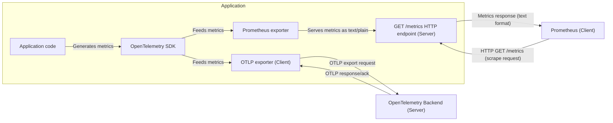

Many applications export their metrics directly to
[Prometheus](https://prometheus.io/). If you're unfamiliar with Prometheus, in a
nutshell it's a time-series database for storing metrics, like counters and
histograms. Applications that store their metrics in Prometheus typically use a
popular Prometheus client as part of the integration.

Now that OpenTelemetry is
[a graduated CNCF project](/blog/2026/otel-graduates/), many companies are now
increasingly looking to move to OpenTelemetry to add more signals beyond metrics
to their observability architecture. Logs and traces are popular additions for
getting further insight into how applications behave. Profiles are also starting
to become a popular fourth telemetry signal for even deeper understanding.

This can create a migration hurdle - how can we migrate our applications from
one system to another for metrics without having a single cut-over event? To
de-risk any migration an incremental approach would be preferred, where metrics
are exported to both systems for a period of time so that "before" and "after"
states can be compared and checked to ensure there is no loss of production
visibility in either system for observing metrics or driving alerting.

## Using the OpenTelemetry Prometheus exporter for .NET

The
[latest release](https://github.com/open-telemetry/opentelemetry-dotnet/releases/tag/coreunstable-1.17.0-beta.1)
of the OpenTelemetry Prometheus exporter for .NET allows you to take this exact
approach with your production metrics. You can use the
[.NET Meter class](https://learn.microsoft.com/dotnet/core/diagnostics/metrics-instrumentation)
from your application and framework code to collect metrics and export it to
both Prometheus and another exporter, such as the
[OTLP exporter](/docs/specs/otel/protocol/exporter/).

The Prometheus exporter is effectively a
[Prometheus client library](https://prometheus.io/docs/instrumenting/clientlibs/)
written on top of the OpenTelemetry SDK, exposing an HTTP scrape endpoint in
your application to allow a Prometheus server to collect metrics from your
application at regular intervals. The exporter implements the OpenTelemetry
[Prometheus specification](https://github.com/open-telemetry/opentelemetry-specification/blob/27b10516ad3a27c12a0ab5c63456ddc95766bc68/specification/metrics/sdk_exporters/prometheus.md)
([matrix](https://github.com/open-telemetry/opentelemetry-specification/blob/27b10516ad3a27c12a0ab5c63456ddc95766bc68/spec-compliance-matrix.md))
and implements all of the
[documented text exposition formats](https://prometheus.io/docs/instrumenting/exposition_formats/)
(except
[OpenMetrics 2.0](https://prometheus.io/docs/specs/om/open_metrics_spec_2_0/),
which is still experimental) to allow for
[compatibility with OpenMetrics](https://github.com/open-telemetry/opentelemetry-specification/blob/27b10516ad3a27c12a0ab5c63456ddc95766bc68/specification/compatibility/prometheus_and_openmetrics.md).



By using only the `Meter` class alongside the `Counter<T>`, `Gauge<T>` and
`Histogram<T>` instruments in your .NET application code metrics can be
collected without needing to use both the .NET OpenTelemetry SDK and a dedicated
Prometheus client.

```csharp
public class BlogPostComments
{
    private readonly Meter _meter;
    private readonly Counter<long> _likes;

    public BlogPostComments(IMeterFactory meterFactory)
    {
        _meter = meterFactory.Create("OpenTelemetry.Blog");
        _likes = _meter.CreateCounter<long>("blog_post_likes");
    }

    public void BlogPostLiked(long id) =>
        _likes.Add(1, new KeyValuePair<string, object?>("post_id", id));
}
```

It's then a small amount of code to configure the OpenTelemetry SDK to export
your metrics to both Prometheus and over OTLP to a backend that supports
OpenTelemetry.

```csharp
using OpenTelemetry.Exporter;
using OpenTelemetry.Metrics;

using var meterProvider = Sdk.CreateMeterProviderBuilder()
    .SetResourceBuilder(CreateResourceBuilder())
    .AddMeter("OpenTelemetry.Blog")
    .AddOtlpExporter()
    .AddPrometheusExporter()
    .Build();
```

Using the `Meter` APIs to export metrics makes your application code more
portable and uncoupled from Prometheus specific APIs. This allows you to remove
any Prometheus client library dependencies from your application code. As well
as making your code ready for use with the OpenTelemetry ecosystem, it also
opens up the ability for you to use other .NET ecosystem tooling such as the
[`dotnet-counters`](https://learn.microsoft.com/dotnet/core/diagnostics/dotnet-counters)
tool to view metrics.

## Pushing metrics to Prometheus using OTLP

Alternatively if you only have a Prometheus server and no OTLP compatible
backend and only want to export metrics, Prometheus itself has opt-in support
for ingesting metrics pushed to it over OTLP.

First ensure that you run Prometheus with the `--web.enable-otlp-receiver`
command line flag.

Then configure the OTLP exporter similarly to the code snippet above, but in
this case you wouldn't need to use the Prometheus exporter as well. Also note
that the OTLP exporter specified a base path for the metrics OTLP endpoint and
uses HTTP/protobuf as the protocol for the OTLP exporter.

```csharp
using OpenTelemetry.Exporter;
using OpenTelemetry.Metrics;

using var meterProvider = Sdk.CreateMeterProviderBuilder()
    .SetResourceBuilder(CreateResourceBuilder())
    .AddMeter("OpenTelemetry.Blog")
    .AddOtlpExporter((options, _) =>
    {
        options.Endpoint = new Uri("http://prometheus:9090/api/v1/otlp/v1/metrics");
        options.Protocol = OtlpExportProtocol.HttpProtobuf;
    })
    .Build();
```

This approach allows you to push metrics to Prometheus with the OpenTelemetry
.NET SDK over OTLP without depending on a Prometheus client library in your
application code.

You can find a complete example for this approach in the
[Getting Started with Prometheus and Grafana](https://github.com/open-telemetry/opentelemetry-dotnet/blob/fcd9fb6db19baf1d24373e517f6810126dd7d26a/docs/metrics/getting-started-prometheus-grafana/README.md)
sample in the OpenTelemetry .NET repository.

## Summary

With minimal runtime overhead, the application can both push OTLP metrics and
have Prometheus metrics pulled, allowing for both systems to be used in parallel
until such time that you decide to go all-in with an OpenTelemetry-compatible
backend for your metrics.
