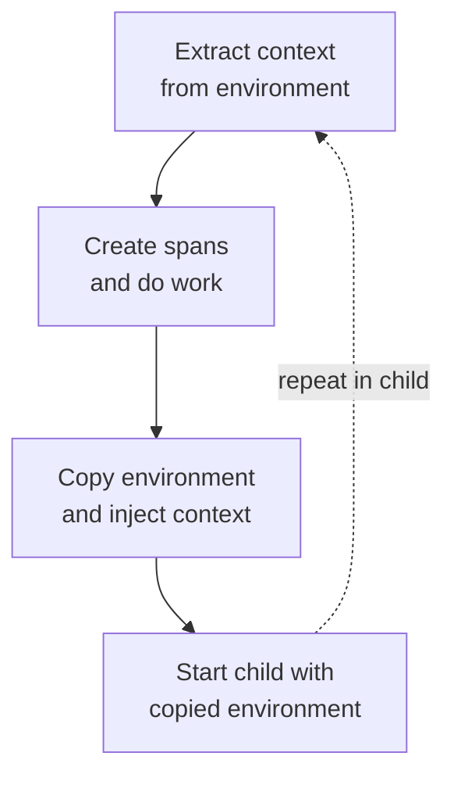
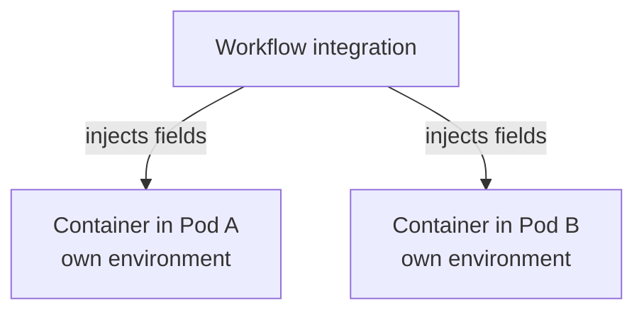

A trace does not always cross a network boundary. A workflow runner starts a
shell, the shell launches a build tool, and the build tool starts test
processes. Batch and data-processing systems create similar chains of child
processes. Without a shared way to pass trace information across these
boundaries, spans from each process can end up in separate traces.

If [context propagation][] is new to you, it is the mechanism that carries
information from one service or process to the next. For tracing, this includes
the trace and span identifiers that let new spans join the same trace. It can
also carry baggage: application-defined key-value pairs that are passed to
downstream work.

The OpenTelemetry specification now has a release candidate for using
[environment variables as context propagation carriers][env-carrier-spec]. It
standardizes how propagators can use environment variables to carry data such as
trace context and baggage between processes when protocol headers or message
metadata are not available.

Before we mark this specification Stable, we want feedback from language
implementers, tool authors, platform engineers, and users operating real CI/CD,
batch, and command-line workloads.

## What is an environment variable carrier?

A carrier is the place where propagation data is stored while it moves between
services or processes. HTTP headers are a familiar carrier. A process
environment can also be a carrier because environment variable names and values
are strings. The release candidate defines how the existing `TextMapPropagator`
model applies to environment variables.

For example, when using the W3C Trace Context and W3C Baggage propagators, the
propagation fields are represented by environment variables such as:

```text
TRACEPARENT=00-4bf92f3577b34da6a3ce929d0e0e4736-00f067aa0ba902b7-01
TRACESTATE=vendorname=opaquevalue
BAGGAGE=build.id=42,repository.name=example
```

The [OpenTelemetry Propagators API][propagators-api] calls writing these fields
to a carrier **injection** and reading them **extraction**. A propagator gets
the relevant value from the current `Context` object. For tracing, that value is
`SpanContext`; for baggage, it is `Baggage`. Extraction returns a new `Context`
containing the value read from the carrier.

The environment carrier does not interpret these values; it treats them as plain
strings. The configured propagator remains responsible for choosing field names
and validating and parsing values. This keeps the carrier usable with W3C
formats as well as formats such as B3.

Environment variable names have more restrictions than HTTP header names, so the
specification defines a normalization algorithm. It converts ASCII letters to
uppercase, replaces unsupported characters with underscores, and ensures that a
name does not start with a digit. For example:

```text
x-b3-traceid -> X_B3_TRACEID
```

The rules apply consistently when an implementation reads (`Get`), writes
(`Set`), or lists (`Keys`) environment variables, including on case-insensitive
platforms such as Windows.

## How propagation works between processes

The intended lifecycle follows the way process environments already work:

1. A child process receives environment variables when it starts.
2. During initialization, configured propagators extract values from that
   environment into a `Context`.
3. The application creates spans and performs work using that `Context`.
4. Before starting another child, the application copies the environment and
   injects propagation fields from its current `Context` into that copy.
5. The application starts the child with the modified environment, and the cycle
   repeats.



Applications should use a separate environment copy for each child. This is
especially important when several processes run concurrently and belong to
different spans. Treating propagation variables as startup input also avoids
relying on mutations to the parent process's global environment.

## Use cases and implementations

### OpenTelemetry language implementations

OpenTelemetry language implementations can provide helpers that let a configured
`TextMapPropagator` read from and write to a process environment. Depending on
the language, a helper might be a carrier type, a getter and setter, or another
language-appropriate API. It may live in an API, SDK, or contrib package.
Instrumentation can use these helpers to extract incoming values at process
startup and inject fields into a copied environment before starting a child.

These helpers do not start child processes. Application code or instrumentation
starts the child and passes the prepared environment to the relevant process
API. The configured propagator handles its propagation format, so integrations
do not need to parse W3C Trace Context, W3C Baggage, B3, or other supported
formats themselves.

### Command-line tools such as otel-cli

A command-line tool can apply the same pattern without requiring every shell
script to integrate with an OpenTelemetry API directly. With tracing configured,
for example by setting an OTLP endpoint, [otel-cli][] can create a span around a
command and inject that span's `TRACEPARENT` into the command's environment:

```console
otel-cli exec --service build --name compile -- make all
```

By default, when a valid incoming `TRACEPARENT` is present, `otel-cli` uses it
as the parent of the span it creates. If `make`, a process that it launches, or
another `otel-cli` invocation extracts the propagated `TRACEPARENT`, its spans
can remain in the same trace. This is a practical example of using environment
variables to continue a trace across command boundaries. OpenTelemetry language
implementations provide the same underlying building blocks for instrumented
applications and libraries.

### Shell scripts

[Thoth][] provides OpenTelemetry instrumentation for shell scripts as well as
GitHub Actions. For shell scripts, sourcing its `otel.sh` file initializes the
project's SDK and automatic instrumentation. It creates a root span for the
script, creates spans for supported commands, and continues instrumentation into
child shells and executable scripts that use a shebang. It can also inject W3C
`traceparent` headers through supported HTTP clients such as `curl` and `wget`.
Thoth propagates `TRACEPARENT` and `TRACESTATE` through child-process
environments.

### GitHub Actions

Environment propagation for GitHub Actions is not only hypothetical. Two
independent community projects illustrate different approaches:

- Thoth also provides workflow-level and job-level instrumentation. Its
  job-level instrumentation runs on the GitHub runner, injects instrumentation
  into shell, Node.js, Docker, and composite action steps, and uses
  `TRACEPARENT` and `TRACESTATE` to continue context into child processes.
- [Run with Telemetry][] wraps a particular command in a span and places the
  resulting `TRACEPARENT` in that command's environment. Its optional
  `job-as-parent` mode lets the generated command span join a trace representing
  the wider job.

### Jenkins

The [Jenkins OpenTelemetry plugin][] provides a concrete example in an
established CI system. It exposes the current `TRACEPARENT` and `TRACESTATE` in
the environment of shell, batch, and PowerShell steps. An OpenTelemetry-aware
build or test tool invoked by a step can use that context to connect its spans
to the Jenkins pipeline trace.

The plugin also has a configuration option for exporting selected `OTEL_*` SDK
configuration variables to downstream tools. These variables solve a different
problem: `TRACEPARENT` and `TRACESTATE` carry trace context, while variables
such as `OTEL_EXPORTER_OTLP_ENDPOINT` configure how the downstream process
handles telemetry.

### Argo Workflows

[Argo Workflows][] is another useful example. Argo models workflow steps as
containers running on Kubernetes. A workflow integration could inject the
propagation fields into each container's environment. Instrumented code or a
tool such as `otel-cli` could then extract those fields and continue the trace.



Each target container needs a separate injection because Kubernetes Pods do not
inherit one another's process environments. Inside a container, the same carrier
can pass propagation fields to any child processes it starts.

The mechanism also applies to batch schedulers, ETL systems, test runners, and
other environments where work is connected through process creation rather than
a request protocol.

## Security and limitations

Environment variables are accessible to all code running in a process. On some
systems they may also be visible to other processes or users with sufficient
permissions. Do not use propagation variables for secrets, and review baggage
before passing it across a trust boundary. Receiving processes must treat the
propagation fields as untrusted input and let the configured propagator validate
them.

An environment carrier only transports propagation fields. It does not create
spans, configure an SDK, replace propagation through network protocols, or
propagate automatically between containers or Kubernetes Pods.

## Please report problems now

The document is currently marked Release Candidate. Implementations are
available in several OpenTelemetry languages, and current coverage is recorded
in the [specification compliance matrix][]. Broader implementation work is
tracked in [SDK implementation tracker issue 4771][sdk-tracker].

**Feedback period:** We will wait until at least November 2, 2026, and until at
least 14 days have passed without a new related issue being reported before
stabilizing the specification. If significant findings require specification
updates, we will restart the 14-day feedback period when those updates are
available for review. This gives the community time to validate any substantial
changes before stabilization.

We now want to determine whether the requirements are sufficiently clear,
portable, secure, and implementable to mark the document Stable. In particular,
we would value feedback on these questions:

- Do the normalization rules work for your operating systems and runtimes?
- Can your language implementation expose extraction and injection in a
  language-appropriate way?
- Is the process-startup and child-environment guidance clear enough?
- Does the model work for CI/CD systems such as GitHub Actions and Argo
  Workflows, as well as batch and command-line tooling?
- Are any concurrency, security, or trust-boundary concerns missing?
- Does any requirement lead different implementations to incompatible behavior?

Please read the [environment variable carrier specification][env-carrier-spec]
and evaluate it against an implementation or a concrete use case. When you find
a problem, report it where it can be acted on:

- For unclear or incorrect requirements, portability problems, missing use
  cases, or specification-level security concerns, [open an issue in the
  OpenTelemetry Specification repository][new-spec-issue]. Add a comment to
  [stabilization issue #5040][stabilization-issue] linking the new issue.
- For behavior specific to one language implementation, open an issue in that
  implementation's repository and cross-reference [the implementation
  tracker][sdk-tracker].
- For behavior specific to a tool or workflow platform, open an issue in that
  project's repository. If it also reveals a gap in the specification, create a
  specification issue and connect the two.

A useful report includes the process or workflow being instrumented, operating
system and runtime, configured propagator, environment variable names, expected
and actual behavior, and a minimal example when possible. Please also call out
whether the problem involves concurrent children, name normalization, or a
security boundary.

React to the stabilization issue with a thumbs-up to help prioritize the work.
Add a comment when you find a blocker or can share concrete implementation or
production experience; comments containing only "+1" do not help us evaluate the
specification.

Your feedback now will help ensure that Stable means this mechanism works
consistently across language implementations, tools, and workflow platforms.

[Argo Workflows]: https://github.com/argoproj/argo-workflows
[context propagation]: /docs/concepts/context-propagation/
[env-carrier-spec]:
  https://github.com/open-telemetry/opentelemetry-specification/blob/eec6fadba46a5002f55ff88ce4405d58a1aa4aec/specification/context/env-carriers.md
[Jenkins OpenTelemetry plugin]:
  https://github.com/jenkinsci/opentelemetry-plugin/blob/6f67e4ab1d1513f7f513d7570907dd341094a74d/docs/job-traces.md#environment-variables-for-trace-context-propagation-and-integrations
[new-spec-issue]:
  https://github.com/open-telemetry/opentelemetry-specification/issues/new/choose
[otel-cli]: https://github.com/tobert/otel-cli
[propagators-api]:
  https://github.com/open-telemetry/opentelemetry-specification/blob/ce9394dc3dd53bb182611d2f3ba1e8f53975e905/specification/context/api-propagators.md#operations
[Run with Telemetry]:
  https://github.com/krzko/run-with-telemetry/blob/c2636c369317450dfd825ae4b67760d49600ca18/README.md#environment-variables-injection
[sdk-tracker]:
  https://github.com/open-telemetry/opentelemetry-specification/issues/4771
[specification compliance matrix]:
  https://github.com/open-telemetry/opentelemetry-specification/blob/eec6fadba46a5002f55ff88ce4405d58a1aa4aec/spec-compliance-matrix.md
[stabilization-issue]:
  https://github.com/open-telemetry/opentelemetry-specification/issues/5040
[Thoth]:
  https://github.com/plengauer/Thoth/blob/f1837aa22450dd691359f1dd05bcc6aec41162dd/README.md#automatic-instrumentation-of-shell-scrips
