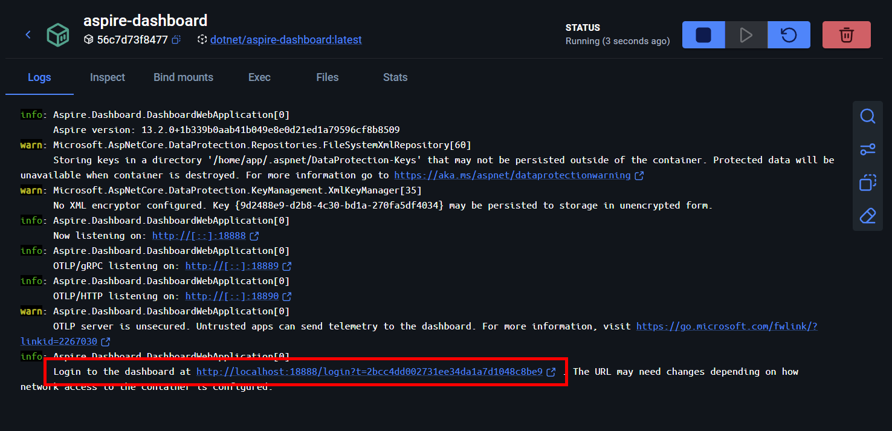
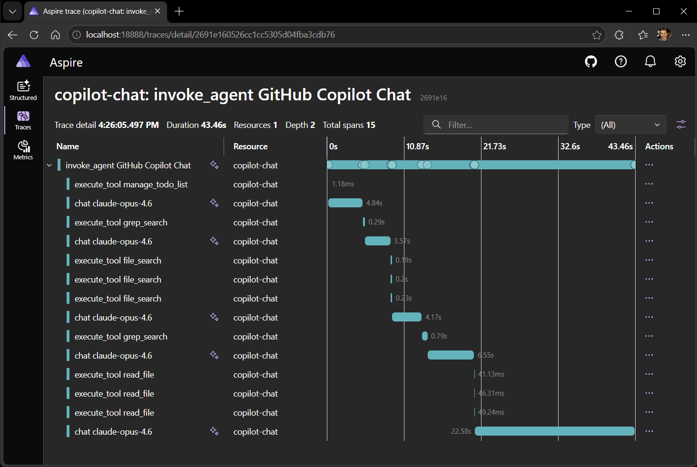
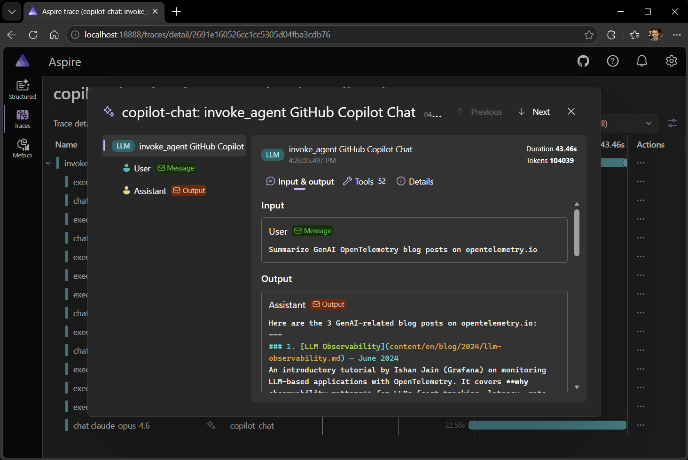

Your AI agent just took 45 seconds to answer a simple question. Was it the
model? A slow tool call? A retry loop? Every time an application calls an LLM, a
chain of model calls, tool invocations, and token exchanges happens behind the
scenes — and without observability, you are guessing.

The OpenTelemetry
[Semantic Conventions for Generative AI](/docs/specs/semconv/gen-ai/) give you
that visibility. They standardize how GenAI operations are recorded — the model
being called, input and output token counts, and when opted in, the full content
of prompts, completions, tool calls, and tool results.

This post walks through:

- Exporting GenAI telemetry from an LLM-powered app.
- Configuring the [Aspire Dashboard](https://aspire.dev/dashboard/overview/), an
  observability tool optimized for local development, to receive and display
  that telemetry.
- Exploring GenAI traces, metrics, and events in Aspire's GenAI visualizer.

## Exporting GenAI telemetry

For this walkthrough, we use VS Code Copilot to generate telemetry, since most
developers already have it installed. However, many coding assistants support
monitoring with OpenTelemetry:

- [VS Code Copilot](https://code.visualstudio.com/docs/copilot/guides/monitoring-agents)
  emits traces, metrics, and events for every agent interaction.
- [OpenAI Codex](https://developers.openai.com/codex/config-advanced#observability-and-telemetry)
  exports structured log events and OTel metrics for API requests, tool calls,
  and sessions.
- [Claude Code](https://code.claude.com/docs/en/monitoring-usage) exports
  metrics and log events via OTel, with trace support in beta.

Beyond monitoring the tools you already use, you can add OpenTelemetry to your
own GenAI-powered app to get insight into how it interacts with LLMs.

### Configure telemetry export

Telemetry export requires a few settings. For
[VS Code Copilot](https://code.visualstudio.com/docs/copilot/guides/monitoring-agents),
open Settings and search for `copilot otel`:

| Setting                                   | Description                          | Value                                                 |
| ----------------------------------------- | ------------------------------------ | ----------------------------------------------------- |
| `github.copilot.chat.otel.enabled`        | Enable OTel emission                 | `true`                                                |
| `github.copilot.chat.otel.captureContent` | Capture full prompt/response content | `true`                                                |
| `github.copilot.chat.otel.otlpEndpoint`   | OTLP collector endpoint              | `"http://localhost:4318"` (default, no change needed) |

By default, no prompt content or tool arguments are captured with GenAI
telemetry, as these can contain sensitive data. Only metadata like model names,
token counts, and durations are included. Enabling content capture populates
span attributes with full prompt messages, system prompts, tool schemas, tool
arguments, and tool results.

## Exploring GenAI telemetry with the Aspire Dashboard

Any OTLP-compatible backend can receive GenAI telemetry. For this walkthrough,
we use the [Aspire Dashboard](https://aspire.dev/dashboard/overview/) — a free,
open source telemetry viewer that ships as a
Docker container. It accepts OTLP data directly and provides a built-in trace
viewer, metrics explorer, and structured logs page — no cloud account required.
It is well suited for local development and debugging of GenAI workloads.

Run the following Docker command to get started:

```sh
docker run --rm -p 18888:18888 -p 4317:18889 -p 4318:18890 -d --name aspire-dashboard \
    mcr.microsoft.com/dotnet/aspire-dashboard:latest
```

The dashboard collects telemetry sent to `http://localhost:4318`, and
you can view telemetry by visiting `http://localhost:18888`.

A login token is required on first access. Retrieve it from the container logs.
To skip the login prompt during local development, add
`-e ASPIRE_DASHBOARD_UNSECURED_ALLOW_ANONYMOUS=true` to the `docker run`
command.



### Explore traces

GenAI operations from VS Code Copilot are now recorded and observable. Ask
Copilot a question in VS Code, then open the **Traces** page in the dashboard.
You will see entries for each LLM interaction.

Selecting a trace reveals the span tree: the top-level `invoke_agent` span with
child `chat` spans for each LLM call and `execute_tool` spans for each tool
invocation.



The span details show GenAI semantic convention attributes:

- **`gen_ai.request.model`** — the model used (for example, `gpt-4o`).
- **`gen_ai.usage.input_tokens`** and **`gen_ai.usage.output_tokens`** — token
  counts for each LLM call.
- **`gen_ai.response.finish_reasons`** — why the model stopped generating (for
  example, `stop` or `tool_calls`).

When an app is configured to record content, messages and tool calls are
captured as structured span attributes such as `gen_ai.system_instructions`,
`gen_ai.input.messages`, and `gen_ai.output.messages`. This content is valuable
for debugging, but these attributes can be large, and many observability
platforms render them as raw JSON, making them difficult to read.

Aspire's
[GenAI telemetry visualizer](https://aspire.dev/dashboard/explore/#genai-telemetry-visualization)
parses these attributes and renders a chat-style view of the conversation,
showing system prompts, user messages, assistant responses, and tool call
arguments and results. Launch the visualizer by selecting the sparkle icon next
to a GenAI span.



No more guessing about LLM usage or digging through raw JSON — every prompt,
response, and tool call is visible at a glance.

### Explore metrics

Navigate to the **Metrics** page and select the `copilot-chat` service. The
GenAI metrics are prefixed with `gen_ai`:

- **`gen_ai.client.operation.duration`** — histogram of LLM call latencies.
  Filter by `gen_ai.request.model` to compare models.
- **`gen_ai.client.token.usage`** — histogram of token consumption. Filter by
  `gen_ai.token.type` to separate `input` from `output` tokens.

These metrics let you estimate per-request cost, catch token-hungry prompts
before they hit production, detect latency regressions, and monitor usage
patterns across models and agents.

## Beyond this demo

The [Aspire Dashboard](https://aspire.dev/dashboard/overview/) is ideal for
local debugging, but the same OpenTelemetry data can be sent to any
OTLP-compatible backend. Because the telemetry follows the
[GenAI semantic conventions](/docs/specs/semconv/gen-ai/), it is interoperable
with instrumentation from other AI tools and frameworks. Whether you are
monitoring a Python application using the
[OpenTelemetry OpenAI instrumentation](https://github.com/open-telemetry/opentelemetry-python-contrib/tree/6733459e4ee6a1d7a46025a71da6887f83491223/instrumentation-genai/opentelemetry-instrumentation-openai-v2),
or a .NET application with
[Microsoft.Extensions.AI](https://learn.microsoft.com/dotnet/ai/microsoft-extensions-ai),
the same attributes and span structures appear in your observability backend.

## Get involved

The GenAI semantic conventions are in active development — your feedback on
real-world usage directly shapes what gets standardized next.

- Test GenAI instrumentation in your own applications and
  [report issues](https://github.com/open-telemetry/semantic-conventions/issues).
- Try the [Aspire Dashboard](https://aspire.dev/dashboard/overview/) for local
  OpenTelemetry debugging and [contribute to it](https://github.com/microsoft/aspire).
- Join the
  [GenAI Semantic Conventions and Instrumentation SIG](https://github.com/open-telemetry/community/blob/5125996b5d159ff9aaa906f9a25226a821dc7bed/projects/gen-ai.md)
  discussions.
