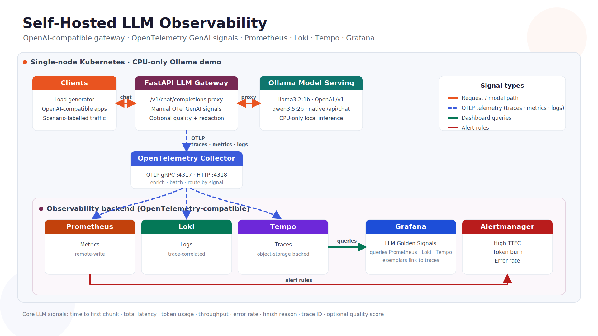

Most self-hosted LLM setups are monitored like any other service: CPU, memory,
pod status, HTTP status codes. Those tell you the _platform_ is alive. They tell
you almost nothing about whether the _model path_ is serving users well. A
gateway can return a clean `200` while the user waited 19 seconds for the first
token, the request burned 2,500 output tokens, or the response was truncated at
`length`.

The OpenTelemetry GenAI semantic conventions exist to close exactly this gap.
This post is a small, reproducible, CPU-only example of applying them to a
gateway in front of a local model, and an honest note on their current maturity.

## A note on maturity first

The `gen_ai.*` semantic conventions are still **Development** status.
OpenTelemetry itself graduated from the CNCF in May 2026 — the framework and
SDKs are stable — but this slice of conventions is not, and the attribute names
can still change. The right way to use them today is to opt in explicitly:

```bash
OTEL_SEMCONV_STABILITY_OPT_IN=gen_ai_latest_experimental
```

Don't ship dashboards that assume these names are frozen. Do start emitting
them, because the signals are too useful to skip.

## The example

A FastAPI gateway exposes an OpenAI-compatible `/v1/chat/completions` endpoint
and proxies to a local model served by Ollama. It's instrumented with the
OpenTelemetry Python SDK to emit GenAI spans, metrics, and trace-correlated
logs. The telemetry flows through the OpenTelemetry Collector into Prometheus
(metrics), Loki (logs), and Tempo (traces), with Grafana on top. Everything is
open source and runs on CPU — no GPU, no hosted API — so it's reproducible on a
laptop.



The instruments that carry the story:

| Instrument                                 | What it answers                       |
| ------------------------------------------ | ------------------------------------- |
| `gen_ai.client.operation.duration`         | How long did the operation take?      |
| `gen_ai.client.token.usage` (input/output) | What did it cost in tokens?           |
| `gen_ai.response.finish_reasons`           | Did it finish cleanly, or truncate?   |
| time to first chunk (per request)          | What wait did the user actually feel? |

A design choice worth copying: record every metric _inside_ the active request
span. With trace-based exemplars, a spike in a Grafana histogram links straight
to the Tempo trace that produced it, and the shared `trace_id` ties it to the
Loki log line for the same request. One click from "p95 is bad" to "this exact
request."

## Why time-to-first-token deserves its own signal

For streamed responses, total latency hides the number users feel most: the wait
before the first token appears. Measuring it means timing the first content
chunk out of the async stream, separately from the total duration. Instrumenting
a streaming handler this way — without breaking back-pressure — is the part most
worth getting right:

- start a timer when the request span opens;
- on the first non-empty chunk, record time-to-first-chunk and set it as a span
  attribute;
- keep recording inter-chunk timing for the rest of the stream;
- on completion, record duration, token usage, and finish reasons.

## What it makes visible

Driving the gateway with labelled load — normal, slow, expensive, error, and
low-quality scenarios — produces wildly different telemetry from an identical,
healthy platform:

| Scenario    | Avg latency | Avg TTFT | Tokens in/out |
| ----------- | ----------: | -------: | ------------: |
| normal      |       3.0 s |   0.16 s |       34 / 38 |
| expensive   |      42.9 s |   19.4 s |    320 / 2534 |
| low-quality |       0.6 s |   0.39 s |      222 / 30 |
| errors      |     0.002 s |        — |          none |

Infrastructure dashboards stayed green through all of it. The GenAI signals did
not — which is the entire reason to emit them. The same instrumented endpoint
also makes model selection measurable: run the same prompt against two models,
change only `gen_ai.request.model`, and compare duration, TTFT, and token usage
directly.

## Keep cardinality and content under control

Two practical cautions when adopting these conventions:

- **Cardinality.** Keep request-identifying or free-text values off metric
  attributes. Label metrics by low-cardinality dimensions (operation, model, a
  coarse scenario/route) and let traces carry the high-cardinality detail.
- **Content.** Capturing prompts and responses is opt-in for a reason. If you
  enable it, redact (emails, phone numbers, cards, secrets) _before_ export, and
  keep it off by default.

## Takeaway

The GenAI conventions turn an opaque model proxy into something you can operate:
you can see the wait users feel, the tokens you spend, when output breaks, and
which model is actually better for a workload — all correlated across metrics,
logs, and traces. They're still Development, so opt in deliberately and keep an
eye on the spec. But the signals are real today, and emitting them is the
difference between "the service is up" and "the model is doing its job."

Example code, dashboard, and alert rules:
[github.com/iamsharduld/ubuntu-con-india-codex](https://github.com/iamsharduld/ubuntu-con-india-codex).
