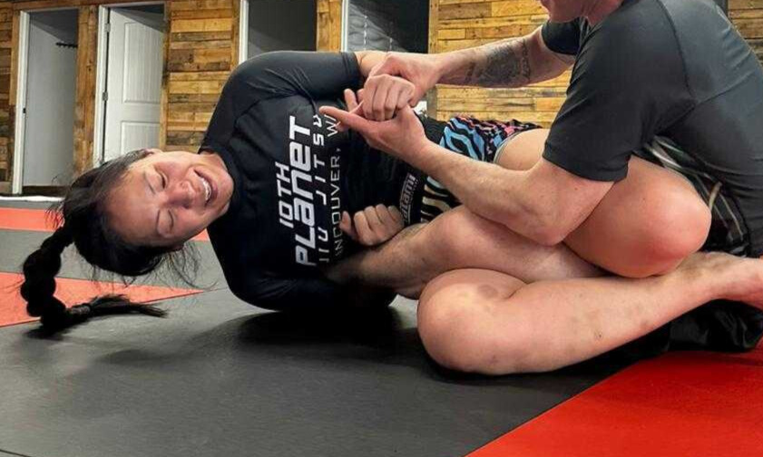
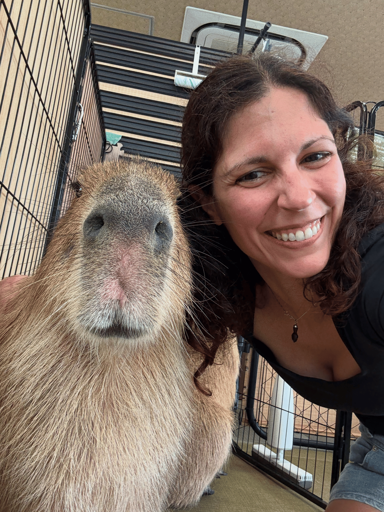
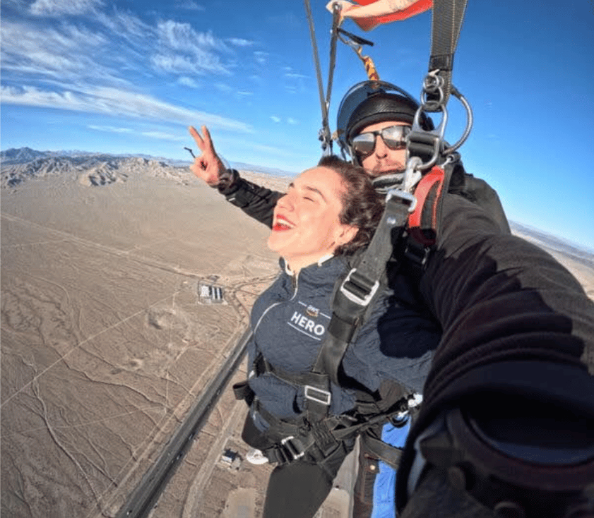

Hi, community! We are your [newly appointed Community Managers](https://opentelemetry.io/blog/2026/new-community-managers/). 
We’ve begun the initial transitional work behind the scenes, and we look 
forward to seeing more of you all in the very near future (KubeCon EU, 
anyone?). With great power comes great responsibility, and we want to hear 
from you as we look into expanding both the project and the community. 

In the meantime, we wanted to (re-)introduce ourselves, and invite you to 
connect with us! Feel free to find us over on CNCF’s Slack; for now, you can 
ping us directly in [#opentelemetry](https://cloud-native.slack.com/archives/CJFCJHG4Q) 
(we’re working on creating one single @ so you can easily reach all of us). 

## Reese Lee, Community Manager
Slack handle: @Reese Lee
[LinkedIn](https://www.linkedin.com/in/reese-lee/)

I remember thinking How cool! when Austin Parker was announced as the [first 
OTel Community Manager back in late 2022](https://opentelemetry.io/blog/2022/announcing-community-manager/); 
by that time, I had been involved in the project for almost a year, having 
joined New Relic’s OpenTelemetry engineering team in November 2021. I didn’t 
know everything this new role entailed, but something about it just immediately 
resonated with me.

Over the next few years, I helped develop and grow the then-fledgling End-User 
Working Group into the End-User SIG it is today. I somehow overcame my shyness 
(believe it or not, I used to be _very_ shy!) and fear of public speaking to 
deliver my very first talk ever at KubeCon EU 2022 (Valencia, Spain) about 
tail sampling with the collector. 

Since then, I’ve delivered many more sessions about OTel (a bunch of them with 
Adriana!) at various conferences, worked on the inaugural OTel Unplugged that 
took place during KubeCon NA 2022 (Detroit, Michigan) and the OTel Observatory 
at KubeCons, written blog posts, reviewed CFPs as a Program Committee member 
for multiple events, contributed to docs (my proudest to-date is still 
[this Venn diagram](https://opentelemetry.io/docs/concepts/sampling/) that I 
created and that was modified for the Sampling doc), interviewed contributors 
and end users, and more. 

I take being appointed to this role with a significant amount of reverence 
and honor (along with a humbling dash of disbelief), and my goal is to do this 
wonderful community and project proud. Oh, and outside of my professional life, 
I enjoy reading sci-fi, watching horror movies, and training jiu-jitsu.

## Adriana Villela, Community Manager
Slack handle: @Adriana Villela
[Socials](https://bio.site/adrianavillela)

If I were to tell my younger teenage self what I do for a living now, she 
would’ve definitely been shocked. I got an early start in computers. BASIC 
was my first language, and my first operating system was DOS. This was all 
thanks to my dad, who is a retired software architect and who has coded 
using punch cards (FORTRAN, I think), C++, SmallTalk, Java, Go, Kotlin, 
and, post-retirement, Rust. I, on the other hand, as an avid Star Trek fan, 
wanted to design spaceships and had planned to be an aerospace engineer. 
And yet, ironically, after a summer job writing code at the Canadian Space 
Agency, I decided that software was in my future. Spoiler: I graduated with 
an industrial engineering degree, which wasn't related to software, but still offered a number of software-related classes.

My path to cloud native was a long one – I was in tech for 20 years, working 
mostly in large enterprise, closed systems, before I found my way into 
OpenTelemetry, first, managing an Observability practices team, and then 
as a Developer Advocate. In my first advocacy job, my manager, Austin Parker, who 
recruited me to work alongside them and Ted Young at Lightstep back in 2022 
(talk about fangirling), encouraged me to contribute to OpenTelemetry. I 
started off with a few contributions to the OTel docs, and then in early 2023 
joined Reese as co-chair of the OTel End User Working Group, which was later 
converted to a SIG. Together, we built up the SIG into what it is today – a vibrant, 
thriving community in which End Users get to connect with each other and the 
rest of the OTel community. I think one of our proudest moments was when 
we started seeing an increase in regular contributors to the SIG. The work we 
were doing was making a difference!

Over the years, I’ve been lucky enough to speak at a number of cloud native 
events, including KubeCon (EU/NA/Japan), Observability Day (EU/NA), 
Platform Engineering Day (NA), a number of KCDs (Porto, Warsaw), Open 
Source Summit (EU, NA, Japan) and Cloud Native Days (Bergen, Austria) 
around the world. Many of them, with Reese as my amazing co-speaker and 
partner in crime.

So when Austin asked Reese and me if we’d be interested in being OTel community 
managers, saying that we embody OTel, well… I can’t even express how flattering 
it was. To see our work recognized by the community like that brings tears to my 
eyes. For real. I’ve been searching my whole career for a place to fit in, and the 
OTel community has been that for me. I have finally found my tech home. I am 
very much looking forward to continuing to work with Reese, my OTel ride-or-die, 
and with Julia, whom I’ve known for the last few years from the CNCF Ambassadors 
circuit. Cheers to amazing months ahead!

## Julia Furst Morgado, Associate Community Manager
Slack handle: @juliafmorgado
[Socials](http://bio.site/juliafmorgado)

In 2022, I transitioned into tech and I became deeply involved in open source 
right away, contributing to the Kubernetes documentation, the OpenTelemetry 
documentation, and the CNCF glossary. I have always loved trying new things 
and pushing myself out of my comfort zone, sometimes literally, like jumping out 
of airplanes. Over time, that work led me to [speak at KubeCon + CloudNativeCon Chicago](https://www.youtube.com/watch?v=rqtENN7iveQ)
about becoming a CNCF Ambassador.

As I grew in the ecosystem, many people in the OpenTelemetry project supported 
me. They reviewed my pull requests, answered my questions, and helped me find 
my footing. That support gave me confidence and reinforced that this is a 
community that invests in its people. Now, serving the community in this 
capacity feels like a natural evolution of that journey and an opportunity to 
give back in a meaningful way.

For me, open source is ultimately about people.  That is why I organize the 
[KCD New York](https://kcdnewyork.com/) and the [Cloud Native Meetup in New York](https://community.cncf.io/cloud-native-new-york-city/). 
Strong technical ecosystems are sustained by connection and trust, not just 
code. When people feel welcomed, they step forward and take ownership. 
Creating spaces where that happens is what fuels me.

That is also why stepping into this role alongside two other incredible 
women means so much to me. The three of us are different in many ways. 
We come from different cultures, different experiences, and different paths 
into tech. Those differences influence how we listen and how we think about 
the future of the project.

OpenTelemetry should serve everyone. From someone writing their first 
instrumentation to experts managing complex distributed systems at scale, 
the project must feel accessible and valuable at every level. Diversity helps us 
think about all of those people, not just one type of contributor or user.

I am truly grateful to be nominated and excited to step into this new chapter. 
This is both a responsibility and a privilege, and I am ready to continue 
building, learning, and giving back to this community!
