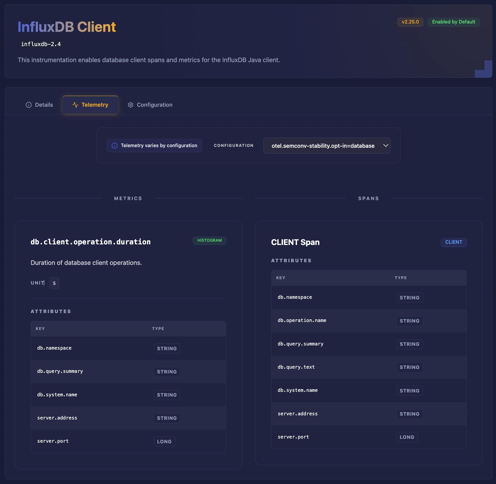

OpenTelemetry is vast. The Java agent alone includes over 240 different
auto-instrumentations. The Collector has hundreds of components. Python,
JavaScript, Go, and .NET each have their own ecosystems of instrumentation
libraries, each with its own patterns and conventions.

In our
[2025 Developer Experience Survey](/blog/2025/devex-survey/#key-takeaways),
users said that "documentation is difficult to navigate, requiring users to
switch between the OpenTelemetry website and GitHub repositories" and that they
often have to "piece together information from various sources." Only about half
of users rely on [opentelemetry.io](https://opentelemetry.io) as their primary
resource; the rest turn to GitHub, vendor documentation, or wherever they can
find answers.

And even when you find documentation, it might not answer the basic question:
what telemetry signals will I actually receive? The
[OpenTelemetry Getting Started Survey](/blog/2024/otel-get-started-survey/)
found that 65% of respondents wanted reference implementations showing what
instrumentations actually produce. As was noted in the
[OpenTelemetry 2025 Year in Review post](/blog/2026/2025-year-in-review/#ecosystem-explorer-unlocking-the-power-of-our-metadata),
the existing [OpenTelemetry Registry](/ecosystem/registry/) helps users discover
components, but it "doesn't always provide the depth of information needed" to
answer questions like: Which libraries are instrumented? What spans, metrics, or
attributes do they emit? How does that change across versions?

There's a catch-22 at the heart of OpenTelemetry adoption. To understand what
telemetry a component produces (what spans, metrics, or attributes) you often
have to deploy it first. That's a lot to ask of someone evaluating whether
OpenTelemetry fits their needs.

We’re building something to fix that. After working on a prototype for about a
year, the new site is now live at
[explorer.opentelemetry.io](https://explorer.opentelemetry.io/) \- but it is
very much still a work in progress.

## The Java agent ecosystem

The Java agent is our first fully mapped ecosystem. Over 240 instrumentations
are
[indexed and searchable](https://explorer.opentelemetry.io/java-agent/instrumentation/latest).
You can browse by name, filter by instrumentation type, and drill into detail
pages that show exactly what spans, metrics, and attributes each instrumentation
emits. Configuration options are documented and mapped to the telemetry they
affect.

Version support is built in. The Explorer tracks multiple Java agent releases,
so you can see what telemetry a specific version produces, or what changed
between versions. This is particularly useful when planning upgrades or
debugging why telemetry looks different after a release.

There is automation that runs nightly. When a new Java agent version releases,
the pipelines pick it up, extract the metadata, and update the registry. No
manual intervention required.

We've validated the initial approach with Java. Now we need help expanding to
new ecosystems.

## The frontier: Explorers needed

The Java agent is just one corner of the OpenTelemetry ecosystem. There's a vast
landscape of other components waiting to be mapped, and each language presents
its own interesting challenges.

### Expanding Java coverage

Even within Java, we're just getting started. The Java Agent's built-in
instrumentations are mapped, but there's more: extensions from the
[opentelemetry-java-contrib](https://github.com/open-telemetry/opentelemetry-java-contrib)
repository, third-party extensions from the community, and native
instrumentation built directly into libraries like
[Apache Camel](https://camel.apache.org/components/4.18.x/others/opentelemetry2.html).
Each layer adds coverage that developers need to discover.

### Collector components

The OpenTelemetry Collector has its own rich ecosystem of receivers, processors,
exporters, and connectors. We've already built most of the automation pipeline
to extract Collector component metadata. Now we need to build out the web
interface to make it all discoverable and searchable. This is close to ready and
[needs contributors](https://github.com/open-telemetry/opentelemetry-ecosystem-explorer/issues?q=sort%3Aupdated-desc%20is%3Aissue%20is%3Aopen%20label%3A%22Collector%20Ecosystem%22)
to help bring it across the finish line.

### Python instrumentation

The Python ecosystem works differently than Java. Instead of a single unified
agent, OpenTelemetry Python is composed of dozens of individual instrumentation
packages (Flask, Django, FastAPI, requests, etc.) distributed via PyPI. These
packages are
[versioned and released](https://github.com/open-telemetry/opentelemetry-js-contrib/releases)
independently, and while they follow shared OpenTelemetry conventions,
consistency in implementation and documentation of emitted telemetry can vary.

There’s still a lot to figure out here: How do we extract instrumentation
capabilities from these distributed packages? What metadata schema works for
both auto-instrumentation and explicit instrumentation? How do we track changes
across dozens of independent release cycles?

### JavaScript instrumentation

JavaScript follows a similar pattern to Python, with OpenTelemetry JS
maintaining a modular ecosystem of instrumentation packages covering Express,
Fastify, and the broader Node.js landscape. However, it also provides
aggregation layers (such as auto-instrumentation bundles) that make the
experience somewhat more cohesive than Python. The patterns we develop for
Python will likely inform how we approach JavaScript, but each ecosystem has its
own runtime model and quirks to understand.

### GenAI and LLM instrumentation

This is some of the fastest moving, but still uncharted territory. OpenTelemetry
is actively working on semantic conventions for generative AI, but the ecosystem
is changing fast. LangChain, LlamaIndex, OpenAI clients, Anthropic clients:
frameworks are racing to add observability, but there's no authoritative map of
what telemetry each actually emits.

What signals do popular LLM frameworks capture? How complete is semantic
convention adoption? What patterns are emerging for tracing RAG pipelines or
agent tool calls? These are open questions that
[contributors could help answer](https://github.com/open-telemetry/opentelemetry-ecosystem-explorer/issues/154).

### Defining the language

Beyond mapping specific ecosystems, there's foundational work in defining how we
describe components. What categories of functionality do instrumentations
provide? How do we distinguish between components that emit telemetry, those
that enrich telemetry from other sources, and those that handle context
propagation? This taxonomy work helps users understand what they're getting and
helps us build a consistent experience across ecosystems. Much of this thinking
has already been developed in the Java ecosystem, where a more unified
auto-instrumentation model has forced clearer definitions and boundaries. The
challenge now is to evaluate how those concepts translate to other ecosystems
and identify where they map cleanly, where they need to be adapted, and where
fundamentally different runtime models require us to rethink the approach
entirely.

## Many ways to contribute

You don't need to be an OpenTelemetry expert to help. The project needs
different skills, and there are entry points at various levels.

### Product designers and UX experts

The information associated with these components can go deep and be very dense.
We are looking for designers and UX experts who can help evaluate our approaches
and propose ways to present this overwhelming amount of information to users
(and agents).

### Research and documentation

Before we can build automation for a new ecosystem, someone needs to understand
it. What metadata is available? How is it structured? Where does it live? This
is exploration work: surveying repositories, reading source code, documenting
patterns. No code required, and it's a great way to learn OpenTelemetry
internals while contributing something valuable.

### Python automation

The data extraction pipelines are written in Python. Adding a new ecosystem
means writing a new watcher that understands how to pull metadata from that
ecosystem's repositories. If you're comfortable with Python and interested in
data pipelines, this is where building out new ecosystems starts.

### Web development

The explorer frontend is React with TypeScript and Tailwind CSS. There's plenty
of UI work: new pages for Collector components, improved search and filtering,
version comparison views, accessibility improvements, mobile responsiveness. If
you're a front-end developer, you can make a visible impact quickly.

## Join the expedition

Some contributors will go deep in one area. Others will help across multiple.
Both are valuable. The codebase is approachable, the maintainers are active, and
we're happy to help people get oriented. Big shout out to the community members
who have already contributed to the project in its early stages:

- [Pratik Jadhav (@pratik50)](https://github.com/pratik50)
- [Luca Cavenaghi (@lucacavenaghi97)](https://github.com/lucacavenaghi97)
- [Adam Silva @adaumsilva](https://github.com/adaumsilva)
- [Manohar Mallipudi (@Vjc5h3nt)](https://github.com/Vjc5h3nt)

The Ecosystem Explorer is live, the foundation is working, and there's
interesting work ahead. If any of these sound appealing, here's how to get
involved:

- **Explore the (work in progress) site**:
  [explorer.opentelemetry.io](https://explorer.opentelemetry.io/)
- **Browse the code**:
  [github.com/open-telemetry/opentelemetry-ecosystem-explorer](https://github.com/open-telemetry/opentelemetry-ecosystem-explorer)
- **Find (or submit) issues**: Look for
  "[good first issue](https://github.com/open-telemetry/opentelemetry-ecosystem-explorer/issues?q=sort%3Aupdated-desc%20is%3Aissue%20is%3Aopen%20label%3A%22good%20first%20issue%22)"
  or
  "[help wanted](https://github.com/open-telemetry/opentelemetry-ecosystem-explorer/issues?q=sort%3Aupdated-desc%20is%3Aissue%20is%3Aopen%20label%3A%22help%20wanted%22)"
  labels. There are quite a few!
- **Join the conversation**:
  [`#otel-ecosystem-explorer`](https://cloud-native.slack.com/archives/C09N6DDGSPQ)
  on CNCF Slack
- **Attend meetings**: Communications SIG, Tuesdays 9:00 AM PT (bi-weekly)

Come help us map the ecosystem!
