This report presents findings from the OpenTelemetry Japanese Community Survey,
conducted to understand the current landscape of OTel awareness, adoption, and
community engagement among developers and engineers in Japan. The survey
targeted practitioners across roles such as development, SRE, DevOps, and
Platform Engineering, distributed through CNCF community channels and Japanese
social platforms like X (formerly Twitter), [Qiita](https://qiita.com/), and
Zenn. The goal was to develop data-driven strategies that can meaningfully grow
OTel usage and engagement within Japan's tech ecosystem.

## Key takeaways

- When it comes to OTel adoption, this survey reached a mature audience with
  61.47% already running it in production and a further 25.69% under evaluation
  — together accounting for nearly 87% of respondents.
- Traces dominate signal collection at 93%, contrary to global OTel surveys,
  where metrics typically lead.
- The community is strongly satisfied, with an NPS of +49, though 27.37% remain
  passive — a conversion opportunity through better documentation and community
  engagement.
- Go teams show the strongest adoption commitment, jumping from 39% in
  evaluation to 76% in production — the largest increase of any language.
- 86% of respondents attend conferences, yet only 25% attended KubeCon Japan
  2025, signalling significant untapped reach for future editions.
- Twitter/X is the second most used information channel (83%), yet OpenTelemetry
  has no presence there nor in the popular local social platforms Zenn or Qiita.
  If we want to engage with the Japanese audience, we should consider addressing
  this.

## Demographics and background

The respondent pool skews heavily toward **development teams** (44.95%), with
SRE as the second-largest group (22.94%). DevOps, Platform Engineering, and
Sales Engineering make up the remaining mid-tier, while Operations and dedicated
Observability roles account for less than 7% combined. Geographically, the
survey is strongly concentrated in the **Kanto region** (76.15%) — which
includes Tokyo — with Kinki (Osaka/Kyoto area) at 12.84% being a distant second.
This is unsurprising given Tokyo's dominance in Japan's tech industry, but it's
worth acknowledging that the results may not fully represent the broader
Japanese developer population outside these urban centres.

On company size, the survey skews toward larger organisations: 44.04% come from
mid-large companies (100–999 employees) and 35.78% from enterprises with over
1,000 employees. Small companies (1–49) account for just 14.68%. This is
relevant because larger organisations tend to have more structured observability
practices and the resources to evaluate and adopt tools like OTel.

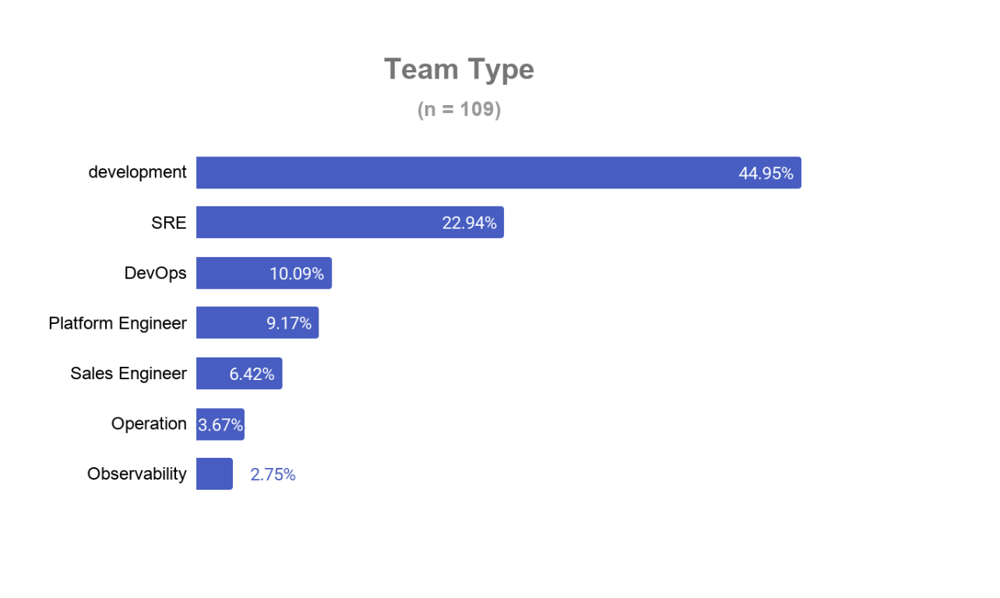 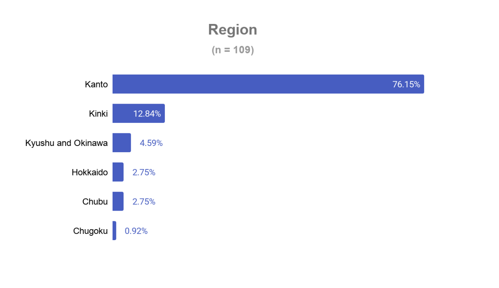 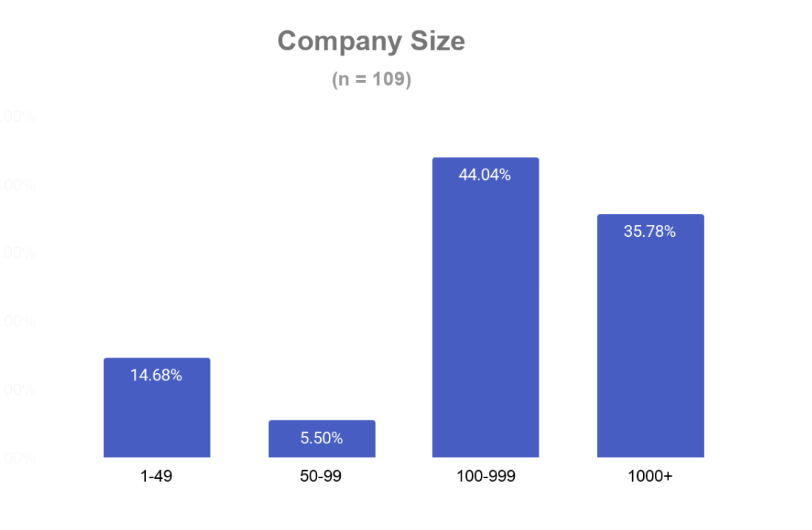
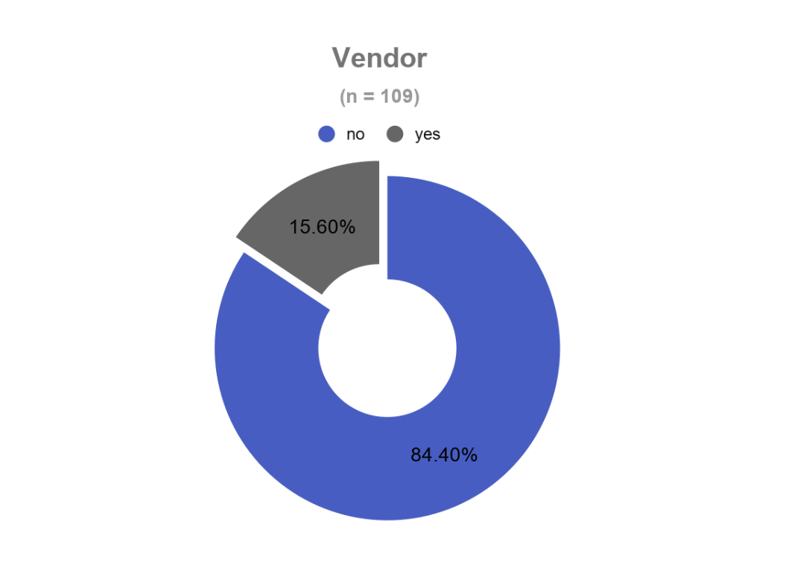

## OpenTelemetry adoption

### OTel adoption maturity

The adoption story is broadly positive. A strong majority (61.47%) are already
running OTel in production, while 25.69% are still in testing or evaluation.
Only 12.84% have heard of it but haven't used it. Together, the "in production"
and "under evaluation" cohorts account for nearly 87% of respondents, suggesting
this survey reached an already engaged audience, which is typical when
distributed through community channels.

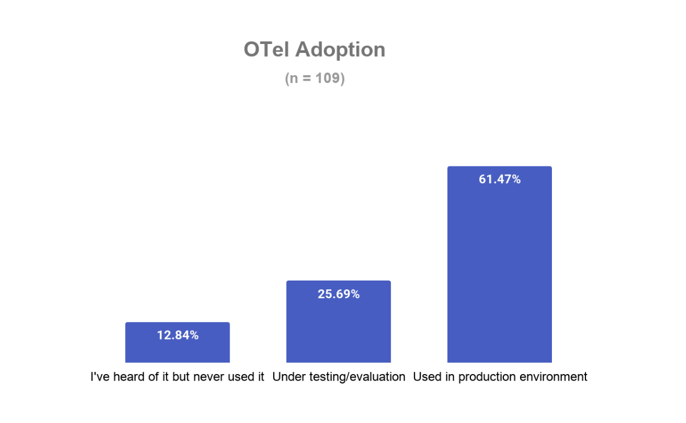

### Telemetry signals collected

**Traces** are the most widely collected signal at 93%, followed by Metrics
(71%), Logs (60%), and Profiles, trailing significantly at just 13%. This is
contrary to previous surveys within the OTel community, which have metrics
leading usage.

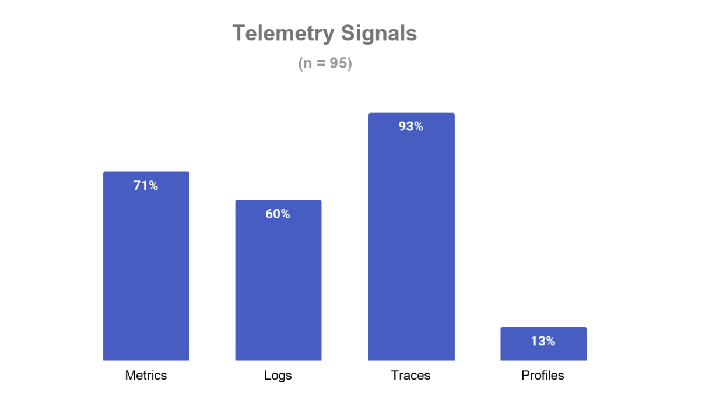

### Collector distribution

Among collector choices, the **Contrib Collector** is most popular at 59%,
reflecting demand for the broader plugin ecosystem it provides. Core Collector
and OCB (OpenTelemetry Collector Builder) are tied at 27% each. The OCB figure
is notable, revealing that 27% of users are building custom distributions,
suggesting a meaningful portion of the community has advanced, production-grade
needs. Notably, mid-large companies (100–999 employees) account for half of all
Contrib Collector users — a disproportionately high share compared to their
representation in Core (23%) and OCB (32%). This likely reflects the fact that
these organisations are complex enough to need Contrib's broad integration
library, but have not yet reached the scale or platform engineering capacity to
justify building and maintaining a fully custom OCB distribution.

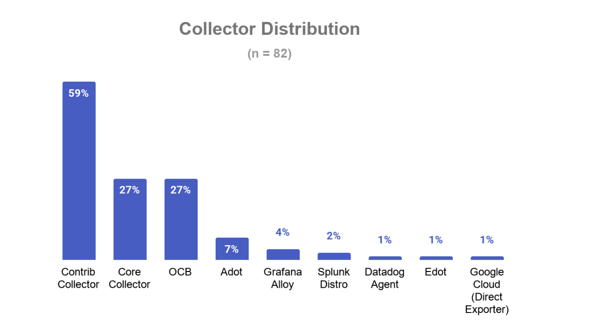
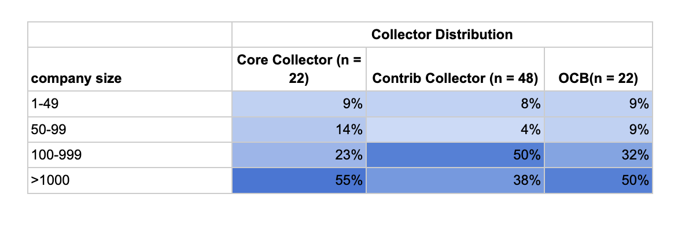

### Programming languages

Java leads at 61%, followed closely by Go (57%) and JavaScript/TypeScript (50%).
Python sits at 33%. Interestingly, the comparison of OTel adoption vs
programming languages shows that out of the 28 evaluating and 67 running OTel,
39% and 76% are using Go, respectively. On the other hand, 71% of Java are
evaluating OTel, and 69% are running it in production. This suggests that Go
teams are particularly committed once they adopt OTel.

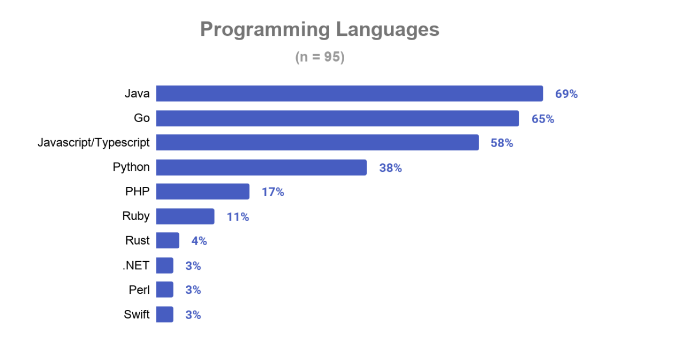 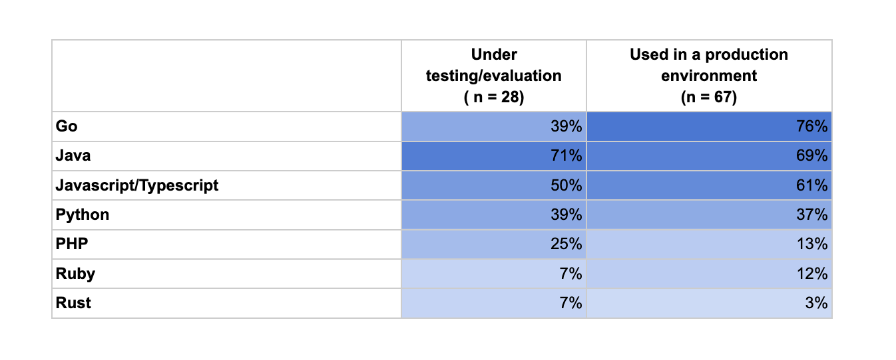

### Net Promoter Score (NPS)

The NPS of approximately +49 (61.05% promoters minus 11.58% detractors) is a
positive result for an open source project. Over 6 in 10 respondents are
enthusiastic advocates. That said, more than a quarter are passive, representing
an opportunity to convert them through better documentation, community events,
and success stories.

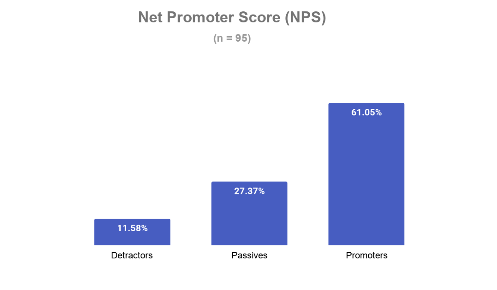

## IT community and events

### Event type preferences

A clear majority (64.22%) prefer **both in-person and virtual events**,
indicating that a hybrid approach would best serve the community. Pure in-person
preference sits at 22.02%, while virtual-only is 8.26%. Only 5.5% expressed no
preference for either format. This strongly supports running hybrid events
rather than choosing one mode exclusively.

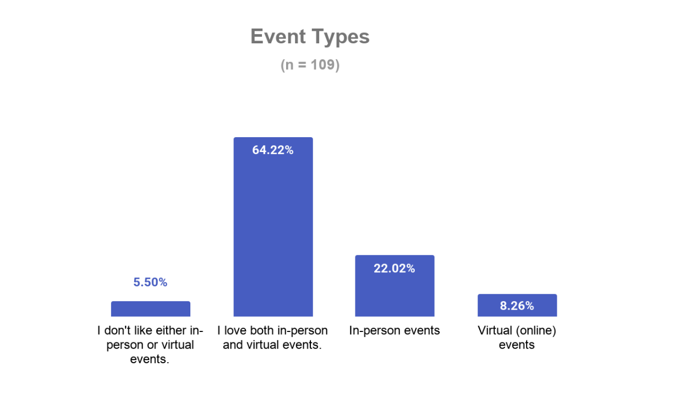

### Events attended

General IT **conferences** dominate attendance at 86%, which reflects Japan's
active conference culture. KubeCon + CloudNativeCon Japan 2025, hands-on
workshops, and technical deep dives each attracted 25% of respondents.
Networking events (17%) and beginner tutorials (9%) are lower. If 86% of
respondents attend conferences, and just about 25% attended the previous
(first-ever) KubeCon, that leaves room for lots of potential attendees for
future events, and this makes us ask a further question: **what proportion of
KubeCon absentees prefer virtual events?** As shown in the graph below, we found
no relationship between the event choice and missing KubeCon. **Therefore, we
suggest future KubeCon events to explore better ways to reach the Japanese
community.**

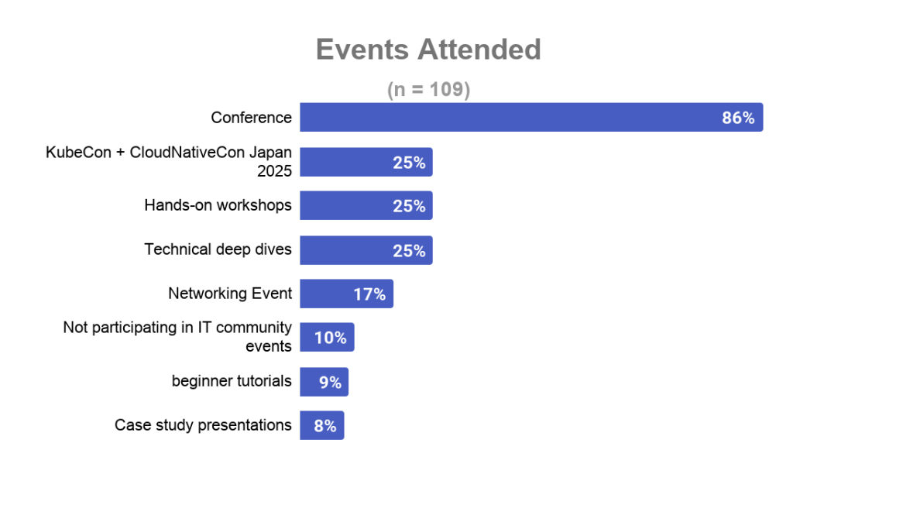 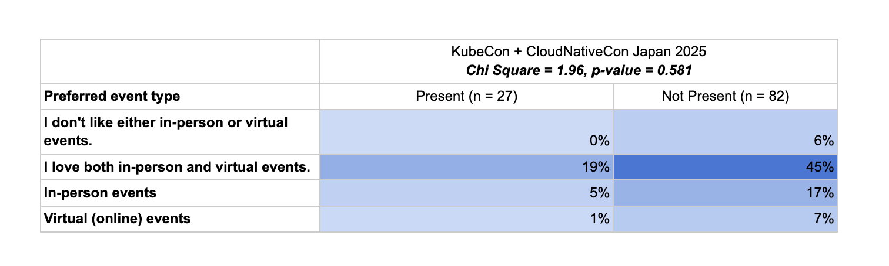

## Information sources

**Official documentation** (85%), **Twitter/X** (83%), **GitHub** (81%), and
**Blogs** (80%) are the four dominant information channels — all tightly
clustered. Japanese-specific platforms Zenn (62%) and Qiita (39%) are notably
significant, reflecting the importance of Japanese-language technical content.
YouTube (19%) and LinkedIn (9%) are the least-used channels in this community.
Given that OpenTelemetry does not currently have a Twitter/X account, this poses
the question to the Governance Committee: **Do we open a Twitter/X account to
reach Japanese or explore other local platforms?**

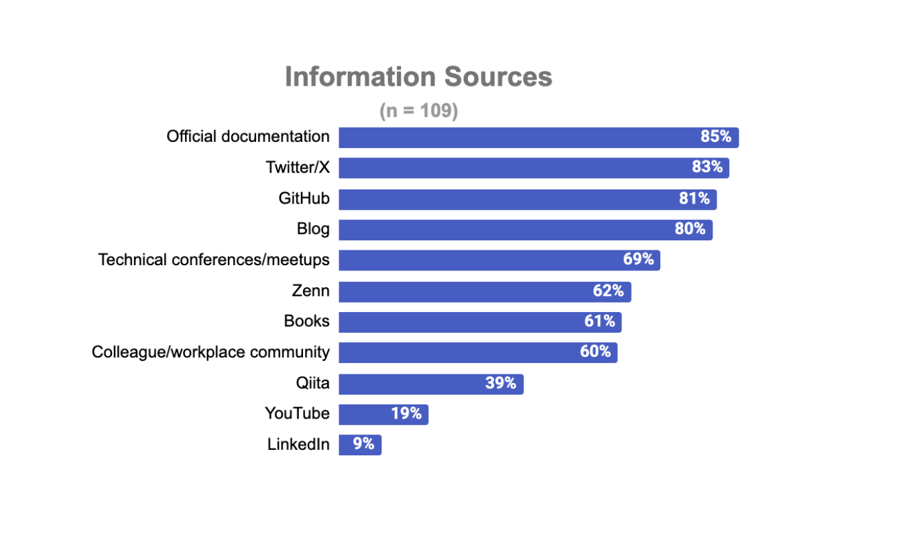

## Summary

The survey paints a picture of a community that is **mature and engaged**. Most
respondents already use OTel in production, broadly recommend it, and actively
participate in the tech community through conferences and online platforms. The
key opportunities lie in:

- Expanding reach beyond Kanto over time.
- Focusing on current events in the Kanto region.
- Nurturing the 25% still in evaluation.
- Growing Japanese-language documentation.
- Calling for social reach for the Japanese.
- Running hybrid events that serve both the in-person and virtual segments of
  the community.
