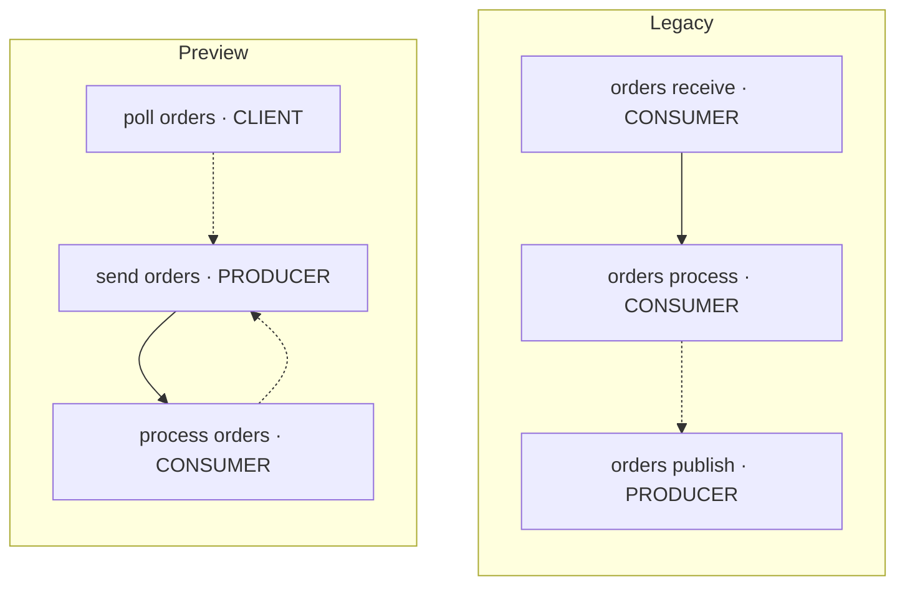

The **`2.32.0`** release of the [OpenTelemetry Java agent][java-agent] is now
out and serves as the release candidate for **3.0**, which is targeted for
**October 2026**. You can preview the new behavior now, before it becomes the
default.

Give it a try against your dashboards, alerts, and downstream pipelines, and
[let us know what breaks][issues]. Your feedback will help us catch migration
problems before 3.0 ships.

The preview is not a complete specification of the final 3.0 release; some
behavior may still change before release.

## What's changing

3.0 brings changes to telemetry, configuration, and instrumentation defaults.
Database and code conventions become stable defaults; messaging and RPC move to
newer conventions that are still experimental.

| Change area                      | What to check                                                          |
| -------------------------------- | ---------------------------------------------------------------------- |
| Attribute and metric conventions | Queries, grouping keys, value filters, and thresholds                  |
| Messaging traces                 | Span names, parent relationships, and receive/process metrics          |
| Database endpoint identity       | Service graphs and grouping by `server.address`                        |
| Capture settings and defaults    | Captured log fields, expected instrumentation, and application startup |

## Try the preview

Choose environment variables or [declarative configuration][decl-config] in the
examples below. The YAML snippets are fragments to merge into your existing
configuration file; keep your resource, exporter, and other settings.

### Step 1: Compare old and new telemetry

Start in a test deployment with the domains relevant to your application. With
the umbrella preview flag off, append `/dup` to emit old and new attributes and
metrics together:



{}

```text
OTEL_INSTRUMENTATION_COMMON_V3_PREVIEW=false
OTEL_SEMCONV_STABILITY_OPT_IN=database/dup,code/dup
OTEL_SEMCONV_STABILITY_PREVIEW=messaging/dup,rpc/dup,service.peer/dup
```

{} {}

```yaml
instrumentation/development:
  general:
    stability_opt_in_list: 'database/dup,code/dup'
  java:
    common:
      v3_preview: false
      semconv_stability:
        preview: [messaging/dup, rpc/dup, service.peer/dup]
```

{} 

For example, a JDBC span can carry both naming schemes:

| Legacy attribute                       | Preview attribute                       |
| -------------------------------------- | --------------------------------------- |
| `db.system: "postgresql"`              | `db.system.name: "postgresql"`          |
| `db.name: "orders"`                    | `db.namespace: "orders"`                |
| `db.statement: "SELECT * FROM orders"` | `db.query.text: "SELECT * FROM orders"` |

Use the new fields to update and validate your queries.

> **Dual emission does not preserve both trace shapes.** A span still has only
> one name and kind, and `/dup` uses the newer convention for those. Compare
> attributes and metrics with `/dup`, and inspect trace structure separately.

### Step 2: Test the new conventions alone

Remove `/dup` from the domain settings to test the new telemetry on its own:



{}

```text
OTEL_INSTRUMENTATION_COMMON_V3_PREVIEW=false
OTEL_SEMCONV_STABILITY_OPT_IN=database,code
OTEL_SEMCONV_STABILITY_PREVIEW=messaging,rpc,service.peer
```

{} {}

```yaml
instrumentation/development:
  general:
    stability_opt_in_list: 'database,code'
  java:
    common:
      v3_preview: false
      semconv_stability:
        preview: [messaging, rpc, service.peer]
```

{} 

Check values and units as well as names: a threshold expressed in milliseconds
needs conversion when its metric moves to seconds. Confirm that dashboards and
alerts work without the legacy fields.

### Step 3: Test configuration and instrumentation defaults

Next, test the broader changes with the umbrella flag:



{}

```text
OTEL_INSTRUMENTATION_COMMON_V3_PREVIEW=true
OTEL_SEMCONV_STABILITY_PREVIEW=rpc,service.peer
```

{} {}

```yaml
instrumentation/development:
  java:
    common:
      v3_preview: true
      semconv_stability:
        preview: [rpc, service.peer]
```

{} 

The umbrella enables the newer database, code, and messaging conventions and
**disables `/dup` for those domains**. RPC and `service.peer` require the
separate preview setting shown above; their opt-in tokens are ignored when the
umbrella is on.

Check application startup, captured fields, missing spans and metrics, and query
results.

## What to check

### Names, values, types, and units

The JDBC example above shows attribute renames, but a key rename alone will not
fix every query:

- **Values:** `db.system: "mssql"` becomes
  `db.system.name: "microsoft.sql_server"`.
- **Types:** gRPC's numeric `rpc.grpc.status_code: 0` becomes the string
  `rpc.response.status_code: "OK"`.
- **Units:** database connection-pool and RPC duration metrics move from
  milliseconds to seconds.
- **Consolidation:** `code.namespace` and `code.function` consolidate into
  `code.function.name`.

### Messaging trace structure

Messaging moves from semantic conventions [v1.24][messaging-1.24] to
[v1.43][messaging-1.43]. This affects both queries and the way a producer's work
connects to a consumer's work in a trace. For Kafka, the naming changes look
like this:

| Operation | Legacy span name | Preview span name |
| --------- | ---------------- | ----------------- |
| Send      | `orders publish` | `send orders`     |
| Receive   | `orders receive` | `poll orders`     |
| Process   | `orders process` | `process orders`  |

The operation now comes first, and its name reflects the client API. The old
`messaging.operation` attribute also splits into `messaging.operation.name` and
`messaging.operation.type`: for a Kafka poll, the name is `poll` and the type is
`receive`.

**Parent relationships change too.** The diagram shows a single Kafka message
with its producer context propagated, no ambient consumer span, and receive
spans enabled. Solid arrows run from parent to child; dashed arrows point from a
span to the context it links to.



The process span no longer takes the receive span as its parent. In this
example, it continues the producer's trace and also links to the message
creation context. When an ambient span exists, that span becomes the parent
instead; the link to the message creation context remains. An enabled receive
span represents the client operation separately and changes from `CONSUMER` to
`CLIENT`.

Receive spans remain opt-in. Receive metrics are recorded independently of that
span setting, so you do not need to enable poll spans to measure receive
operations. The metric names also change:

- `messaging.publish.duration` and `messaging.receive.duration` become
  `messaging.client.operation.duration`.
- `messaging.receive.messages` becomes `messaging.client.consumed.messages`.
- `messaging.client.sent.messages` and `messaging.process.duration` measure sent
  messages and processing time.

### Database endpoint identity

`server.address` describes the configured target, while `network.peer.address`
identifies the endpoint actually contacted, where available. For a cluster, the
configured target can be a list of endpoints instead of a single host. Review
service graphs and dashboards grouped by `server.address`: their grouping may
change even though the attribute name has not.

### Capture settings and instrumentation defaults

The preview can add or remove telemetry as well as rename it. Suppose your
application already attaches `order.id` and `customer.tier` as structured fields
to a log message, using SLF4J key-value pairs. After enabling the umbrella
preview, those fields can appear in exported logs without enabling capture
separately. MDC remains separately configured and opt-in.

To capture only `order.id` from those structured fields:



{}

```text
OTEL_INSTRUMENTATION_COMMON_LOGGING_STRUCTURED_ATTRIBUTES_INCLUDED=order.id
```

{} {}

```yaml
instrumentation/development:
  java:
    common:
      logging:
        structured_attributes:
          included: [order.id]
```

{} 

The common `.included` / `.excluded` selectors replace the old source-specific
structured-field capture settings, which are ignored in preview mode. Review the
emitted fields when migrating: the new selectors support glob patterns, so `*`
means "include everything." Copying `*` from a legacy literal-name list can
broaden capture.

Other default changes may be visible in your telemetry or at startup:

| What you may notice after enabling the preview | What to check                                                              |
| ---------------------------------------------- | -------------------------------------------------------------------------- |
| Additional structured log attributes           | Review the common `.included` / `.excluded` selectors                      |
| Missing Hibernate, Hystrix, or Twilio spans    | These instrumentations default to off; explicitly re-enable those you need |
| Startup fails when using the Zipkin exporter   | Zipkin exporter support is removed in preview mode; switch to OTLP         |

### For extension and distribution maintainers

Extension and distribution maintainers should also test the preview:
invokedynamic instrumentation becomes the default, changing how instrumentation
and helper classes are loaded.

## Using AI to help with the migration

The [OpenTelemetry Ecosystem Explorer][explorer] provides version-specific
instrumentation metadata that can help an AI agent identify changes to names,
types, and units. Pair it with your captured `/dup` telemetry to confirm value
changes, then ask the agent to draft updates to your dashboards and alerts.

<details>
<summary>Example prompt to adapt to your stack</summary>

```text
Help migrate my dashboards and alerts to the Java agent 3.0 preview.

Agent version, libraries, and preview settings: <details>
Queries and backend naming conventions: <files or examples>
Baseline and preview telemetry: <files or samples>

Use the OpenTelemetry Ecosystem Explorer (https://explorer.opentelemetry.io/)
metadata for my version and my telemetry. Check the emission conditions against
my settings; use upstream sources to verify mappings the metadata cannot prove.

Return a cited old-to-new mapping and draft query changes. Check names, types,
values, and units; flag trace-shape or capture changes separately. Mark missing
or conflicting evidence VERIFY, including unavailable version metadata. Do not
assume missing metadata means no change. Preserve query intent and flag any
backend naming assumptions. Do not apply changes.
```

</details>

Review the proposed changes against real data before applying them.

## Tell us what you find

[Open an issue][issues] with your agent version, configuration, affected library
versions, and a small example of the unexpected behavior. Testing now gives us
time to address problems before 3.0 becomes the default.

[java-agent]:
  https://github.com/open-telemetry/opentelemetry-java-instrumentation
[issues]:
  https://github.com/open-telemetry/opentelemetry-java-instrumentation/issues
[decl-config]: /docs/zero-code/java/agent/declarative-configuration/
[explorer]: https://explorer.opentelemetry.io/
[messaging-1.24]:
  https://github.com/open-telemetry/semantic-conventions/blob/v1.24.0/docs/messaging/messaging-spans.md
[messaging-1.43]:
  https://github.com/open-telemetry/semantic-conventions/blob/v1.43.0/docs/messaging/messaging-spans.md
