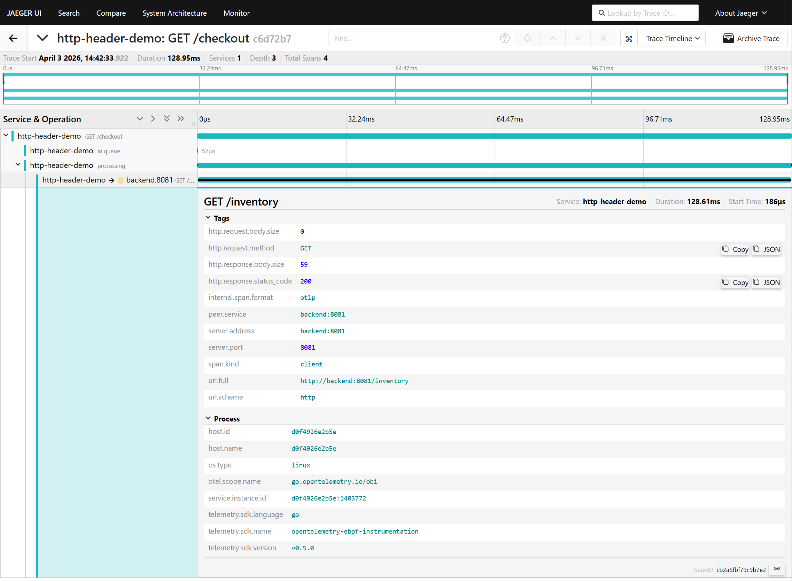

When incidents are active, traces usually tell you that something is wrong. The
harder problem is figuring out who is affected and why, quickly.

[OpenTelemetry eBPF Instrumentation (OBI)](https://github.com/open-telemetry/opentelemetry-ebpf-instrumentation)
[v0.7.0](https://github.com/open-telemetry/opentelemetry-ebpf-instrumentation/releases/tag/v0.7.0)
adds HTTP header enrichment so spans can carry request context like tenant or
user segment. That context is often exactly what helps you move from "error rate
is up" to "this is isolated to one customer cohort".

The best part: this is a config change on OBI itself. You do not need to rebuild
or redeploy your existing applications.

## Why this matters in practice

Most teams have felt this pain: traces show latency and failures, but not enough
request context to narrow scope during triage. Header enrichment closes that gap
without requiring app code changes.

For this demo, we include:

- `x-tenant-id`
- `x-user-segment`

And we intentionally obfuscate:

- `authorization`

That gives responders useful debugging context while still masking sensitive
values.

## The config change

This is the core policy used in the demo:

```yaml
ebpf:
  # Needed so headers are captured for enrichment.
  track_request_headers: true
  payload_extraction:
    http:
      enrichment:
        enabled: true
        policy:
          # Only emit headers that rules explicitly match.
          default_action: exclude
          # Replacement value for obfuscated headers.
          obfuscation_string: '***'
        rules:
          - action: include
            type: headers
            scope: all
            match:
              patterns: ['x-tenant-id', 'x-user-segment']
              case_sensitive: false
          - action: obfuscate
            type: headers
            scope: all
            match:
              patterns: ['authorization']
              case_sensitive: false
```

Two small details are worth calling out: `scope: all` applies rules to both
request and response headers, and `case_sensitive: false` avoids missing headers
because of casing differences.

Turning this feature on or off is a simple OBI config update and OBI redeploy.
No application rebuild required.

## Visual walkthrough

Baseline trace (before enrichment): no header attributes in the span.



After enabling enrichment in OBI v0.7.0: the span now includes request header
context.


Note, now `authorization` is present but masked, while `x-tenant-id` and
`x-user-segment` stay visible.


Traces can now be filtered by enriched attributes (for example
`http.request.header.x-tenant-id`) to focus on the impacted cohort.


## Takeaway

OBI
[v0.7.0](https://github.com/open-telemetry/opentelemetry-ebpf-instrumentation/releases/tag/v0.7.0)
header enrichment is a practical debugging feature: it improves incident
response signal, keeps policy explicit, and can be rolled out (or rolled back)
by changing OBI configuration only.

Already running OBI? Upgrade to v0.7.0 and give
[header enrichment](/docs/zero-code/obi/configure/metrics-traces-attributes/#http-header-enrichment-for-spans)
a try.

New to OBI? Start with the
[demo used in this post](https://github.com/open-telemetry/opentelemetry-ebpf-instrumentation/tree/b1f159092a3743464e53e78b16f0c4d817c47e02/examples/http-header-enrichment-demo)
to see an end-to-end example of how it works. Then be sure to check out how to
[start using OBI](/docs/zero-code/obi/setup/) for your application.

Have you already tried header enrichment? Let us know how it went. Find us on
the
[`#otel-ebpf-instrumentation` CNCF Slack channel](https://cloud-native.slack.com/archives/C06DQ7S2YEP),
or
[open a discussion](https://github.com/open-telemetry/opentelemetry-ebpf-instrumentation/discussions)
if you have feedback that could help shape future releases.
