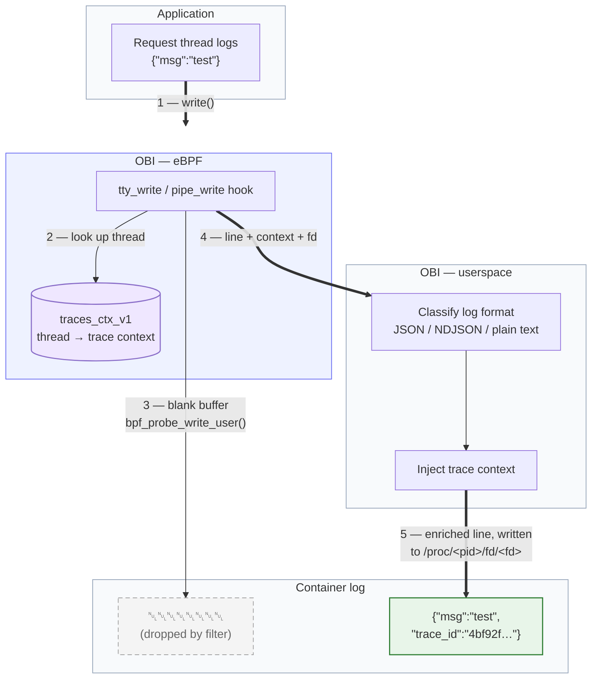
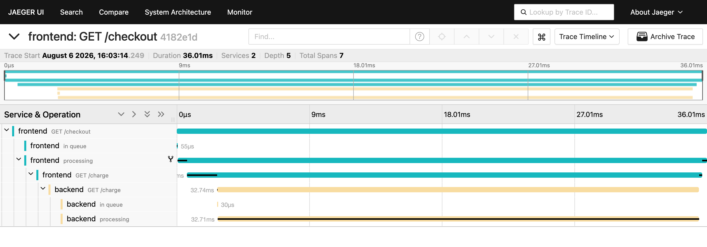
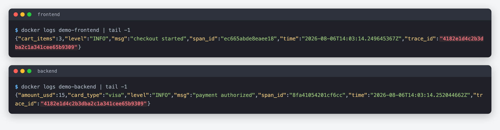

You get paged. A trace shows a request failing in one of your services, and you
know the answer is in the logs — but which log lines belong to _that_ request?
If the service never adopted structured logging with trace context, the honest
answer is: you grep by timestamp and hope.

Injecting trace context into logs traditionally means touching every service:
adding an SDK, configuring the logger to emit `trace_id` and `span_id`, and
redeploying. [OpenTelemetry eBPF Instrumentation (OBI)](https://github.com/open-telemetry/opentelemetry-ebpf-instrumentation)
now does this from the kernel instead. It intercepts your application's log
writes as they happen, looks up the trace context of the thread doing the
writing, and re-emits the log line with `trace_id` and `span_id` injected — no
code changes, no redeploys, no logging library requirements.

This post explains how it works, because the "how" is the interesting part:
correlating a `write()` syscall with a distributed trace touches goroutine
scheduling, event-loop internals, and thread pools — and eBPF lets us follow
all of them.

## What you get

Your application writes this:

```json
{ "level": "INFO", "message": "payment authorized", "amount": 42 }
```

The container log ends up with this:

```json
{
  "level": "INFO",
  "message": "payment authorized",
  "amount": 42,
  "trace_id": "4bf92f3577b34da6a3ce929d0e0e4736",
  "span_id": "00f067aa0ba902b7"
}
```

The IDs are the same ones OBI reports on the spans for that request, so your
backend can link both signals directly. It works for JSON logs, NDJSON, and
plain text — free-form lines get a `key=value` annotation:

```text
payment authorized trace_id=4bf92f3577b34da6a3ce929d0e0e4736 span_id=00f067aa0ba902b7
```

If your logger already emits one of the configured fields, OBI preserves it and
only fills in what's missing.

## How it works

### A shared map of "what is this thread doing right now"

OBI already watches every service's network traffic, so at any moment it knows
which trace and span a thread is serving. The log enricher builds on a small,
pinned BPF map called `traces_ctx_v1` that captures exactly that:

- **Key**: the kernel thread ID (`pid_tgid`)
- **Value**: 16 bytes of trace ID + 8 bytes of span ID

When OBI's tracers see an HTTP request or a client call start on a thread, they
write the active context into the map; when the request finishes, they delete
it. The map is pinned to the BPF filesystem under a
[documented name and layout](https://github.com/open-telemetry/opentelemetry-ebpf-instrumentation/blob/6a9df076223faff5bb94ea75f15a8e24c7a1ca0d/devdocs/trace-profile-correlation.md#data-model),
so other components can read the same context.

### Intercepting the write

The enricher attaches kprobes to the kernel functions where container log
output actually flows — `tty_write` for containers attached to a
pseudo-terminal and `pipe_write` for the default case, where the container
runtime reads stdout through a pipe — with two helper probes to recover the
file descriptor for `write()` and `writev()` calls. When a tracked process writes a log line, the BPF program:

1. Looks up `traces_ctx_v1` for the calling thread.
2. Copies the log line (up to 8 KiB, including multi-segment `writev()`
   payloads) into a ring buffer event together with the trace context.
3. Overwrites the original user-space buffer with NUL bytes, so the container
   runtime captures a blank placeholder line instead of the un-enriched
   duplicate.

In user space, OBI parses the line — JSON, NDJSON, or plain text — injects the
missing fields, and appends the enriched line to the same pty or pipe the
application was writing to. From the container runtime's point of view, the
application simply logged a line with trace context in it. Writes are fanned
out to parallel workers sharded by output file, so ordering is preserved per
log stream. The placeholder lines are trivially dropped in your log shipper
with a single filter.

The whole flow, end to end:



### The hard part: the thread is not the request

Keying trace context by thread ID works only if the thread that read the
request is the thread that writes the log. Modern runtimes break that
assumption constantly:

- **Go** multiplexes goroutines across OS threads; a handler can migrate
  mid-request.
- **Node.js** interleaves many in-flight requests on one event-loop thread.
- **Java** servers accept a request on one thread and process it on a pool
  worker.
- **Ruby (Puma)** has a reactor thread that reads requests for busy workers.
- **Python (asyncio)** can switch tasks at any `await`.

OBI keeps `traces_ctx_v1` accurate by hooking the exact point in each runtime
where "which request is this thread serving" changes:

| Runtime | Refresh point |
| ------- | ------------- |
| Go | `runtime.casgstatus` — fires on every goroutine status transition, so the map follows the goroutine to whichever thread it lands on |
| Node.js | An `async_hooks` before-callback hook signals BPF, which re-resolves the trace from the request's socket before every JS callback runs |
| Java | A lightweight agent intercepts `Executor`/`Runnable`/`ForkJoinTask` handoffs and tells BPF the parent-child thread relationship |
| Ruby | A probe on Puma's work-queue pop propagates the reactor thread's context to the worker picking up the request |
| Python | Probes on asyncio's task-step machinery re-bind the context on every task switch, including `asyncio.create_task` children and `asyncio.to_thread` workers |

The Go case is a good example of the approach. When a goroutine transitions to
_running_, a uprobe on the runtime's status-change function checks whether that
goroutine has an in-flight server request, client call, or database operation,
and refreshes the map entry for the OS thread it just landed on. When the
handler returns, the entry is deleted. This way a log write resolves to the
right span even after the goroutine has migrated to a different OS thread.

## Turning it on

The enricher is opt-in per service. Select services under
`ebpf.log_enricher` (or `extensions.obi.correlation.log_trace_annotation` in
version 2 of the configuration).

For a service that logs JSON, selecting it is all it takes — OBI enriches
every JSON object it writes:

```yaml
ebpf:
  log_enricher:
    services:
      - service:
          - k8s_deployment_name: payments-*
```

For a service that logs plain text, the `plain_text` block controls where the
`key=value` annotation is placed and which lines of a multi-line write get it:

```yaml
ebpf:
  log_enricher:
    services:
      - service:
          - k8s_deployment_name: legacy-billing-*
    plain_text:
      enabled: true
      placement: suffix
      multiline: first_line
```

The injected field names default to `trace_id` and `span_id` and are
configurable via `field_names`, so the output matches whatever your log
pipeline already expects. If OBI detects that a service exports OTel traces on its own,
it injects only `trace_id`: the span IDs OBI generates would not match the
SDK's, and a wrong span link is worse than none.

## Seeing it work

To show the full picture we ran a small two-service demo: an uninstrumented Go
`frontend` that calls an uninstrumented Go `backend`, each logging one JSON
line per request with `log/slog`, plus OBI and Jaeger — four containers total.
No OpenTelemetry SDK anywhere in the application code.

A single `curl` to the frontend produces one distributed trace in Jaeger —
OBI also propagates the trace context between the two services, so the
frontend and backend spans join under one trace:



And this is what the container logs look like. Both services logged plain
`slog` JSON with no trace fields; OBI injected matching context — the same
`trace_id` in both services, each with its own `span_id`:



Searching Jaeger for the `trace_id` from either log line lands on exactly the
trace shown above — correlation works in both directions, log to trace and
trace to log.

## Limitations and future work

- **Logs must be written synchronously from the request thread** — buffered or
  background logging breaks the link. Go, Node.js, Java, and Ruby do this by
  default; Python needs `PYTHONUNBUFFERED=1`, .NET a synchronous console
  writer.
- **[Java virtual threads are not enriched yet.](https://github.com/open-telemetry/opentelemetry-ebpf-instrumentation/issues/2284)**
  The carrier thread ID doesn't identify the request, and a wrong attribution
  is worse than a missing one. Platform-thread enrichment is unaffected.
- **Writes are capped at 8 KiB** per `write()`/`writev()` call; larger writes
  pass through un-enriched.
- **It needs `CAP_SYS_ADMIN`** and a kernel that is not in lockdown mode,
  because rewriting the user-space buffer uses `bpf_probe_write_user`.

## Try it

Trace-log correlation ships in OBI today. Point it at one service, add
the placeholder filter to your collector, and your existing logs — with no
code changes and no redeploy — start carrying the trace IDs you needed during
the last incident.

- [OBI documentation](/docs/zero-code/obi/)
- [OBI repository](https://github.com/open-telemetry/opentelemetry-ebpf-instrumentation)
- Questions or feedback: the
  [#otel-ebpf-instrumentation](https://cloud-native.slack.com/archives/C06DQ7S2YEP)
  channel on the CNCF Slack
