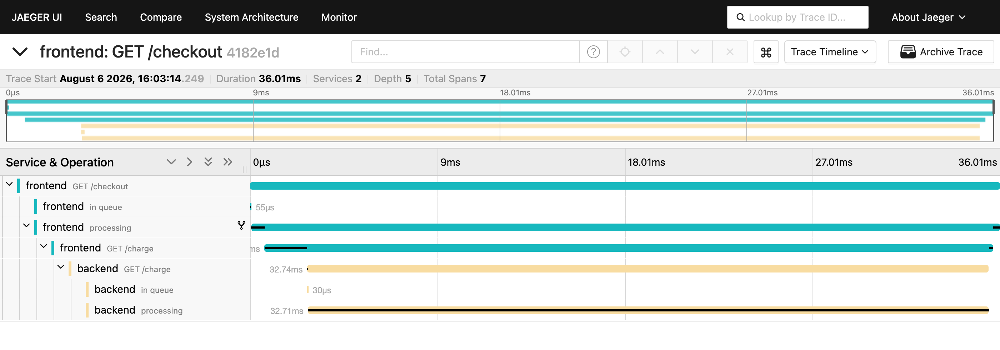
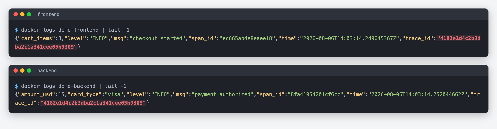

You get paged. A trace shows a request failing in one of your services, and you
know the answer is in the logs — but which log lines belong to _that_ request?
If the service never adopted structured logging with trace context, the honest
answer is: you grep by timestamp and hope.

[OpenTelemetry eBPF Instrumentation (OBI)](https://github.com/open-telemetry/opentelemetry-ebpf-instrumentation)
can now add that missing trace context to the logs your services already write.
Your applications don't change: no SDK, no logging-library configuration, no
application rebuild or redeploy.

The boundaries up front: it applies to logs written to stdout or stderr — the
streams your container runtime captures — and a line is annotated when OBI has
active trace context for the request being served at the moment of the write.
What you roll out is an OBI configuration change and a one-line filter in your
log pipeline.

Under the hood, OBI already knows — through eBPF — which request each thread is
serving at the moment it writes a log line; that's the entire trick. The
correlation fields are added before the container logging pipeline receives the
line. The rest of this post covers what changes in practice, what the feature
requires from your environment, and how to enable it.

## What changes during an incident

Your application writes this:

```json
{ "level": "INFO", "message": "payment authorized", "amount": 42 }
```

The container log ends up with this:

```json
{
  "level": "INFO",
  "message": "payment authorized",
  "amount": 42,
  "trace_id": "4bf92f3577b34da6a3ce929d0e0e4736",
  "span_id": "00f067aa0ba902b7"
}
```

The IDs are the same ones OBI reports on the spans for that request, so
correlation works in both directions: paste the `trace_id` from a failed trace
into your log search and get exactly the log lines for that request, or copy the
`trace_id` from a suspicious log line into your trace backend and land on the
trace it belongs to.

It works for JSON logs, NDJSON, and plain text — free-form lines get a
`key=value` annotation:

```text
payment authorized trace_id=4bf92f3577b34da6a3ce929d0e0e4736 span_id=00f067aa0ba902b7
```

If your logger already emits one of the configured fields, OBI preserves it and
only fills in what's missing.

Here it is end to end, on a small demo: an uninstrumented Go `frontend` that
calls an uninstrumented Go `backend`, each logging one JSON line per request,
plus OBI and Jaeger — four containers total. No OpenTelemetry SDK anywhere in
the application code.

A single request to the frontend produces one distributed trace in Jaeger — OBI
also propagates the trace context between the two services, so the frontend and
backend spans join under one trace:



Both services logged plain JSON with no trace fields; OBI injected matching
context — the same `trace_id` in both services, each with its own `span_id`:



Searching Jaeger for the `trace_id` from either log line lands on exactly the
trace shown above.

## Is this a fit for your environment?

Check these before you plan a rollout:

- **Log destination.** Enrichment covers logs written to stdout or stderr and
  captured by the container runtime. Logs written directly to files or shipped
  over the network by an in-process appender are not covered.
- **Active trace context.** A line is enriched only when it is written while OBI
  is tracing a request on that service — an HTTP or gRPC request, a client call,
  or a database operation in flight. Startup messages and background-job logs
  pass through unchanged.
- **Kernel and privileges.** OBI's log enricher needs `CAP_SYS_ADMIN` and a
  kernel that is not in lockdown mode. Enriching the common `write()` path
  requires Linux 6.0 or later; on older kernels only `writev()`-based writes are
  enriched, so coverage depends on how your runtime's logger writes.
- **Synchronous logging.** The link between a log line and a request relies on
  the write happening from the thread serving the request. Go, Java, and Ruby
  loggers do this by default. Node.js stdout is asynchronous when backed by a
  pipe — the default in containers — so under write backpressure occasional
  lines can miss or carry stale context. Python needs `PYTHONUNBUFFERED=1`; .NET
  needs a synchronous console writer.
  [Java virtual threads are not enriched yet](https://github.com/open-telemetry/opentelemetry-ebpf-instrumentation/issues/2284);
  platform-thread workloads are unaffected.
- **Services instrumented with an OTel SDK.** Enrichment works there too, and is
  useful when the SDK exports traces but not logs: OBI injects only `trace_id`,
  because the span IDs OBI generates would not match the SDK's — and a wrong
  span link is worse than none. You can still find the transaction in the logs
  by trace ID.

## Enable it

The enricher is opt-in. With version 2 configuration, enable it under
`extensions.obi.correlation.log_trace_annotation`. Its `match` list takes the
same match clauses as `capture` rules and selects which captured workloads get
annotated. It must select at least one workload, and a workload outside your
`capture` selection is never annotated:

```yaml
extensions:
  obi:
    version: '2.0'
    capture:
      policy:
        default_action: exclude
      rules:
        - action: include
          match:
            process:
              exe_path_glob:
                - /frontend
                - /backend
    correlation:
      log_trace_annotation:
        enabled: true
        match:
          - process:
              exe_path_glob:
                - /frontend
                - /backend
        plain_text:
          enabled: true
          placement: suffix
          multiline: first_line
```

The `plain_text` block controls where the `key=value` annotation is placed on
non-JSON logs and which lines of a multi-line write get it. The injected field
names default to `trace_id` and `span_id` and are configurable via
`field_names`, so the output matches whatever your log pipeline already expects.

With version 1 configuration, the same selection lives under
`ebpf.log_enricher.services` — see the
[trace-log correlation documentation](/docs/zero-code/obi/trace-log-correlation/)
for the details.

One pipeline change is required: for each enriched line, the original
un-enriched line is replaced by a blank placeholder (NUL bytes) in the container
log, and the enriched line is appended in its place. Add a filter to your log
shipper that drops the blank placeholder lines — a single rule that matches
all-NUL records.

## Before enabling it in production

Behavior to account for in your rollout plan:

- **Large writes are split.** A single `write()` or `writev()` larger than 8 KiB
  is not enriched intact: the captured prefix is re-emitted with trace context
  while the remainder reaches the log stream separately, without enrichment —
  one logical record can become two. If your services routinely emit very large
  log lines, measure before enabling.
- **Roll out incrementally.** Start with one low-risk service in `match` and
  check two things in your log backend: the blank placeholder lines are being
  dropped by your filter, and log lines appear once — not duplicated, not split.
  Then add more services to `match`. Services left out of `match` are still
  traced; only their logs are left unchanged. Rolling back is removing a service
  from `match`, or setting `enabled: false` to turn annotation off for every
  service; the application is untouched in either direction.

## Try it

Trace-log correlation ships in OBI. Point it at one service, add the placeholder
filter to your log shipper, and your existing logs — with no application rebuild
or redeploy — start carrying the trace IDs you needed during the last incident.

- Run the demo from this post yourself:
  [docker compose example](https://gist.github.com/mmat11/f3f23707e7bc9c94bce144f56276251d)
- [OBI documentation](/docs/zero-code/obi/)
- [OBI repository](https://github.com/open-telemetry/opentelemetry-ebpf-instrumentation)
- Curious how it works under the hood? The eBPF internals live in the
  [developer documentation](https://github.com/open-telemetry/opentelemetry-ebpf-instrumentation/blob/6a9df076223faff5bb94ea75f15a8e24c7a1ca0d/devdocs/trace-log-correlation.md)
- Questions or feedback: the
  [#otel-ebpf-instrumentation](https://cloud-native.slack.com/archives/C06DQ7S2YEP)
  channel on the CNCF Slack
