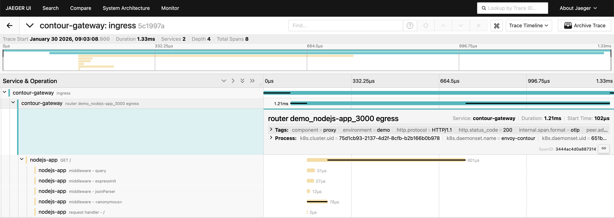
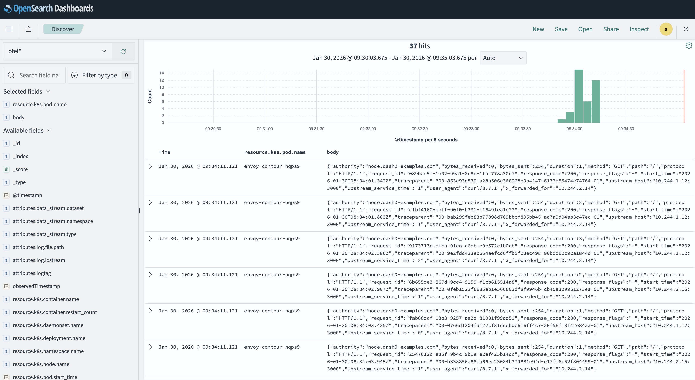
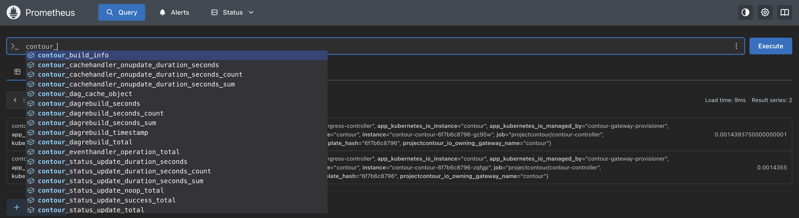
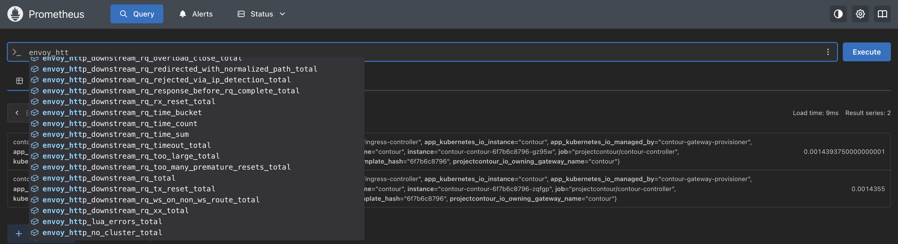
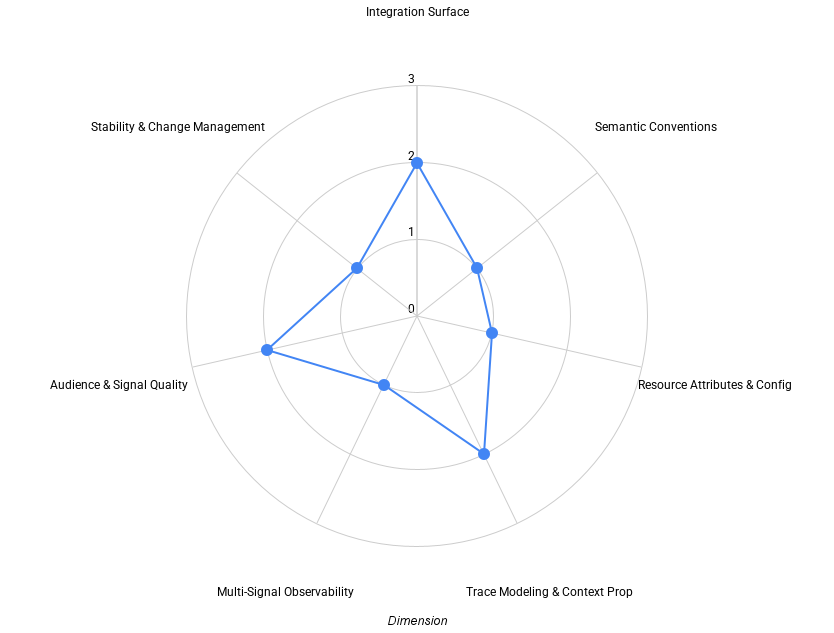
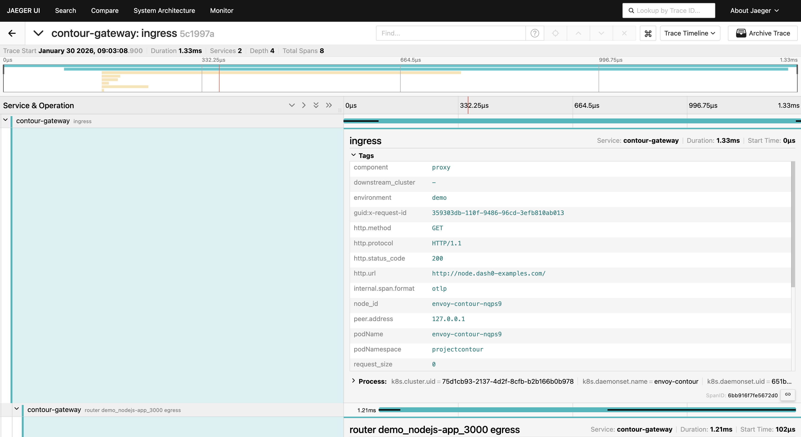

[Contour](https://projectcontour.io/) is a CNCF-graduated ingress controller
built on Envoy and widely used in Kubernetes environments. As OpenTelemetry
adoption has matured across the cloud native ecosystem, ingress controllers are
increasingly expected not just to emit telemetry, but to integrate cleanly into
OpenTelemetry-based observability pipelines with predictable behavior across
traces, logs, and metrics.

Ingress controllers sit at a critical boundary in Kubernetes architectures. They
are the first hop for incoming traffic, they enforce routing and policy
decisions, and they often represent the earliest observable point for
understanding user-perceived latency and failure modes. This makes them a
natural focus for evaluating how well OpenTelemetry works in practice at the
infrastructure edge.

Recent developments in the Kubernetes ecosystem further underline the importance
of understanding ingress controller behavior and maturity. With the
[announcement](https://kubernetes.io/blog/2026/01/29/ingress-nginx-statement/)
that ingress-nginx is being retired from the Kubernetes project, many users are
reassessing their ingress choices and evaluating alternatives such as Contour,
Gateway API–based implementations, and other Envoy-powered data planes. In that
context, observability \- and specifically how well ingress controllers
integrate with OpenTelemetry \- becomes an important input when making long-term
platform decisions.

This post examines Contour’s OpenTelemetry support using a multi-dimensional
maturity framework. Rather than treating OpenTelemetry support as a binary
feature, the goal is to understand how Contour’s telemetry behaves in practice:
where it integrates natively, where it relies on downstream processing, and how
well the resulting signals support real operational workflows.

## How we evaluate OpenTelemetry support

OpenTelemetry support rarely evolves uniformly across all signals. Tracing,
logging, and metrics are often shaped by different historical decisions,
upstream dependencies, and user expectations, particularly in infrastructure
projects built on Envoy.

To make these differences easier to reason about, this evaluation uses a draft
maturity framework that looks at OpenTelemetry support across a set of
independent dimensions:

- **Integration Surface** – how users connect the project to observability
  pipelines
- **Semantic Conventions** – how consistently telemetry meaning aligns with
  OpenTelemetry conventions
- **Resource Attributes & Configuration** – how identity and configuration
  behave across environments
- **Trace Modeling & Context Propagation** – how traces are structured and how
  context flows
- **Multi-Signal Observability** – how traces, metrics, and logs work together
  in practice
- **Audience & Signal Quality** – who the telemetry is designed for and how
  usable it is by default
- **Stability & Change Management** – how telemetry evolves once users depend on
  it

Each dimension is evaluated independently. Projects often land at different
maturity levels across different dimensions, and that is expected. The value of
the framework lies in making trade-offs visible and discussable rather than
collapsing everything into a single score.

The framework itself is still evolving and is being discussed openly in the
[OpenTelemetry community](https://github.com/open-telemetry/community/issues/3247).
This post should be read as an application of the framework, not as a definitive
or final judgment of Contour’s observability design.

## Evaluation environment

[The evaluation environment](https://github.com/dash0hq/dash0-examples/tree/main/contour)
is intentionally simple and designed to reflect a common local development
workflow. Contour runs in a local kind cluster and is configured using the
Gateway API. An OpenTelemetry Collector receives telemetry from Envoy and acts
as the central alignment point for traces, logs, and metrics.

Request traffic is generated from the local machine to exercise ingress
behavior. A small backend service runs inside the cluster to verify that trace
context created or propagated by Contour is preserved as requests flow
downstream. This makes it possible to observe both ingress-level behavior and
downstream trace continuity without introducing unnecessary complexity.

For observability backends, the evaluation uses an open source observability
stack consisting of _Jaeger_ for tracing, _Prometheus_ for metrics, and
_OpenSearch_ for logs. This setup mirrors a common OpenTelemetry deployment
pattern, where the Collector normalizes and routes signals to different backends
depending on signal type.

The purpose of this environment is not to simulate production load, but to
observe how Contour’s telemetry behaves once enabled and how signals align when
processed through an OpenTelemetry pipeline.

## Tracing at the ingress

Tracing is the strongest aspect of Contour’s OpenTelemetry integration. Envoy
spans are exported via OTLP using Envoy’s ExtensionService, making OpenTelemetry
the primary export path for tracing rather than a secondary or optional
integration.

Trace context propagation follows the W3C Trace Context specification. When an
incoming `traceparent` header is present, Contour participates correctly in the
existing trace by creating a new span and propagating updated context
downstream. When no upstream context exists, Contour starts a new trace at the
ingress boundary.This ensures that every request entering the cluster has a
well-defined trace root and that downstream services receive consistent trace
context aligned with the spans generated at the gateway.

Span structure reflects Envoy’s execution model and focuses on synchronous
request handling. Parent–child relationships between ingress spans and backend
spans are preserved, making it straightforward to reason about how requests flow
through the gateway and into downstream services.

While customization of span naming and hierarchy is limited, the resulting
traces are predictable and consistent. Users familiar with Envoy-based proxies
can interpret Contour traces without needing project-specific knowledge, which
is an important property for shared infrastructure components.

## Access logs and trace correlation

Contour emits structured access logs as JSON to stdout. These logs include HTTP
request and response details such as method, path, status code, timing, and
upstream information, and they are designed to be consumed by log aggregation
systems rather than read directly from files.

Trace context is embedded in the access logs, enabling correlation with tracing
data. However, this correlation is not automatic at the source. Instead, it
depends on the OpenTelemetry Collector to ingest the logs, apply a custom
parsing pattern, extract trace and span identifiers, and enrich the resulting
log records.

This makes the Collector a critical component in the observability pipeline.
Without Collector-side processing, logs and traces would remain parallel but
disconnected signals. With it, operators can move naturally from a trace to the
corresponding ingress logs to understand routing decisions, response codes, or
upstream behavior.

This approach works well in practice, but it also highlights where
responsibility lies. Signal alignment is achieved at the pipeline level rather
than being fully modeled by Contour itself.

## Metrics: Prometheus-native by design

Metrics follow a traditional model. Contour and Envoy expose metrics exclusively
in Prometheus format, covering request counts, response codes, latency
histograms, upstream health, and controller-level behavior.

Metrics are scraped by the OpenTelemetry Collector using the Prometheus
receiver. From there, they can be enriched with Kubernetes metadata and queried
using PromQL.

There is no OTLP export path for metrics today. As a result, metrics remain
Prometheus-native and are collected, labeled, and queried differently from
traces and logs. This split does not prevent effective observability, but it
does reinforce that Contour does not yet offer a unified, OTLP-first
multi-signal model.

## Summary view: Contour OpenTelemetry maturity

Before diving into each dimension in detail, it’s useful to step back and
consider how Contour’s OpenTelemetry support shapes up across the framework as a
whole.

Each dimension is evaluated independently on a 0–3 scale, where higher values
indicate deeper and more intentional OpenTelemetry integration. The purpose of
this evaluation isn’t to produce a single aggregate score, but to highlight
where the experience is already strong and where users are more likely to
encounter friction when operating Contour as a shared ingress layer.

In Contour’s case, the overall shape reflects a project with strong,
OpenTelemetry-native tracing, high-quality access logs that can be correlated
with traces once processed through an OpenTelemetry Collector, and a more
traditional, Prometheus-first approach to metrics. Resource identity and
semantic alignment are largely achieved through downstream enrichment rather
than explicit modeling at the source.

## Dimension-by-dimension analysis

The sections that follow walk through each dimension in turn, grounding this
high-level view in concrete observations from the evaluation environment.

### Integration surface

From an integration perspective, Contour presents a mixed model.

Tracing integrates cleanly with OpenTelemetry using OTLP as the primary export
path from Envoy. Logs and metrics, however, are not emitted over OTLP. Instead,
they follow separate ingestion paths and rely on the OpenTelemetry Collector to
scrape, parse, and normalize them before alignment with traces. See the
[Multi-signal observability](#multi-signal-observability) section for a more
in-depth analysis.

In practice, this makes the Collector the central integration surface. It is
responsible for parsing access logs, extracting trace context, scraping metrics,
and enriching all signals with shared context. OpenTelemetry integration works
well, but the integration surface extends beyond the ingress itself and into
pipeline configuration.

### Semantic conventions

Contour’s telemetry largely reflects Envoy’s existing conventions. HTTP
attributes are present and useful, but many rely on deprecated OpenTelemetry
semantic conventions rather than the latest stable recommendations, like
`http.status_code` instead of `http.response.status_code.`

This is a common characteristic of Envoy-based projects and reflects upstream
constraints rather than project-specific design decisions. Telemetry meaning is
generally clear to experienced users, but full alignment with current semantic
conventions would improve interoperability with generic dashboards, queries, and
tooling.

This is also visible in the Jaeger trace view from the evaluation, where
deprecated HTTP attributes are still present.

### Resource attributes & configuration

Contour exposes a stable `service.name` for tracing and behaves predictably
across namespaces and environments. The default value can be overridden through
Contour’s tracing configuration, allowing operators to control how ingress spans
are identified in downstream observability systems.

Beyond this, however, resource identity at the source remains minimal. Standard
service-level attributes such as `service.namespace` and `service.version` are
not set. While OpenTelemetry guidance suggests aligning `service.instance.id`
with `k8s.pod.uid`, this relationship is not explicitly modeled or documented at
the source. As a result, naming and identity are not fully consistent across
signals without downstream normalization.

Kubernetes resource attributes such as `k8s.pod.uid`, workload identifiers, node
attributes, and cluster identifiers are largely absent from emitted telemetry.
Instead, OpenTelemetry Collector processors are expected to infer and enrich
this context based on deployment topology and pipeline configuration. This makes
enrichment behavior sensitive to Collector placement and configuration rather
than being intrinsic to the telemetry itself.

Runtime customization of resource identity is also limited. Standard
OpenTelemetry mechanisms such as `OTEL_RESOURCE_ATTRIBUTES` are not consistently
honored, and supported resource detectors are not described as part of an
explicit observability contract.

In practice, stable and expressive resource identity is achieved through
downstream enrichment rather than source-level modeling. While this approach is
workable, it shifts additional responsibility onto adopters to design, operate,
and maintain enrichment pipelines in order to achieve consistent identity across
signals.

### Trace modeling & context propagation

Trace modeling in Contour is deliberate and focused on the ingress layer’s core
responsibility: handling synchronous HTTP request flows. Traces clearly
represent the lifecycle of a request as it enters the cluster, with predictable
span boundaries and stable parent–child relationships that reflect Envoy’s
execution model.

Context propagation follows open standards and behaves reliably across ingress
and downstream services. Incoming trace context is preserved when present, and
new traces are started correctly at the ingress boundary when no upstream
context exists. This ensures that requests are always observable from the point
they enter the system, which is particularly important for shared gateways that
sit in front of many independent workloads.

More advanced propagation scenarios or domain-specific trace semantics \- such
as alternative context formats or custom span hierarchies \- are not addressed
by default. However, this is largely a function of Envoy’s default behavior
rather than a hard limitation. Envoy’s extensibility model leaves room for such
capabilities to be introduced where needed, either through configuration or
custom extensions.

Overall, the resulting trace model prioritizes clarity, correctness, and
predictability over expressiveness. For a shared ingress layer, this is an
appropriate trade-off.

### Multi-signal observability {#multi-signal-observability}

Contour emits traces, logs, and metrics, but they are not designed as a unified
system at the source.

Correlation between traces and logs is achieved through Collector-side
processing, particularly through custom log parsing and enrichment. Metrics
remain Prometheus-native and are aligned with other signals primarily through
timestamps and shared resource enrichment rather than direct linkage.

This places the OpenTelemetry Collector at the center of multi-signal
observability. Meaningful cross-signal workflows are possible, but they require
significant pipeline configuration rather than coming out of the box from
Contour.

### Audience & signal quality

Contour’s telemetry is well suited for platform and infrastructure teams
operating shared ingress controllers.

The signals focus on gateway-level concerns such as routing behavior, response
codes, latency, and upstream interactions. Access logs are structured, readable,
and emphasize operationally relevant details. Traces provide clear insight into
ingress behavior and downstream propagation.

Defaults support common debugging workflows without extensive customization,
while avoiding application-specific semantics. This clearly defines the intended
audience and keeps the signal surface stable for long-term operational use.

### Stability & change management

Contour is a mature project with a predictable release cadence. Observed
telemetry behavior is stable and consistent, which is essential for dashboards,
alerts, and long-lived operational workflows.

At the same time, telemetry is not treated as an explicit contract. There is
limited documentation around semantic stability, no schema versioning, and no
telemetry-specific change communication. Users therefore rely on implicit
stability rather than explicit guarantees when upgrading or evolving
observability pipelines.

## Where Contour lands

Taken together, Contour’s OpenTelemetry support reflects a pragmatic and
functional level of maturity.

Tracing is OpenTelemetry-native and reliable. Access logs are high quality and
can be correlated with traces once processed through an OpenTelemetry Collector.
Metrics remain Prometheus-first, and resource identity depends heavily on
downstream enrichment.

This shape is common among Envoy-based ingress controllers today. It highlights
both how far OpenTelemetry integration has come and where further evolution \-
particularly around resource modeling, semantic alignment, and unified
multi-signal design \- could reduce operational friction over time.

## Final thoughts

Contour demonstrates that effective OpenTelemetry support does not require full
adoption across every signal to deliver real value. Strong trace propagation,
high-quality access logs, and a clean tracing integration surface already
support meaningful operational workflows.

At the same time, this evaluation makes the role of the OpenTelemetry Collector
explicit. For Contour, the Collector is not just a transport mechanism, but the
component that aligns signals, enables correlation, and turns emitted telemetry
into something operators can reason about.

Looking ahead, incremental improvements \- such as more explicit resource
identity, closer alignment with current semantic conventions, and gradual
movement toward a more unified OTLP-first model \- could further strengthen
Contour’s OpenTelemetry story without compromising stability.

The maturity framework used here is intended to support that discussion and make
progress visible over time.
