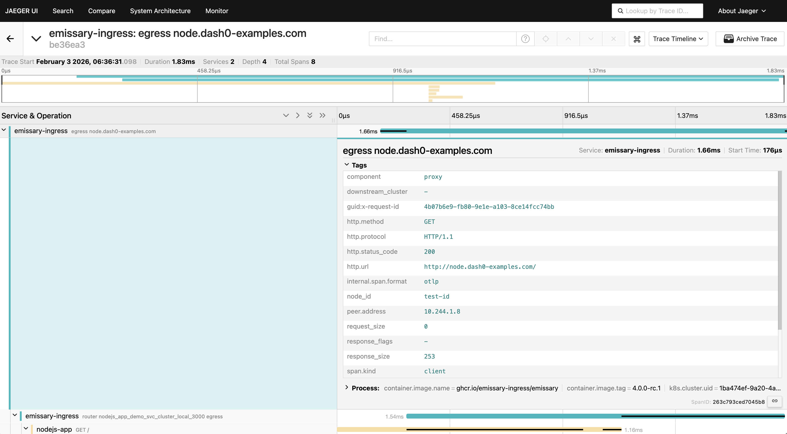
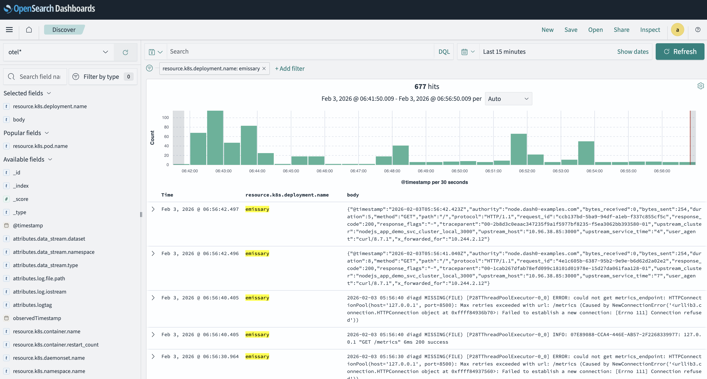
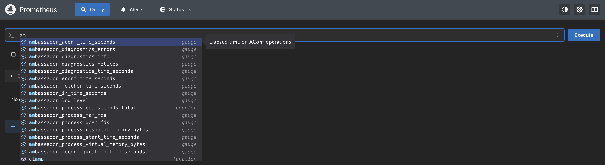
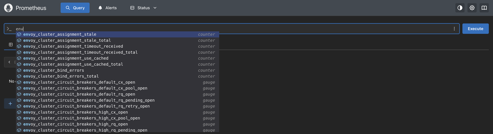
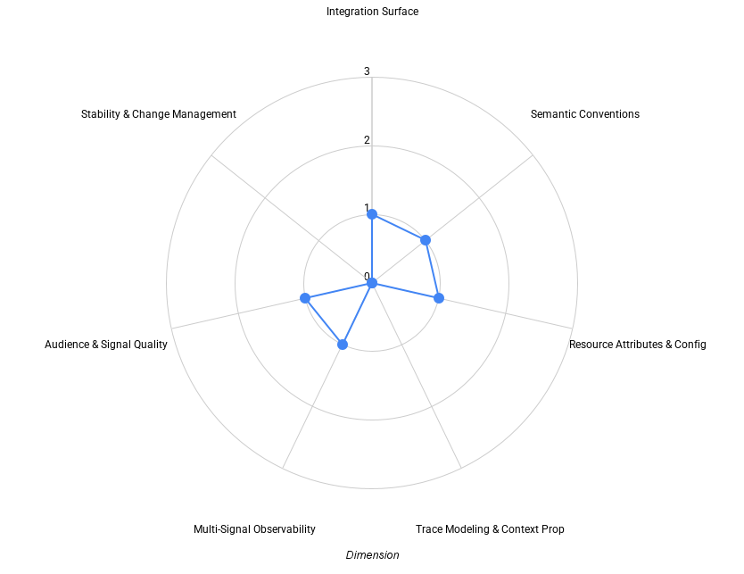

[Emissary Ingress](https://github.com/emissary-ingress/emissary) is an
Envoy-based ingress controller with a long history in the Kubernetes ecosystem.
Originally developed as Ambassador, the project has evolved through multiple
architectural iterations while continuing to focus on flexibility,
extensibility, and deep control over ingress behavior.

As OpenTelemetry has emerged as the standard for cloud native observability,
infrastructure components such as ingress controllers are increasingly expected
to integrate cleanly into OpenTelemetry-based pipelines. For shared ingress
layers in particular, observability is not just about emitting telemetry, but
about doing so in a way that is semantically correct, interoperable, and stable
over time.

Ingress controllers sit at a critical boundary in Kubernetes architectures. They
are the first hop for incoming traffic, they enforce routing and policy
decisions, and they often represent the earliest point at which latency, errors,
and availability can be observed. This makes them a natural focal point for
evaluating how OpenTelemetry behaves in practice at the edge of the platform.

Recent developments in the Kubernetes ecosystem further underline the relevance
of this evaluation. With the announcement that ingress-nginx is being retired
from the Kubernetes project, many teams are reassessing their ingress choices
and exploring alternatives. In that context, understanding how ingress
controllers integrate with OpenTelemetry becomes an important input when making
long-term platform decisions.

This post evaluates Emissary Ingress’ OpenTelemetry support using the same
multi-dimensional maturity framework applied to kgateway, Traefik, and Contour.
Rather than treating OpenTelemetry support as a binary feature, the goal is to
understand how Emissary’s telemetry behaves in practice: where it integrates
cleanly, where it relies on downstream processing, and where limitations affect
correctness or usability.

## How we evaluate OpenTelemetry support

OpenTelemetry support rarely evolves uniformly across all signals. Tracing,
logging, and metrics are often shaped by different historical decisions,
upstream dependencies, and user expectations \- particularly in infrastructure
projects built on Envoy.

To make these differences easier to reason about, this evaluation uses a
[draft maturity framework](https://github.com/open-telemetry/community/issues/3247)
that looks at OpenTelemetry support across a set of independent dimensions:

- **Integration Surface** – how users connect the project to observability
  pipelines
- **Semantic Conventions** – how consistently telemetry meaning aligns with
  OpenTelemetry conventions
- **Resource Attributes & Configuration** – how identity and configuration
  behave across environments
- **Trace Modeling & Context Propagation** – how traces are structured and how
  context flows
- **Multi-Signal Observability** – how traces, metrics, and logs work together
  in practice
- **Audience & Signal Quality** – who the telemetry is designed for and how
  usable it is by default
- **Stability & Change Management** – how telemetry evolves once users depend on
  it

Each dimension is evaluated independently. Projects often land at different
maturity levels across different dimensions, and that is expected. The purpose
of the framework is not to rank projects, but to make trade-offs visible and
easier to discuss — especially as OpenTelemetry adoption deepens across the
ecosystem.

The framework itself is still evolving and is being discussed openly in the
OpenTelemetry community. This post should be read as an application of the
framework, not as a definitive or final judgment of Emissary’s observability
design.

## Evaluation environment

The
[evaluation environment](https://github.com/dash0hq/dash0-examples/tree/main/emissary-ingress)
is intentionally simple and designed to reflect a common local development
workflow.

Emissary Ingress v4.0.0-rc.1 is deployed in a local kind Kubernetes cluster and
configured as the ingress controller. An OpenTelemetry Collector is deployed
in-cluster and acts as the central alignment point for traces, logs, and
metrics.

Request traffic is generated from outside the cluster to exercise ingress
behavior directly. A small backend service runs inside the cluster to verify
that trace context created or propagated by Emissary is preserved as requests
flow downstream. This makes it possible to observe both ingress-level behavior
and downstream trace continuity without introducing unnecessary complexity.

For observability backends, the evaluation uses an open source observability
stack consisting of Jaeger for tracing, Prometheus for metrics, and OpenSearch
for logs. This mirrors a common OpenTelemetry deployment pattern, where the
Collector normalizes and routes signals to different backends depending on
signal type.

The purpose of this environment is not to simulate production load, but to
observe how Emissary’s telemetry behaves once enabled and how signals align when
processed through an OpenTelemetry pipeline.

## Tracing at the ingress

Tracing is the primary OpenTelemetry integration point for Emissary Ingress.
Emissary supports exporting traces via OpenTelemetry by configuring a
TracingService custom resource and selecting OpenTelemetry as the tracing
driver.

Trace context propagation follows the W3C Trace Context specification. Incoming
traceparent headers are preserved, and when no upstream context is present,
Emissary creates a new trace at the ingress boundary. This ensures that requests
entering the cluster are traceable from the point they arrive at the platform
and that context is propagated correctly to downstream services.

However, while trace context propagation works reliably, trace modeling itself
contains a fundamental semantic issue. In the evaluated version, ingress entry
spans are emitted with a CLIENT span kind rather than SERVER.

In OpenTelemetry, SERVER spans represent inbound request handling and are
expected to appear at the start of a request lifecycle. CLIENT spans represent
outbound calls and are expected to have a parent span. Using CLIENT spans as
root spans for inbound ingress traffic violates OpenTelemetry span semantics and
misrepresents the role of the ingress in the trace.

As a result, traces appear structurally complete — spans exist, parent-child
relationships are present, and downstream propagation works — but they are
semantically incorrect. Server-side latency, ingress responsibility, and request
handling behavior cannot be interpreted correctly using standard OpenTelemetry
assumptions.

This issue has practical consequences. Automated analysis, latency attribution,
and cross-service comparisons become unreliable, and users must mentally
compensate for incorrect span roles when interpreting traces.

## Access logs and trace correlation

Emissary emits structured access logs as JSON to stdout. These logs include HTTP
request and response details such as method, path, status code, timing, routing
decisions, and upstream information. They are designed to be consumed by log
aggregation systems rather than read directly from files.

Trace context is not embedded in access logs by default. Correlation between
traces and logs therefore depends on OpenTelemetry Collector–side processing. In
the evaluation setup, the Collector ingests container logs, applies custom
parsing logic, extracts trace and span identifiers where possible, and enriches
the resulting log records.

This makes the OpenTelemetry Collector a critical component in the observability
pipeline. Without Collector-side processing, logs and traces remain parallel but
disconnected signals. With it, operators can move from a trace to the
corresponding ingress logs to understand routing decisions, response codes, or
upstream behavior.

This design places responsibility for correlation firmly in the pipeline rather
than at the source. While this is workable, it increases operational complexity
and makes correlation dependent on correct Collector configuration.

## Metrics: Prometheus-native by design

Metrics in Emissary follow a traditional Envoy model. Emissary and Envoy expose
metrics in Prometheus format, covering request counts, response codes, latency
histograms, upstream health, and controller-level behavior.

Metrics are scraped by the OpenTelemetry Collector using the Prometheus
receiver. From there, they can be enriched with Kubernetes metadata and queried
using PromQL.

One additional source of friction is naming. While the project is now Emissary
Ingress, many controller-level metrics continue to use the legacy `ambassador_*`
prefix rather than an `emissary_*` namespace. This reflects Emissary’s
historical evolution, but it can be confusing for operators.

There is no OTLP export path for metrics at the source. As a result, metrics
remain Prometheus-native and are collected, labeled, and queried differently
from traces and logs. While this does not prevent effective monitoring, it
reinforces that Emissary does not yet offer a unified, OTLP-first multi-signal
model.

## Summary view: Emissary OpenTelemetry maturity

Before diving into each dimension in detail, it’s useful to step back and look
at how Emissary’s OpenTelemetry support shapes up across the framework as a
whole.

Each dimension is evaluated independently on a 0–3 scale, where higher values
indicate deeper and more intentional OpenTelemetry integration. The goal of this
view is not to produce a single score, but to highlight where the experience is
already usable and where users are likely to encounter friction.

In Emissary’s case, the overall shape reflects a project where OpenTelemetry
support exists, but where correctness, consistency, and stability limit how
safely that support can be relied on in practice.

## Dimension-by-dimension analysis

The sections that follow walk through each dimension in turn, grounding this
high-level view in concrete observations from the evaluation environment.

### Integration surface

From an integration perspective, Emissary presents a mixed model.

Tracing integrates with OpenTelemetry via OTLP and Kubernetes-native
configuration, but requires explicit custom resource definitions and restarts to
take effect. Logs and metrics follow separate ingestion paths and rely heavily
on the OpenTelemetry Collector to normalize and align them.

In practice, this makes the Collector the primary integration surface.
OpenTelemetry integration works, but the integration surface extends beyond the
ingress itself and into pipeline configuration.

### Semantic conventions

Emissary’s telemetry largely reflects Envoy’s existing conventions. HTTP
attributes are present and useful, but rely on deprecated OpenTelemetry semantic
conventions rather than the current stable recommendations.

This limits interoperability with generic dashboards, queries, and tools that
expect up-to-date OpenTelemetry semantics. While experienced users can interpret
the signals correctly, the reliance on deprecated conventions increases
long-term migration cost.

### Resource attributes & configuration

Emissary exposes a stable service identity, but resource modeling at the source
is minimal.

Standard service-level attributes such as service.namespace, service.version,
and service.instance.id are not consistently set. Kubernetes resource attributes
such as pod, workload, node, and cluster identifiers are largely absent at the
source and must be added via Collector-side enrichment.

Runtime customization of resource identity is limited, and supported detectors
are not documented as part of an explicit observability contract. In practice,
stable identity is achieved through downstream enrichment rather than
source-level modeling.

### Trace modeling & context propagation

While context propagation follows open standards and behaves reliably, incorrect
span semantics undermine trace correctness.

Using CLIENT spans for inbound ingress traffic breaks OpenTelemetry expectations
and affects both human and automated trace analysis. This is a fundamental issue
that limits OpenTelemetry maturity regardless of signal availability.

### Multi-signal observability

Emissary emits traces, logs, and metrics, but they are not designed as a unified
system at the source.

Correlation between traces and logs depends on Collector-side parsing and
enrichment, and metrics remain Prometheus-native. Meaningful multi-signal
observability is possible, but it is achieved through pipeline-level alignment
rather than an OTLP-first design.

### Audience & signal quality

Emissary’s telemetry is primarily oriented toward maintainers and advanced
operators.

Signals are expressive but require significant domain knowledge to interpret
correctly. Experimental warnings, lack of semantic guarantees, and reliance on
pipeline customization limit how broadly usable the telemetry is by default.

### Stability & change management

Emissary is a mature project, but its OpenTelemetry integration is explicitly
marked as work-in-progress and not recommended for production use.

There is limited documentation around semantic stability, no telemetry-specific
change communication, and long-standing issues affecting trace correctness
remain unresolved. Users rely on implicit behavior rather than explicit
guarantees.

## Final thoughts

Emissary Ingress exposes a wide range of telemetry signals, but its current
OpenTelemetry implementation has fundamental limitations that affect
correctness, interoperability, and stability.

This evaluation highlights where Emissary works today, where it falls short, and
what would be required to align it more closely with modern OpenTelemetry
expectations. As ingress controllers become increasingly strategic
infrastructure components, semantic accuracy and signal consistency matter as
much as signal availability.

The
[maturity framework](https://github.com/open-telemetry/community/issues/3247)
used here is intended to support that discussion and make progress visible over
time.
