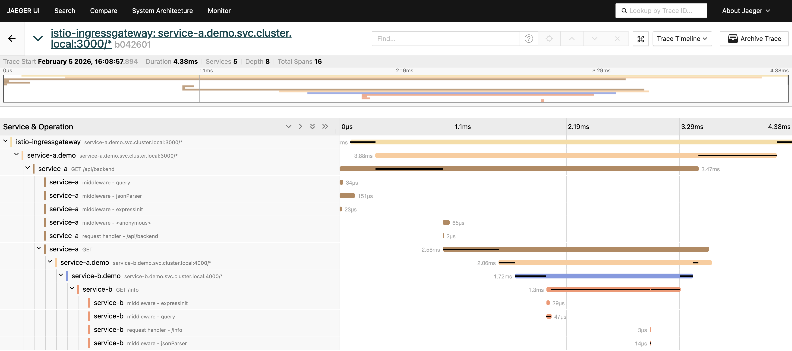
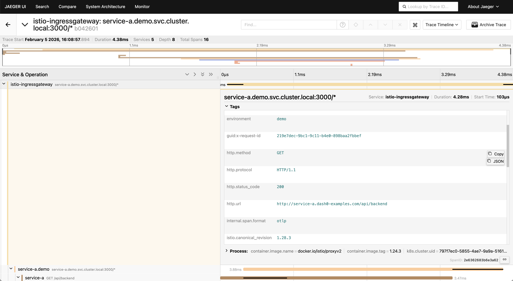
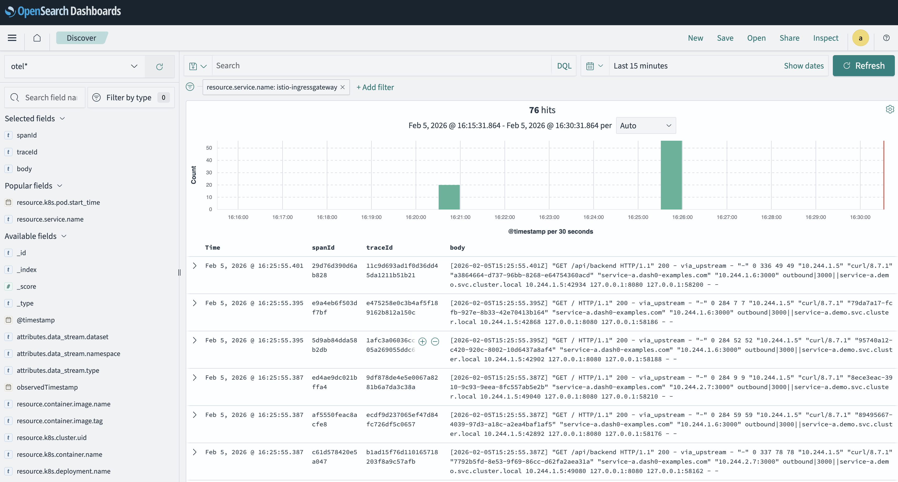
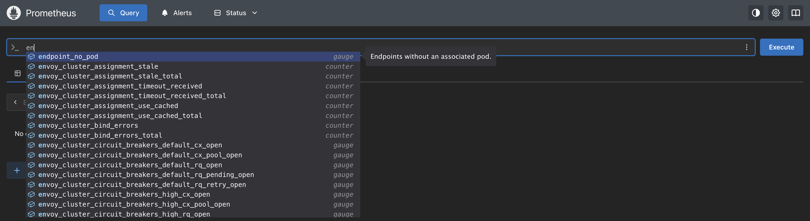
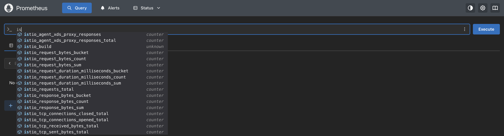
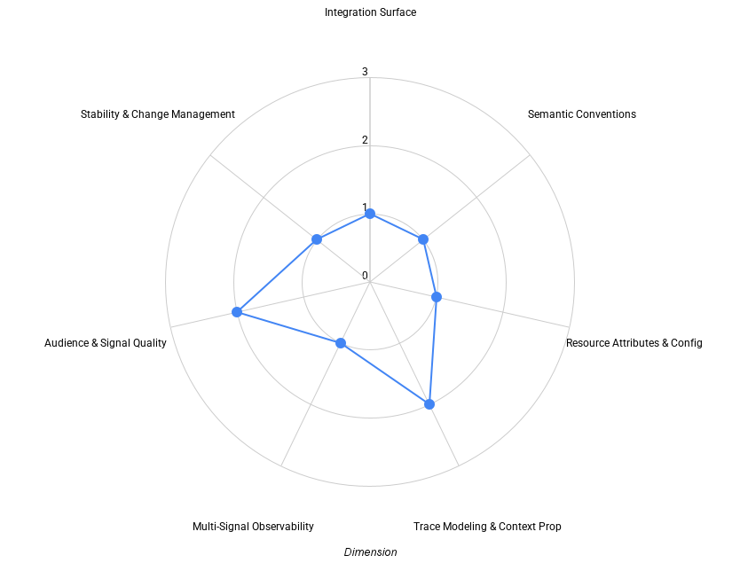

[Istio](https://istio.io/) is one of the most widely deployed service meshes in
the Kubernetes ecosystem. While it is often associated with sidecarless-based
traffic management, Istio’s gateway components play a distinct and increasingly
important role as the entry point into service mesh–enabled environments.

Gateways sit at a critical boundary. They terminate incoming traffic, apply
routing and security policies, and often represent the first place where
user-facing latency or failures can be observed. As OpenTelemetry has become the
de facto standard for cloud native observability, users increasingly expect
gateways to integrate cleanly into OpenTelemetry-based pipelines \- not just to
emit telemetry, but to do so with predictable semantics, consistent identity,
and usable defaults across traces, logs, and metrics.

Recent developments in the Kubernetes ecosystem further underline the relevance
of this evaluation. With the
[announced retirement of ingress-nginx](https://kubernetes.io/blog/2026/01/29/ingress-nginx-statement/)
from the Kubernetes project, many teams are reassessing their ingress strategy
and evaluating alternatives such as Gateway API–based implementations,
Envoy-based gateways, and service mesh gateways. In that context, understanding
how Istio Gateway integrates with OpenTelemetry becomes an important input into
long-term platform decisions.

This post examines Istio Gateway’s OpenTelemetry support using the same
multi-dimensional maturity framework applied throughout this series. Rather than
treating OpenTelemetry support as a binary feature, the goal is to understand
how Istio’s telemetry behaves in practice: where it is OpenTelemetry-native,
where it relies on downstream processing, and how well the resulting signals
support real operational workflows.

## How we evaluate OpenTelemetry support

OpenTelemetry support rarely evolves uniformly across all signals. Tracing,
logging, and metrics are often shaped by different historical decisions,
ecosystem norms, and architectural constraints. In service meshes and gateways,
this is especially visible: metrics were traditionally exposed for scraping,
logging formats evolved independently, and tracing was often introduced
incrementally through proxy-level instrumentation.

To make these differences easier to reason about, this evaluation uses a
[draft maturity framework](https://github.com/open-telemetry/community/issues/3247)
that looks at OpenTelemetry support across a set of independent dimensions:

- **Integration Surface** – how users connect the project to observability
  pipelines
- **Semantic Conventions** – how consistently telemetry meaning aligns with
  OpenTelemetry conventions
- **Resource Attributes & Configuration** – how identity and configuration
  behave across environments
- **Trace Modeling & Context Propagation** – how traces are structured and how
  context flows
- **Multi-Signal Observability** – how traces, metrics, and logs work together
  in practice
- **Audience & Signal Quality** – who the telemetry is designed for and how
  usable it is by default
- **Stability & Change Management** – how telemetry evolves once users depend on
  it

Each dimension is evaluated independently. Projects often land at different
maturity levels across different dimensions, and that is expected. The framework
is intended to surface trade-offs and friction points rather than collapse
everything into a single score.

The framework itself is still evolving and is being discussed openly in the
OpenTelemetry community. This post should be read as an application of the
framework, not as a definitive or final judgment of Istio’s observability
design.

## Evaluation environment

The
[evaluation environment](https://github.com/dash0hq/dash0-examples/tree/main/istio)
reflects a common local development workflow.

Istio Gateway runs in a local `kind` Kubernetes cluster using Istio `Gateway`
and `VirtualService` resources. OpenTelemetry support is enabled through Envoy’s
native tracing capabilities and Istio’s configuration mechanisms.

Request traffic is generated from the local machine to exercise gateway
behavior. A small backend service runs inside the cluster to verify that trace
context created or propagated by Istio Gateway is preserved as requests flow
downstream.

An OpenTelemetry Collector acts as the central alignment point for all
telemetry. Traces are exported from Envoy via OTLP. Metrics are collected
through Prometheus-style scraping, and logs are ingested and enriched through
the Collector pipeline. Signals are routed to an open source observability stack
consisting of Jaeger for tracing, Prometheus for metrics, and OpenSearch for
logs.

The goal is not to simulate production load, but to observe how Istio Gateway’s
telemetry behaves once enabled and how signals align when processed through an
OpenTelemetry pipeline.

## Tracing at the gateway

Tracing is a mature and reliable aspect of Istio Gateway’s OpenTelemetry
integration. Envoy spans are emitted using OpenTelemetry-compatible mechanisms,
and Istio treats tracing as a first-class concern within the data plane.

Trace context propagation follows the W3C Trace Context specification. Incoming
trace context is preserved, and when no upstream context is present, Istio
Gateway starts a new trace at the ingress boundary. This ensures that every
request entering the mesh has a well-defined trace root.

Span structure reflects Envoy’s execution model and focuses on synchronous
request handling. Parent–child relationships between gateway spans and
downstream service spans are preserved, making it straightforward to reason
about how requests flow through the gateway and into the mesh.

However, Istio currently relies on deprecated HTTP semantic conventions from
pre-1.23 OpenTelemetry specifications. Attributes such as `http.method`,
`http.status_code`, and `http.url` have been superseded by stable alternatives
like `http.request.method`, `http.response.status_code`, and `url.full`. In
addition, some attributes are emitted with incorrect types \- for example, HTTP
status codes are sent as strings rather than integers.

While traces are predictable and operationally useful, this reliance on
deprecated semantics introduces forward-compatibility concerns as OpenTelemetry
tooling increasingly expects stable conventions.

## Access logs and trace correlation

Istio Gateway emits access logs via OTLP through Envoy’s OpenTelemetry access
log integration (`envoyOtelAls`). These logs capture ingress-level details such
as HTTP method and path, response status, timing, routing decisions, and
upstream metadata, and are delivered directly into an OpenTelemetry pipeline
without relying on file-based log collection.

Trace correlation works out of the box. Istio populates the OTLP LogRecord
`traceId` and `spanId` fields automatically, which allows observability backends
to associate access logs with the corresponding gateway spans immediately. In
practice, this makes it straightforward to move from an ingress span to the
related access log entries without additional correlation logic.

The primary limitation lies in log structure rather than correlation. In the
evaluated setup, the access log payload is emitted as a single text string in
the log body rather than being parsed into structured OpenTelemetry log
attributes. As a result, logs are correlated but not easily filterable or
aggregatable by common fields such as status code, method, route name, or
upstream cluster.

This is where the OpenTelemetry Collector plays a key role. It parses the log
body, extracts structured attributes, and enriches records with Kubernetes
metadata, turning correlated but unstructured logs into data that can be queried
and analyzed effectively. Correlation is native at the source, while usability
depends on downstream structuring and enrichment.

## Metrics: Prometheus-native by design

Metrics in Istio Gateway follow a deliberately Prometheus-native design rooted
in Envoy and Istio’s long operational history. Envoy exposes a rich set of
metrics covering request counts, response codes, latency histograms, upstream
health, and connection-level behavior. Istio adds gateway-specific and
control-plane metrics that reflect configuration and routing state.

In this evaluation, metrics are collected by the OpenTelemetry Collector using
the Prometheus receiver. From there, they are enriched with Kubernetes metadata
and queried using PromQL in Prometheus.

There is no OTLP export path for metrics at the source. As a result, metrics are
emitted using Prometheus naming, units, and conventions rather than the
OpenTelemetry metrics data model. This limits access to standardized semantic
conventions, explicit units, and signal-level consistency with traces and logs.
While the metrics themselves are comprehensive and operationally useful, the
Prometheus-native approach constrains interoperability with OpenTelemetry-native
backends and prevents Istio Gateway from participating fully in an OTLP-first,
multi-signal observability model.

## Summary view: Istio Gateway OpenTelemetry maturity

Before diving into each dimension in detail, it is useful to step back and
consider how Istio Gateway’s OpenTelemetry support shapes up across the
framework as a whole.

Each dimension is evaluated independently on a 0–3 scale, where higher values
indicate deeper and more intentional OpenTelemetry integration. Rather than
producing a single score, the goal is to highlight where the experience is
already strong and where users are more likely to encounter friction when
operating Istio Gateway as a shared ingress layer.

In Istio Gateway’s case, the overall shape reflects reliable tracing with
deprecated semantics, comprehensive metrics that remain Prometheus-native, and
access logs that are correlated by default but require downstream processing to
become fully usable.

## Dimension-by-dimension analysis

### Integration surface

Istio Gateway presents a clear but layered integration surface. Tracing
integrates cleanly with OpenTelemetry using OTLP, while logs and metrics follow
separate ingestion paths and rely on the OpenTelemetry Collector to normalize
and align them.

This model works well for teams already operating centralized Collectors, but it
requires more configuration than projects that treat OTLP as the default
interface across all signals.

### Semantic conventions

A notable gap in Istio Gateway’s current OpenTelemetry implementation is the
continued use of deprecated HTTP semantic conventions. Attributes such as
`http.method`, `http.status_code`, and `http.url` originate from older
specifications and have been superseded by stable alternatives.

Because these deprecated attributes are still emitted \- and sometimes with
incorrect types \- users may need to implement normalization logic in their
pipelines as backends and tooling increasingly expect stable semantic
conventions.

### Resource attributes & configuration

Resource identity in Istio Gateway is partially explicit and partially derived.
Some service-level attributes are present, but Kubernetes resource attributes
are typically added by the OpenTelemetry Collector using standard processors.

Configuration precedence between Istio settings and standard OpenTelemetry
environment variables is not always obvious, which can make behavior harder to
predict across environments without careful pipeline design.

### Trace modeling & context propagation

Trace modeling in Istio Gateway is deliberate and focused. Traces represent
synchronous request flows clearly, with consistent parent–child relationships
and predictable span boundaries.

Context propagation follows open standards and behaves reliably across gateway
and downstream services. While advanced trace features such as exemplars are not
enabled by default, Envoy’s extensibility leaves room for such capabilities to
be introduced.

### Multi-signal observability

Istio Gateway emits all three signals \- traces, metrics, and logs \- but they
are not designed as a unified system at the source. Tracing is
OpenTelemetry-native, while logs and metrics require Collector-side alignment.

As a result, meaningful multi-signal observability is achieved through
pipeline-level configuration rather than through an OTLP-first design across all
signals.

### Audience & signal quality

Istio Gateway’s telemetry is well suited for platform and infrastructure teams
operating shared gateways. Traces and metrics provide deep insight into ingress
behavior, routing decisions, and performance characteristics.

At the same time, effective use of the telemetry requires familiarity with
Envoy, Istio, and the OpenTelemetry Collector. Defaults are powerful but not
self-explanatory, which limits how broadly usable the telemetry is without prior
domain knowledge.

### Stability & change management

Istio is a mature project with a predictable release cadence. Observed telemetry
behavior is stable in practice, which is essential for dashboards and alerts.

However, Istio does not populate the `schema_url` field in OTLP exports. The
absence of schema tracking makes it difficult to determine which version of
OpenTelemetry semantic conventions is implemented and complicates migration
planning as conventions evolve. As a result, telemetry behavior is stable but
not treated as an explicit, versioned contract.

## Where Istio Gateway lands

Taken together, Istio Gateway’s OpenTelemetry support reflects a mature project
with strong operational capabilities, but one that is not yet fully aligned with
current OpenTelemetry standards across all dimensions.

Tracing provides reliable context propagation and predictable span modeling,
though it relies on deprecated semantic conventions that will require migration
as the OpenTelemetry ecosystem evolves. Metrics are comprehensive and
production-proven, but remain Prometheus-native, following established Envoy
patterns rather than an OTLP-first design.

Logs demonstrate effective trace correlation out of the box, but the
unstructured body format requires OpenTelemetry Collector processing to achieve
full queryability and consistency. This positions the Collector as a central \-
and unavoidable \- component for achieving coherent, multi-signal observability.

Overall, Istio Gateway sits firmly in the _OTel-Aligned_ category: OpenTelemetry
is clearly supported and operationally useful, while concrete gaps in semantic
alignment and schema tracking limit long-term interoperability without pipeline
intervention.

## Closing thoughts

Istio Gateway demonstrates how far OpenTelemetry integration has progressed in
large, complex infrastructure projects. Tracing is robust, metrics are rich and
operationally valuable, and logs can be aligned effectively through standard
pipelines.

At the same time, this evaluation highlights a recurring theme across the
series: meaningful observability is shaped not only by signal availability, but
by semantic correctness, schema tracking, and the ability to evolve safely over
time.

For teams evaluating ingress options in a post–ingress-nginx world, Istio
Gateway offers strong observability capabilities \- particularly in service
mesh-centric environments. Understanding where OpenTelemetry is native and where
pipeline-level work is required helps set realistic expectations and points to
clear opportunities for future refinement.
