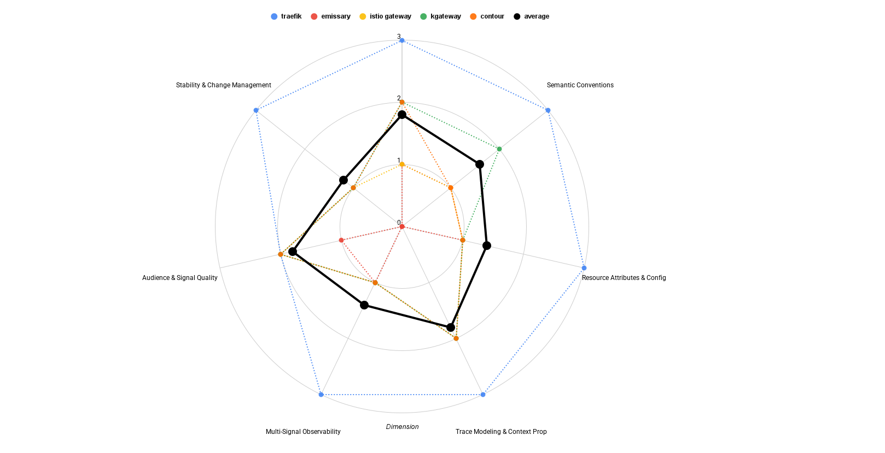

Ingress controllers sit at one of the most critical points in a Kubernetes
architecture. Every inbound request passes through them, making ingress the
natural starting point for distributed traces, access logs, and request-level
metrics. If observability is missing or inconsistent at this layer, downstream
telemetry becomes harder to interpret, correlate, and trust.

Ingress is also where many operational questions originate. Why is latency
increasing? Which backend is actually handling traffic? Are retries happening?
Are requests failing before they ever reach an application? Without clear
telemetry at the ingress layer, these questions often lead to blind spots,
partial answers, or expensive guesswork.

Over the past months, this series has examined OpenTelemetry support across
several widely used ingress controllers and gateways. Rather than treating
OpenTelemetry integration as a binary capability, each project was evaluated
using a
[draft maturity framework](https://github.com/open-telemetry/community/issues/3247)
that looks at how intentionally and consistently OpenTelemetry is applied across
traces, logs, and metrics.

This post brings those individual evaluations together. Instead of repeating
project-specific deep dives, it focuses on what the comparisons reveal about the
current state of OpenTelemetry adoption in ingress controllers as a category \-
and what we learned by applying the maturity framework itself across multiple
real-world implementations.

## Projects included in the comparison

The comparison is based on hands-on evaluations of the following ingress
controllers and gateways:

- Contour
- Emissary Ingress
- Istio Gateway
- kgateway
- Traefik

Each evaluation was performed in a Kubernetes environment using an OpenTelemetry
Collector as the central alignment point for traces, logs, and metrics. Request
traffic was generated externally, and downstream services were used only to
validate trace propagation and correlation behavior.

The goal was not to benchmark performance or feature completeness, but to
understand how each project models telemetry at the ingress layer, how much work
is required to make signals usable together, and how closely emitted telemetry
aligns with current OpenTelemetry expectations.

Traefik is not a CNCF project, but it is included due to its strong
OpenTelemetry focus and its relevance in real-world ingress deployments.

### What about ingress-nginx?

Ingress-nginx is intentionally not included in this maturity comparison.

While ingress-nginx was previously evaluated for OpenTelemetry support, the
Kubernetes community has since
[announced the retirement](https://kubernetes.io/blog/2026/01/29/ingress-nginx-statement/)
of the project. Given that decision, it no longer made sense to apply a
forward-looking maturity framework or invest in a full evaluation as part of
this series.

For readers interested in ingress-nginx’s OpenTelemetry support as it existed
prior to the deprecation announcement, a detailed analysis from September 2025
is available on the
[Dash0 blog](https://www.dash0.com/blog/observing-ingress-nginx-with-opentelemetry-and-dash0).

The exclusion of ingress-nginx further underscores why observability maturity
matters when teams are selecting a long-term ingress replacement. As
organizations migrate, they are implicitly choosing not just an ingress
controller, but an observability model that will shape how they debug, operate,
and scale their platforms.

## How OpenTelemetry support is evaluated

OpenTelemetry adoption rarely progresses evenly across all telemetry signals.
Tracing, logging, and metrics often evolve independently, shaped by historical
conventions, proxy capabilities, and ecosystem tooling.

To make these differences easier to reason about, this series applies a draft
_OpenTelemetry Support Maturity Framework_ that evaluates projects across seven
independent dimensions:

- **Integration Surface** – how users connect the project to observability
  pipelines
- **Semantic Conventions** – how consistently telemetry aligns with
  OpenTelemetry semantics
- **Resource Attributes & Configuration** – how identity and configuration
  behave across environments
- **Trace Modeling & Context Propagation** – how traces are structured and how
  context flows
- **Multi-Signal Observability** – how traces, logs, and metrics work together
  in practice
- **Audience & Signal Quality** – who the telemetry is designed for and how
  usable it is by default
- **Stability & Change Management** – how telemetry evolves once users depend on
  it

Each dimension is evaluated independently on a 0–3 scale. The intent is not to
rank projects or collapse everything into a single score, but to surface
trade-offs and friction points that affect real-world operability.

This distinction turned out to be particularly important for ingress
controllers, where some signals appear “good enough” in isolation, but reveal
deeper issues when evaluated in combination.

## Summary view: ingress controller OpenTelemetry maturity

Before diving into cross-cutting observations, the radar chart below provides a
high-level overview of how the evaluated ingress controllers compare across the
framework, including an aggregate average that reflects overall maturity trends.

Each axis represents one maturity dimension. Higher values indicate deeper, more
intentional OpenTelemetry integration, but the purpose of this visualization is
not comparison for its own sake. Instead, it highlights where the ecosystem is
already strong and where users are most likely to encounter limitations.

Even without reading the individual evaluations, a clear pattern emerges.
Tracing tends to score higher across projects, while semantic conventions,
metrics, and long-term stability cluster lower. This shared shape is one of the
most valuable outcomes of the comparison.

## What the comparison reveals about ingress controllers

### Tracing is consistently strong

Across all evaluated ingress controllers, tracing is the most mature signal.

Common characteristics include predictable span boundaries at the ingress layer,
reliable W3C Trace Context propagation, and consistent parent–child
relationships between gateway spans and downstream services. This makes it
possible to reason clearly about request flow, latency, retries, and routing
decisions starting at the edge.

This consistency is largely due to a shared foundation: almost all evaluated
ingress controllers are built on Envoy. Envoy provides robust tracing
capabilities out of the box, and most projects have leaned into that strength
early.

However, tracing maturity is not uniform in terms of standards compliance. Many
ingress controllers still emit deprecated HTTP semantic conventions rather than
the current stable attributes defined in newer OpenTelemetry specifications.
Attributes such as `http.method` and `http.status_code` remain common, even
though they have been superseded by `http.request.method` and
`http.response.status_code`. In some cases, attribute types are also incorrect.

Operationally, tracing works well. Strategically, this semantic lag creates
forward-compatibility risk as OpenTelemetry tooling increasingly assumes stable
conventions.

### Access logs are improving, but uneven

Access logging shows greater variation across projects.

Some ingress controllers emit logs via OTLP with trace and span identifiers
embedded directly in the log records. Others emit logs in text or JSON formats
that require parsing and enrichment downstream. In many cases, trace–log
correlation is possible, but only after pipeline-level processing.

As a result, the OpenTelemetry Collector becomes a critical component in nearly
all ingress observability setups. Even when correlation identifiers are present
at the source, structuring logs and enriching them with Kubernetes metadata
typically happens in the pipeline.

This is not inherently wrong, but it shifts responsibility from the ingress
controller to the platform team. The more work required in the pipeline, the
easier it is to introduce inconsistencies, blind spots, or operational
fragility.

Traefik stands out here. Although its OTLP log export is currently marked
experimental, it demonstrates a clear intent to treat OpenTelemetry as a
first-class logging interface rather than an optional integration layered on top
of traditional log formats.

### Metrics remain predominantly Prometheus-native

Metrics are where the ecosystem diverges most clearly from OpenTelemetry’s
long-term direction.

Across nearly all evaluated ingress controllers, metrics are exposed in
Prometheus format and collected via scraping. Even when an OpenTelemetry
Collector is involved, it often acts as a Prometheus scraper rather than an OTLP
receiver.

This approach is familiar and operationally proven. However, it comes with
important trade-offs. Prometheus-native metrics lack the semantic richness,
explicit units, and well-defined aggregation semantics provided by the
OpenTelemetry metrics model. This makes it harder to reason consistently about
metrics across components and harder to align metrics with traces and logs.

In practice, this means users often see three different mental models:
OpenTelemetry-style traces, partially structured logs, and Prometheus-style
metrics. Each is useful, but the lack of a shared semantic foundation limits
cross-signal analysis.

Traefik again represents an exception by exporting metrics via OTLP at the
source. Even when those metrics are ultimately stored in Prometheus format, this
preserves OpenTelemetry semantics at the producer and allows greater flexibility
in downstream routing and analysis.

### Multi-signal observability is usually achieved in the pipeline

A consistent theme across all evaluations is that multi-signal observability is
rarely modeled at the source.

Instead, traces, logs, and metrics are emitted through different mechanisms and
aligned later using shared resource attributes and Collector-side enrichment.
This approach works, but it places significant responsibility on platform teams
to design and maintain correct observability pipelines.

Ingress controllers that treat OpenTelemetry as a primary integration surface
reduce this operational burden by making signal alignment more predictable out
of the box.

### Envoy as both enabler and constraint

Envoy underpins nearly every ingress controller evaluated. This has a dual
effect.

On the positive side, Envoy provides high-quality tracing and a rich set of
metrics, giving projects a strong baseline. On the limiting side, Envoy’s
defaults \- including deprecated semantic conventions and Prometheus-centric
metrics \- are inherited unless projects actively diverge from them.

As a result, many ingress controllers share not only common strengths, but also
common gaps. Improving OpenTelemetry support at the ingress layer may therefore
require not just project-level changes, but upstream alignment around Envoy
defaults and migration paths.

### A brief note on Cilium

As part of this comparison, we also looked at **Cilium Ingress** to understand
its current level of OpenTelemetry support.

Cilium occupies a slightly different space than the other ingress controllers
evaluated, combining networking, security, and observability concerns. While it
exposes a rich set of Prometheus metrics and provides detailed flow visibility
through Hubble, direct OpenTelemetry support for ingress-related telemetry is
currently limited.

The previously available [`hubble-otel`](https://github.com/cilium/hubble-otel)
integration has been deprecated, and OpenTelemetry is no longer a first-class
export path. In practice, OpenTelemetry users rely on the OpenTelemetry
Collector to scrape Cilium’s Prometheus metrics and integrate them into broader
observability pipelines.

This makes it possible to observe Cilium Ingress using OpenTelemetry tooling at
the pipeline level, but unlike the other ingress controllers in this series,
OpenTelemetry is not treated as a native or intentional integration surface
within the project itself.

## What this comparison tells us about the maturity framework itself

While this series has focused on evaluating ingress controllers, it has also
served as a practical test of the maturity framework itself. Applying the same
dimensions consistently across multiple ingress implementations surfaced clear
patterns \- not just in project behavior, but in how well the framework captures
meaningful differences in OpenTelemetry adoption.

Looking at the combined radar chart and aggregated scores, several observations
stand out.

The framework consistently separates _signal availability_ from _signal
quality_. Nearly all evaluated ingress controllers emit traces, logs, and
metrics in some form, but dimensions such as Semantic Conventions, Resource
Attributes & Configuration, and Multi-Signal Observability reveal whether that
telemetry is interoperable, consistent, and future-proof.

Tracing maturity clustered higher than other dimensions, reflecting Envoy’s
strong foundation. At the same time, the framework correctly prevented projects
from reaching the highest maturity level when semantic debt, missing schema
tracking, or limited configurability were present.

Metrics emerged as the weakest and most uneven dimension, reinforcing that
OpenTelemetry-native metrics adoption at the ingress layer is still early. The
framework proved sensitive to this gap without penalizing projects simply for
using Prometheus.

Semantic Conventions surfaced as an ecosystem-wide issue rather than a
project-specific one. Deprecated attributes, incorrect types, and missing schema
tracking appeared consistently across Envoy-based ingress controllers.

Stability & Change Management also emerged as a weak point. Telemetry behavior
appeared stable in practice, but rarely treated as an explicit, versioned
contract. Missing schema_url fields and lack of telemetry-specific change
communication limited maturity here.

Overall, the framework held up well. A few refinements may be worth exploring \-
such as clearer guidance around upstream constraints inherited from Envoy and
sharper distinction between OTLP transport and semantic richness \- but no
structural changes are required. The framework proved effective at comparing
projects fairly and surfacing actionable differences.

## Where this leaves the ecosystem

Taken together, these evaluations paint a consistent picture:

Tracing is broadly strong and reliable. Access logs are improving, but uneven.
Metrics remain largely Prometheus-native.

Signals are largely disconnected, using neither consistent resource attributes
nor trace-context correlation. Collectors are essential for correlation and
enrichment. Semantic conventions lag behind current OpenTelemetry standards.

Ingress controllers are clearly on the OpenTelemetry path, but most remain
somewhere between _OTel-aligned_ and _OTel-native_. The maturity framework helps
make these trade-offs explicit and provides a shared vocabulary for discussing
roadmap priorities and integration gaps.

## Final thoughts

Ingress controllers define the first mile of observability. As teams move away
from ingress-nginx and reassess their ingress layer, OpenTelemetry support
should be evaluated alongside performance, security, and operational complexity.

This is becoming increasingly important as OpenTelemetry adoption accelerates
across the cloud native ecosystem. According to the latest
[CNCF Annual Cloud Native Survey](https://www.cncf.io/reports/the-cncf-annual-cloud-native-survey/),
_49% of respondents now use OpenTelemetry in production_, and an additional _26%
are actively evaluating it_. Together, that means three out of four
organizations are either already relying on OpenTelemetry or preparing to do so.

At this level of adoption, OpenTelemetry is no longer an experimental
integration or a “nice to have.” Platform engineers and SREs increasingly expect
first-class OpenTelemetry support from the infrastructure components they
deploy, including ingress controllers. Telemetry that requires heavy
customization, semantic translation, or fragile pipeline logic introduces
friction precisely where teams are trying to standardize and simplify.

The evaluations in this series show meaningful progress. Tracing is broadly
reliable, access logging is improving, and the OpenTelemetry Collector provides
a powerful alignment layer. At the same time, they also reveal how much work
remains. Metrics are still predominantly Prometheus-native, semantic conventions
lag behind current specifications, cross-signal correlation is generally weak,
and telemetry stability is rarely treated as an explicit, versioned contract.

The foundation is already there. The next step is refinement: updating semantic
conventions, embracing OTLP where it makes sense, and treating telemetry as a
long-lived interface rather than an implementation detail.

The radar chart tells a story \- but the real value lies in what projects choose
to do next.
