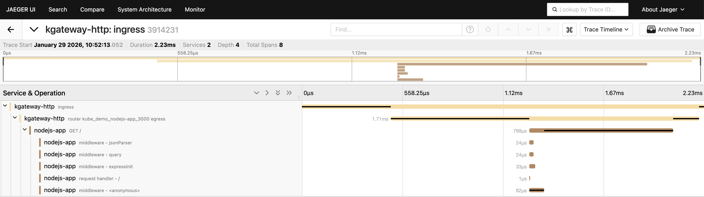
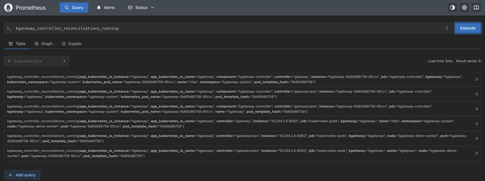

[kgateway](https://kgateway.dev/) is a Kubernetes Gateway API implementation
based on Envoy. Like other gateways and ingress controllers, it sits directly on
the request path at the edge of the cluster, terminating connections, applying
routing rules, and forwarding traffic to backend services. Because every
external request flows through it, the gateway is also one of the most valuable
places to observe what users actually experience.

In this post, we’ll look at kgateway’s OpenTelemetry support from two angles.
First, we’ll examine how traces, logs, and metrics are exposed in practice using
a small, self-contained test environment. Second, we’ll evaluate that behavior
using a draft maturity framework that breaks “OpenTelemetry support” into a set
of concrete dimensions. The goal isn’t to produce a score, but to make
trade-offs and friction points visible.

## How we’ll evaluate OpenTelemetry support

OpenTelemetry support isn’t binary. Most projects land somewhere in between:
traces might be native, metrics might still rely on Prometheus scraping, logs
might correlate cleanly in some paths but not others. To make those differences
easier to talk about, we’ll use a draft maturity framework that evaluates
OpenTelemetry support across several independent dimensions.

The full draft of the framework lives in a public GitHub issue, where feedback
and discussion are very welcome:
[https://github.com/open-telemetry/community/issues/3247](https://github.com/open-telemetry/community/issues/3247)

At a high level, the framework looks at OpenTelemetry support across the
following dimensions, each evaluated independently on a scale from _Level 0
(Instrumented)_ to _Level 3 (OpenTelemetry-Optimized)_:

- **Integration Surface** – how users connect the project to their observability
  pipelines
- **Semantic Conventions** – how consistently telemetry meaning aligns with
  OpenTelemetry conventions
- **Resource Attributes & Configuration** – how identity and configuration
  behave across environments
- **Trace Modeling & Context Propagation** – how traces are structured and how
  context flows **Multi-Signal Observability** – how traces, metrics, and logs
  work together in practice
- **Audience & Signal Quality** – who the telemetry is designed for and how
  usable it is by default
- **Stability & Change Management** – how telemetry evolves once users depend on
  it

This framework is an early draft, and this post should be read as an application
of the framework rather than a definitive judgment of the quality of the support
of OpenTelemetry in kgateway. Gateways are a particularly useful place to test
this framework, because they exercise all three current stable OpenTelemetry
signals (logs, metrics, traces) and sit at a natural boundary in terms of cloud
native architectures: the edge of Kubernetes clusters.

## Evaluation environment

The observations in this post are based on a
[small test environment built around kgateway](https://github.com/dash0hq/dash0-examples/tree/main/kgateway).
It includes kgateway running as a Gateway API data plane, an in-cluster
OpenTelemetry Collector, and a simple Node.js backend used to generate realistic
request traffic.

Telemetry is collected using OpenTelemetry-native mechanisms and exported to an
open source observability stack: traces to _Jaeger_, metrics to _Prometheus_,
and logs to _OpenSearch_. Rather than walking through the setup step by step,
the purpose of this environment is to validate how kgateway behaves once
telemetry is enabled and traffic is flowing.

This keeps the focus on signal behavior and integration characteristics, rather
than on deployment mechanics.

## Tracing at the gateway

Tracing is where kgateway is at its strongest. Tracing is configured
declaratively using the Gateway API’s policy attachment model via
`HTTPListenerPolicy`. No application changes or sidecars are required.

Under the hood, kgateway relies on Envoy’s native OpenTelemetry support and
exports spans directly over OTLP/gRPC. If a request arrives with W3C trace
context headers, kgateway continues that trace. If it doesn’t, the gateway
creates a new root span at the edge. In both cases, the gateway becomes a
first-class participant in the distributed trace.

An important detail is upstream span creation. kgateway can optionally emit a
span representing the hop from the gateway to the backend service. This makes
routing latency and gateway-introduced delays visible without overwhelming the
trace with internal implementation detail.

In Jaeger, this results in traces that feel complete. The entry point is clear,
the handoff to the backend service is explicit, and the gateway no longer
appears as an opaque box at the front of the trace.

## Access logs with native OpenTelemetry correlation

Access logs are another strong area. kgateway can export structured access logs
directly over OTLP/gRPC using Envoy’s OpenTelemetry access log sink. Logs are
emitted as OpenTelemetry `LogRecord`s rather than plain text.

The key difference compared to many ingress setups is correlation with tracing
data through trace context. Trace ID and span ID are attached automatically at
the LogRecord level. There is no need to inject `traceparent` into the log body
and no need to write parsing or transformation rules to extract it later, or
other commonplace workarounds to backfill the trace-context correlation from
logs to spans.

The log body itself is configurable using Envoy's standard formatting operators,
allowing request metadata, response codes, timing information, and upstream
details to be included directly in the log record.

This makes logs feel like a first-class OpenTelemetry signal rather than
something retrofitted onto a tracing pipeline.

## Metrics: powerful, but still Prometheus-native

Metrics are where kgateway follows a more traditional path. Both the controller
and the Envoy data plane expose metrics exclusively in Prometheus format. These
include the full set of Envoy statistics \- request counts, response codes,
connection pools, upstream health \- alongside controller-level reconciliation
and lifecycle metrics.

There is no OTLP metrics export option today. To bring metrics into the same
observability pipeline, the OpenTelemetry Collector scrapes the Prometheus
endpoints using the Prometheus receiver. From there, metrics can be enriched
with Kubernetes resource attributes and queried using PromQL.

This approach works well in practice and mirrors how many Envoy-based projects
are observed today. However, it does mean that metrics follow a different
collection model than traces and logs, which are pushed over OTLP. This further
reinforces that it does not follow OpenTelemetry HTTP or RPC semantic
conventions, and neither has the built-in notion of metric unit.

## Summary view: kgateway OpenTelemetry maturity

Before diving into each dimension, the radar chart below provides a high-level
overview of how kgateway’s OpenTelemetry support shapes up across the framework.

_Each dimension is scored independently on a 0–3 scale, where higher values
indicate deeper, more intentional OpenTelemetry integration._

The purpose of this chart isn’t to produce a single score. It’s to highlight
where the experience is already strong and where users are likely to feel
friction. In kgateway’s case, the shape reflects a project that is
OpenTelemetry-native for traces and logs, with metrics still anchored in the
Prometheus ecosystem.

## Dimension-by-dimension analysis

### Integration Surface

kgateway exposes tracing and logging via OTLP/gRPC using a Gateway API–native
policy resource. This provides a clean integration surface: configuration is
declarative, works across environments, and fits naturally into Collector-based
pipelines.

Metrics, however, are exposed only via Prometheus endpoints and do not follow
HTTP or RPC semantic conventions. As a result, users interact with two
integration paths: OTLP for traces and logs, and Prometheus scraping for
metrics.

OpenTelemetry is the primary interface for two signals, but not all three.

### Semantic Conventions

Because kgateway builds on Envoy’s OpenTelemetry support, traces and logs follow
familiar shapes and are easy to interpret using standard OpenTelemetry
knowledge. In terms of spans, HTTP semantics are consistent, and correlation
works without project-specific interpretation.

One caveat is that some HTTP attributes still follow older OpenTelemetry
semantic conventions. For example, spans use `http.status_code` rather than the
current `http.response.status_code`, and legacy HTTP attribute names such as
`http.method` and `http.url` are present. This indicates partial alignment with
OpenTelemetry semantic conventions, but not full adherence to the latest
recommendations.

Telemetry is generally consistent and interoperable, with room for more
intentional refinement.

### Resource Attributes & Configuration

kgateway exposes a stable `service.name` and behaves predictably across
namespaces and environments. However, resource identity is intentionally minimal
at the source and relies heavily on downstream enrichment rather than explicit
modeling by the gateway itself.

Only a limited subset of standard service-level resource attributes is emitted
at the source. While `service.name` is present, attributes such as
`service.namespace`, `service.version`, and `service.instance.id` are not set.
In addition, service naming is not fully consistent across signals, with
different values observed between traces and logs. This limits the ability to
group related gateway components, distinguish replicas, or compare behavior
across releases without additional pipeline-level normalization.

Kubernetes resource attributes are largely absent at the source. Critical
identifiers such as `k8s.pod.uid`, `k8s.pod.name`, container, workload, node,
and cluster attributes are not emitted directly by kgateway. As a result,
standard Collector-side processors (such as the Kubernetes attributes processor)
must rely on indirect or connection-based association to derive workload and
infrastructure context, making enrichment dependent on pipeline topology and
deployment model.

Runtime customization of resource identity is limited. In particular,
`OTEL_RESOURCE_ATTRIBUTES` is not consistently honored by the gateway runtime,
and supported resource detectors are not documented as part of the gateway’s
observability contract. This limits users’ ability to inject environment,
ownership, or deployment-specific context at runtime without modifying gateway
configuration or relying entirely on downstream enrichment.

As a result, identity and configuration are stable in practice, but depend on
downstream enrichment and non-standard attributes rather than an explicit,
source-level resource model. This provides a workable baseline for many
deployments, but falls short of the explicit, interoperable, and
runtime-configurable resource modeling expected at higher maturity levels.

### Trace Modeling & Context Propagation

Context propagation follows W3C Trace Context standards, allowing kgateway to
participate cleanly in distributed traces regardless of upstream implementation
details. When incoming requests do not carry an existing trace context, the
gateway reliably creates a new root span at the edge, ensuring that traces
always have a well-defined starting point.

Beyond basic propagation, kgateway also supports optional upstream span
creation, emitting a client span that represents the hop from the gateway to the
backend service. This results in traces that clearly distinguish between ingress
handling and upstream request execution, making gateway-induced latency and
routing behavior visible without exposing unnecessary internal detail.

The trace model is intentionally focused on common synchronous request flows.
More advanced propagation formats or custom trace semantics are not enabled by
default, but Envoy’s extensibility model leaves room for such behavior to be
introduced through extensions or additional processing where required.

Overall, the resulting trace structure is coherent and predictable for typical
gateway workloads. While it does not attempt to capture more complex
asynchronous or domain-specific behaviors out of the box, it reflects deliberate
trace modeling choices rather than reliance on defaults alone.

### Multi-Signal Observability

kgateway exposes three signals traces, logs, and metrics \- but does so using a
mixed delivery model. Traces and logs are emitted natively over OTLP, while
metrics are exposed in Prometheus format and collected through scraping.

Once ingested, these signals can be unified through the OpenTelemetry Collector
and correlated downstream. However, the difference in collection models
introduces a split in configuration and operational concerns. Traces and logs
follow a push-based, OpenTelemetry-native path, while metrics rely on
Prometheus-style pull semantics, including endpoint discovery and scrape
configuration.

In practice, this means that correlation across signals is achieved at the
pipeline level rather than being fully expressed by the gateway itself. This
approach works well and aligns with common Envoy and Prometheus-based
observability patterns today, but it falls short of a fully OTLP-first,
multi-signal experience.

### Audience & Signal Quality

From a user perspective, kgateway’s telemetry is immediately usable. OTLP-native
tracing and automatically correlated access logs significantly reduce the effort
required to understand request flows through the gateway. Users can move between
traces and logs without manual trace ID injection, custom parsing, or additional
correlation logic.

Telemetry defaults are sensible and work without extensive customization. Common
debugging workflows \- such as identifying slow requests, understanding routing
decisions, or validating upstream responses \- are supported out of the box once
data is ingested into an OpenTelemetry-compatible backend.

The signals are primarily optimized for infrastructure and platform engineers
rather than application developers. Telemetry focuses on gateway behavior,
routing, and latency rather than business-level or application-specific
semantics, which is appropriate for this layer but also defines the scope of its
usefulness. This makes the telemetry particularly well suited for platform and
infrastructure teams operating shared gateways.

### Stability & Change Management

In observed behavior, kgateway’s telemetry is stable and predictable. Span
structure, attribute presence, and signal behavior appear consistent across
executions, which is important for users building dashboards, alerts, and
operational workflows that depend on this data.

However, stability at scale also depends on explicit commitment. There is
limited documentation describing telemetry as a long-lived contract, and changes
to emitted attributes, naming, or structure are not clearly governed or
communicated from an observability perspective. As more users depend on this
telemetry for production workflows, this lack of explicit guarantees can
increase the cost of upgrades or changes.

Today, stability is achieved primarily through implementation consistency rather
than through formal change management, versioning, or published expectations
around telemetry evolution.

## Where kgateway lands

Taken together, kgateway’s OpenTelemetry support aligns most closely with
**Level 2** overall. OpenTelemetry is clearly a primary integration path for
tracing and logging, configuration is Gateway API–native, and correlation across
signals works once telemetry is ingested into an OpenTelemetry pipeline.

At the same time, several aspects limit higher maturity. Metrics remain
Prometheus-first, resource identity is largely derived through downstream
enrichment rather than explicit source-level modeling, and runtime
configurability of telemetry is limited. These trade-offs do not prevent
effective observability, but they do increase reliance on pipeline configuration
and external conventions.

This shape is common among Envoy-based infrastructure projects today. It
reflects a pragmatic balance between stability and adoption, while also
highlighting a clear path forward as OTLP metrics support matures and resource
modeling becomes a more explicit part of gateway observability design.

## A brief look ahead: agentgateway

It’s worth briefly mentioning [agentgateway](https://agentgateway.dev/) in the
context of the analysis above. While kgateway builds on Envoy and reflects the
current state of OpenTelemetry adoption in established gateway architectures,
agentgateway represents a newer class of Gateway API implementations designed
specifically for AI and LLM traffic.

agentgateway was built with OpenTelemetry as a first-order design constraint.
Traces and logs are emitted natively over OTLP, and metrics focus on
domain-specific signals such as token usage, model selection, and provider
behavior. As a result, observability concerns that appear as incremental
improvements in kgateway are foundational design choices in agentgateway.

Placed alongside kgateway, this contrast highlights how starting with
OpenTelemetry as the primary integration surface can shape observability
characteristics from the outset, rather than retrofitting them onto an existing
gateway model.

## Closing thoughts

kgateway demonstrates how far OpenTelemetry support at the gateway layer has
come. Native OTLP tracing and logging, clean context propagation, and
declarative configuration via the Gateway API make it straightforward to
integrate kgateway into modern, open source observability stacks.

At the same time, the analysis also makes the remaining gaps more visible.
Metrics still follow a Prometheus-first model, which works well operationally
but creates a split between push-based and pull-based telemetry. That split
isn’t unique to kgateway, but it does shape how platform teams design and
operate their pipelines.

This is exactly why a dimensional maturity model is useful. Instead of
collapsing “OpenTelemetry support” into a single label, it allows us to talk
concretely about where a project is strong, where it’s evolving, and where
trade-offs are still being made. We’ll continue to apply this framework across
the rest of the series, both to validate the model itself and to make
differences between gateway implementations easier to reason about.

If you have feedback on the framework, the dimensions, or the interpretation
here, the linked
[GitHub issue](https://github.com/open-telemetry/community/issues/3247) is the
place to join the discussion.
