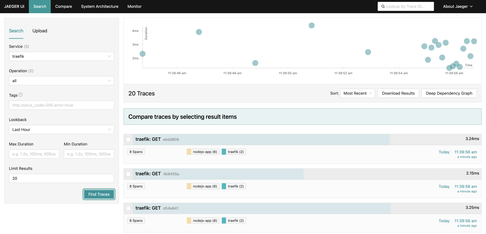
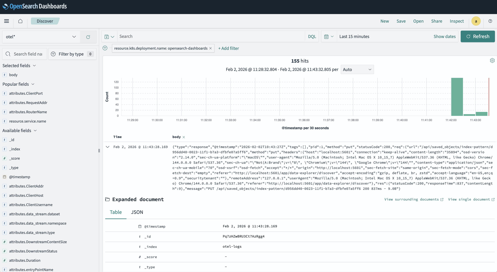
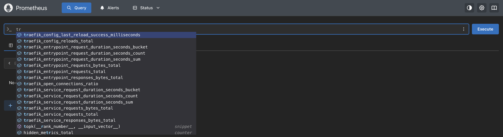
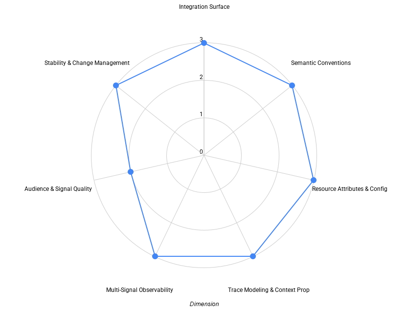

[Traefik](https://github.com/traefik/traefik/) is a widely adopted ingress
controller and edge router in the Kubernetes ecosystem, known for its dynamic
configuration model, broad protocol support, and strong community momentum.
Unlike many ingress controllers that build on Envoy, Traefik is implemented in
Go and follows a different architectural approach to request handling and
telemetry emission. That difference is reflected clearly in how Traefik
integrates with OpenTelemetry.

Ingress controllers sit at a critical boundary in Kubernetes environments. They
handle incoming traffic, apply routing and security policies, and often
represent the first observable hop when diagnosing user-facing latency or
failures. Because of this position, the quality, structure, and consistency of
telemetry emitted by an ingress controller can have an outsized impact on
operational visibility.

Recent developments in the Kubernetes ecosystem further underline the relevance
of ingress observability. With the
[announcement that ingress-nginx](https://kubernetes.io/blog/2026/01/29/ingress-nginx-statement/)
is being retired from the Kubernetes project, many teams are reassessing their
ingress choices and evaluating alternatives such as Gateway API–based
implementations, and other data planes. In that context, understanding how
ingress controllers integrate with OpenTelemetry becomes an important input when
making long-term platform decisions.

This post examines Traefik’s OpenTelemetry support using the same
multi-dimensional maturity framework applied throughout this series. Rather than
treating OpenTelemetry support as a binary feature, the goal is to understand
how Traefik’s telemetry behaves in practice: where it is OpenTelemetry-native,
where standard pipeline enrichment is expected, and how well the resulting
signals support real operational workflows.

## How we evaluate OpenTelemetry support

OpenTelemetry support rarely evolves uniformly across all signals. Tracing,
logging, and metrics are often shaped by different historical decisions,
ecosystem norms, and backend assumptions. In ingress controllers, this is
especially visible: metrics were traditionally exposed for scraping, logging
formats evolved independently, and tracing was often added later.

To make these differences easier to reason about, this evaluation uses a draft
maturity framework that looks at OpenTelemetry support across a set of
independent dimensions:

- **Integration Surface** – how users connect the project to observability
  pipelines
- **Semantic Conventions** – how consistently telemetry meaning aligns with
  OpenTelemetry conventions
- **Resource Attributes & Configuration** – how identity and configuration
  behave across environments
- **Trace Modeling & Context Propagation** – how traces are structured and how
  context flows
- **Multi-Signal Observability** – how traces, metrics, and logs work together
  in practice
- **Audience & Signal Quality** – who the telemetry is designed for and how
  usable it is by default
- **Stability & Change Management** – how telemetry evolves once users depend on
  it

Each dimension is evaluated independently. Projects often land at different
maturity levels across different dimensions, and that is expected. Level 3 in
this framework represents OpenTelemetry-optimized behavior, where OTLP is
treated as the primary interface and telemetry design is intentional rather than
incidental.

The framework itself is still evolving and is being discussed openly in the
[OpenTelemetry community](https://github.com/open-telemetry/community/issues/3247).
This post should be read as an application of the framework, not as a definitive
or final judgment of Traefik’s observability design.

## Evaluation environment

The
[evaluation environment](https://github.com/dash0hq/dash0-examples/tree/main/traefik)
is intentionally simple and reflects a common local development workflow.
Traefik runs in a local kind cluster and is configured as an ingress controller
using Kubernetes-native resources. OpenTelemetry is enabled using Traefik’s
built-in exporters for tracing, logging, and metrics.

Request traffic is generated from the local machine to exercise ingress
behavior. A small backend service runs inside the cluster to verify that trace
context created or propagated by Traefik is preserved as requests flow
downstream. This allows ingress-level behavior and downstream trace continuity
to be observed without introducing unnecessary complexity.

An OpenTelemetry Collector acts as the central alignment point for all
telemetry. Traefik exports traces, logs, and metrics via OTLP. The Collector
receives all three signals, applies standard enrichment, and routes them to an
open source observability stack consisting of Jaeger for tracing, Prometheus for
metrics, and OpenSearch for logs.

The purpose of this environment is not to simulate production load, but to
observe how Traefik’s telemetry behaves once enabled and how signals align when
processed through a standard OpenTelemetry pipeline.

## Tracing at the ingress

Tracing is a strong and well-integrated aspect of Traefik’s OpenTelemetry
support. Traefik emits spans via OTLP, making OpenTelemetry the primary export
path for tracing rather than a secondary integration layered on top of an
existing system.

Trace context propagation follows the W3C Trace Context specification. Incoming
trace context is preserved, and when no upstream context is present, Traefik
correctly starts a new trace at the ingress boundary. This ensures that every
request entering the cluster has a well-defined trace root.

Span structure reflects Traefik’s internal request handling model. Traces
represent synchronous request flows through the ingress layer with predictable
parent–child relationships. While span depth and naming are relatively simple,
the resulting traces are consistent and easy to interpret.

For platform teams operating shared ingress controllers, this predictability is
valuable. Traces clearly show ingress latency, routing behavior, and downstream
propagation without introducing excessive noise or application-specific
semantics.

## Access logs and trace correlation

Traefik can export structured access logs via OTLP when explicitly enabled,
providing an OpenTelemetry-compatible export option alongside its existing JSON
log output. This OTLP-based log export is currently marked as experimental and
must be opted into through configuration, but it signals the project’s direction
toward integrating more closely with OpenTelemetry-based pipelines. Log records
include detailed HTTP request and response information and can be ingested
directly by OpenTelemetry Collectors, with downstream processing used to enrich
context and normalize fields where required.

Traefik logs are correlated with tracing data: Trace context, i.e., the
identifiers of the trace and the span being recorded as the log was produced,
are embedded directly in the OTLP log records emitted by Traefik. This means
logs are natively correlated with traces at the source, without requiring
parsing, extraction, or reconstruction of trace context downstream. Compared to
approaches that rely on text logs or post-hoc correlation logic, this
significantly reduces configuration toil, operational complexity and the risk of
correlation errors.

At the same time, Traefik’s access logs use a custom log schema rather than
OpenTelemetry semantic conventions. Field names such as `DownstreamStatus`,
`RequestMethod`, and `RequestPath` are expressive and internally consistent, but
they do not align with standardized OpenTelemetry attribute names, nor with
their customary naming scheme.

Since Traefik automatically sets the `k8s.pod.uid` attribute, Kubernetes
resource attributes such as pod, deployment, and namespace identifiers are
easily added by the OpenTelemetry Collector using the standard `k8sattributes`
processor without having to rely on brittle correlations like the connection ip,
which notoriously does not work when service meshes are used. This separation of
concerns aligns with common OpenTelemetry deployment patterns: Traefik provides
clean, correlated ingress-level telemetry, while the Collector enriches it with
environment-specific context and, where needed, normalizes log fields for
broader interoperability.

## Metrics: OpenTelemetry-native export

Traefik exports metrics using OTLP, treating OpenTelemetry as the primary
integration surface for metrics alongside traces and logs. Metrics are pushed
directly to the OpenTelemetry Collector, avoiding scrape-based configuration and
keeping telemetry export consistent across all signals.

This OTLP-first approach provides several advantages. It establishes a
vendor-neutral export contract, simplifies configuration by using a single
protocol across signals, and makes it possible to route metrics to different
backends without changing Traefik’s configuration. From the project’s
perspective, metrics are expressed as OpenTelemetry metrics.

In this evaluation, metrics are routed from the Collector to Prometheus, which
ingests OTLP data and stores the resulting time series in its native Prometheus
format. This conversion reflects the storage model of the chosen backend, not a
limitation of Traefik’s metrics export.

If an OpenTelemetry-native metrics backend were used instead, the same
OTLP-exported metrics would remain OpenTelemetry metrics end-to-end, preserving
OpenTelemetry metric semantics throughout the pipeline. The important
distinction is that Traefik’s export contract remains OpenTelemetry-native
regardless of where metrics are ultimately stored.

By treating OTLP as the primary metrics interface and delegating storage
concerns to the pipeline, Traefik enables flexible, future-proof metrics
integration while keeping observability configuration consistent across signals.

## Summary view: Traefik OpenTelemetry maturity

Before diving into each dimension in detail, it is useful to step back and
consider how Traefik’s OpenTelemetry support shapes up across the framework as a
whole.

Each dimension is evaluated independently on a 0–3 scale, where higher values
indicate deeper and more intentional OpenTelemetry integration. The purpose of
this evaluation is not to produce a single aggregate score, but to highlight
where the experience is already strong and where users are more likely to
encounter friction when operating Traefik as a shared ingress layer.

In Traefik’s case, the overall shape reflects a project that treats
OpenTelemetry as a first-class interface across all three signals. Traces, logs,
and metrics are exported via OTLP, with environment-specific context added
through standard Collector enrichment rather than source-level instrumentation.

## Dimension-by-dimension analysis

The sections that follow walk through each dimension in turn, grounding this
high-level view in concrete observations from the evaluation environment.

### Integration surface

From an integration perspective, Traefik presents a clean and consistent model.
All three telemetry signals are exported using OTLP, and configuration is
straightforward and Kubernetes-native.

The OpenTelemetry Collector plays a central role, but primarily as an enrichment
and routing layer rather than as a workaround for missing source-level
capabilities. This results in a relatively simple and portable integration
surface.

### Semantic conventions

Traefik’s telemetry generally follows established conventions, but alignment
with current OpenTelemetry semantic conventions is uneven. HTTP semantics are
clear, but log field names reflect Traefik’s internal schema rather than
standardized OpenTelemetry attributes. It would be really good if Traefik
aligned the naming scheme of their custom attributes to the OTel semantic
conventions, and published a semconv describing them and their meaning using
[OTel Weaver](https://github.com/open-telemetry/weaver).

This does not prevent effective observability, but it does require
transformation if logs are to be used with generic OpenTelemetry dashboards and
tools.

### Resource attributes & configuration

Traefik emits a stable service identity and behaves predictably across
environments. Kubernetes resource attributes are not fully emitted at the
source, but are consistently added by the OpenTelemetry Collector using standard
processors.

This pattern is widely used in OpenTelemetry deployments and does not limit
observability in practice. Runtime customization of resource identity is
possible through standard pipeline configuration, even if not treated as an
explicit source-level contract.

### Trace modeling & context propagation

Trace modeling in Traefik is deliberate and focused on synchronous HTTP request
flows. Context propagation follows open standards and behaves reliably across
ingress and downstream services.

More advanced propagation scenarios or domain-specific trace semantics are not
addressed by default, but Traefik’s extensibility leaves room for such behavior
to be introduced if needed.

### Multi-signal observability

Traefik emits traces, logs, and metrics using a consistent OTLP-first model.
This uniform export mechanism reduces pipeline complexity and avoids split-brain
observability setups.

Correlation between signals is native for traces and logs, with infrastructure
context added through standard enrichment. Metrics integrate cleanly into the
same pipeline, even when stored in a backend that uses a different internal
representation.

### Audience & signal quality

Traefik’s telemetry is well suited for platform and infrastructure teams
operating shared ingress controllers. Signals focus on routing behavior,
latency, response codes, and backend interaction, supporting common debugging
and operational workflows without requiring extensive customization.

### Stability & change management

Traefik is a mature project with a predictable release cadence. Telemetry
behavior is stable in practice, though not treated as an explicit contract with
versioned guarantees.

Users can rely on consistent behavior across releases, but clearer documentation
of telemetry stability and evolution would further strengthen long-term
confidence. While Traefik’s telemetry is highly usable for its intended
audience, it does not yet reach the level of being fully OpenTelemetry-optimized
by default. Access logs use a custom schema rather than OpenTelemetry semantic
conventions, and some signals require familiarity with Traefik-specific field
names or Collector-level transformation to integrate seamlessly with generic
OpenTelemetry tooling.

As a result, the telemetry is immediately valuable for platform and
infrastructure teams who understand ingress behavior and OpenTelemetry
pipelines, but it is not yet self-describing or semantically standardized enough
to be consumed universally without interpretation. Reaching that level \- where
signals are broadly usable out of the box across tools and audiences \- is what
distinguishes Level 3 in this dimension.

## Where Traefik lands

Taken together, Traefik’s OpenTelemetry support reflects a project that is close
to OpenTelemetry-optimized. By treating OTLP as the primary interface across all
signals and relying on standard pipeline enrichment, Traefik enables flexible,
interoperable observability with relatively low operational friction.

## Final thoughts

Traefik demonstrates how adopting OpenTelemetry as a first-class export
mechanism across traces, logs, and metrics can simplify observability pipelines
and future-proof telemetry design.

At the same time, this evaluation reinforces the importance of the OpenTelemetry
Collector as an architectural component. For Traefik, the Collector is where
enrichment, optional normalization, and backend routing occur, turning clean
OTLP signals into actionable observability.

The
[maturity framework](https://github.com/open-telemetry/community/issues/3247)
used here is intended to make those design choices visible and comparable, and
to support ongoing discussion as ingress controllers and OpenTelemetry continue
to evolve together.
