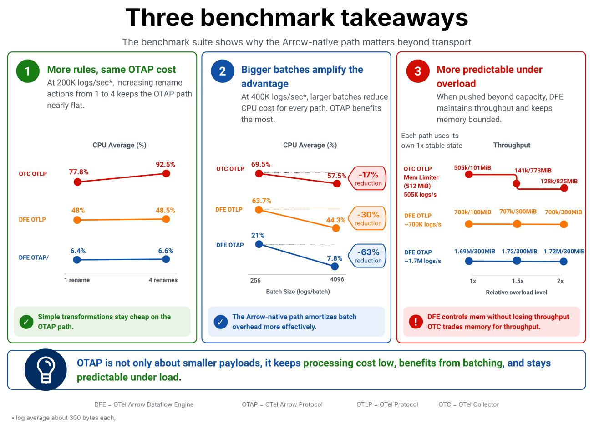
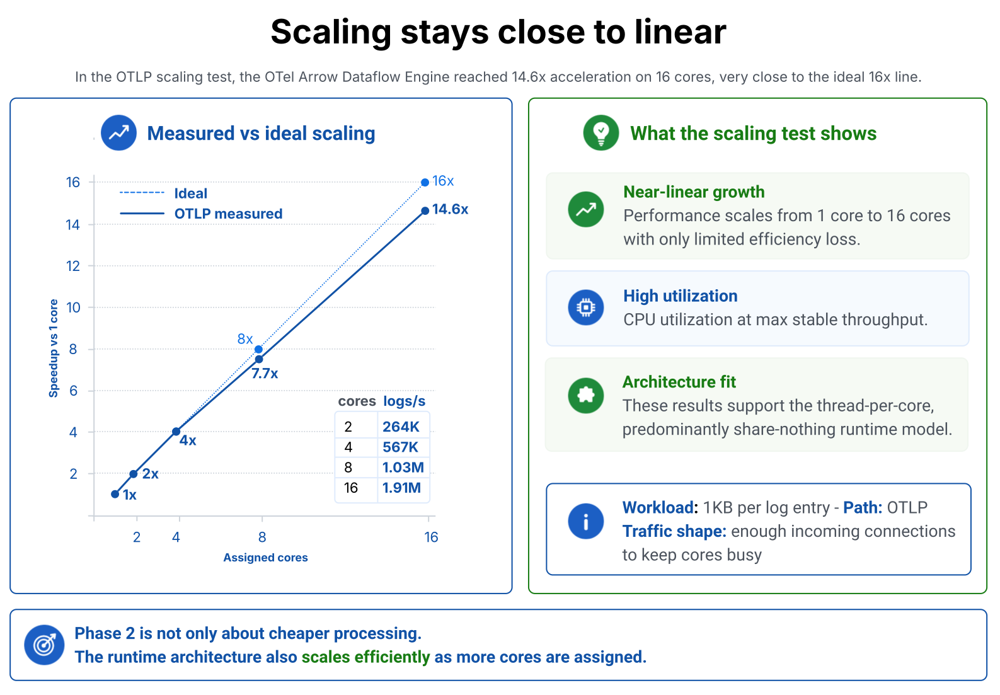
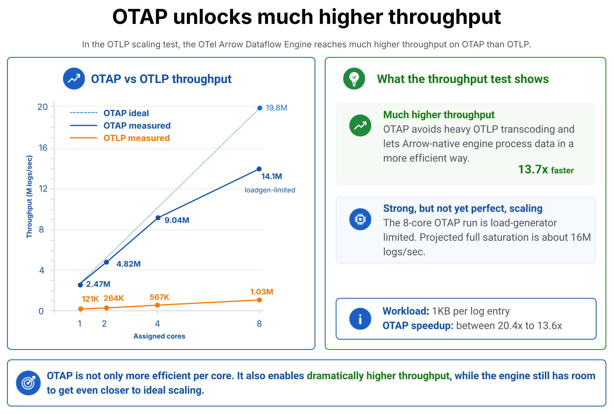

[Phase 1](https://github.com/open-telemetry/otel-arrow/blob/main/docs/phase1-overview.md)
of OTel-Arrow established OTAP, the OpenTelemetry Arrow Protocol, as an
efficient transport protocol for OpenTelemetry. Apache Arrow is a
language-independent, columnar in-memory format designed to move and process
structured data efficiently across systems. We demonstrated that telemetry
could be transported with significantly lower network overhead while preserving
compatibility with the OpenTelemetry data model.

[Phase 2](https://opentelemetry.io/blog/2025/otel-arrow-phase-2/) asked a
different question: what happens if Arrow is used not only on the wire, but
also as the representation the pipeline works with internally?

Telemetry volume is increasing quickly, driven by broader OpenTelemetry
adoption, richer instrumentation, and more dynamic AI and agentic workloads. At
that scale, common pipeline operations such as removing an attribute, renaming a
field, adding metadata, or routing signals need to stay cheap. Many of these
operations are simple and repetitive: if a processor touches an attribute in one
record, it will often touch the same attribute across many records in the same
batch.

That pattern maps well to a columnar representation. If telemetry can remain in
compact Arrow batches while processors rename attributes, enrich data, and route
signals, the pipeline can do less work around each transformation and use CPU
and memory more efficiently and predictably. We believe OTAP can play an
important role in helping OpenTelemetry pipelines handle this next phase of
telemetry growth more efficiently.

## A Dataflow Engine Built to Test the Native Arrow Path

To explore this idea, we built the OTel-Arrow Dataflow Engine. This Arrow-first
engine (written in Rust) is designed to build OTAP-based pipelines that can efficiently
consume and produce OTAP streams, while also supporting OTLP, Syslog ingestion,
and experimental STEF support through optimized conversions to and from OTAP.

Support for multiple protocols is essential because OpenTelemetry users should
not have to choose between compatibility and efficiency. The objective is to
preserve compatibility while introducing Arrow-native fast paths wherever the
workload justifies them.

The Go Collector remains the broadly deployed, general-purpose OpenTelemetry
Collector implementation. The purpose of this work is to explore what becomes
possible when a telemetry data plane is designed around an Arrow-native
representation and a bounded runtime model.

The Dataflow Engine uses a [NUMA-friendly](https://www.kernel.org/doc/html/v4.18/vm/numa.html),
[thread-per-core, share-nothing](https://seastar.io/shared-nothing/)
architecture. It emphasizes bounded channels and data structures, avoids
synchronization in hot paths, propagates ack/nack signals through pipelines,
and supports live pipeline reconfiguration through an admin API.

The important point is not that the implementation is in Rust. The benchmark
results should be read as measurements of data representation and runtime
design: Arrow-native processing, fewer conversion boundaries, bounded execution,
and explicit flow control.

In the diagrams below, DFE refers to the OTel-Arrow Dataflow Engine, while
Collector refers to the OpenTelemetry Collector implementation.

## Benchmark Highlights

The Phase 2 benchmarks were designed to answer three practical questions:

- Does keeping telemetry in an Arrow-native representation make real pipeline
  processing cheaper, or does OTAP only help on the wire?
- Can the runtime architecture turn that advantage into stable throughput as
  more CPU cores are assigned?
- How much additional throughput does native OTAP provide compared with OTLP
  on the same Dataflow Engine runtime?

Rather than walk through the full benchmark matrix in this post, we focus on
three summary diagrams that capture the most important results. The
[interactive benchmark](https://open-telemetry.github.io/otel-arrow/compare/)
site provides the complete view, including additional rates, batch sizes,
compression settings, memory behavior, network usage, and saturation markers.

### Benchmark Context

The benchmark uses a deliberately simple transformation operation: renaming log
attributes such as `exception.type` to `exception.kind`.

This kind of work appears frequently in OpenTelemetry pipelines. Teams rename
attributes during semantic convention migrations, normalize fields before
sending data to a backend, add environment metadata, or prepare telemetry for
routing, governance, and enrichment. Individually, these operations should be
inexpensive; when they are not, the cost is often the surrounding decode,
object-walk, allocation, and encode work.

The benchmarks shown here were run on an Intel Xeon Platinum 8581C system with
16 cores and 118 GiB of RAM, running Debian GNU/Linux 12.

## Result 1: OTAP Keeps Common Pipeline Work Cheap

Figure 1: Summary of transformation benchmarks showing sensitivity to the count of transformation rules,
batch-size behavior, and overload behavior.

The above diagram summarizes three important observations from the
transformation benchmarks.

The first observation shows that at 200K logs/sec, with approximately 300 bytes per log entry, increasing the
number of rename actions from one to four keeps the native OTAP path nearly
flat. The DFE OTAP path moves from 6.4% to 6.6% CPU.

The DFE OTLP path is an important middle point in this comparison. It pays an up-front cost of decoding OTLP and converting it into the OTAP-oriented internal path, which explains the more expensive baseline for a single operation. Once converted to an OTAP representation, the cost per additional operation remains as low as the end-to-end OTAP path.

The OTel Collector OTLP path represents the current Collector. It pays the high
up-front cost of decoding OTLP proto and then a further 3.75% CPU per operation
for a total of 92.5% CPU after four operations.

The second observation shows that at 400K logs/sec, larger batches reduce CPU cost for every path, but the OTAP
path benefits the most. It drops from 21% CPU at 256 logs per batch to 7.8% at
4096 logs per batch, which is the expected behavior for a compact, columnar,
batch-oriented representation.

The third observation is about overload behavior. In the overload scenario, the
Dataflow Engine keeps memory under control, while the Collector OTLP path grows
from 95 MiB to 14 GiB as saturation increases from 1x to 2x. This is not only a
protocol result. It also reflects the importance of bounded execution, explicit
flow control, and making overload visible rather than allowing memory to absorb
it.

Taken together, these results show that OTAP is not only about smaller payloads.
It keeps processing cost low, benefits significantly from batching, and helps make overload
behavior more predictable.

The next two results separate two questions: first, whether the Dataflow Engine
runtime scales when telemetry enters through OTLP, and second, how much more
throughput is available when the same runtime can stay on the native OTAP path.

## Result 2: Scaling Stays Close to Linear

Figure 2: OTLP scaling test comparing measured speedup with ideal linear
scaling from 1 to 16 cores.

The second diagram looks at the runtime architecture itself. In this OTLP
scaling test, the OTel-Arrow Dataflow Engine was evaluated from 1 core to 16
cores. The measured result reached 14.6x acceleration on 16 cores, very close to
the ideal 16x line, and reached 1.91M logs/sec on 16 cores.

This result is important because Phase 2 is not only about a new protocol. It is
also about the runtime model around the OTAP-oriented internal path. In this
test, telemetry enters as OTLP and must be decoded and converted before
processing can happen. Even with that conversion cost, the thread-per-core,
share-nothing architecture with bounded flow control converts additional
assigned cores into stable throughput with limited efficiency loss.

## Result 3: OTAP Provides Higher Throughput on the Same Runtime

Figure 3: Throughput comparison between OTAP and OTLP paths on the OTel-Arrow
Dataflow Engine.

The third diagram compares OTAP and OTLP throughput on the same Dataflow Engine
runtime. At 8 cores, the OTAP path reaches 14.1M logs/sec, while the OTLP path
reaches 1.03M logs/sec. That is about 13.7x higher throughput for OTAP in this
test.

This result shows the effect of removing the OTLP conversion boundary. OTAP
avoids heavy OTLP transcoding and lets the Arrow-native engine process data
more directly. The 8-core OTAP run is load-generator limited, and the projected
full-saturation throughput is about 16M logs/sec, so there is still room to
move closer to ideal scaling.

## Key Takeaways

These three benchmark summaries support the main direction of Phase 2. OTAP
reduces the cost of representing telemetry. The OTel-Arrow Dataflow Engine
preserves that advantage through processing, scales it across cores, and keeps
overload behavior visible and contained. For production telemetry pipelines,
that predictability matters as much as raw throughput. OTAP is not only cheaper
per operation; it also enables much higher throughput on the same runtime.

These comparisons should be read as measurements of the specific benchmark
paths and configurations shown here, not as universal claims about every
possible Collector deployment. The full benchmark matrix is available on the
[interactive benchmark site](https://open-telemetry.github.io/otel-arrow/compare/)
for readers who want to explore the raw charts and configuration details.

## Why Arrow Changes the Cost Model

The benchmark results are not only about avoiding serialization. They show a
deeper change in the cost model of telemetry processing.

In a traditional OTLP-oriented path, telemetry usually arrives as protobuf
bytes. Before a processor can act on it, the pipeline often needs to decode
those bytes into nested objects, walk resource, scope, and signal structures,
update attribute collections, allocate memory, and then encode the result again.
For simple operations such as attribute renames, this surrounding work can cost
more than the transformation itself.

With an OTAP-native path, telemetry can remain in Arrow record batches.
Processors can operate on a compact, columnar, batch-oriented representation,
with better memory locality and fewer allocations. Repeated values are grouped
more naturally, compression has a more favorable layout to work with, and
processors can take advantage of Arrow kernels, dictionary encodings, or
vectorized execution where the operation fits the columnar model.

In short, OTAP does not only reduce the number of bytes on the network. Its
larger opportunity is to reduce overhead inside the telemetry data plane itself.

## Current Maturity Level

The OTel-Arrow Dataflow Engine has reached a maturity level where many essential
capabilities are usable in realistic environments. It is still more accurate,
however, to describe it as an incubation-stage project than as a broadly
production-stabilized platform for external users.

Production users should treat the engine as something to evaluate, benchmark,
and shape through feedback, not as a drop-in replacement for existing Collector
deployments today.

Configuration formats, APIs, component interfaces, and certain operational
semantics may still evolve during Phase 3 as benchmarks improve, real-world
experimentation progresses, and community feedback accumulates. This caution is
intentional: the goal is to stabilize the engine once the architecture,
operational model, and integration boundaries are fully validated, rather than
freezing interfaces too early.

That does not mean reproducing the Collector's configuration, pipeline, or
operational semantics one-for-one. The goal is to define semantics that fit a
bounded, columnar runtime, then make the integration points with the broader
OpenTelemetry ecosystem explicit.

## Phase 3

Phase 3 is currently under discussion. It is expected to target a first stable,
production-usable release, with significant improvements in several areas:

- **Pipeline-level control mechanisms**: inter-pipeline topics, tenant-aware
  resource governance, live reconfiguration with rollback support, and
  possible OpAMP support.
- **Core component ecosystem**: receivers, processors, exporters, and extensions
  covering the majority of common telemetry pipelines, implemented in Rust and
  maintained within OpenTelemetry.
- **Extensibility and processing**: a WASM-based extension model for specialized
  components, exploration of compatibility paths for selected Collector
  components, and a new OTAP-native transform processor with OTTL-compatible
  transformations and the experimental OPL language.
- **Ecosystem validation and guidance**: collaboration with the OpenTelemetry
  Demo and relevant Blueprint efforts to validate OTAP and the Dataflow Engine
  in realistic end-to-end scenarios.

OPL, or OpenTelemetry Processing Language, is currently being specified and
implemented. It is intended to be stream-oriented, strongly typed, and safe for
processing signals that comply with the OpenTelemetry data model. This
processing language could also enable predicate and projection pushdown,
allowing receivers to apply filtering and field-selection requirements closer
to the source when supported.

We are also exploring native integration with agentic workflows, enabling agents
to discover engine capabilities, configuration possibilities, and internal
telemetry, and to safely validate generated configurations. During Phase 3, we
will begin a second round of discussions with the OpenTelemetry Governance
Committee to evaluate how this engine could integrate into the broader
OpenTelemetry ecosystem.

## Conclusion

OTAP is not simply a more compact network format. When telemetry remains inside
an Apache Arrow data model through transport and pipeline processing, the
pipeline can avoid repeated deserialization, object reconstruction, allocations,
copies, and reserialization, while opening the door to vectorized processing and
higher compression ratios.

Combined with an architecture grounded in bounded runtime design, this
representation enables gains across multiple dimensions: network efficiency, CPU
consumption, memory usage, stability under load, and controlled reconfiguration.
That is why we believe the Arrow-native path is an important direction for
OpenTelemetry as telemetry volumes continue to grow and observability pipelines
are expected to perform more work before data reaches the backend.

We would particularly welcome feedback from the OpenTelemetry community around
runtime semantics, operational models, processing APIs, pipeline guarantees, and
OTAP-native processing patterns. We are also interested in benchmark ideas,
real-world pipeline designs, and configurations that significantly improve
throughput, efficiency, memory behavior, or overload handling. We would like to
use them to challenge our assumptions and raise the performance and scalability
bar for telemetry pipelines. 

Join the discussions in the
[otel-arrow](https://github.com/open-telemetry/otel-arrow/discussions) GitHub
project, on the [#otel-arrow](https://cloud-native.slack.com/archives/C07S4Q67LTF)
Slack channel, or in the relevant OpenTelemetry
[SIG meetings - Arrow](https://github.com/open-telemetry/community/tree/main#sig-arrow).
Contributions are welcome. For larger contributions, we strongly encourage
opening a [GitHub issue](https://github.com/open-telemetry/otel-arrow/issues)
before beginning implementation work and using SIG discussions for early
feedback when the change affects architecture, semantics, or broader ecosystem
integration.
