In 2024, the End User SIG conducted a
[Collector Survey](/blog/2024/otel-collector-survey/) to gather feedback on how
the [OpenTelemetry Collector](/docs/collector/) is used in practice and the user
experience. Insights from that survey informed several development and
prioritization decisions within the community.

As a follow-up, we conducted another survey in 2025 to understand how deployment
practices, usage patterns, and implementation challenges have evolved since
then. This blog post presents an analysis of the results, highlighting notable
changes compared to the previous year.

## Key takeaways

- Collector deployments continue to scale (65% run more than 10 collectors),
  with Kubernetes remaining dominant (81%) while virtual machine (VM) usage
  increased significantly from 33% to 51%.
- A quarter of users with a relatively small deployment size, and about half of
  users with large deployment sizes, use both Kubernetes and VMs.
- An additional 13% of people now build their own Collector, and 61% of OTel
  users could not admit that
  [OpenTelemetry Collector Builder](/docs/collector/extend/ocb/) is easy to use.
- Large organizations (>100 Collectors) collect more metrics and logs. On the
  other hand, smaller organizations (<100 Collectors) collect more traces.
- Otlphttpexporter, datadogexporter, filelogreceiver, k8sclusterreceiver,
  k8sclusterreceiver, filereceiver, Attributesprocessor, transformprocessor,
  Routingconnector, datadogconnector, Storage, zpages, and filestorage usage
  increased in usage, while Memorylimiterprocessor reduced.
- Configuration management and resolution, stability, and Collector
  observability are the top improvement requests.

## Detailed insights

### Deployment scale and environment

Last year, the question of the number of Collectors our users have in production
was categorized differently from this year. This is because a lot of people
reported having more than 10 Collectors in production in the 2024 survey, and
that led us to break the categories into more levels in the 2025 survey. For
comparison, we scaled down the 2025 category and found that 65% (+10%) have more
than 10 Collectors, 15%(-7%) have between 2 and 5 Collectors, and we see no
change in the number of users with 1 Collector and 6-10 Collectors.

In terms of the deployment location, OTel users still have a huge preference for
Kubernetes (81%, same as the previous year), 51% (+18%) reported using VMs, and
18% (+7%) use bare metal. In the 2025 survey, none of the respondents selected
HashiCorp Nomad as their preferred deployment location.

The 18% increase in the usage of VMs raised questions like what percentage of VM
users also use Kubernetes, and what are their deployment sizes? We found that a
quarter of users with a relatively small deployment size (<100 collectors), and
about half of the users with large deployment sizes (>100 collectors), use both
Kubernetes and VMs.

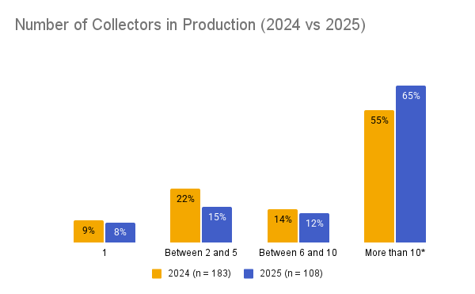

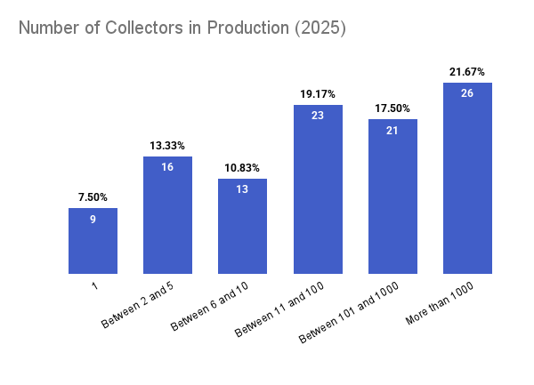
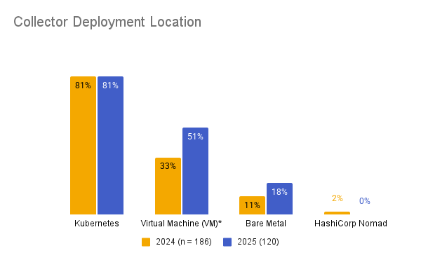

Deployment location with \* implies significance at 90% confidence level

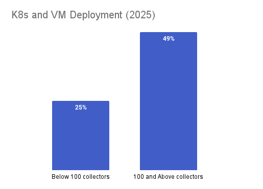

### Usage and deployment scenarios

The Kubernetes usage scenarios show a similar trend to last year's survey: 58%
(-7%) gateway, 50% (-2%) daemonset, 23% (-1%) sidecar, and 14% (+1%)
statefulset. These percentage differences are negligible.

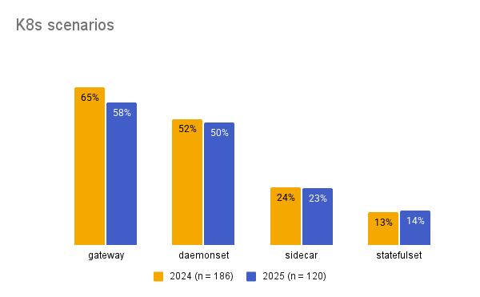

### Customization and configuration

The number of OTel users who build their own Collector increased to 46% (+13%).
Out of these 55 builders of their own Collectors, 47 (86%) use the OpenTelemetry
Collector Builder (in comparison with 80% last year), and 21 (~25%) of users
reported the Collector Builder to be hard to use, against just 2 last year.

It is also important to note that only 39% of the respondents confidently agreed
that the Collector Builder is easy to use, leaving 61% saying either neutral or
hard to use (signaling a lot of room for improvement).

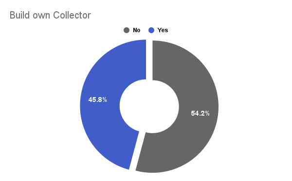 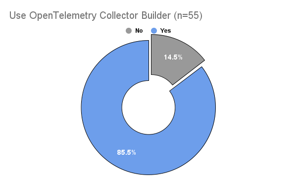
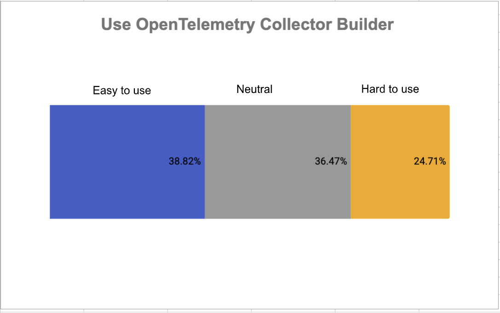

### Monitoring and observability

Regarding the monitoring of Collectors, about 23% (-6% from last year) reported
not monitoring Collectors. However, in the 2024 survey, 82% reported collecting
internal metrics and logs, and the 2025 survey reveals that 83% collect metrics,
61% collect logs, and 25% collect traces. This indicates that metrics are the
most commonly collected internal telemetry. Furthermore, we checked if the
number of Collectors informs the type of telemetry monitored. We found that
people who run 100+ Collectors certainly collect metrics but rarely traces.

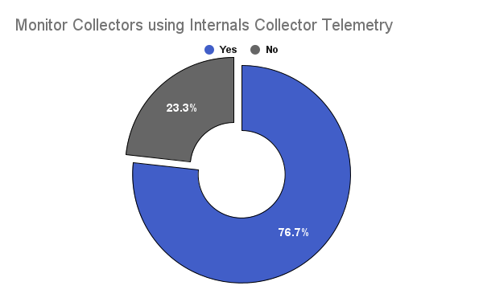
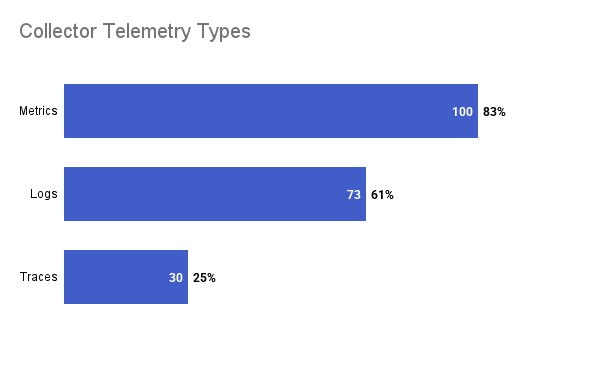
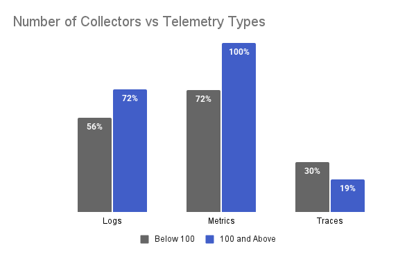

### OTel component usage

In our attempt to compare how component adoption has changed between 2025 and
the previous year, we calculated a difference in percentages of the top 10
components (using the 2025 survey), and the following component usage changed
significantly at 90% confidence level:

- **Receivers** : Filelogreceiver, k8sclusterreceiver, and filereceiver
  increased
- **Processors** : Attributesprocessor and transformprocessor increased while
  Memorylimiterprocessor reduced.
- **Exporters** : Otlphttpexporter and Datadogexporter increased while
  lokiexporter decreased.
- **Connectors** : Routingconnector and datadogconnector increased.
- **Extensions** : Storage, zpages, and filestorage increased.

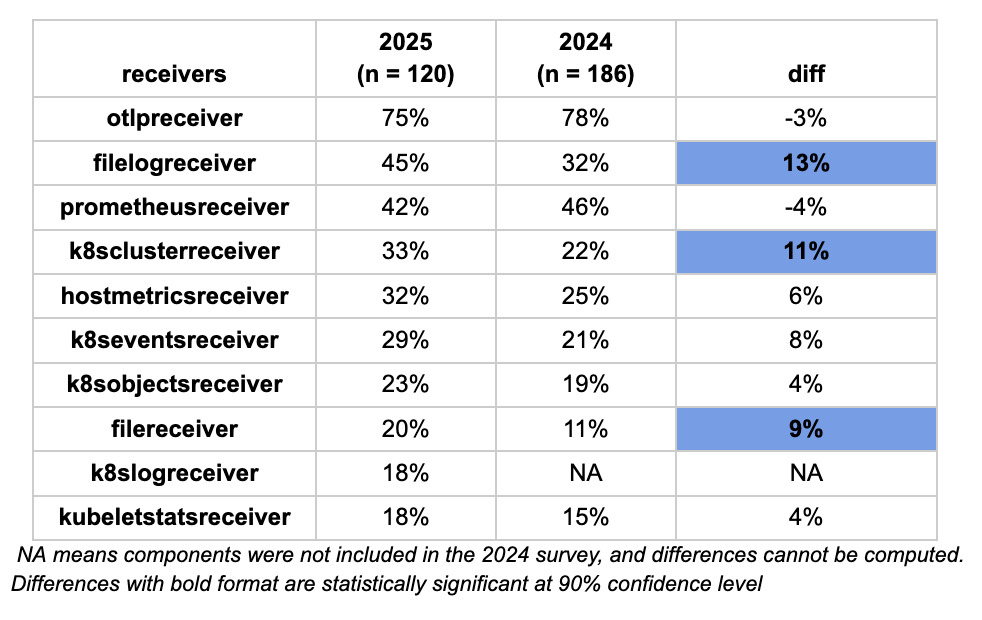 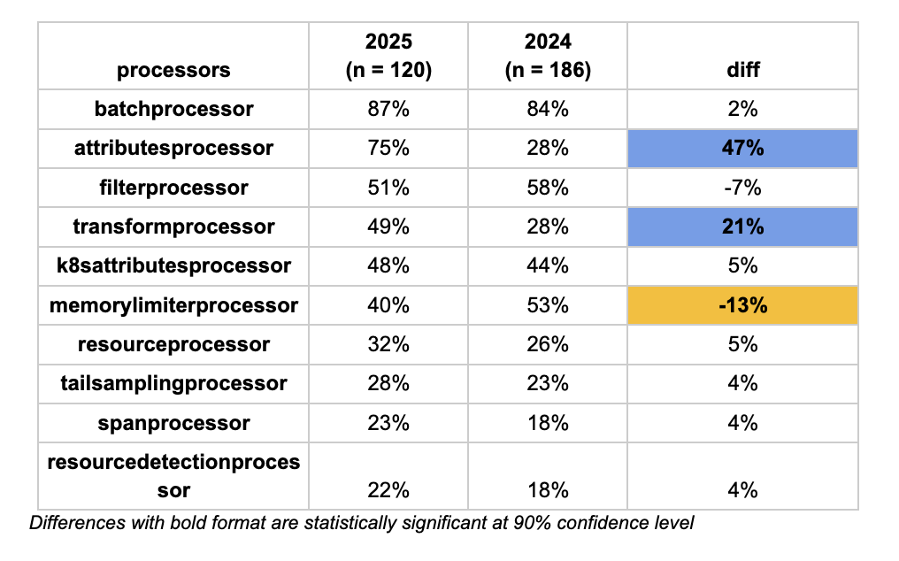 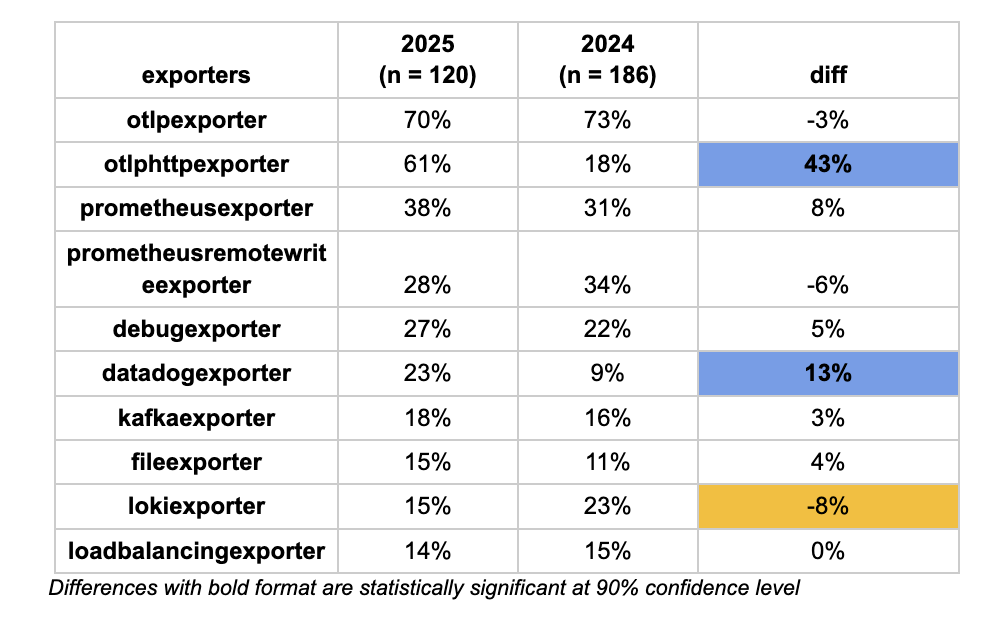
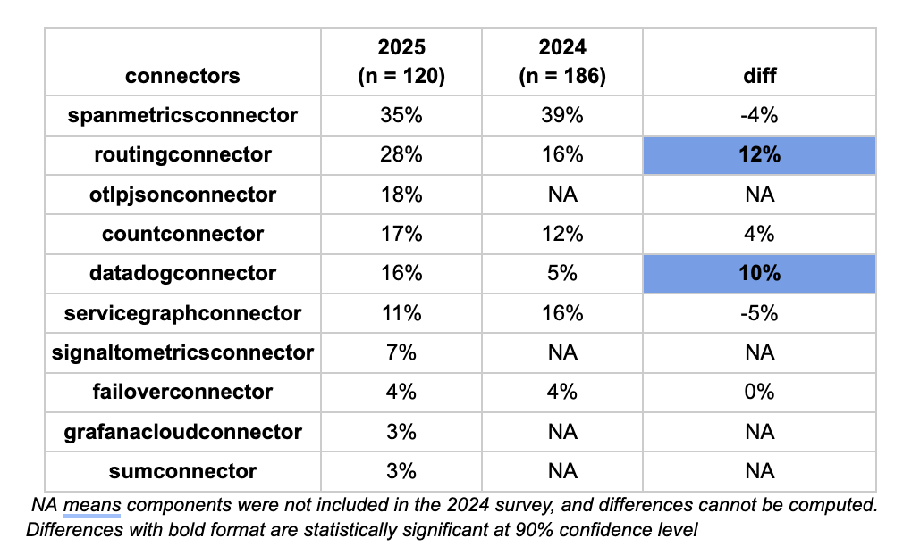 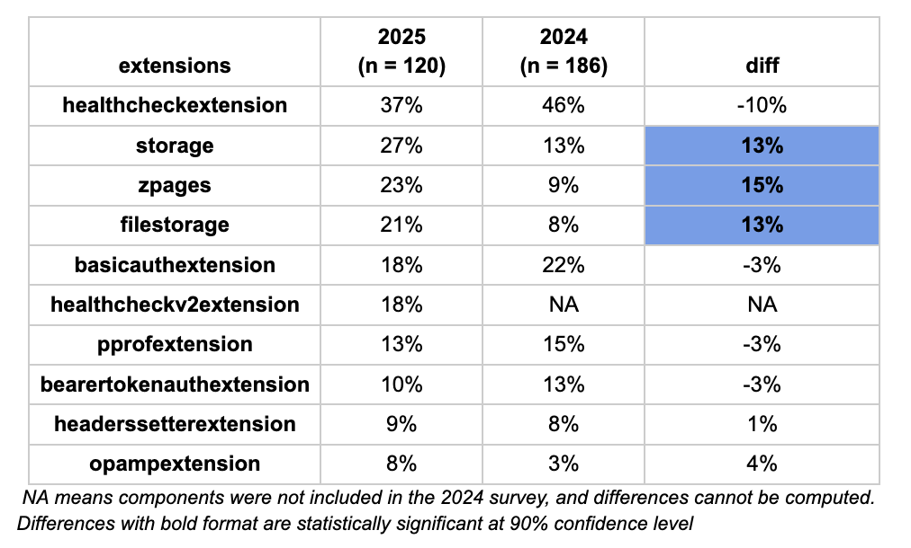

## Areas for improvement

OTel users expressed the area of improvement they’d want in multiple responses:
About 63% said configuration management and resolution, 52% stated stability,
43% want Collector observability to improve, and 29% want support for more
receivers or exporters.

> [!NOTE]
>
> We cannot directly compare the 2024 results with the 2025 results for this
> question because they were asked differently.

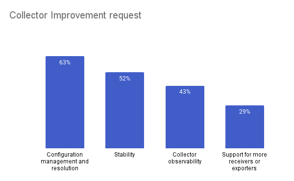

In more detail, the users expressed their suggestions on what should be improved
in words:

### Configuration, reconfiguration, and operational flexibility

Users consistently highlighted the difficulty of operating the Collector in
dynamic, production environments, especially when configuration changes require
full restarts. There is a strong desire for more granular reconfiguration
capabilities that allow individual pipelines to be modified or restarted
independently, enabling safer and more flexible operations at scale.

> _“Single pipeline reconfiguration and restarts without the need to break other
> connections and pipelines — the whole collector should not be restarted if a
> single pipeline needs to be changed.”_

### Performance, scalability, and resource efficiency

As Collector deployments grow, performance and resource usage are becoming more
visible bottlenecks. Respondents pointed to startup latency and high resource
consumption in certain components as issues that directly impact their ability
to run the Collector efficiently in large or resource-constrained environments.

> _“The spanmetrics connector requires a lot of resources, and faster startup
> time would significantly improve operating the Collector at scale.”_

### Documentation quality, accessibility, and signal consistency

Documentation emerged as a recurring challenge, particularly for advanced
configuration, cross-signal consistency, and practical usage guidance. Users
also emphasized the need for clearer documentation across different signals and
better accessibility for non-English-speaking communities.

> _“Documentation needs to be improved, with more consistent signal support and
> better guidance — including resources in languages beyond English.”_

### Developer experience and extensibility

Building custom components is powerful but difficult, with users describing a
steep learning curve and a lack of clear, up-to-date guidance. Many reported
relying on GitHub issues rather than official documentation to understand best
practices, making extensibility harder than necessary.

> _“Learning the best and most recent patterns for writing custom exporters was
> extremely painful — we had to rely mostly on GitHub issues to understand the
> direction the community is taking.”_

### Ecosystem gaps and component coverage

Respondents highlighted missing or under-maintained components as a blocker to
broader adoption, particularly for specific platforms, exporters, and receivers.
In some cases, users resorted to running standalone components or building
custom exporters to fill these gaps.

> _“We are using a standalone CloudWatch exporter because the
> awscloudwatchmetricsreceiver has no maintainers.”_

### Reliability, health, and backward compatibility

Running the Collector reliably in production remains a key concern, with users
calling for stronger health checks, safer upgrades, and clearer backward
compatibility guarantees to reduce operational risk.

> _“A more robust health extension and stronger backward compatibility
> guarantees are essential for operating the Collector safely in production.”_

## Conclusion

The 2025 follow-up survey reinforces what OpenTelemetry users already experience in practice: the
OpenTelemetry Collector is firmly established as production infrastructure, but operating it at scale
remains challenging. Deployments are larger and more hybrid, customization is increasing, and component
usage continues to evolve, yet configuration management, stability, observability, and documentation
still represent meaningful friction for users. These results highlight where continued community
investment can have the most impact—not just in adding new capabilities, but in making the Collector
easier to operate, extend, and evolve safely in real-world environments. These insights will help inform
ongoing discussions and prioritization across the project as the Collector continues to grow with its
users.
