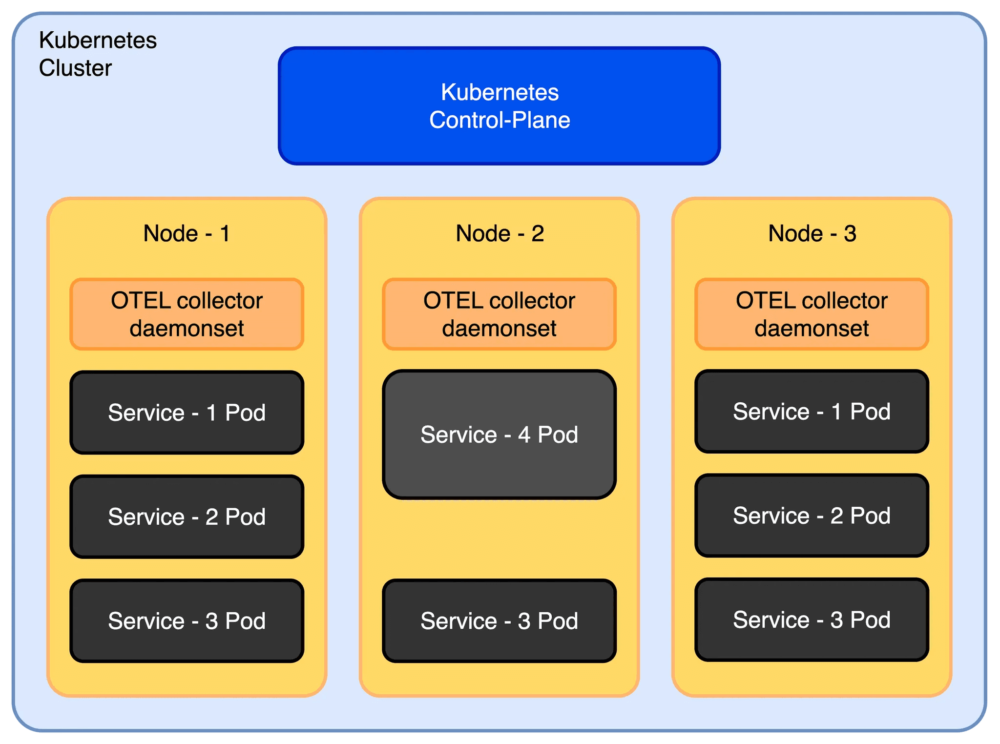
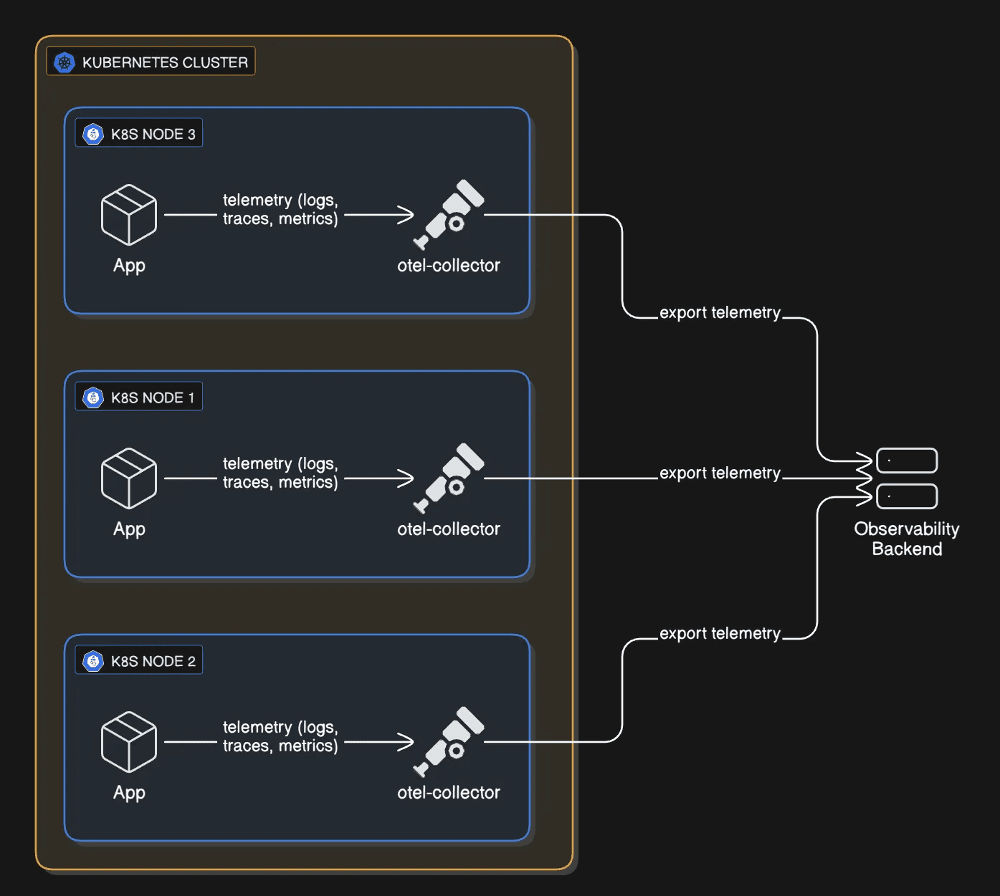
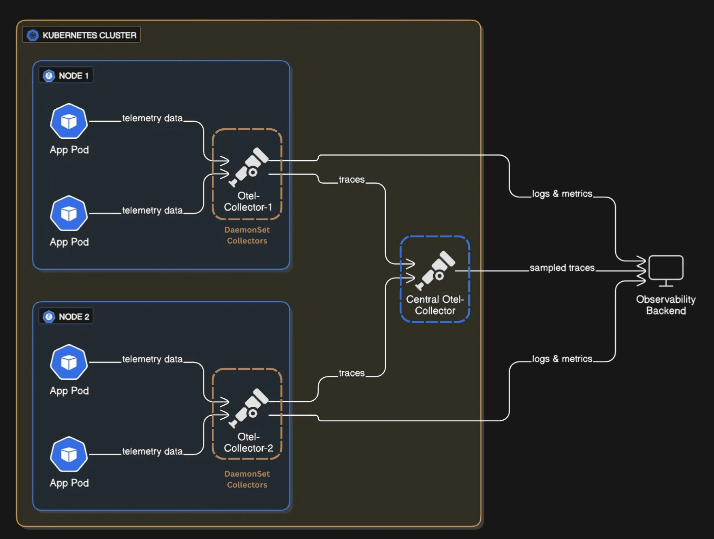
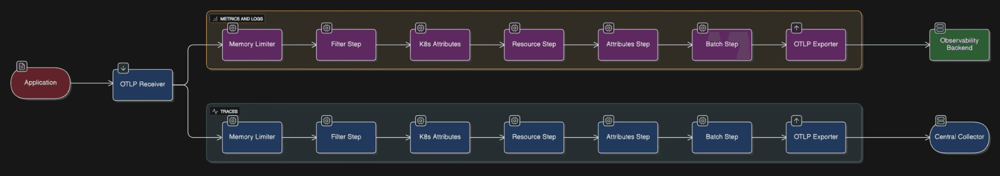
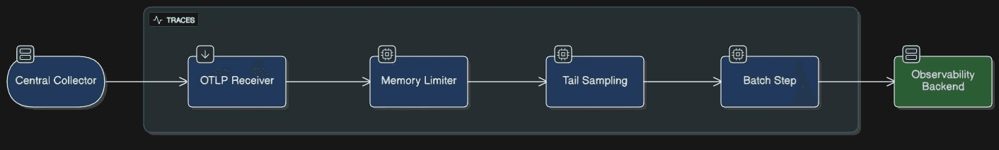

If you've read our post on
[OpenTelemetry fundamentals](https://one2n.io/blog/observability-zero-to-one-a-pragmatic-guide-to-opentelemetry),
you know that logs, metrics, and traces are the three pillars of observability.
But here's what we didn't cover: how to actually make observability work at
scale.

At [One2N](https://one2n.io), we run [OpenTelemetry Collector](/docs/collector/)
instances on production Kubernetes clusters every day. Collecting data turned out
to be just the first step. The real challenge is handling that data reliably,
cost-effectively, and at volume.

This blog tries to address these challenges. Some of the takeaways we would like
to focus on are:

1. How to handle rate limits without losing data
2. Why collectors crash during traffic spikes and how to prevent it
3. How to filter noise without dropping important data
4. How to enrich telemetry with Kubernetes context automatically
5. Why trace sampling is harder than it seems
6. How to build a two-tier collector architecture that scales



## Problem 1: Rate limiting hell

Rate limiting was the first thing I ran into. The collector was sending every
single span as an individual HTTP request to the backend. Seemed fine at first.
Then during load testing, the backend started throwing 429 errors. Rate
limiting. I was losing spans. The issue? Without batching, a collector can easily fire off
thousands of requests per second, and no backend is happy about that.

The fix is the [`batch` processor](/docs/collector/configuration/#processors).
Add it to the end of your pipeline, right after all your filtering and sampling
logic. What it does is instead of sending spans one by one, it buffers them and
ships them out in chunks. Simple, but it made a huge difference.

Sample batch processor config:

```yaml
processors:
  batch:
    timeout: 30s
    send_batch_size: 1000
```

With this, the collector buffers spans and sends them in bulk (every 30s or 1000
spans), instead of one-by-one. This dramatically cut the number of API calls we
made and kept us under quota.

> When we placed the batch processor early in the pipeline, it batched all
> incoming data, logs/spans/metrics that were later dropped. This wasted CPU and
> memory without preventing rate limits. Moving it to the end of the pipeline
> (after filtering and sampling) ensured only the final, filtered data was
> batched and exported.

## Problem 2: Memory spikes and collector crashes

A few days into a production rollout, we noticed our collector pods were
restarting more frequently than expected. I checked the Kubernetes events for the affected pods
and saw that they were getting OOMKilled left and right.

Digging deeper, I found that restarts spiked between 1 PM and 3 PM which was the
same window when our application traffic peaked.

What happened was the collector was buffering everything it received into
memory, and when traffic spiked, boom. Out of memory. The collector went down
right when I needed it most.

I fixed it by adding the `memory_limiter` processor as the very first step in
the pipeline.

Sample memory limiter config:

```yaml
processors:
  memory_limiter:
    check_interval: 5s
    limit_mib: 500
    spike_limit_mib: 100
```

The processor checks memory usage every 5 seconds. When usage crosses the soft
limit (`limit_mib` - `spike_limit_mib`), it starts rejecting new data by
returning errors to the previous component in the pipeline.

If usage continues to climb and breaches the hard limit (`limit_mib`), it goes
a step further, forcing garbage collection to be performed. This gave the
collector room to breathe. Instead of crashing, it sheds excess load and
recovered quickly.

It's crucial to understand the trade-off: when the memory limiter is triggered,
it starts rejecting new data to prevent a crash. **This means you will lose
telemetry data during traffic spikes.** We worked with the application teams to
analyze the data volume and tune both the application's telemetry generation and
the collector's limits to find a balance between stability and data fidelity.

> The `memory_limiter` processor should be placed first in the pipeline. This
> ensures that backpressure can reach upstream receivers, minimizing the
> likelihood of dropped data when memory limits are triggered.

> Since the OpenTelemetry Collector is written in Go, we set the `GOMEMLIMIT`
> environment variable to align Go's garbage collector with our `limit_mib`.
> This ensures Go's internal memory management respects the Collector's
> configured limits, preventing unexpected memory overflows.

## Problem 3: Noisy telemetry from auto-instrumentation

Auto-instrumentation captures everything, including database calls, HTTP
requests, and health check pings. While helpful, by default it sends unwanted
data without filtering.

Some auto-instrumentation libraries export detailed metrics for every HTTP
request, including health checks. This low-value telemetry data overwhelmed the
real signals and increased storage costs.

To fix this, use the `filter` processor to drop unwanted data.

Sample filter processor config:

```yaml
processors:
  filter:
    error_mode: ignore
    traces:
      span:
        - 'IsMatch(attributes["http.route"], ".*/(health|status).*")'
```

This drops health and status endpoint spans. Result: cleaner traces, lower
storage costs. This small change made our traces and metrics far more useful.

## Problem 4: Missing Kubernetes metadata

I was getting latency spikes in my backend, but the traces had zero context.
Which service? Which pod? Which namespace? It was impossible to debug. I needed
to know which Kubernetes node the span came from, which deployment, everything.
Without that metadata attached to the spans, I was flying blind.

The solution I found was to use the `k8sattributes` processor to automatically
enrich telemetry with Kubernetes metadata.

Sample k8sattributes config:

```yaml
processors:
  k8sattributes:
    passthrough: false
    auth_type: serviceAccount
    pod_association:
      - sources:
          - from: resource_attribute
            name: k8s.pod.ip
    extract:
      metadata
```

This attaches metadata like namespace, pod name, and deployment to each span and
log. Now every span and log includes fields that make filtering and building
dashboards much more powerful.

> **A word of caution:** adding these attributes, especially high-cardinality
> ones (like `k8s.pod.id`, `k8s.node.ip`), increases your payload size and can
> significantly drive up costs, particularly for metrics. Additionally, in
> environments with autoscaling, a pod ID you see in telemetry data might have
> already been terminated or scaled in by the time you debug. Be selective about
> which attributes you attach to which signals to balance observability and
> cost.

## Problem 5: High-volume traces but no signal

This was the big one. At scale, I was generating thousands of traces per minute.
Most of them were successful `200 OK` requests, boring stuff I didn't need.

But buried in that noise were a few error traces that actually mattered. I
couldn't see them. My backend was getting crushed, and I had no way to focus on
what actually went wrong.

The solution was to add the
[`tail_sampling` processor](https://github.com/open-telemetry/opentelemetry-collector-contrib/tree/v0.147.0/processor/tailsamplingprocessor)
to keep only meaningful traces. Tail sampling waits until a trace is complete
before deciding whether to keep it, allowing you to filter based on error
status, latency, or other attributes.

Sample tail sampling config (with what each part actually does):

```yaml
tail_sampling/traces:
  decision_wait: 20s # Wait up to 20 seconds for a trace to complete
  num_traces: 2000 # Hold up to 2000 traces in flight at once
  expected_new_traces_per_sec: 100
  decision_cache:
    sampled_cache_size: 100_000 # Remember which traces we sampled
    non_sampled_cache_size: 100_000
  sample_on_first_match: true # Stop checking once we hit a rule

  policies:
    # Rule 1: Never drop a trace with errors
    - name: keep-error-traces
      type: and
      and:
        and_sub_policy:
          - name: service-name-test
            type: string_attribute
            string_attribute:
              key: service.name
              values:
                - 'api' # Apply to api service
          - name: status-code-test
            type: status_code
            status_code:
              status_codes:
                - ERROR # Any errors at all
          - name: method-match-test
            type: string_attribute
            string_attribute:
              key: http.method
              values:
                - 'GET'
                - 'POST'
                - 'PUT'
                - 'DELETE'
                - 'PATCH'

    # Rule 2: Always keep traces from critical money-moving endpoints
    - name: critical-endpoint-policy
      type: and
      and:
        and_sub_policy:
          - name: path-match-test
            type: string_attribute
            string_attribute:
              key: http.route
              values:
                - '/payments' # These matter
                - '/orders'
                - '/requests'
          - name: method-match-test
            type: string_attribute
            string_attribute:
              key: http.method
              values:
                - 'POST' # Only the write operations

    # Rule 3: If it's slow, we want to see it
    - name: latency-policy
      type: latency
      latency:
        threshold_ms: 5000 # Anything taking more than 5 seconds

    # Rule 4: For everything else, just grab a random 10%
    - name: probabilistic-sampling
      type: probabilistic
      probabilistic:
        sampling_percentage: 10 # Good baseline for normal traffic
```

This setup ensured we:

- Always export traces with errors.
- Always export traces for critical endpoints.
- Export slow requests (latency ≥ 5000ms).
- Randomly sample 10% of all other traces for a baseline.

> It's important to recognize that tail sampling is resource intensive. The
> collector must hold all spans for a trace in memory while it waits for the
> trace to complete, which increases its compute and memory requirements. The
> policies are also highly flexible; for instance, you can add rules to filter
> based on span size, allowing you to drop exceptionally large spans unless they
> contain an error, further optimizing costs.



It worked well. Our trace volume dropped, costs went down, and the signals we
cared about were easier to spot.

## Problem 6: The gotcha which led to a re-architecture

Everything looked fine until we started noticing something odd. Some traces were
incomplete. The root span would be there, but several downstream spans were
missing or some traces had root span missing. This made debugging harder,
especially for distributed requests that crossed multiple services.

After digging into it, we realized the problem was with **tail sampling**. It
only works when all spans of a trace reach the same collector instance. In our
setup, spans were spread across multiple collectors. Each instance was making
independent sampling decisions with only partial visibility. As a result, we saw
broken traces that told only half the story.

**The real fix was setting up distributed enrichment + centralized tail
sampling**

We redesigned our collector pipeline, so all spans from a single trace
always land on the same collector instance. We route by trace ID. This way the collector sees the
complete picture before deciding what to keep.

Think of it like this: you wouldn't have two judges review halves of the same
case separately and each make a conviction decision. You'd have them look at the
whole case together. Same idea here.

## The final architecture: using DaemonSets

Here's the architecture we landed on for production workloads. We deploy
collectors as DaemonSets: basically one collector living on each Kubernetes node,
hanging out close to the actual applications.



These DaemonSet collectors do three things:

**First, they filter early.** Throw away the stuff you don't need. Health check
spans, readiness probe logs, liveness probe metrics this is noise. Drop it here,
at the source, before it travels across the cluster. This saves network
bandwidth, storage, and backend costs immediately.

**Second, they enrich with context.** Before sending data anywhere, attach
Kubernetes metadata: _namespace, pod name, deployment, node name_. The
collector's already on the node, so it has full access to this info. Don't send
raw telemetry and add labels later; do it here where the context is fresh and
complete.

**Third, they route smartly.** Logs and metrics go straight to the backend. But
traces? Those go to a central collector for the next layer of processing.

**One thing to watch:**

If you attach fancy high-cardinality attributes like `k8s.pod.id` or
`k8s.node.ip` to everything, your payload size balloons. In autoscaling clusters, a pod ID
you're sending might be dead by the time you look at it. **Be selective:** not
every signal needs every attribute.



Here's the key: traces are routed by trace ID. This means all spans from one
request stay together and land on the same central collector. Now the collector
can see the whole picture and make smart decisions about tail sampling.

Once a complete trace arrives, the central collector applies the sampling rules
we talked about earlier. It keeps errors, critical endpoints, and slow requests.
It samples a baseline of normal traffic. Everything else gets dropped.

**Why does this setup actually work?**

- Enrichment and filtering happen at the source, where full pod and Kubernetes
  context is available. This ensures accurate metadata and removes noisy
  telemetry early.
- Spans are routed by `trace_id`, so all spans of a request stay together. This
  keeps traces complete and easy to analyze.
- Tail sampling happens centrally after the full trace is collected. This
  allows smart decisions based on errors and latency.

With this setup, we kept all required metadata while sending only meaningful
traces to the backend. Errors and slow requests were always captured, while
normal traffic was sampled just enough for coverage. This led to faster incident
triage, cleaner dashboards, and much lower ingest volumes.



## Before you build this, ask yourself

**Is my trace volume high enough?** If you're sending under 50 traces per
second, a single collector is probably fine. This two-tier setup adds complexity. Only
worth it if you're drowning in data.

**What's my current observability bill looking like?** Measure how many GB per
day you're sending. Tail sampling usually cuts this by 40–70%. The
infrastructure cost of running central collectors is usually worth it if you're
paying a lot for ingest.

**How fast do I need to debug?** During an incident, can I find the right trace
in 30 seconds or 5 minutes? If you need blazingly fast incident triage, this
architecture gets you there. If incidents are rare and debugging can be slower,
maybe overkill.

**Does my team know Kubernetes well?** This setup means managing DaemonSets,
understanding pod routing, tuning memory limits. It's not rocket science but
it's not trivial either. Make sure your team's ready.

## Conclusion

Here's what we learned the hard way: building observability at scale
isn't about the tools or the configuration. It's about understanding your
data—how it flows through your system, what matters, what's noise. The two-tier
architecture we're sharing here came from trial and error on live clusters. It
filters out garbage at the edge, enriches data where it makes sense, and makes
intelligent decisions about sampling in the center. That's the pattern that
actually works.

In our case, we addressed challenges such as rate limits, noisy telemetry, high
trace volumes, and missing metadata by **redesigning the collector
architecture** and choosing the right processors. Moving to a **two-tier
collector setup** allowed us to filter and enrich data at the source, apply
intelligent tail sampling centrally, and scale reliably under heavy traffic all
while controlling costs and preserving the telemetry data that truly mattered.

The key takeaway is that effective observability depends as much on
**architecture and data flow** as it does on instrumentation. A well designed
collector pipeline can be the difference between actionable insights and
overwhelming noise or worse, silent failure.

## About One2N

[One2N](https://one2n.io) is an engineering partner that helps teams build and
run reliable software at scale. Our Site Reliability Engineering practice spans
the full lifecycle of production systems: designing observability pipelines,
tuning collector architectures on Kubernetes, reducing on-call load, and
hardening systems under real traffic.

The patterns in this post come from that experience of helping teams navigate the same
trade-offs between collector stability and data fidelity, ingest cost and
debuggability, and pipeline complexity and incident response time.