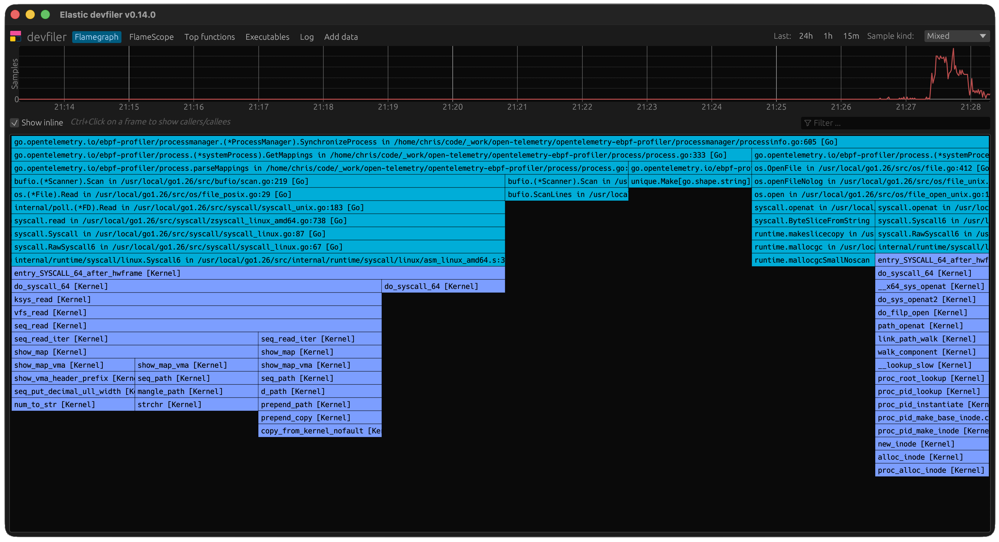

Since OpenTelemetry first [introduced](/blog/2024/profiling/) Profiles, momentum
has only grown towards building a unified industry standard for continuous
production profiling, standing alongside traces, metrics, and logs. Today, the
Profiling SIG is proud to announce that the Profiles signal has officially
entered
[public Alpha](https://github.com/open-telemetry/opentelemetry-specification/blob/v1.55.0/oteps/0232-maturity-of-otel.md#alpha),
and we are ready for broader community use and feedback.

## Production profiling for all

Continuously capturing low-overhead performance profiles in production is a
technique that
[has been used for decades](https://www.waldspurger.org/carl/papers/dcpi-sosp97.pdf).
It helps troubleshoot production incidents, improves user experience by making
software faster and reduces computation costs by making the same work take less
resources. Historically, the industry lacked a common framework and protocol for
continuous profiling, even with formats like JFR and pprof being popular.

With OpenTelemetry Profiles, we're introducing an industry-wide standard for
production profiling, with true vendor neutrality and powered by community and
ecosystem support. There are a few components to making this a reality:

- Creating a unified data
  [representation](https://github.com/open-telemetry/opentelemetry-proto/blob/v1.10.0/opentelemetry/proto/profiles/v1development/profiles.proto)
  for profiling data, compatible with existing formats like pprof.
- Introducing a novel reference eBPF-based profiler
  [implementation](https://github.com/open-telemetry/opentelemetry-ebpf-profiler).
- Making Profiles an organic part of the OpenTelemetry ecosystem, such as
  integrating it with the OTel Collector.

All of the above have been substantially improved in the Alpha release, so let's
dive into what we've been working on!

## Standardizing the data representation

Creating a unified profiling format is a significant challenge, as it must serve
as the industry standard across diverse environments. The working group had to
reconcile numerous requirements: sampling vs. tracing, native vs. interpreted
runtimes, the tension between wire/memory-size efficiency and data readability,
and other similar aspects.

The resulting Profiles Alpha
[format](https://github.com/open-telemetry/opentelemetry-proto/blob/v1.10.0/opentelemetry/proto/profiles/v1development/profiles.proto)
offers a balanced feature set that can efficiently capture profiling data:

- The stack representation is deduplicated so that each unique callstack is
  stored only once, allowing efficient encoding of diverse profiling data.
- The dictionary tables for other common entities also allow efficient data
  normalization.
- While primarily focused on encoding aggregated data, the format also allows
  capturing timestamped event data to support use cases such as recording
  individual (even if sampled) off-CPU events.
- Resource attributes allow augmenting the data model with additional
  information. String dictionary support enables efficient
  ([40% smaller wire size](https://github.com/open-telemetry/sig-profiling/blob/ec8a031b86205e905a1211e162f6f7691a6ff5d2/otlp-bench/reports/2025-11-27-gh733-resource-attr-dict/README.md?from_branch=main))
  linking of profiling data to the same [resource](/docs/concepts/resources/)
  that emitted associated logs, metrics or traces.
- Profile samples can be further associated with the Tracing `trace_id` /
  `span_id` attributes, enabling cross-signal correlation of the data.
- [Semantic conventions](https://github.com/open-telemetry/semantic-conventions)
  provide definition for the most common profiling-specific attributes.

Originally inspired by the pprof format and developed in collaboration with
`pprof` maintainers, OTLP Profiles has evolved into an independent standard that
addresses the broad requirements of the OpenTelemetry ecosystem. Data in the
original pprof format can be round-trip converted to/from OTLP Profiles with no
loss of information. For that purpose a new native
[translator](https://github.com/open-telemetry/opentelemetry-collector-contrib/tree/cc10682103a84a8d7700d6e64c469d7a1469af49/pkg/translator/pprof?from_branch=main)
is now included to ensure seamless interoperability.

To ensure data quality and ease of adoption, we are also releasing a
[conformance checker tool](https://github.com/open-telemetry/sig-profiling/tree/3ee8c0d4f303285cb72e0b3b934f8b20b209edaa/profcheck?from_branch=main).
This allows validating that the exported profiles adhere to the technical
specifications and semantic conventions of OpenTelemetry Profiles.

## Frictionless insights with the eBPF Profiling Agent

With the Elastic
[donation](/blog/2024/elastic-contributes-continuous-profiling-agent/) of its
[eBPF profiling agent](https://github.com/open-telemetry/opentelemetry-ebpf-profiler)
to OpenTelemetry and its integration with the OTel Collector, low-overhead
whole-system continuous profiling on Linux with support of the most widely-used
language runtimes without any additional instrumentation is available to every
OpenTelemetry user.

A number of significant improvements are available with the Alpha release:

- The eBPF agent now works as an OpenTelemetry Collector receiver, leveraging
  existing OpenTelemetry processing pipelines for metrics and K8s metadata, and
  is shipped as an official
  [collector distribution](https://github.com/open-telemetry/opentelemetry-collector-releases/tree/4c40558ecfad1e7ae8b535013ef3cd14ae763ff9/distributions/otelcol-ebpf-profiler?from_branch=main).
- Automatic on-target symbolization of Go executables
- ARM64 support for Node.js V8
- Initial support for BEAM (Erlang/Elixir)
- Support for .NET 9 and 10
- Fixes and improvements to Ruby unwinding and symbolization

## Profiles in the OTel ecosystem

OpenTelemetry is a holistic ecosystem with many orchestrated parts. It's
critical that a new signal like Profiles integrates ubiquitously, so that all
signals can benefit from each other. The Alpha release brings multiple
improvements in this area across many dimensions of the OTel universe.

Some notable examples of the horizontal integration of Profiles include:

- OTel Collector now includes support for receiving Profiles data in specific
  formats or augmenting profiles with infrastructure information.
  - A
    [pprof receiver](https://github.com/open-telemetry/opentelemetry-collector-contrib/tree/cb1f1bb54ee849b4c569eb8f6a950c0f9c7c6d43/receiver/pprofreceiver?from_branch=main)
    allows receiving profiles from pprof-formatted files.
  - The
    [k8sattributesprocessor](https://github.com/open-telemetry/opentelemetry-collector-contrib/tree/cc10682103a84a8d7700d6e64c469d7a1469af49/processor/k8sattributesprocessor?from_branch=main)
    allows augmenting profiles with Kubernetes metadata.
  - [OTTL](/docs/collector/transforming-telemetry/) support allows building
    custom rules to transform, or filter profiles.
- OTLP Resource model was updated to allow efficient information sharing,
  including updating Collector to transparently support this optimization for
  Profiles signal.

## Getting started

To learn more about OpenTelemetry profiles, you can visit the
[profiles concepts](/docs/concepts/signals/profiles) page that is part of the
OpenTelemetry [documentation](/docs/).

The easiest way to get started with an actual deployment is to use the
OpenTelemetry
[eBPF profiler](https://github.com/open-telemetry/opentelemetry-ebpf-profiler)
in combination with a backend that supports OTLP Profiles. As the signal is
still under development, production-ready backends have not yet emerged but
multiple vendors are working on supporting OpenTelemetry Profiles.

To speed up development and experimentation, Elastic has open-sourced a desktop
application named [devfiler](https://github.com/elastic/devfiler) that
reimplements the backend (collection, data storage, symbolization and UI)
portion of the eBPF profiler. Note that devfiler is not a real production
backend and should not be used as such. For further instructions, please refer
to the eBPF profiler
[repository](https://github.com/open-telemetry/opentelemetry-ebpf-profiler).

## Brought to you by...

Projects like this involve many people. Thanks to everyone who made this
possible, including:

- [Alexey Alexandrov](https://github.com/aalexand) (Google)
- [Ivo Anjo](https://github.com/ivoanjo) (Datadog)
- [Frederic Branczyk](https://github.com/brancz) (Polar Signals)
- [Roger Coll](https://github.com/rogercoll) (Elastic)
- [Dmitry Filimonov](https://github.com/petethepig) (Grafana Labs)
- [Felix Geisendörfer](https://github.com/felixge) (Datadog)
- [Nayef Ghattas](https://github.com/Gandem) (Datadog)
- [Jonathan Halliday](https://github.com/jhalliday) (Red Hat)
- [Dale Hamel](https://github.com/dalehamel) (Shopify)
- [Joel Höner](https://github.com/athre0z) (Zymtrace)
- [Christos Kalkanis](https://github.com/christos68k) (Elastic)
- [Florian Lehner](https://github.com/florianl) (Elastic)
- [Damien Mathieu](https://github.com/dmathieu) (Elastic)
- [Greg Mefford](https://github.com/GregMefford) (Adobe)
- [Tigran Najaryan](https://github.com/tigrannajaryan) (Splunk)
- [Tommy Reilly](https://github.com/gnurizen) (Polar Signals)
- [Tim Rühsen](https://github.com/rockdaboot) (Zymtrace)
- [Josh Suereth](https://github.com/jsuereth) (Google)
- [Timo Teräs](https://github.com/fabled) (Elastic)
- [Brennan Vincent](https://github.com/umanwizard) (Polar Signals)

## What's next

We encourage teams building profiling tools and products to start using the
OpenTelemetry Profiles. Here is how you can participate:

- Add OTel Profiles as an export or receive option in your tool. This is already
  happening (e.g.
  [async-profiler](https://github.com/async-profiler/async-profiler/blob/b3f58429f5c0252e9ced3f0fcb444fed17671321/docs/OutputFormats.md?from_branch=master))!
- Test the eBPF agent and OTel Collector (v0.148.0 or newer) support for
  Profiles and report issues. Or even send PRs!
- Review the signal documentation and suggest what can be improved.

Note that with the Alpha status of the release, the signal should not be used
for critical production workloads. See the
[definition of the Alpha maturity level](https://github.com/open-telemetry/opentelemetry-specification/blob/v1.55.0/oteps/0232-maturity-of-otel.md#alpha)
in OpenTelemetry for details.

In the meantime and towards the next milestone, there is a lot of exciting work
planned and in the works:

- As correlation of signals is crucial for the success of observability, there
  is
  [ongoing work](https://github.com/open-telemetry/opentelemetry-specification/pull/4855)
  on sharing information between eBPF based agents, like
  [OBI](/docs/zero-code/obi/) and Profiling Agent.
- Symbolization is a key component of every production profiling stack, so we
  are discussing standardizing the API, the storage format and publishing a
  reference implementation for it.
- Sharing of runtime information between in-process SDK code and eBPF agents is
  important for cross-signal correlation to allow answering questions like "What
  were the off-CPU events for traces at the 99% latency?".
  [Process context](https://github.com/open-telemetry/opentelemetry-specification/pull/4719)
  and
  [thread context](https://github.com/open-telemetry/opentelemetry-specification/pull/4947)
  sharing OTEPs are in the works to enable this.

And for all of this, we need your feedback! To reach us, file a GitHub issue in
the [OTLP](https://github.com/open-telemetry/opentelemetry-proto) or
[Profiling SIG](https://github.com/open-telemetry/sig-profiling) repository. It
will help make the signal fit the industry needs and steadily evolve it towards
its next heights: Beta and GA releases!
