---
title:
  'Optimizing Tail Sampling in OpenTelemetry with Retroactive Sampling: -70%
  Resource Usage'
linkTitle: 'Retroactive Sampling in OpenTelemetry'
date: 2026-06-24
author: '[Zhu Jiekun](https://github.com/jiekun) (VictoriaMetrics)'
sig: Collector SIG
cSpell:ignore: Jiekun NSDI Retroacting tailsampling vtagent youtube
---

In March, our team gave a talk on **retroactive sampling** at KubeCon
Europe 2026 ([recording](https://www.youtube.com/watch?v=ehKzt_kGEeM)).

By writing this blog post, as a transcript of the session, we want to explain
how retroactive sampling **reduces outbound traffic, CPU, and memory usage** in
the data collection pipeline significantly **compared to tail sampling in
OpenTelemetry**.

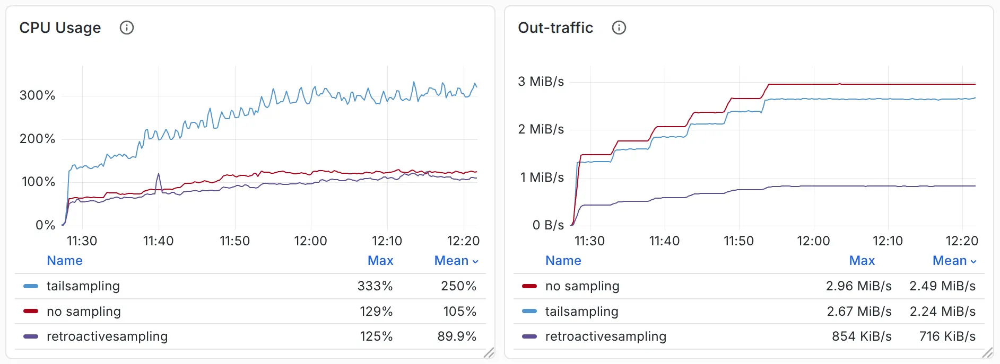

## 1. Background

We'll start with concepts for the beginners, but feel free to skip ahead to
section 2 if you're already familiar with these concepts - you won't miss
anything important.

### 1.1 Distributed Tracing


The diagram above shows how a trace is visualized. The concept of distributed
tracing is straightforward: you have a distributed system with dozens of
microservices that call each other as they process a single request. Each
microservice records its work as a span, and spans are organized into a trace by
the parent-child relationships.

Traces could be expensive. One trace can contain hundreds or thousands of spans,
with each span ranging from hundreds of bytes to multiple kilobytes. If your
gateway serves millions of incoming requests every second, your microservices
can easily generate traces at GB/s. Collecting, transporting, and processing
this volume will stress your bandwidth, CPU, memory, and storage.

### 1.2 Sampling

Sampling is the most common way to reduce trace volume. Based on when sampling
happens, it falls into two categories:

- Head sampling
- Tail sampling

> [!NOTE] About Sampling You may be aware that other sampling approaches exist,
> but they are out of scope here:
>
> - Unit sampling: Ignores head decisions and exports spans within a specific
>   unit, or service(s).
> - Reverse sampling: The child service can revise the head decision after an
>   interesting event happens, and the new sampling decision will be propagated
>   via response.
> - Various offline sampling approaches.
>
> This post focuses only on tail-based sampling, but comments about other
> sampling approaches are welcome.

Head sampling makes decisions at the entry point to your distributed services,
typically at the gateway. The gateway - or let's call it "the root service" -
decides whether to keep or drop the trace, and propagates the decision to child
services alongside the request (via headers/metadata).

Head sampling is usually random. It does not change the sampling decision even
if the trace contains interesting events or exceptions. It simply discards data
without being aware of what will happen.

On the other hand, tail sampling better aligns with user needs. It decides after
collecting all spans of a trace so that it can take the full context of the
trace into account.

In this approach, spans are generated by services and exported to a centralized
collector. After waiting for a specified time interval to consider the trace
complete, the collector analyzes it and makes the decision. If sampled, it
forwards the trace to the next stage (such as trace storage).

### 1.3 Resource Overhead of the Tail Sampling

The biggest problem with tail sampling is that it's not free. In some cases, it
could be even more expensive than collecting all the traces.

Tail sampling aggregates spans by `trace_id` and buffers them in memory. To
buffer data for a few seconds or minutes, the collector running tail sampling
must be provisioned with sufficient memory.

There are some techniques that can release memory earlier (such as making a
decision as soon as the root span is received), but network latency and delivery
unreliability in distributed systems prevent any approach from guaranteeing that
all spans will arrive by a given event or time.

As a result, users often prefer longer buffering windows and aim to store more
data within limited memory.

Beyond the memory cost, tail sampling imposes overhead on other resources, such
as the CPU. In production, trace data cannot typically be handled by a single
collector, which will hit its limits when scaling vertically. Multiple collector
instances are therefore required. Since tail sampling needs to aggregate spans
by `trace_id`, all spans of the same trace must be routed to the same collector.
This means a **load balancer** is mandatory: either deployed in front of the
tail sampling collectors or implemented via a daemonset agent for load
balancing.

Anyway, extra routing and computation overhead are unavoidable.

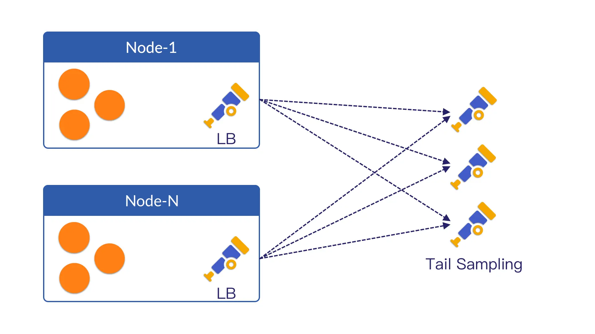

Last but not least, the **network overhead**.

In most scenarios, traces are forwarded across nodes. This uses the node's
bandwidth, which may be available at no extra cost.

But when it comes to cross-cluster, cross-region, and cross-cloud provider
scenarios:

- You need to pay for egress traffic.
- You may need to pay for a cross-cloud interconnect to achieve high bandwidth
  and low latency.

However, the traces that are preserved and ingested after sampling may account
for only 10% - or even less, such as 1% or 0.1%.

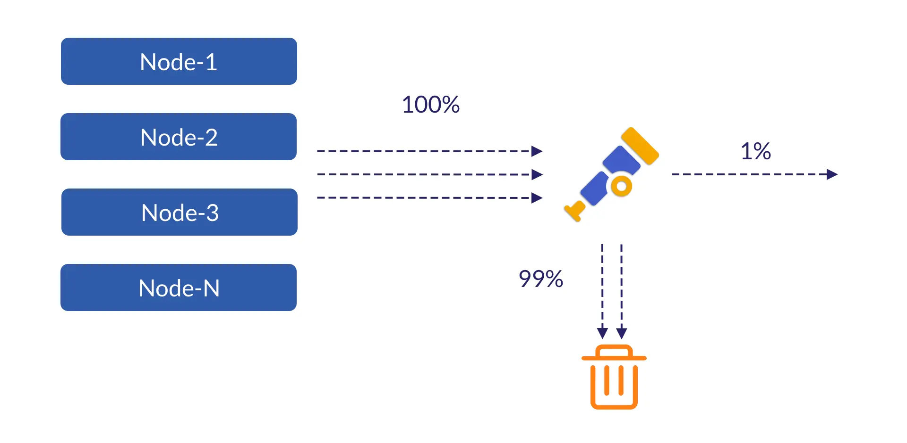

This means you pay the full cost for 100% of the traces, while most are
discarded just minutes later.

## 2. The Retroactive Sampling

The core idea behind retroactive sampling is straightforward and can be
summarized in two parts.

First, it **sends only the necessary attributes** to the central collector for
decision-making, while buffering raw data on edge agents and retrieving it only
when a trace is sampled.

By reducing unnecessary data transfer, it directly lowers:

1. Memory usage in the central collector for buffering data.
2. CPU time for transmitting (encoding/decoding) and routing data.
3. Network bandwidth for transmission.

To reduce memory pressure on edge agents, we **replaced the in-memory buffer
with an on-disk FIFO queue**, further lowering their overall memory footprint.

Now, let's dive into more details.

### 2.1 Exporting and Retroacting Traces

If you take a close look at the attributes a span carries and compare them with
the tail sampling conditions you are using, you will find that most of these
attributes are irrelevant to the sampling decision.

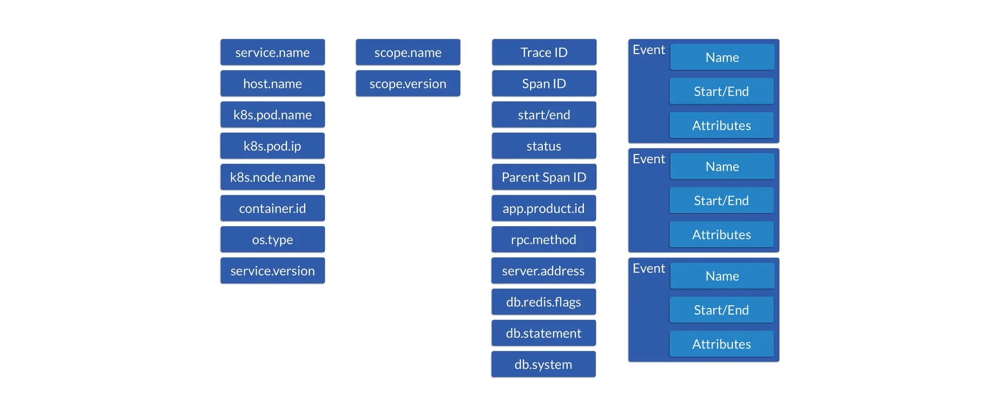

For example, attributes such as `os.version`, `sdk.version`, `request.path`, and
`cmd` provide almost no value when users want to preserve the following traces
via tail sampling:

- Traces that contain errors.
- Traces with excessive latency (5s or longer).
- 1% of the remaining (healthy) traces.

The collector only needs `trace_id`, the `start_time` and `end_time` of each
span, and `status_code` to make the decision.

The **retroactive sampling** approach works in the following way:

1. The agent on each node buffers trace spans, while extracting only attributes
   needed for sampling decision and sending them to the collector.
2. The collector makes the sampling decision and propagates it back to the
   agents.
3. Based on the decision, the agent checks the buffered spans, drops unsampled
   spans, and sends the remaining sampled spans to the trace storage.

At its core, this approach **makes sampling decisions using only a small amount
of information**, then **retroactively requests the full spans for the sampled
traces**.

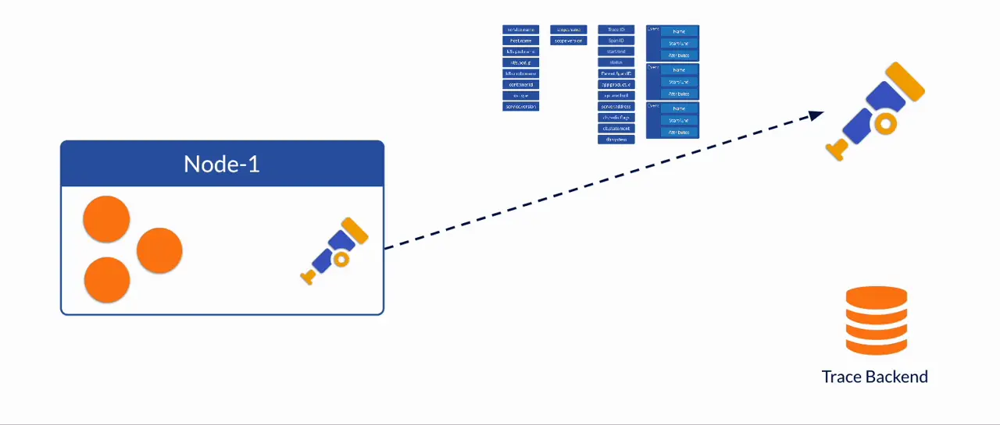

Specifically, the attributes sent to the collector can look like this. They are
only 33 bytes long, while a full span can easily exceed 1 KB. As a result, the
collector consumes far less memory buffering them compared with the traditional
tail sampling approach which buffers the full span.

```text
+---------------------------+-----------------+-----------------+-----------------+
|         16 bytes          |     8 bytes     |     8 bytes     |     1 byte      |
+---------------------------+-----------------+-----------------+-----------------+
|         trace_id          |    start_time   |     end_time    |   status_code   |
+---------------------------+-----------------+-----------------+-----------------+
```

The collector in retroactive sampling operates similarly to tail sampling before
the sampling decision. And once the decision is made, the collector sends the
sampled `trace_id` back to all agents. This can be implemented in either a
push-based or pull-based manner.

### 2.2 Optimization of Raw Data Buffering

A key to retroactive sampling is that **raw spans**, instead of being buffered
by the tail sampling collector, **should now be buffered on the agent** and
retrieved only when necessary. However, if we simply use the same in-memory data
structures as tail sampling does, it **only shifts memory pressure from the
central collector to edge agents without reducing the overall memory
footprint**, which is not ideal.

What we did to further improve it is **use an on-disk FIFO queue instead of an
in-memory buffer**.

We prefer this solution for the following reasons:

1. The data volume processed by the agent differs from that of the central
   collector. Even without high read/write speed, a disk is sufficient for
   agent-side scenarios **without any optimization**.
2. In addition, there are many optimization techniques available for on-disk
   data structure design, enabling it to support even high data throughput
   efficiently.

In our (prototype) implementation, trace data is processed as follows:

1. Key attributes are extracted from trace spans and sent to the collector for
   sampling, as mentioned in 2.1.
2. The batch of trace spans is then marshaled into binary data, stamped with the
   current timestamp, and written as a block to an **on-disk FIFO queue**.
3. A background worker continuously consumes from this FIFO queue. It first
   reads the header bytes as the timestamp, in order to determine how long the
   blocks/spans have been in the queue.
4. After confirming or **waiting until the spans have exceeded a configured
   retention period** (e.g., 1 minute), the worker will have already received
   the sampling decision for this block from the collector. It then filters out
   unsampled spans and forwards the sampled ones to trace storage.

We can use the diagram below to illustrate the workflow of the agent.

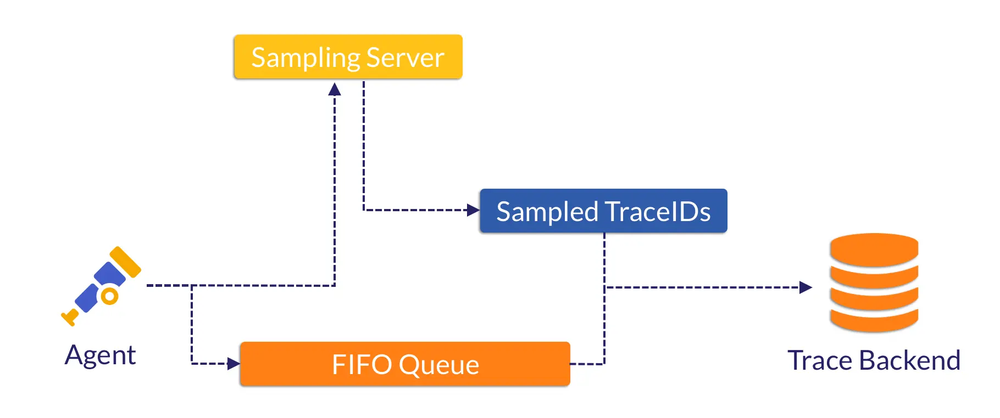

> [!NOTE] Sampling Server and Collector We built the sampling server to replace
> the collector, as shown in the diagram above and the benchmark in section 3,
> yet their roles remain similar.
>
> We implemented it ourselves since no such implementation exists in the
> OpenTelemetry Collector. But once the idea is accepted by the community, we
> can use a standard OpenTelemetry Collector to handle such task.

## 3. Benchmark Comparison

That's enough theory for now.

We ran a benchmark using the OpenTelemetry Demo combined with traffic replay to
verify whether the retroactive sampling is truly useful.

In this benchmark, we wanted to compare **retroactive sampling**, **no
sampling**, and **tail sampling**. We deployed:

- An application (load generator), an OpenTelemetry agent, and VictoriaTraces as
  traces backend for each scenario, responsible for span generation, forwarding
  trace spans from the same node, and receiving the sampled spans.
- For no sampling (as a baseline), the agent only performs batching and
  exporting.
- For tail sampling (as a comparison), we deployed a set of OpenTelemetry
  collectors between the agent and VictoriaTraces.
- For retroactive sampling (as a comparison), we built and deployed a set of
  sampling servers between the agent and VictoriaTraces. We also built the
  retroactive sampling processor in each OpenTelemetry agent, to extract key
  attributes and buffer raw spans.

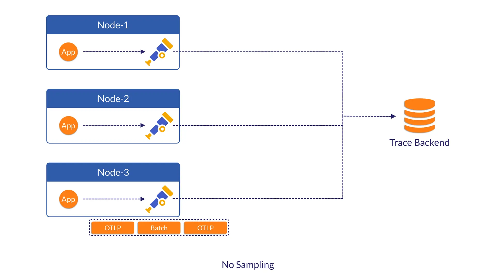

By generating a load of 15,000 to 30,000 spans/s, we observed CPU, memory usage,
and outbound traffic as follows:

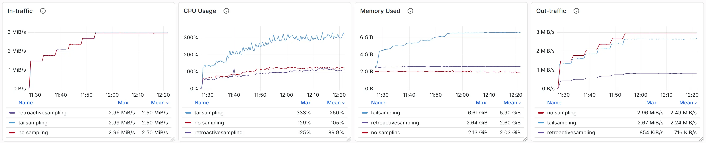

> [!NOTE] Resources
>
> - Out-traffic refers to the actual traffic sent by the OpenTelemetry agent -
>   that is, the traffic transmitted across nodes.
> - CPU and memory usage are measured for the OpenTelemetry agent, OpenTelemetry
>   collector (if present), and sampling server (if present) only. These numbers
>   reflect the resources consumed by the data collection and sampling pipeline.

For reference, the total disk space used in retroactive sampling is shown below.

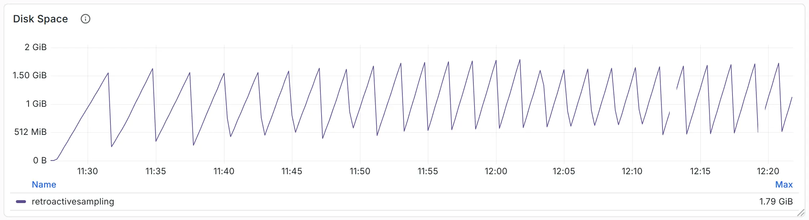

Through comparison, we can see that retroactive sampling reduces **compressed
traffic** by 70%, while saving 60–70% of CPU and memory resources. Compared with
tail sampling, retroactive sampling consumes only 1.7 GB of disk space, but
saves 4 GB of memory.

## 4. Discussion

Every approach has its pros and cons, and retroactive sampling is no exception -
it is not a silver bullet.

A drawback of retroactive sampling is that **it provides little information to
the collector for making sampling decisions**.

What if users want to sample based on 10 attributes? Well, we can send all the
required attributes to the collector, though this will consume additional memory
and bandwidth. In the worst case, if users want to sample using all attributes
of a span, retroactive sampling becomes a degraded version of tail sampling and
loses much of its value.

```text
+-------------+--------+------------------+---------------+---------------+----------------+
|  16 bytes   |   ...  |     128 bytes    |    64 bytes   |    8 bytes    |    64 bytes    |
+-------------+--------+------------------+---------------+---------------+----------------+
|  trace_id   |   ...  |   exception_log  |   user_agent  |  app_version  |    endpoint    |
+-------------+--------+------------------+---------------+---------------+----------------+
```

Are there any alternative solutions?

### 4.1 Variant: Local + Retroactive Sampling

We don't have to send all (sampling-related) attributes to the collector if the
local agent can determine that a trace should be sampled.

Sampling-related attributes and conditions can be divided into two categories:

1. Aggregation across multiple spans is required to make a decision. Example:
   calculating trace duration using `start_time` / `end_time` from all spans.
2. No aggregation required. Example: sampling based on the `endpoint` value.

For the first category of attributes, we have no choice - they must be sent to
the central collector for decision-making.

But for the second category of attributes, the agent can make the sampling
decision. **All that remains is to propagate the decision (`trace_id`) to other
agents**, so they also send the corresponding spans to the trace storage.

So, returning to the question: what if users want to sample based on 10
attributes? We only need to transmit data for a small number of (category-1)
attributes, plus the sampled `trace_id` determined by the remaining (category-2)
attributes.

This means bandwidth usage remains constrained and does not necessarily increase
as more sampling-related attributes or conditions are added.

From a data structure perspective, attributes like the examples above (128-byte
`exception_log`, 64-byte `user_agent`) can be effectively replaced by a single
1-byte `sampled` flag.

```text
+-------------+-------------------+-------------------------+-------------------------+
|   1 byte    |     16 bytes      |        8 bytes          |        8 bytes          |
+-------------+-------------------+-------------------------+-------------------------+
|   sampled   |     trace_id      |    start_time (opt)     |     end_time (opt)      |
+-------------+-------------------+-------------------------+-------------------------+
```

That's enough discussion for the agent. But don't forget that the collector. In
this design, the collector should be responsible for two tasks instead of one:

1. Performing retroactive sampling as usual.
2. If the agent has already made a local sampling decision, the collector must
   merge it with the result from retroactive sampling and propagate the final
   decision to all agents.

### 4.2 Alternative: Disk-based Tail Sampling

As we mentioned earlier, the significant memory savings of retroactive sampling
stem from using disk instead of memory in the OpenTelemetry agent. The same
approach can also be applied to tail sampling. While it won't help reduce
network bandwidth, it still provides benefits.

The OpenTelemetry community already has a proposal to offload in-memory data to
disk:
[#42326](https://github.com/open-telemetry/opentelemetry-collector-contrib/issues/42326).
Specifically, it uses [Pebble](https://github.com/cockroachdb/pebble), a
key‑value store implemented in Go, as the on-disk storage.

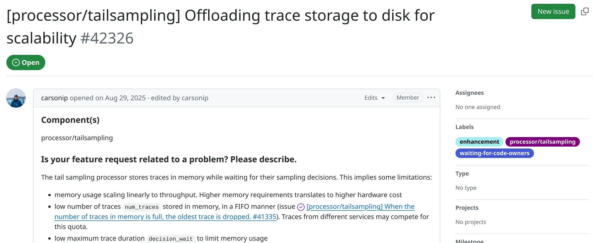

As shown in the
[benchmark](https://github.com/open-telemetry/opentelemetry-collector-contrib/issues/42326#issuecomment-3992297512),
this approach reduces memory usage by over 80% compared to the memory-based tail
sampling, but at the cost of a 5x increase in CPU utilization.

| Metric           | In-Memory | Pebble (Disk) |         Relative |
| ---------------- | --------: | ------------: | ---------------: |
| Peak memory (MB) |   3420.63 |        638.78 |  -81.32% (0.19x) |
| Avg memory (MB)  |   2646.63 |        471.15 |  -82.20% (0.18x) |
| Avg CPU (%)      |     12.88 |         96.59 | +649.92% (7.50x) |
| Peak CPU (%)     |     42.14 |        230.67 | +447.39% (5.47x) |

Since this is not a stable implementation, these numbers are likely to improve
over iterations. We wish to include them in future comparisons with retroactive
sampling.

What we can compare now are the data structures:

- Whether using Pebble or any other on-disk key-value database, lookups by
  `trace_id` require random disk I/O. To speed up queries, data should be sorted
  by `trace_id` - this introduces extra overhead during data persistence.
- In contrast, retroactive sampling uses an on-disk FIFO queue to reduce memory
  usage, while keeping the essential `trace_id` lookups in memory for fast
  access. We consume the FIFO queue to maximize sequential read speed, and
  compare it with the in-memory sampling decisions.

As we've observed in our benchmarks, the design of retroactive sampling delivers
good performance.

## 5. Summary

Through our talk at KubeCon + CloudNativeCon and this blog post, we aim to
**share the core idea behind retroactive sampling, not just its concrete
implementation**. By focusing on reducing unnecessary data transmission, users
can simultaneously optimize bandwidth, CPU, and memory usage.

Besides, disk-based designs are well worth exploring - for both tail sampling
and retroactive sampling. We have seen many sampling solutions built on Kafka
and other delayed message queues, which overlap with the idea of retroactive
sampling. We believe the disk-based design holds great potential.

Speaking of implementation: the retroactive sampling setup used in our benchmark
is still a prototype, but we plan to donate it as a new processor to the
OpenTelemetry Collector so more users can benefit.

We also plan to add the same functionality to VictoriaTraces' own agent
(vtagent), targeted for the second half of 2026 - 100% open source. Stay tuned.

## 6. Further Reading

The idea of retroactive sampling originates from the NSDI 2023 paper
[The Benefit of Hindsight: Tracing Edge-Cases in Distributed Systems](https://www.youtube.com/watch?v=9a_w0Txy0gs),
by Lei Zhang.

While its implementation differs from VictoriaMetrics' prototype, the paper
elaborates on extensive design details and potential trade-offs.

We highly recommend that everyone interested in this topic read it to understand
the original design.

---

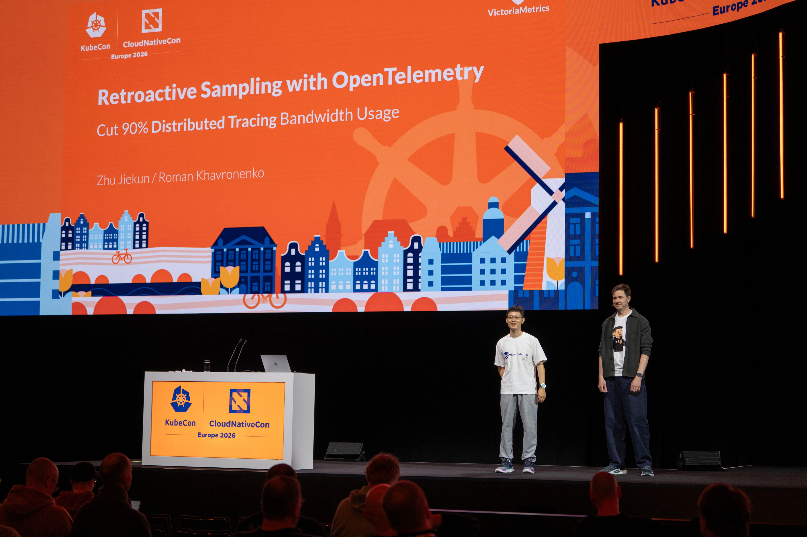

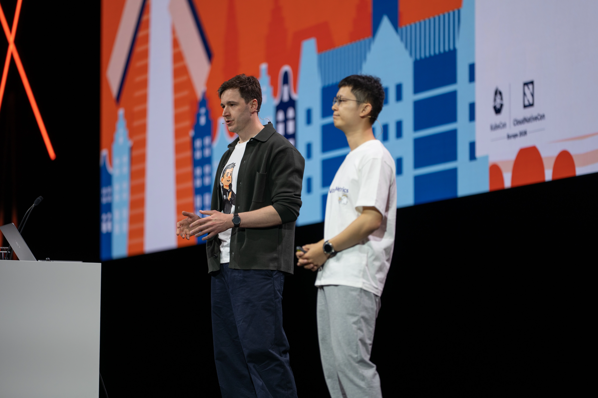

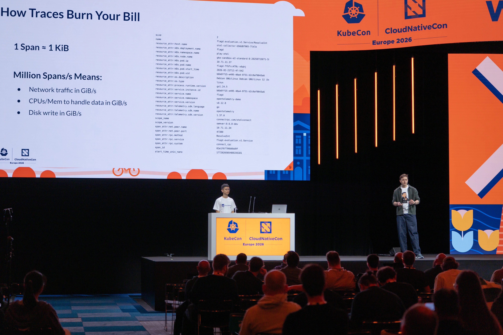
