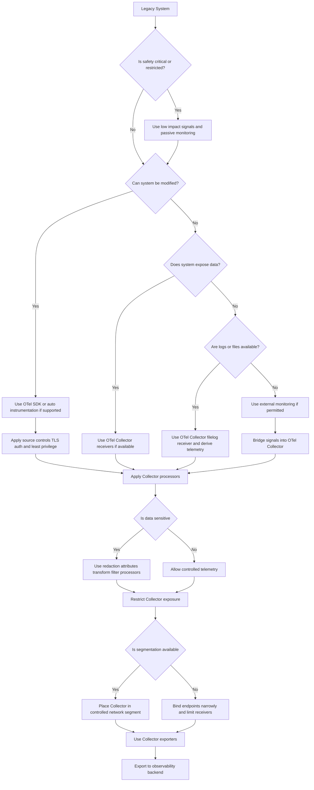

---
title:
  'Security in OpenTelemetry for Legacy and Industrial Environments: What
  Changes'
linkTitle: Security Legacy Environments
date: 2026-04-22
author: >-
  [Lukasz Ciukaj (Cisco Splunk)](https://github.com/luke6Lh43)
sig: SIG Security
cSpell:ignore: Ciukaj Lukasz
---

OpenTelemetry is gaining traction in manufacturing and other legacy environments
as organizations explore modern observability approaches. However, applying
these practices in traditional systems introduces a different set of security
challenges. The constraints of legacy infrastructure fundamentally change where
and how security controls must be applied.

Legacy and industrial environments often include:

- systems that cannot be modified or instrumented
- long equipment life cycles and limited patching windows
- flat or weakly segmented networks
- sensitive operational data that is not typical PII

This article focuses on what is different about securing OpenTelemetry in these
environments, and how to adapt your approach accordingly.

## Why legacy environments are different

In cloud native systems, security guidance assumes:

- services can be instrumented
- encryption and authentication can be enforced everywhere
- systems can be patched regularly

In legacy and industrial environments, these assumptions often do not hold.

As a result, security is not about applying ideal controls everywhere. It is
about **placing controls at the right points in the telemetry pipeline**, and
balancing visibility with risk.

## Security challenges unique to legacy systems

### Systems cannot be modified

Many industrial systems cannot run agents, support modern libraries, or be
changed at all. This means:

- no native TLS or authentication at the source
- no direct instrumentation using SDKs
- reliance on intermediaries (Collectors, bridges, log pipelines)

Security responsibility shifts **away from the source** and toward the
**Collector and network boundaries**.

### Weak or non-existent network segmentation

Legacy environments often operate on flat or shared networks. Introducing
telemetry collection can:

- expose new ingestion endpoints
- allow unintended lateral access to Collectors or bridges

In these environments, **where you place the Collector** matters more than how
you configure it.

### Limited patching and long lifecycles

Industrial systems may run for years without upgrades. When vulnerabilities are
discovered:

- immediate patching may not be possible
- compensating controls become critical

This shifts the focus from patching to **containment and mitigation**:

- isolating affected components
- restricting network access
- disabling unnecessary telemetry paths

### Different definition of “sensitive data”

In manufacturing environments, sensitive data often includes:

- production processes and machine configurations
- asset identifiers and operational states
- plant-level performance data

Telemetry pipelines must be designed to avoid exposing this information outside
controlled boundaries.

## Designing a secure telemetry pipeline under constraints

When source systems cannot be secured directly, the telemetry pipeline becomes
the control point.

Key design principles:

- **Constrain ingestion points**: Avoid exposing Collector endpoints broadly.
  Bind to specific interfaces and restrict network access.

- **Isolate bridging components**: MQTT bridges, log collectors, or protocol
  adapters should run in controlled segments and not be directly accessible.

- **Minimize exposed components**: Only enable the receivers and exporters you
  actually need.

- **Prefer internal aggregation**: Collect and process telemetry inside the
  environment before exporting it externally.

The goal is to treat the OpenTelemetry Collector as a **controlled boundary**,
not just a data router. This approach aligns with Zero Trust principles, where
security controls are applied at data flow boundaries rather than relying solely
on perimeter defenses.

## A pragmatic decision model for securing telemetry

The following model shows how to select telemetry and apply security controls
based on system constraints in legacy and industrial environments.



## Handling sensitive operational data

OpenTelemetry does not know what data is sensitive in your environment. That
responsibility sits with the implementer. Two principles are critical:

### Data minimization

Only collect telemetry that serves a clear purpose. In constrained environments:

- avoid capturing full payloads unless necessary
- prefer aggregated signals over raw data
- review collected attributes regularly

### Scrubbing and transformation

Use Collector processors to reduce risk before data leaves the environment. For
example, replacing identifiers:

```yaml
processors:
  transform/hash_user:
    trace_statements:
      - context: span
        statements:
          - set(attributes["user.hash"], SHA256(attributes["user.id"]))
          - delete_key(attributes, "user.id")
```

Or enforcing strict allowlists:

```yaml
processors:
  redaction/strict:
    allow_all_keys: false
    allowed_keys:
      - id
      - name
      - status
```

In legacy environments, **processing at the Collector is often the only place
where data can be controlled**.

## Reducing attack surface

Every telemetry component introduces potential risk. This is especially
important where systems cannot defend themselves. Focus on:

- reducing the number of active receivers and exporters
- avoiding unnecessary external exposure
- running Collectors with minimal permissions
- limiting inbound traffic to known, trusted sources

In these environments, **less telemetry infrastructure is often more secure**.

## Security as a trade-off

In modern systems, the goal is often complete observability. In legacy
environments, that goal must be balanced against:

- system stability
- safety constraints
- limited control over source systems

This leads to a different mindset: _Security is not about achieving ideal
observability. It is about selecting the safest way to gain useful visibility._

## Conclusion

OpenTelemetry can bring powerful observability to legacy and industrial
environments, but it changes where and how security controls must be applied.
Instead of relying on source-level protections, teams must:

- secure the telemetry pipeline itself
- carefully manage data exposure
- design for constrained and imperfect systems

With this approach, organizations can gain meaningful visibility while
respecting the realities of traditional environments.

## Further reading and resources

- [OpenTelemetry Security Documentation](/docs/security/)
- [OpenTelemetry CVE List](/docs/security/cve/)
- [Collector Configuration Best Practices](/docs/security/config-best-practices/)
- [Handling Sensitive Data](/docs/security/handling-sensitive-data/)
- [Community Incident Response Guidelines](/docs/security/security-response/)
