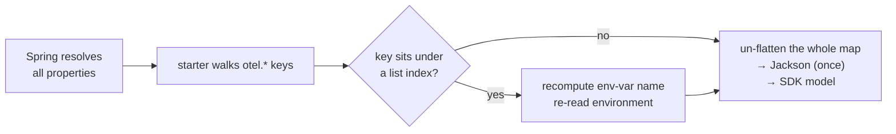
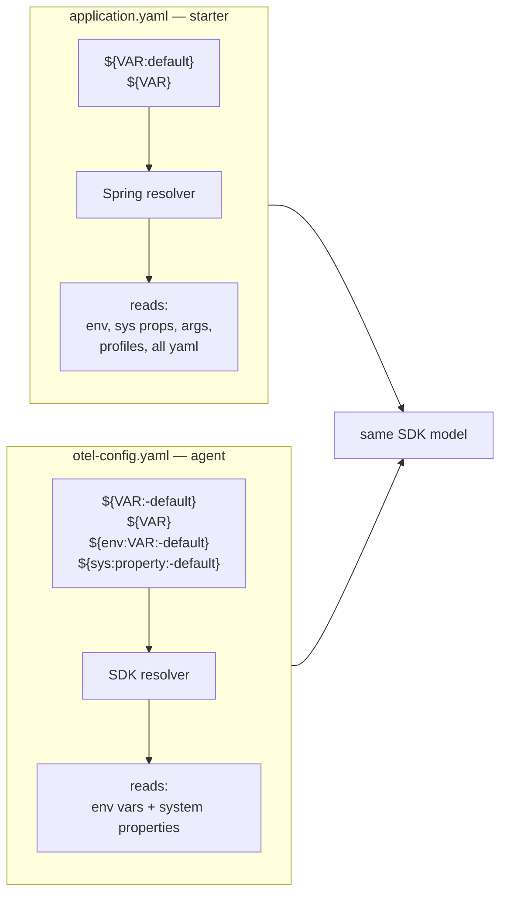
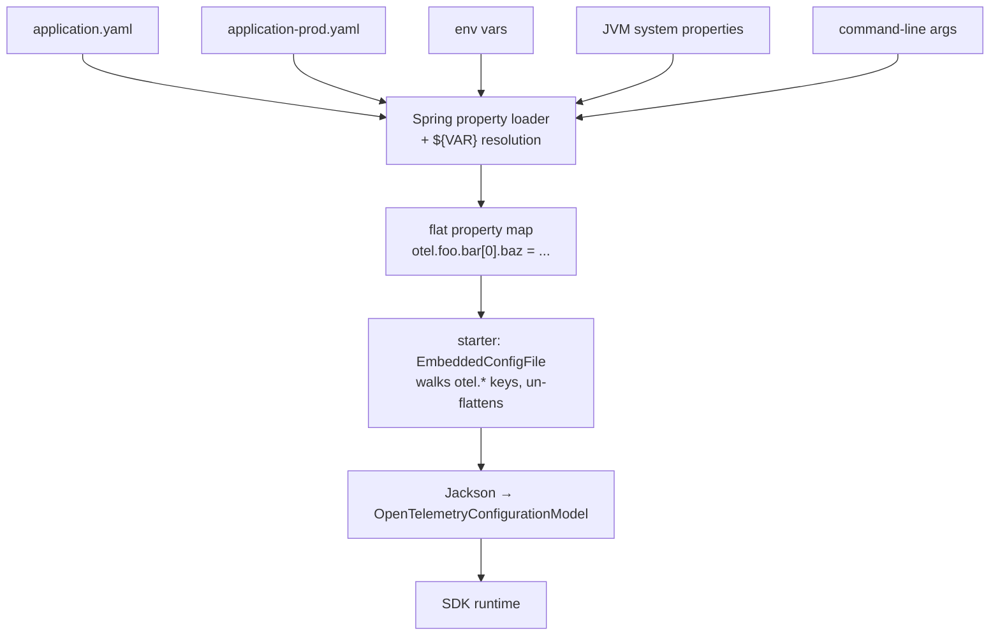

The OpenTelemetry Spring Boot starter 2.26.0 gained declarative-configuration
support — the same YAML schema [the Java agent introduced in late
2025](/blog/2025/declarative-config/), now embedded inside `application.yaml`.
This post is the story of how that landed, told through the eyes of one
small environment variable.

*In a hurry? Jump straight to the
[Spring Boot starter declarative-config docs](/docs/zero-code/java/spring-boot-starter/declarative-configuration/),
paste your `application.properties` into the
[interactive converter](/docs/zero-code/java/spring-boot-starter/declarative-configuration/#convert-your-existing-configuration),
or pick your SDK setup in the
[Ecosystem Explorer](/ecosystem/) with the Spring Boot starter target
selected. Come back for the story when you have a coffee.*

---

Meet a small environment variable.

```bash
OTEL_SERVICE_NAME=petclinic
```

You have set her hundreds of times. In CI files. In Dockerfiles. In your
terminal, with a `&&` and a shrug. She is so familiar that you have never
thought twice about where she actually goes.

She is older than you think.

For years, environment variables (and their close cousin, the JVM `-D` system
property) were the only way to configure the OpenTelemetry SDK. Every
exporter, every sampler, every captured header — all expressed as a flat list
of `OTEL_*` variables. Our small env var did the whole job, alone.

Recently, she got a sister.

The OpenTelemetry SDK [declarative-configuration
schema](/docs/languages/sdk-configuration/declarative-configuration/) is a YAML
tree that can describe an entire telemetry pipeline — every processor, every
exporter, every nested option — in the same shape the SDK actually runs.
Things the env var could not say. Spring starter users wrote a `@Bean` for
them. Java agent users had to write a full extension and package it in a
separate jar to ship alongside the agent — almost prohibitive.

The two of them share a roof now. Since OpenTelemetry Spring Boot starter
**2.26.0**, the YAML sister moves into your `application.yaml`, under a
single `otel:` key. Our env var still has a place — but a narrower one.
`OTEL_SERVICE_NAME` survives because a service-name resource detector goes
hunting for her at boot. The new family rule is that most env vars don't
flow into the SDK automatically anymore; if you want one to override a YAML
leaf, you invite her in by name with `${VAR:default}`.

This is the story of how they get along.

## A YAML file inside your YAML file

Here is what living together looks like:

```yaml
otel:
  file_format: '1.0'

  resource:
    attributes:
      - name: service.name
        value: petclinic

  tracer_provider:
    processors:
      - batch:
          exporter:
            otlp_http:
              endpoint: ${OTEL_EXPORTER_OTLP_TRACES_ENDPOINT:http://localhost:4318/v1/traces}
```

That block under `otel:` is the OpenTelemetry SDK speaking its own native
YAML — list of processors, each holding an exporter, each holding configuration
— inside Spring's `application.yaml`. The presence of `otel.file_format` is
the switch. Everything beneath it is parsed against the SDK schema. Spring
does not need to know what any of it means.

## The wall the env var alone could not climb

Env vars do cover a fixed list of built-in choices: a
[fixed set of samplers](/docs/languages/sdk-configuration/general/#otel_traces_sampler)
via `OTEL_TRACES_SAMPLER`, the standard OTLP exporters via
`OTEL_EXPORTER_OTLP_*`, the usual signal-toggle flags. Anything outside that
catalog — a custom rule-based sampler, a second OTLP exporter on a debug
pipeline, a baggage processor, any nested option the SDK exposes — meant
writing a `@Bean` (Spring starter) or shipping a separate extension jar
(Java agent). The bigger sister is what unlocks the rest of the tree.

The docs page for the starter has a small example most teams need on day
one: [exclude actuator endpoints from
tracing](/docs/zero-code/java/spring-boot-starter/programmatic-configuration/#exclude-actuator-endpoints-from-tracing).
Yesterday that was a `@Configuration` class:

```java
@Configuration
public class FilterPaths {
  @Bean
  public AutoConfigurationCustomizerProvider otelCustomizer() {
    return p ->
        p.addSamplerCustomizer(
            (fallback, config) ->
                RuleBasedRoutingSampler.builder(SpanKind.SERVER, fallback)
                    .drop(UrlAttributes.URL_PATH, "^/actuator")
                    .build());
  }
}
```

Today it is a YAML block in `application.yaml`:

```yaml
otel:
  tracer_provider:
    sampler:
      parent_based:
        root:
          rule_based_routing:
            fallback_sampler:
              always_on:
            span_kind: SERVER
            rules:
              - action: DROP
                attribute: url.path
                pattern: /actuator.*
```

It's the same Java code under the hood — both the agent and the starter
already bundle the `opentelemetry-samplers` contrib jar. What changes is who
writes the wiring. With declarative config, you do not.

So how does our small env var fit into a world where the SDK is configured by
a tree?

She travels.

## Stage one: arriving at Spring's property stack

When the application starts, our env var arrives at the front desk of a
building she has known her entire life: the Spring property loader. She is
not alone. Behind her is the JVM `-D`, in front of her is `application.yaml`,
beside her is the active profile's overlay and the `--key=value` from the
command line. Spring stacks them all into a single addressable property
universe.

She is one of many. `OTEL_SERVICE_NAME` rides the same Spring property bus as
`SERVER_PORT` and `SPRING_PROFILES_ACTIVE`. Spring does not know which of
these belong to OpenTelemetry; that is the starter's job, at the end of the
line.

> [!NOTE] How Spring quietly aligns env vars with YAML keys
>
> Spring exposes every property under a single canonical, lowercased,
> dot-separated name. The same property can come from many sources, written
> differently in each:
>
> | Source        | Written as                       |
> | ------------- | -------------------------------- |
> | env var       | `OTEL_SERVICE_NAME=petclinic`    |
> | system prop   | `-Dotel.service.name=petclinic`  |
> | command line  | `--otel.service.name=petclinic`  |
> | `application.yaml` | `otel.service.name: petclinic` |
>
> Spring translates between them with rules like "lowercase, `_` becomes
> `.`". The starter never has to know which one you used.
>
> This is a Spring-only superpower. The OpenTelemetry SDK by itself does not
> auto-map env vars onto YAML paths — that was discussed during the schema's
> design and rejected as too complex. So inside the agent's standalone YAML,
> you cannot set `OTEL_SERVICE_NAME` and have it land at `service.name` in
> the tree. The starter gets this for free, because Spring is doing the
> mapping, not the SDK.



*The starter walks every property Spring exposes, picks out the `otel.*`
keys, and hands the assembled map to Jackson — once, for the whole tree, not
per element. The diamond is the seam this post is about: an extra step for
keys that sit under a list index, which the next stage explains.*

## Stage two: a cousin Spring almost lost

Our protagonist is humble. But she has a gnarly cousin, the kind of relative
who barely makes it past the front desk:

```bash
OTEL_TRACER_PROVIDER_PROCESSORS_0_BATCH_EXPORTER_OTLP_HTTP_ENDPOINT=http://collector:4318/v1/traces
```

This one has a job to do: override one exporter's endpoint inside the YAML
sister's tree. Asking Spring for the property by name would return her value
just fine — Spring's relaxed binding has long understood that
`OTEL_..._ENDPOINT` is another spelling of `otel....endpoint`, brackets and
all.

But the starter is doing something unusual. The OTel schema is too big and
changes too often to bind to a configuration class, so the starter does not
ask Spring for known properties — it *enumerates* every `PropertySource`
looking for keys that begin with `otel.`. The walk sees the YAML source's
names (`otel.tracer_provider.processors[0]...`) but misses the env-var
source's names (`OTEL_TRACER_..._ENDPOINT`); Spring's rename only happens
when you *resolve* a property, not when you *list* one. The cousin's value
is right there behind the front desk; the starter is simply not looking in
the place where Spring filed her.

Sixteen lines of code in [`EmbeddedConfigFile`][embed-link] close that gap.
For every yaml-style `otel.*` key that contains a `[N]` bracket, the starter
reconstructs the env-var name from the property name and asks Spring
directly. The cousin gets called. The seam is the diamond in the diagram
above.

[embed-link]: https://github.com/open-telemetry/opentelemetry-java-instrumentation/blob/main/instrumentation/spring/spring-boot-autoconfigure/src/main/java/io/opentelemetry/instrumentation/spring/autoconfigure/EmbeddedConfigFile.java#L66-L82

> [!NOTE] What Spring's binding does — and what it doesn't
>
> Setting `OTEL_SERVICE_NAME=petclinic` is the same as writing
> `otel.service.name: petclinic` in `application.yaml` — Spring resolves
> both spellings to the same property. The same rule extends to list
> indices: `OTEL_RESOURCE_ATTRIBUTES_0_NAME` is another way of writing
> `otel.resource.attributes[0].name`.
>
> But the renaming only happens when you *resolve* a property by name. If
> you *enumerate* property names from the environment-variable source, you
> see the raw `OTEL_..._NAME` form. The yaml source enumerates names with
> brackets. A program that walks both lists — instead of binding to a
> known set of keys — sees two parallel naming conventions and has to
> align them itself. That alignment is what the starter's 16-line patch
> does.

## Stage three: two substituters, one syntax

Our env var can also speak in placeholders. So can her sister. They both use
`${...}`. They mean almost — but not quite — the same thing.



> [!NOTE] Same dollar-brace, two substituters
>
> Inside `application.yaml`, Spring resolves `${VAR:default}` (single colon)
> from any property source it knows about — env vars, system properties,
> profiles, command-line args, external config servers. The SDK's standalone
> YAML uses `${VAR:-default}` (double colon, dash) and resolves from process
> env vars and JVM system properties only. In the starter, the SDK
> substituter never runs — Spring has already finished by the time the
> starter reads the value.

The dialects are close enough that mixing them up is easy. The reason the
starter uses Spring's syntax is that Spring's resolver runs first, and by the
time the starter retrieves a property the placeholder is already gone. The
SDK never gets a chance to find one.

That is also why all the Spring-native config tricks — profiles,
command-line `--key=value`, `@Value`-style externalization, even external
config servers — work transparently for OTel config. The starter never
implemented any of them. Spring's resolver did, and the starter just reads
properties.

The biggest practical consequence: in the starter, any env var named on the
same canonical key path as a YAML leaf overrides it automatically — no
extra wiring. The agent's standalone YAML cannot do that. There, an env-var
override has to be wired into the YAML as a `${VAR}` placeholder ahead of
time, or it does nothing.

> [!NOTE] Example: overriding a YAML leaf with an env var
>
> In the starter, this works at startup with nothing else changed in the
> YAML:
>
> ```bash
> OTEL_TRACER_PROVIDER_PROCESSORS_0_BATCH_EXPORTER_OTLP_HTTP_ENDPOINT=\
>   http://prod-collector:4318/v1/traces
> ```
>
> Whatever the `application.yaml` said for that endpoint is replaced.
>
> In the agent, you would first have to write `${MY_ENDPOINT:-http://...}`
> into the YAML, then set `MY_ENDPOINT` at startup. Containers in
> production land softer in the starter.

## Arrival: the resolved tree the SDK actually boots from

By the time our env var crosses the last boundary, she has been resolved,
relaxed, normalized, and joined with every other `otel.*` key into a single
flat map. The starter un-flattens that map back into the tree the SDK
expects, hands it to Jackson, and Jackson produces the
`OpenTelemetryConfigurationModel` the SDK boots from.

The env var and the YAML sister converge at the same door. Whoever wrote
which value, the SDK only ever sees the resolved result.



*Spring owns the front door. The SDK never sees a raw `${VAR}`, a profile
name, or a property file — only a fully-resolved tree, handed over once at
boot.*

## Why "experimental" is the best reason to try declarative config now

Declarative configuration is the schema OpenTelemetry is converging on
across every language. It is not finished. The Spring Boot starter's support
for it is marked experimental, exactly because it has not seen enough real
applications yet to know which corners to tighten.

That is not a warning. It is an invitation.

Env-var configuration has been around long enough that all its rough edges
have names. The YAML schema is younger — and pre-stable. Now, before it
freezes, is the highest-leverage moment to put declarative config into a
real `application.yaml` and see what breaks. Your friction is what shapes
the schema that lands.

## Getting there in 60 seconds

Two starting points, both already there:

- **You already have an `application.properties`?** Paste it into the
  [interactive converter](/docs/zero-code/java/spring-boot-starter/declarative-configuration/#convert-your-existing-configuration)
  on the doc page. Out comes the YAML, ready to drop into `application.yaml`.
- **Greenfield?** The [OpenTelemetry Ecosystem
  Explorer](https://opentelemetry.io/ecosystem/) generates declarative-config
  YAML interactively — pick exporters, samplers, instrumentations, and copy
  the result. A new Spring Boot starter target mode wraps the output under
  `otel:` and uses the right `distribution.spring_starter.*` keys.

## The fine print

- **Dependency management is required on Spring Boot 3.5+.** Spring Boot 3.5
  ships its own OpenTelemetry version pin that conflicts with what the starter
  needs. Import the OTel instrumentation BOM in `dependencyManagement` (see
  the
  [docs](/docs/zero-code/java/spring-boot-starter/getting-started/#dependency-management)).
  Skip it and you will see
  `NoClassDefFoundError: io/opentelemetry/common/ComponentLoader` at startup.
- **Durations are milliseconds, as numbers.** Use `5000`, not `5s`.
- **Programmatic customization changes shape.**
  `AutoConfigurationCustomizerProvider` is replaced by
  `DeclarativeConfigurationCustomizerProvider`; SDK components plug in via
  the `ComponentProvider` API. The
  [agent extension API
  docs](/docs/zero-code/java/agent/declarative-configuration/#extension-api)
  apply to the starter unchanged.

## Two sisters under one roof

The env var did the job alone for a long time. Her sister fills in what she
could never quite say. They share a building, share a stack, share a door
into the SDK. Spring is the building they both live in. OpenTelemetry is the
work they both do.

If you migrate a real application onto this and hit something off, please
file an issue —
[opentelemetry-java-instrumentation](https://github.com/open-telemetry/opentelemetry-java-instrumentation/issues)
for code, [opentelemetry.io](https://github.com/open-telemetry/opentelemetry.io/issues)
for docs. That is how the docs got fixed last time, and how they will keep
getting better.
