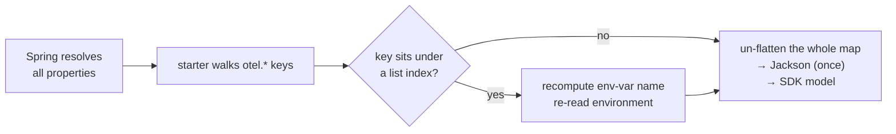
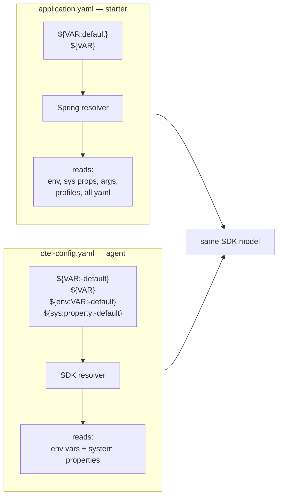
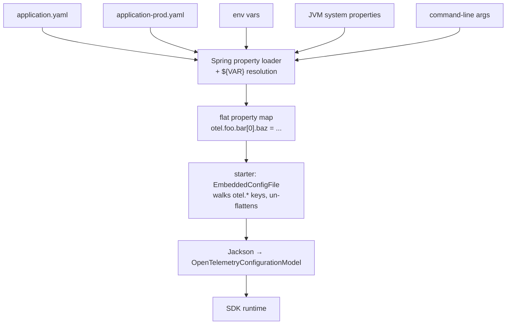

The OpenTelemetry Spring Boot starter gained declarative-configuration support
starting in version 2.26.0 — the same YAML schema
[the Java agent introduced in late 2025](/blog/2025/declarative-config/), now
embedded inside `application.yaml`. This post traces what one env var,
`OTEL_SERVICE_NAME=petclinic`, does in that new world, and where the seams are.

_In a hurry? Jump straight to the
[Spring Boot starter declarative-config docs](/docs/zero-code/java/spring-boot-starter/declarative-configuration/),
paste your `application.properties` into the
[interactive converter](/docs/zero-code/java/spring-boot-starter/declarative-configuration/#convert-your-existing-configuration),
or pick your SDK setup in the [Ecosystem Explorer](/ecosystem/) with the Spring
Boot starter target selected. Come back for the story when you have a coffee._

---

For years, environment variables (and their JVM `-D` cousins) were the only way
to configure the OpenTelemetry SDK: every exporter, every sampler, every
captured header, expressed as a flat list of `OTEL_*` variables.

Since starter 2.26.0, that list has a sibling. The SDK
[declarative-configuration schema](/docs/languages/sdk-configuration/declarative-configuration/)
is a YAML tree that can describe an entire telemetry pipeline (every processor,
every exporter, every nested option) in the same shape the SDK actually runs.

For things the env var could not say, Spring starter users needed to write a
`@Bean`. Java agent users had to write a full extension and package it in a
separate jar to ship alongside the agent — which can be prohibitive.

The schema moves into your `application.yaml`, under a single `otel:` key. Env
vars still work, but in a narrower role: `OTEL_SERVICE_NAME` lands as a resource
attribute because a service-name detector reads it at boot, and any
`${VAR:default}` placeholder you write into the YAML pulls one in by name.
Otherwise, the YAML is the source of truth.

## A YAML file inside your YAML file

```yaml
otel:
  file_format: '1.0'

  resource:
    attributes:
      - name: service.name
        value: petclinic

  tracer_provider:
    processors:
      - batch:
          exporter:
            otlp_http:
              endpoint: ${OTEL_EXPORTER_OTLP_TRACES_ENDPOINT:http://localhost:4318/v1/traces}
```

The block under `otel:` is the OpenTelemetry SDK schema (list of processors,
each holding an exporter, each holding configuration) inside Spring's
`application.yaml`. The presence of `otel.file_format` is the switch. Everything
beneath it is parsed against the SDK schema. Spring does not need to know what
any of it means.

## The wall env vars alone could not climb

Env vars cover a fixed list of built-in choices: a
[fixed set of samplers](/docs/languages/sdk-configuration/general/#otel_traces_sampler)
via `OTEL_TRACES_SAMPLER`, the standard OTLP exporters via
`OTEL_EXPORTER_OTLP_*`, the usual signal-toggle flags. Anything outside that
catalog (a custom rule-based sampler, a second OTLP exporter on a debug
pipeline, a baggage processor, any nested option the SDK exposes) meant writing
a `@Bean` (Spring starter) or shipping a separate extension jar (Java agent).
Declarative config unlocks the rest of the tree.

The docs page for the starter has a small example most teams need on day one:
[exclude actuator endpoints from tracing](/docs/zero-code/java/spring-boot-starter/programmatic-configuration/#exclude-actuator-endpoints-from-tracing).
Yesterday that was a `@Configuration` class:

```java
@Configuration
public class FilterPaths {
  @Bean
  public AutoConfigurationCustomizerProvider otelCustomizer() {
    return p ->
        p.addSamplerCustomizer(
            (fallback, config) ->
                RuleBasedRoutingSampler.builder(SpanKind.SERVER, fallback)
                    .drop(UrlAttributes.URL_PATH, "^/actuator")
                    .build());
  }
}
```

Today it is a YAML block in `application.yaml`:

```yaml
otel:
  tracer_provider:
    sampler:
      parent_based:
        root:
          rule_based_routing:
            fallback_sampler:
              always_on:
            span_kind: SERVER
            rules:
              - action: DROP
                attribute: url.path
                pattern: /actuator.*
```

Both versions run the same Java code — the agent and the starter already bundle
the `opentelemetry-samplers` contrib jar. What changes is who writes the wiring.

> [!NOTE] An alternative: the composable rule-based sampler
>
> The schema also has the composable rule-based sampler (under
> `composite/development.rule_based` in the
> [configuration types reference](/docs/specs/otel-config/types/)), which
> accomplishes the same thing with a richer rule grammar: attribute patterns
> with includes/excludes, multi-condition matches, span-kind filters, parent
> state, and arbitrary nested composition. The example above stays with
> `rule_based_routing` because OTel Java has long recommended that sampler for
> this problem, and the `composite/development` path still carries the
> `*/development` suffix until the composable schema stabilizes. See a working
> [example](https://github.com/open-telemetry/opentelemetry-configuration/blob/v1.0.0/snippets/Sampler_rule_based_kitchen_sink.yaml#L10-L53)
> in the SDK config repository.

The rest of this post follows `OTEL_SERVICE_NAME` through three stages on its
way into the SDK.

## Stage one: arriving at Spring's property stack

Spring's property loader stacks every source the app sees — `application.yaml`,
every active profile's overlay, the JVM `-D` flags, the `--key=value`
command-line args, environment variables — into a single addressable property
universe. `OTEL_SERVICE_NAME` lives in that stack alongside `SERVER_PORT` and
`SPRING_PROFILES_ACTIVE`. Spring does not know which of these belong to
OpenTelemetry; that is the starter's job, at the end of the line.

> [!NOTE] How Spring quietly aligns env vars with YAML keys
>
> Spring exposes every property under a single canonical, lowercased,
> dot-separated name. The same property can come from many sources, written
> differently in each:
>
> | Source             | Written as                      |
> | ------------------ | ------------------------------- |
> | env var            | `OTEL_SERVICE_NAME=petclinic`   |
> | system prop        | `-Dotel.service.name=petclinic` |
> | command line       | `--otel.service.name=petclinic` |
> | `application.yaml` | `otel.service.name: petclinic`  |
>
> Spring translates between them with rules like "lowercase, `_` becomes `.`".
> The starter never has to know which one you used.
>
> This is a Spring-only superpower. The OpenTelemetry SDK by itself does not
> auto-map env vars onto YAML paths; that was discussed during the schema's
> design and rejected as too complex. So inside the agent's standalone YAML, you
> cannot set `OTEL_SERVICE_NAME` and have it land at `service.name` in the tree.
> The starter gets this for free, because Spring is doing the mapping, not the
> SDK.



_The starter walks every property Spring exposes, picks out the `otel.*` keys,
and hands the assembled map to Jackson — once, for the whole tree, not per
element. The diamond is the seam this post is about: an extra step for keys that
sit under a list index, which the next stage explains._

## Stage two: the env var Spring almost lost

Most `otel.*` env vars travel light. This one does not:

```bash
OTEL_TRACER_PROVIDER_PROCESSORS_0_BATCH_EXPORTER_OTLP_HTTP_ENDPOINT=http://collector:4318/v1/traces
```

It gets through, but only because sixteen lines deep inside the starter go
hunting for it by name. The diamond in the diagram above is where they live.

> [!NOTE] Why the starter walks every property source
>
> Asking Spring for the property by name would return this value just fine.
> Spring's relaxed binding has long understood that `OTEL_..._ENDPOINT` is
> another spelling of `otel....endpoint`, brackets and all.
>
> The usual Spring move for "I have a tree of config" would be a
> [`@ConfigurationProperties`](https://docs.spring.io/spring-boot/reference/features/external-config.html#features.external-config.typesafe-configuration-properties)
> class: declare a Java POJO shaped like your config tree, annotate it with the
> property prefix, and Spring binds every source onto it for you. The OTel SDK
> schema is hundreds of properties across many polymorphic layers (every
> exporter type, every sampler type, every processor type),
> [generated](/docs/languages/sdk-configuration/declarative-configuration/) from
> a YAML schema that is still evolving. A hand-written POJO tree to mirror it
> would be a second source of truth, perpetually behind the first. The
> gold-plated answer is to _generate_ the POJOs from the schema (the SDK's DC
> schema plus the not-yet-existing schemas for the `distribution.*` and
> `instrumentation/development.*` subtrees); that same generated description
> could also drive the JSON metadata Spring uses for IDE completion. The Java
> instrumentation team tracks that as a future improvement in
> [opentelemetry-java-instrumentation#14083](https://github.com/open-telemetry/opentelemetry-java-instrumentation/issues/14083).
>
> So the starter does something Spring rarely sees: it walks every
> `PropertySource` directly and collects keys that begin with `otel.`. The walk
> sees the YAML source's names with brackets
> (`otel.tracer_provider.processors[0]...`), the env-var source's names with
> underscores (`OTEL_TRACER_..._ENDPOINT`); Spring's rename only happens when
> you _resolve_ a property, not when you _list_ one. Then Jackson binds the
> collected keys onto the _generated_ configuration model, which always matches
> the live schema.
>
> Sixteen lines in
> [`EmbeddedConfigFile`](https://github.com/open-telemetry/opentelemetry-java-instrumentation/blob/v2.29.0/instrumentation/spring/spring-boot-autoconfigure/src/main/java/io/opentelemetry/instrumentation/spring/autoconfigure/EmbeddedConfigFile.java#L66-L82)
> close the gap between the two naming conventions. For every `otel.*` key that
> contains a `[N]` bracket, the starter rebuilds the env-var name from the
> property name and asks Spring directly.

## Stage three: two substituters, one syntax

Both `application.yaml` and the SDK's standalone YAML use `${...}` placeholders.
They mean almost, but not quite, the same thing. Spring will happily resolve a
chained fallback like
`${OTEL_EXPORTER_OTLP_TRACES_ENDPOINT:${OTEL_EXPORTER_OTLP_ENDPOINT:http://localhost:4318}}/v1/traces`,
chasing the outer placeholder into the inner so you can prefer a signal-specific
override, fall back to a general one, and ultimately to a literal. The SDK's
substituter is a single non-recursive regular-expression pass; the same
expression in `otel-config.yaml` would not parse.



> [!NOTE] Same dollar-brace, two substituters
>
> Inside `application.yaml`, Spring resolves `${VAR:default}` (single colon)
> from any property source it knows about: env vars, system properties,
> profiles, command-line args, external config servers. The SDK's standalone
> YAML uses `${VAR:-default}` (double colon, dash) and resolves from process env
> vars and JVM system properties only. In the starter, the SDK substituter never
> runs; Spring has already finished by the time the starter reads the value.

That is also why all the Spring-native config tricks (profiles, command-line
`--key=value`, `@Value`-style externalization, even external config servers)
work transparently for OTel config. The starter never implemented any of them.
Spring's resolver did, and the starter just reads properties.

The biggest practical consequence: in the starter, any env var named on the same
canonical key path as a YAML leaf overrides it automatically — no extra wiring.
The agent's standalone YAML cannot do that. There, an env-var override has to be
wired into the YAML as a `${VAR}` placeholder ahead of time, or it does nothing.

> [!NOTE] Example: overriding a YAML leaf with an env var
>
> In the starter, this works at startup with nothing else changed in the YAML:
>
> ```bash
> OTEL_TRACER_PROVIDER_PROCESSORS_0_BATCH_EXPORTER_OTLP_HTTP_ENDPOINT=\
>   http://prod-collector:4318/v1/traces
> ```
>
> Whatever the `application.yaml` said for that endpoint is replaced.
>
> In the agent, you would first have to write `${MY_ENDPOINT:-http://...}` into
> the YAML, then set `MY_ENDPOINT` at startup. Containers in production land
> softer in the starter.

## Arrival: the resolved tree the SDK actually boots from

By the time the SDK boots, every `otel.*` value has been resolved, relaxed,
normalized, and joined with every other into a single flat map. The starter
un-flattens that map back into the tree the SDK expects, hands it to Jackson,
and Jackson produces the `OpenTelemetryConfigurationModel` the SDK boots from.
Whatever wrote which value — yaml, env var, profile overlay, command-line arg —
the SDK only ever sees the resolved result.



_Spring owns the front door. The SDK never sees a raw `${VAR}`, a profile name,
or a property file — only a fully-resolved tree, handed over once at boot._

## Why "experimental" is the best reason to try declarative config now

Declarative configuration is the schema OpenTelemetry is converging on across
every language. It is not finished. The Spring Boot starter's support for it is
marked experimental, exactly because it has not seen enough real applications
yet to know which corners to tighten.

That is not a warning. It is an invitation. Now, before the schema freezes, is
the highest-leverage moment to put declarative config into a real
`application.yaml` and see what breaks. Your friction is what shapes the schema
that lands.

## Getting there in 60 seconds

Two starting points, both already there:

- **You already have an `application.properties`?** Paste it into the
  [interactive converter](/docs/zero-code/java/spring-boot-starter/declarative-configuration/#convert-your-existing-configuration)
  on the doc page. Out comes the YAML, ready to drop into `application.yaml`.
- **Greenfield?** The [OpenTelemetry Ecosystem Explorer](/ecosystem/) generates
  declarative-config YAML interactively: pick exporters, samplers,
  instrumentations, and copy the result. A new Spring Boot starter target mode
  wraps the output under `otel:` and uses the right
  `distribution.spring_starter.*` keys.

## The fine print

- **Dependency management is required on Spring Boot 3.5+.** Spring Boot 3.5
  ships its own OpenTelemetry version pin that conflicts with what the starter
  needs. Import the OTel instrumentation BOM in `dependencyManagement` (see the
  [docs](/docs/zero-code/java/spring-boot-starter/getting-started/#dependency-management)).
  Skip it and you will see
  `NoClassDefFoundError: io/opentelemetry/common/ComponentLoader` at startup.
- **Durations are milliseconds, as numbers.** Use `5000`, not `5s`.
- **Programmatic customization changes shape.**
  `AutoConfigurationCustomizerProvider` is replaced by
  `DeclarativeConfigurationCustomizerProvider`; SDK components plug in via the
  `ComponentProvider` API. The
  [agent extension API docs](/docs/zero-code/java/agent/declarative-configuration/#extension-api)
  apply to the starter unchanged.

If you migrate a real application onto this and hit something off, please file
an issue:
[opentelemetry-java-instrumentation](https://github.com/open-telemetry/opentelemetry-java-instrumentation/issues)
for code,
[opentelemetry.io](https://github.com/open-telemetry/opentelemetry.io/issues)
for docs.
