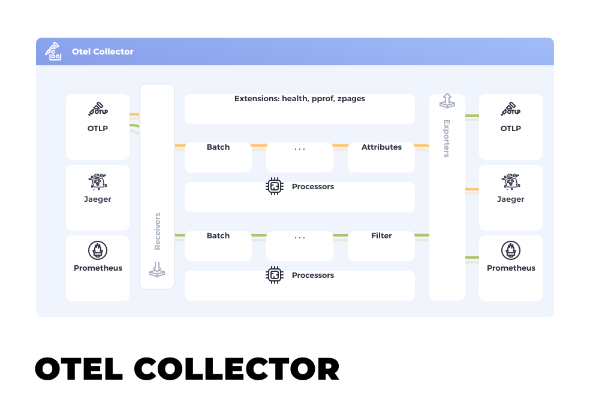

## Introduction

The OpenTelemetry Collector offers a vendor-agnostic implementation of how to
receive, process and export telemetry data. It removes the need to run, operate,
and maintain multiple agents/collectors. This works with improved scalability
and supports open-source observability data formats (e.g. Jaeger, Prometheus,
Fluent Bit, etc.) sending to one or more open-source or commercial back-ends.
The local Collector agent is the default location to which instrumentation
libraries export their telemetry data.

## Objectives

- _Usability_: Reasonable default configuration, supports popular protocols,
  runs and collects out of the box.
- _Performance_: Highly stable and performant under varying loads and
  configurations.
- _Observability_: An exemplar of an observable service.
- _Extensibility_: Customizable without touching the core code.
- _Unification_: Single codebase, deployable as an agent or collector with
  support for traces, metrics, and logs (future).

## When to use a collector

For most language specific instrumentation libraries you have exporters for
popular backends and OTLP. You might wonder,

> under what circumstances does one use a collector to send data, as opposed to
> having each service send directly to the backend?

For trying out and getting started with OpenTelemetry, sending your data
directly to a backend is a great way to get value quickly. Also, in a
development or small-scale environment you can get decent results without a
collector.

However, in general we recommend using a collector alongside your service, since
it allows your service to offload data quickly and the collector can take care
of additional handling like retries, batching, encryption or even sensitive data
filtering.

It is also easier to [setup a collector](./getting-started) than you might
think: the default OTLP exporters in each language assume a local collector
endpoint, so you'd start up a collector and you'd just start getting telemetry.

## Status and releases

The **collector** status is: [mixed][], since core collector components
currently have mixed [stability levels][].

**Collector components** differ in their maturity levels. An effort is underway
to ensure that every component has its stability documented. To track the
progress of this effort, see `opentelemetry-collector-contrib` [issue #10116][].

{}

[issue #10116]:
  https://github.com/open-telemetry/opentelemetry-collector-contrib/issues/10116
[mixed]: /docs/reference/specification/document-status/#mixed
[stability levels]:
  https://github.com/open-telemetry/opentelemetry-collector#stability-levels
