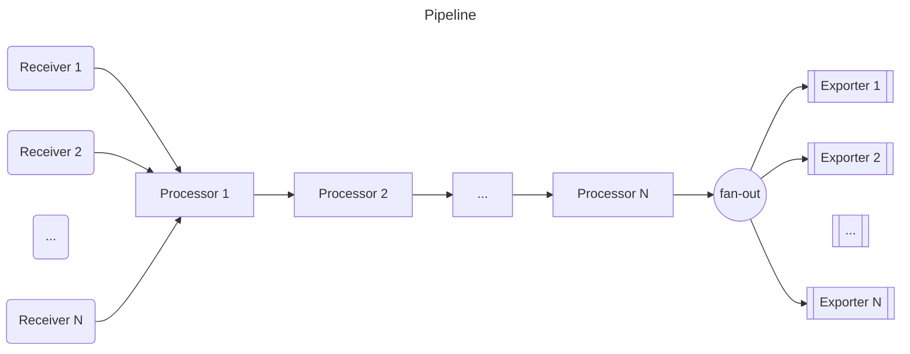
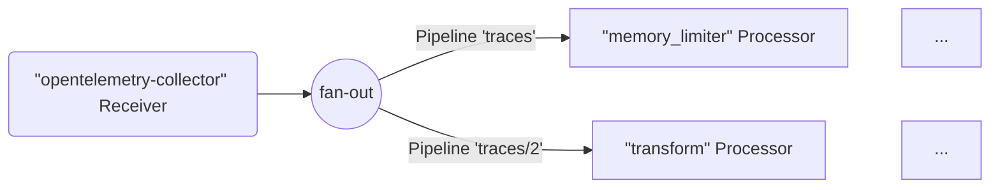
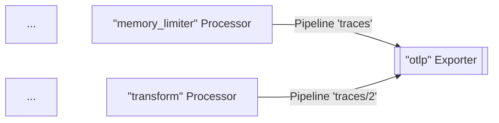
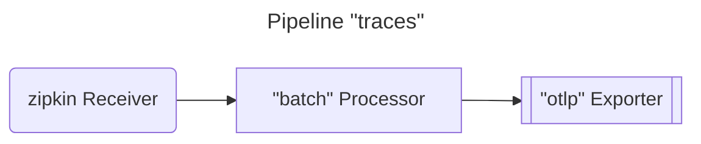
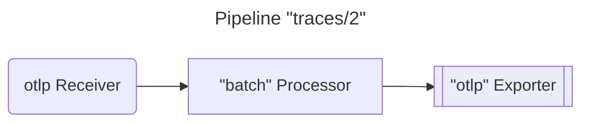
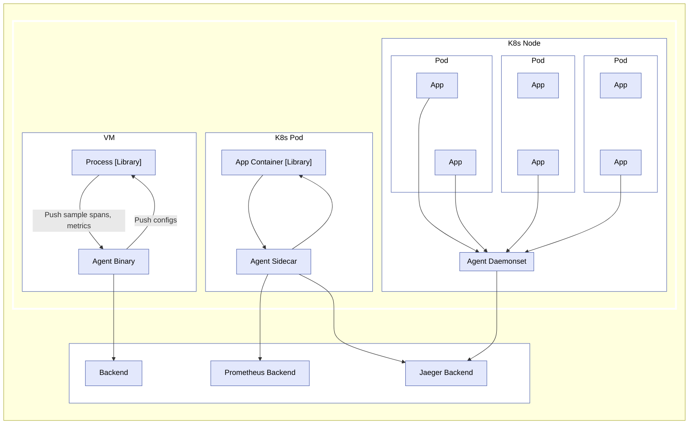
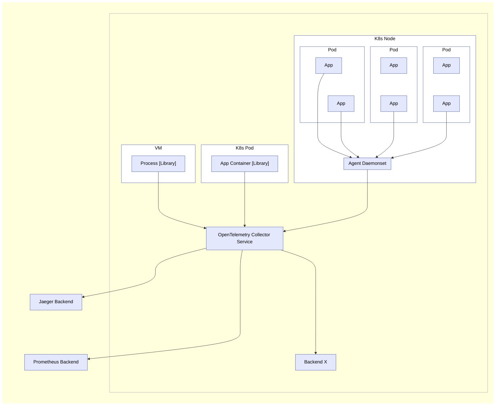

The OpenTelemetry Collector is an executable file that can receive telemetry,
process it, and export it to multiple targets, such as observability backends.

The Collector supports several popular open source protocols for receiving and
sending telemetry data, and it offers an extensible architecture for adding more
protocols.

Data receiving, processing, and exporting are done using
[pipelines](#pipelines). You can configure the Collector to have one or more
pipelines.

Each pipeline includes the following:

- A set of [receivers](#receivers) that collect the data.
- A series of optional [processors](#processors) that get the data from
  receivers and process it.
- A set of [exporters](#exporters) which get the data from processors and send
  it outside the Collector.

The same receiver can be included in multiple pipelines and multiple pipelines
can include the same exporter.

## Pipelines

A pipeline defines a path that data follows in the Collector: from reception, to
processing (or modification), and finally to export.

Pipelines can operate on three telemetry data types: traces, metrics, and logs.
The data type is a property of the pipeline defined by its configuration.
Receivers, processors, and exporters used in a pipeline must support the
particular data type, otherwise the `pipeline.ErrSignalNotSupported` exception
is reported when the configuration loads.

The following diagram represents a typical pipeline:



Pipelines can have one or more receivers. Data from all receivers is pushed to
the first processor, which processes the data and then pushes it to the next
processor. A processor might also drop the data if it's sampling or filtering.
This continues until the last processor in the pipeline pushes the data to the
exporters. Each exporter gets a copy of each data element. The last processor
uses a `fanoutconsumer` to send the data to multiple exporters.

The pipeline is constructed during Collector startup based on pipeline
definition in the configuration.

A pipeline configuration typically looks like this:

```yaml
service:
  pipelines: # section that can contain multiple subsections, one per pipeline
    traces: # type of the pipeline
      receivers: [otlp, zipkin]
      processors: [memory_limiter, batch]
      exporters: [otlp, zipkin]
```

The previous example defines a pipeline for the traces type of telemetry data,
with two receivers, two processors, and two exporters.

### Receivers

Receivers typically listen on a network port and receive telemetry data. They
can also actively obtain data, like scrapers. Usually one receiver is configured
to send received data to one pipeline. However, it is also possible to configure
the same receiver to send the same received data to multiple pipelines. This can
be done by listing the same receiver in the `receivers` key of several
pipelines:

```yaml
receivers:
  otlp:
    protocols:
      grpc:
        endpoint: localhost:4317

service:
  pipelines:
    traces: # a pipeline of “traces” type
      receivers: [otlp]
      processors: [memory_limiter, batch]
      exporters: [otlp]
    traces/2: # another pipeline of “traces” type
      receivers: [otlp]
      processors: [transform]
      exporters: [otlp]
```

In the above example, `otlp` receiver will send the same data to pipeline
`traces` and to pipeline `traces/2`.

> The configuration uses composite key names in the form of `type[/name]`.

When the Collector loads this config, the result looks like this diagram (part
of processors and exporters are omitted for brevity):



{}

When the same receiver is referenced in more than one pipeline, the Collector
creates only one receiver instance at runtime that sends the data to a fan-out
consumer. The fan-out consumer in turn sends the data to the first processor of
each pipeline. The data propagation from receiver to the fan-out consumer and
then to processors is completed using a synchronous function call. This means
that if one processor blocks the call, the other pipelines attached to this
receiver are blocked from receiving the same data, and the receiver itself stops
processing and forwarding newly received data.

{}

### Exporters

Exporters typically forward the data they get to a destination on a network, but
they can also send the data elsewhere. For example, `debug` exporter writes the
telemetry data to the logging destination.

The configuration allows for multiple exporters of the same type, even in the
same pipeline. For example, you can have two `otlp` exporters defined, each one
sending to a different OTLP endpoint:

```yaml
exporters:
  otlp/1:
    endpoint: example.com:4317
  otlp/2:
    endpoint: localhost:14317
```

An exporter usually gets the data from one pipeline. However, you can configure
multiple pipelines to send data to the same exporter:

```yaml
exporters:
  otlp:
    protocols:
      grpc:
        endpoint: localhost:14250

service:
  pipelines:
    traces: # a pipeline of “traces” type
      receivers: [zipkin]
      processors: [memory_limiter]
      exporters: [otlp]
    traces/2: # another pipeline of “traces” type
      receivers: [otlp]
      processors: [transform]
      exporters: [otlp]
```

In the above example, `otlp` exporter gets data from pipeline `traces` and from
pipeline `traces/2`. When the Collector loads this config, the result looks like
this diagram (part of processors and receivers are omitted for brevity):



### Processors

A pipeline can contain sequentially connected processors. The first processor
gets the data from one or more receivers that are configured for the pipeline,
and the last processor sends the data to one or more exporters that are
configured for the pipeline. All processors between the first and last receive
the data from only one preceding processor and send data to only one succeeding
processor.

Processors can transform the data before forwarding it, such as adding or
removing attributes from spans. They can also drop the data by deciding not to
forward it (for example, the `probabilisticsampler` processor). Or they can
generate new data.

The same name of the processor can be referenced in the `processors` key of
multiple pipelines. In this case, the same configuration is used for each of
these processors, but each pipeline always gets its own instance of the
processor. Each of these processors has its own state, and the processors are
never shared between pipelines. For example, if `batch` processor is used in
several pipelines, each pipeline has its own batch processor, but each batch
processor is configured exactly the same way if they reference the same key in
the configuration. See the following configuration:

```yaml
processors:
  batch:
    send_batch_size: 10000
    timeout: 10s

service:
  pipelines:
    traces: # a pipeline of “traces” type
      receivers: [zipkin]
      processors: [batch]
      exporters: [otlp]
    traces/2: # another pipeline of “traces” type
      receivers: [otlp]
      processors: [batch]
      exporters: [otlp]
```

When the Collector loads this config, the result looks like this diagram:





Note that each `batch` processor is an independent instance, although they are
configured the same way with a `send_batch_size` of `10000`.

> The same name of the processor must not be referenced multiple times in the
> `processors` key of a single pipeline.

## Running as an agent

On a typical VM/container, user applications are running in some processes/pods
with an OpenTelemetry library. Previously, the library did all the recording,
collecting, sampling, and aggregation of traces, metrics, and logs, and then
either exported the data to other persistent storage backends through the
library exporters, or displayed it on local zpages. This pattern has several
drawbacks, for example:

1. For each OpenTelemetry library, exporters and zpages must be re-implemented
   in native languages.
2. In some programming languages (for example, Ruby or PHP), it is difficult to
   do the stats aggregation in process.
3. To enable exporting of OpenTelemetry spans, stats, or metrics, application
   users need to manually add library exporters and redeploy their binaries.
   This is especially difficult when an incident has occurred, and users want to
   use OpenTelemetry to investigate the issue right away.
4. Application users need to take the responsibility for configuring and
   initializing exporters. These tasks are error-prone (for example, setting up
   incorrect credentials or monitored resources), and users may be reluctant to
   “pollute” their code with OpenTelemetry.

To resolve the issues above, you can run OpenTelemetry Collector as an agent.
The agent runs as a daemon in the VM/container and can be deployed independent
of the library. Once the agent is deployed and running, it should be able to
retrieve traces, metrics, and logs from the library, and export them to other
backends. We may also give the agent the ability to push configurations (such as
sampling probability) to the library. For those languages that cannot do stats
aggregation in process, they can send raw measurements and have the agent do the
aggregation.



> For developers and maintainers of other libraries: By adding specific
> receivers, you can configure an agent to accept traces, metrics, and logs from
> other tracing/monitoring libraries, such as Zipkin, Prometheus, etc. See
> [Receivers](#receivers) for details.

## Running as a gateway

The OpenTelemetry Collector can run as a gateway instance and receive spans and
metrics exported by one or more agents or libraries or by tasks/agents that emit
in one of the supported protocols. The Collector is configured to send data to
the configured exporter(s). The following figure summarizes the deployment
architecture:



The OpenTelemetry Collector can also be deployed in other configurations, such
as receiving data from other agents or clients in one of the formats supported
by its receivers.
