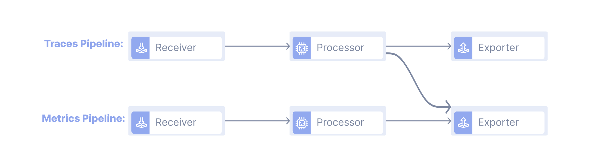
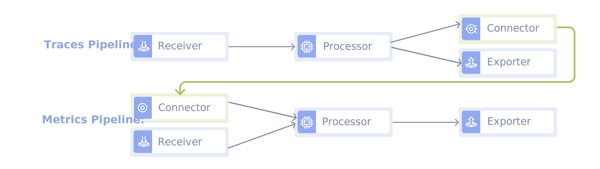

## Connectors in OpenTelemetry

The content of this page is most applicable if you already have an instrumented
application generating some kind of tracing telemetry data and already have an
understanding of the [OpenTelemetry Collector](/docs/collector).

## What is a Connector?

A connector acts as the means of sending telemetry data between different
collector pipelines by connecting them. A connector acts as an exporter to one
pipeline and a receiver to another. Each pipeline in the OpenTelemetry Collector
acts on one type of telemetry data. There may exist the need to process one form
of telemetry data into another one, but it is required to route the according
data to its proper collector pipeline.

## Why use a Connector?

The connector is beneficial at merging, routing and replicating data streams.
Along with sequential pipelining, which is to connect pipelines together, the
connector component is capable of conditional data flow and generated data
streams. Conditional data flow means sending data to the highest priority
pipeline and has error detection to route to alternative pipeline if need be.
Generated data streams means that the component generates and emits its own data
based on the received data. This tutorial emphasizes on the connector's ability
to connect pipelines.

There are processors in OpenTelemetry that convert telemetry data of one type
into another one. A few examples are the spanmetrics processor, as well as the
servicegraph processor. The spanmetrics processor generates aggregate requests,
error and duration metrics from span data. T​he servicegraph processor analyzes
trace data and generates metrics that describe the relationship between the
services. Both these processors ingest trace data and convert them to metrics
data. Since pipelines in the OpenTelemetry Collector are for only one type of
data, it is necessary to convert the trace data from the processor in the traces
pipeline and send it to the metrics pipeline. Historically, some processors
transmitted data by making use of a workaround that follows a bad practice where
a processor directly exports data after processing. The connector component
solves the need for this workaround and the processors that used the workaround
have been deprecated. On the same line, above mentioned processors are also now
deprecated in recent releases and are replaced by the connectors.

Additional details about the connector's full capabilities can be found at the
following links:
[What are Connectors in OpenTelemetry?](https://observiq.com/blog/what-are-connectors-in-opentelemetry/),
[OpenTelemetry Connector Configurations](/docs/collector/configuration/#connectors)

### The Old Architecture:



### New Architecture Using a Connector:



## Building Example Connector

For this tutorial, we will write an example connector that takes traces and
converts them into metrics as a basic example of how the connector component in
OpenTelemetry functions. The functionality of the basic connector is to simply
count the number of spans in traces that contain a specific attribute name. The
count of these occurrences are stored in the connector.

## Configurations

### Setting up Collector Config:

Setup the configuration you will use for the OpenTelemetry Collector in the
`config.yaml` file. This file defines how your data will be routed, processed
and exported. The configurations defined in the file, detail how you want your
data pipeline to behave. You can define the components and how the data moves
through your defined pipeline from start to end. There are further details about
how to configure a collector at
[Collector Configurations](/docs/collector/configuration).

Use the following code for the example connector we will build. The code is an
example of a basic valid OpenTelemetry Collector configuration file.

```yaml
receivers:
  otlp:
    protocols:
      grpc:
        endpoint: 0.0.0.0:4317
      http:
        endpoint: 0.0.0.0:4318

processors:
  batch:

exporters:
  # NOTE: Prior to v0.86.0 use the `logging` instead of `debug`.
  debug:

connectors:
  example:

service:
  pipelines:
    traces:
      receivers: [otlp]
      processors: [batch]
      exporters: [example]
    metrics:
      receivers: [example]
      exporters: [debug]
```

In the connectors portion of the above code, you need to declare the names of
the usable connectors for your pipeline. Here, `example` is the name of the
connector we will create in this tutorial.

## Implementation

1.  Create a folder for your example connector. In this tutorial we will create
    a folder called `exampleconnector`.
2.  Navigate to the folder and run

    ```sh
    go mod init github.com/gord02/exampleconnector
    ```

3.  Run `go mod tidy`

    This will create files `go.mod` and `go.sum`.

4.  Create the following files in the folder
    - `config.go` - A file to define the connector's settings
    - `factory.go` - A file to create instances of the connector

### Create your connector settings in config.go

In order to be instantiated and participate in pipelines, the collector needs to
identify your connector and properly load its settings from within its
configuration file.

In order to be able to give your connector access to its settings, create a
`Config` struct. The struct must have an exported field for each of the
connector’s settings. The parameter fields added will be accessible from the
config.yaml file. Their name in the configuration file is set through a struct
tag. Create struct and add parameters. You can optionally add a validator
function to check if the given default values are valid for an instance of your
connector.

Here is what the `config.go` file should look like:

> exampleconnector/config.go

```go
package exampleconnector

import "fmt"

// Config represents the connector config settings within the collector's config.yaml
type Config struct {
    AttributeName string `mapstructure:"attribute_name"`
}

func (c *Config) Validate() error {
    if c.AttributeName == "" {
        return fmt.Errorf("attribute_name must not be empty")
    }
    return nil
}
```

Further details about mapstructure can be found at
[Go mapstructure](https://pkg.go.dev/github.com/mitchellh/mapstructure).

## Implement the Factory

To instantiate the object, you will need to use the `NewFactory` function
associated with each of the components. We will use the `connector.NewFactory`
function. The `connector.NewFactory` function instantiates and returns a
`connector.Factory` and it requires the following parameters:

- `component.Type`: a unique string identifier for your connector across all
  collector’s components of the same type. This string also acts as the name to
  refer to the connector by.
- `component.CreateDefaultConfigFunc`: a reference to a function that returns
  the default `component.Config` instance for your connector.
- `...FactoryOption`: the slice of `connector.FactoryOptions` will determine
  what type of signal your connector is capable of processing.

1.  Create factory.go file and define the unique string to identify your
    connector as a global constant.

    ```go
    const (
        defaultVal = "request.n"
        // this is the name used to refer to the connector in the config.yaml
        typeStr = "example"
    )
    ```

2.  Create the default configuration function. This is how you choose to
    initialize your connector object with default values.

    ```go
    func createDefaultConfig() component.Config {
        return &Config{
            AttributeName: defaultVal,
        }
    }
    ```

3.  Define the type of the connector you will work with. This will be passed as
    a factory option. A connector can connect pipelines of different or similar
    types. We have to define the type of the exported end of the connector and
    the receiver end of the connector. A connector that exports traces and
    receives metrics is just one distinct configuration of the connector
    component and the order of how it is defined matters. A connector that
    exporters traces and receives metrics is not the same as a connector that
    could export metrics and receive traces.

    ```go
    // createTracesToMetricsConnector defines the consumer type of the connector
    // We want to consume traces and export metrics, therefore, define nextConsumer as metrics, since consumer is the next component in the pipeline
    func createTracesToMetricsConnector(ctx context.Context, params connector.Settings, cfg component.Config, nextConsumer consumer.Metrics) (connector.Traces, error) {
    c, err := newConnector(params.Logger, cfg, nextConsumer)
    if err != nil {
        return nil, err
    }
    return c, nil
    }
    ```

    `createTracesToMetricsConnector` is a function that further initializes the
    connector component by defining its consumer component, or the next
    component to ingest the data after the connector transmits the data. It
    should be noted that the connector is not restricted to one ordered
    combination of types like we have here. For example, the count connector
    defines several of these functions for traces to metrics, logs to metrics
    and metrics to metrics.

    #### Parameters for the `createTracesToMetricsConnector`: 
    - `context.Context`: the reference to the collector’s `context.Context` so
      your trace receiver can properly manage its execution context.
    - `connector.CreateSettings`: the reference to some of the collector’s
      settings under which your receiver is created.
    - `component.Config`: the reference for the receiver config settings passed
      by the collector to the factory so it can properly read its settings from
      the collector config.
    - `consumer.Metrics`: the reference to the next consumer type in the
      pipeline, which is where received traces will go. This can be a processor,
      exporter or another connector.

4.  Write a `NewFactory` function that instantiates your custom factory for your
    connector(component).

    ```go
    // NewFactory creates a factory for example connector.
    func NewFactory() connector.Factory {
        // OpenTelemetry connector factory to make a factory for connectors
        newType, err := component.NewType(typeStr)
        if err != nil {
            panic(err) // or handle error appropriately
        }

        return connector.NewFactory(
            newType,
            createDefaultConfig,
            connector.WithTracesToMetrics(createTracesToMetricsConnector, component.StabilityLevelAlpha))
    }
    ```

    It should be noted that connectors can support multiple ordered combinations
    of data types.

Once finished, here is `factory.go`:

```go
package exampleconnector

import (
	"context"

	"go.opentelemetry.io/collector/component"
	"go.opentelemetry.io/collector/connector"
	"go.opentelemetry.io/collector/consumer"
)

const (
	defaultVal string = "request.n"
	// this is the name used to refer to the connector in the config.yaml
	typeStr string = "example"
)

// NewFactory creates a factory for example connector.
func NewFactory() connector.Factory {
	// OpenTelemetry connector factory to make a factory for connectors
	newType, err := component.NewType(typeStr)
	if err != nil {
		panic(err) // or handle error appropriately
	}

	return connector.NewFactory(
		newType,
		createDefaultConfig,
		connector.WithTracesToMetrics(createTracesToMetricsConnector, component.StabilityLevelAlpha))
}

func createDefaultConfig() component.Config {
	return &Config{
		AttributeName: defaultVal,
	}
}

// createTracesToMetricsConnector defines the consumer type of the connector
// We want to consume traces and export metrics, therefore, define nextConsumer as metrics, since consumer is the next component in the pipeline
func createTracesToMetricsConnector(ctx context.Context, params connector.Settings, cfg component.Config, nextConsumer consumer.Metrics) (connector.Traces, error) {
	c, err := newConnector(params.Logger, cfg, nextConsumer)
	if err != nil {
		return nil, err
	}
	return c, nil
}
```

## Implementing the Trace Connector

Implement the methods from the interface component specific to the type of the
component in the `connector.go` file. In this tutorial we will implement the
Traces connector and therefore must implement the interfaces: `baseConsumer`,
`Traces` and `component.Component`.

1.  Define the connector struct with the desired parameters for your connector

    ```go
    // schema for connector
    type connectorImp struct {
        config          Config
        metricsConsumer consumer.Metrics
        logger          *zap.Logger
        // Include these parameters if a specific implementation for the Start and Shutdown function are not needed
        component.StartFunc
        component.ShutdownFunc
    }
    ```

2.  Define the `newConnector` function to create a connector

    ```go
    // newConnector is a function to create a new connector
    func newConnector(logger *zap.Logger, config component.Config, nextConsumer consumer.Metrics) (*connectorImp, error) {
        logger.Info("Building exampleconnector connector")
        cfg := config.(*Config)

        return &connectorImp{
            config:          *cfg,
            logger:          logger,
            metricsConsumer: nextConsumer,
        }, nil
    }
    ```

    The `newConnector` function is a factory function to create an instance of a
    connector.

3.  Implement `Capabilities` method to properly implement the interface

    ```go
    // Capabilities implements the consumer interface.
    func (c *connectorImp) Capabilities() consumer.Capabilities {
        return consumer.Capabilities{MutatesData: false}
    }
    ```

    Implement the `Capabilities` method to ensure your connector is of type
    consumer. This method defines the capabilities of the component, whether the
    component can mutate data or not. If `MutatesData` is set to true, it
    indicates that the connector mutates the data structures it is handed.

4.  Implement `Consumer` method to consume telemetry data

    ```go
    // ConsumeTraces method is called for each instance of a trace sent to the connector
    func (c *connectorImp) ConsumeTraces(ctx context.Context, td ptrace.Traces) error {
        // loop through the levels of spans of the one trace consumed
        for i := 0; i < td.ResourceSpans().Len(); i++ {
            resourceSpan := td.ResourceSpans().At(i)

            for j := 0; j < resourceSpan.ScopeSpans().Len(); j++ {
                scopeSpan := resourceSpan.ScopeSpans().At(j)

                for k := 0; k < scopeSpan.Spans().Len(); k++ {
                    span := scopeSpan.Spans().At(k)
                    attrs := span.Attributes()
                    mapping := attrs.AsRaw()
                    for key := range mapping {
                        if key == c.config.AttributeName {
                            // create metric only if span of trace had the specific attribute
                            metrics := pmetric.NewMetrics()
                            return c.metricsConsumer.ConsumeMetrics(ctx, metrics)
                        }
                    }
                }
            }
        }
        return nil
    }
    ```

5.  Optional: Implement `Start` and `Shutdown` methods to properly implement the
    interface only if a specific implementation is required. Otherwise, it is
    enough to include `component.StartFunc` and `component.ShutdownFunc` as part
    of the defined connector struct.

The complete connector file should look like this:

> exampleconnector/connector.go

```go
package exampleconnector

import (
	"context"

	"go.uber.org/zap"

	"go.opentelemetry.io/collector/component"
	"go.opentelemetry.io/collector/consumer"
	"go.opentelemetry.io/collector/pdata/pmetric"
	"go.opentelemetry.io/collector/pdata/ptrace"
)

// schema for connector
type connectorImp struct {
	config          Config
	metricsConsumer consumer.Metrics
	logger          *zap.Logger
	// Include these parameters if a specific implementation for the Start and Shutdown function are not needed
	component.StartFunc
	component.ShutdownFunc
}

// newConnector is a function to create a new connector
func newConnector(logger *zap.Logger, config component.Config, nextConsumer consumer.Metrics) (*connectorImp, error) {
	logger.Info("Building exampleconnector connector")
	cfg := config.(*Config)

	return &connectorImp{
		config:          *cfg,
		logger:          logger,
		metricsConsumer: nextConsumer,
	}, nil
}

// Capabilities implements the consumer interface.
func (c *connectorImp) Capabilities() consumer.Capabilities {
	return consumer.Capabilities{MutatesData: false}
}

// ConsumeTraces method is called for each instance of a trace sent to the connector
func (c *connectorImp) ConsumeTraces(ctx context.Context, td ptrace.Traces) error {
	// loop through the levels of spans of the one trace consumed
	for i := 0; i < td.ResourceSpans().Len(); i++ {
		resourceSpan := td.ResourceSpans().At(i)

		for j := 0; j < resourceSpan.ScopeSpans().Len(); j++ {
			scopeSpan := resourceSpan.ScopeSpans().At(j)

			for k := 0; k < scopeSpan.Spans().Len(); k++ {
				span := scopeSpan.Spans().At(k)
				attrs := span.Attributes()
				mapping := attrs.AsRaw()
				for key := range mapping {
					if key == c.config.AttributeName {
						// create metric only if span of trace had the specific attribute
						metrics := pmetric.NewMetrics()
						return c.metricsConsumer.ConsumeMetrics(ctx, metrics)
					}
				}
			}
		}
	}
	return nil
}
```

## Using the Component

### Summary of Using OpenTelemetry Collector Builder:

You can use the
[OpenTelemetry Collector Builder](/docs/collector/custom-collector/) to build
your code and run it. The collector builder is a tool that enables you to build
your own OpenTelemetry Collector binary. You can add or remove components
(receivers, processors, connectors and exporters) to suit your needs.

1.  Follow the OpenTelemetry Collector Builder
    [installation instructions](/docs/collector/custom-collector/).

2.  Write a Configuration File:

    Once installed, the next step is to create a configuration file
    `builder-config.yaml`. This file defines the collector components you want
    to include in your custom binary.

    Here is an example of the configuration file you can use featuring your new
    connector component:

    ```yaml
    dist:
        name: otelcol-dev-bin
        description: Basic OpenTelemetry collector distribution for Developers
        output_path: ./otelcol-dev


    exporters:
        - gomod: 
            # Note: Prior to v0.86.0 use the `loggingexporter` instead of `debugexporter`.
            go.opentelemetry.io/collector/exporter/debugexporter v0.129.0


    processors:
        - gomod:
            go.opentelemetry.io/collector/processor/batchprocessor v0.129.0


    receivers:
        - gomod: 
            go.opentelemetry.io/collector/receiver/otlpreceiver v0.129.0


    connectors:
        - gomod: 
            github.com/gord02/exampleconnector v0.129.0


    replaces:
    # a list of "replaces" directives that will be part of the resulting go.mod

    # This replace statement is necessary since the newly added component is not found/published to GitHub yet. Replace references to GitHub path with the local path
    -  github.com/gord02/exampleconnector => [PATH-TO-COMPONENT-CODE]/exampleconnector

    ```

    It is necessary to include a replace statement. The replace section since
    your newly created component is not published to GitHub yet. The references
    to the GitHub path for your component will need to be replaced with the
    local path to your code.

    There are further details on replacement in go at
    [Go mod file Replace](https://go.dev/ref/mod#go-mod-file-replace).

3.  Build Your collector binary:

    Run the builder while passing in the builder config file detailing the
    included connector component which will then build the custom collector
    binary:

    ```sh
    ./ocb --config [PATH-TO-CONFIG]/builder-config.yaml
    ```

    This will generate the collector binary in the specified output path
    directory that was in your config file.

    When the build is successful, you should see output similar to:
     ```sh
    ./ocb --config builder-config.yaml                
    2025-07-15T22:10:10.351+0900    INFO    internal/command.go:99  OpenTelemetry Collector Builder {"version": "0.129.0"}
    2025-07-15T22:10:10.352+0900    INFO    internal/command.go:104 Using config file       {"path": "builder-config.yaml"}
    2025-07-15T22:10:10.353+0900    INFO    builder/config.go:160   Using go        {"go-executable": "/opt/homebrew/Cellar/go@1.23/1.23.6/bin/go"}
    2025-07-15T22:10:10.354+0900    INFO    builder/main.go:99      Sources created {"path": "./otelcol-dev"}
    2025-07-15T22:10:10.516+0900    INFO    builder/main.go:201     Getting go modules
    2025-07-15T22:10:10.554+0900    INFO    builder/main.go:110     Compiling
    2025-07-15T22:10:13.369+0900    INFO    builder/main.go:140     Compiled        {"binary": "./otelcol-dev/otelcol-dev-bin"}
    ```

4.  Run Your collector binary:

    Now you can run your custom collector binary using the binary path from step 3 output (e.g., `{"binary": "./otelcol-dev/otelcol-dev-bin"}`):

    ```sh
    ./otelcol-dev/otelcol-dev-bin --config [PATH-TO-CONFIG]/config.yaml
    ```

    The output path name and name of dist is detailed in the
    `build-config.yaml`.

## Testing Your Connector

Now that you have built and configured your example connector, you can test its functionality to ensure it works as expected. This section will guide you through creating and running tests that validate your connector's behavior.

### Testing Overview

The example connector is designed to:

- Monitor incoming trace data for spans containing a specific attribute (`request.n` by default)
- When a span with the target attribute is detected, it generates a metric
- Pass the generated metric to the next component in the pipeline (debug exporter)

### Expected Behavior

- **Trace with "request.n" attribute** → Connector detects → Generates metric → Debug output
- **Trace without target attribute** → Connector ignores → No metric generated

### Prerequisites for Testing

- Go 1.21+
- Your custom OpenTelemetry Collector binary with the example connector built-in

### Test Setup

This test uses the OpenTelemetry Go SDK to create and send traces, which is more realistic than manually crafting HTTP requests since it mimics how real applications would instrument their code.

1. **Create a test project directory:**

   ```sh
   mkdir connector-test
   cd connector-test
   ```

2. **Initialize a Go module:**

   ```sh
   go mod init connector-test
   ```

3. **Create the test file:**

   Create a file named `test_connector.go` with the following content:

   > test_connector.go

   ```go
   package main

   import (
       "context"
       "log"
       "time"

       "go.opentelemetry.io/otel"
       "go.opentelemetry.io/otel/attribute"
       "go.opentelemetry.io/otel/exporters/otlp/otlptrace/otlptracehttp"
       "go.opentelemetry.io/otel/sdk/resource"
       sdktrace "go.opentelemetry.io/otel/sdk/trace"
       semconv "go.opentelemetry.io/otel/semconv/v1.26.0"
   )

   func main() {
       ctx := context.Background()

       // Configure OTLP HTTP exporter (send to local Collector)
       exporter, err := otlptracehttp.New(ctx,
           otlptracehttp.WithEndpoint("http://localhost:4318"),
           otlptracehttp.WithInsecure(),
       )
       if err != nil {
           log.Fatal("Failed to create OTLP trace exporter: ", err)
       }

       // Configure resource
       res, err := resource.New(ctx,
           resource.WithAttributes(
               semconv.ServiceNameKey.String("test-service"),
               semconv.ServiceVersionKey.String("1.0.0"),
           ),
       )
       if err != nil {
           log.Fatal("Failed to create resource: ", err)
       }

       // Configure trace provider
       tp := sdktrace.NewTracerProvider(
           sdktrace.WithBatcher(exporter),
           sdktrace.WithResource(res),
       )
       defer func() {
           if err := tp.Shutdown(ctx); err != nil {
               log.Fatal("Failed to shutdown TracerProvider: ", err)
           }
       }()

       otel.SetTracerProvider(tp)

       // Create tracer
       tracer := otel.Tracer("test-tracer")

       // Test case 1: span with "request.n" attribute (connector should react)
       log.Println("🧪 Test 1: Sending trace with 'request.n' attribute...")
       _, span1 := tracer.Start(ctx, "test-operation-with-trigger")
       span1.SetAttributes(
           attribute.String("request.n", "some-value"), // This should trigger the connector
           attribute.String("http.method", "GET"),
           attribute.String("http.url", "/api/test"),
       )
       time.Sleep(5 * time.Second)
       span1.End()

       // Test case 2: span without "request.n" attribute (connector should not react)
       log.Println("🧪 Test 2: Sending trace without 'request.n' attribute...")
       _, span2 := tracer.Start(ctx, "test-operation-without-trigger")
       span2.SetAttributes(
           attribute.String("http.method", "POST"),
           attribute.String("http.url", "/api/other"),
           attribute.String("user.id", "12345"),
       )
       time.Sleep(5 * time.Second)
       span2.End()

       // Wait for all spans to be sent
       time.Sleep(2 * time.Second)
       log.Println("✅ Test completed! Please check the Collector logs.")
   }
   ```

4. **Install dependencies:**

   ```sh
   go mod tidy
   ```

   This will automatically download the required OpenTelemetry Go SDK packages:
   - `go.opentelemetry.io/otel`
   - `go.opentelemetry.io/otel/exporters/otlp/otlptrace/otlptracehttp`
   - `go.opentelemetry.io/otel/sdk`

### Running the Test

1. **Start your OpenTelemetry Collector** with the configuration that includes your example connector:

   ```sh
   ./otelcol-dev/otelcol-dev-bin --config config.yaml
   ```

   Make sure your `config.yaml` includes the connector configuration:

   ```yaml
   receivers:
     otlp:
       protocols:
         http:
           endpoint: 0.0.0.0:4318

   connectors:
     example:

   exporters:
     debug:

   service:
     pipelines:
       traces:
         receivers: [otlp]
         exporters: [example]
       metrics:
         receivers: [example]
         exporters: [debug]
   ```

2. **Run the test in a separate terminal:**

   ```sh
   go run test_connector.go
   ```

### Expected Test Results

**Test Script Output:**
```
2025/07/15 22:19:05 🧪 Test 1: Sending trace with 'request.n' attribute...
2025/07/15 22:19:10 🧪 Test 2: Sending trace without 'request.n' attribute...
2025/07/15 22:19:17 ✅ Test completed! Please check the Collector logs.
```

**Collector Logs:**
When the test runs successfully, you should see in your collector logs:

- **Trace Reception:** OTLP receiver logs showing incoming trace data
- **Connector Activation:** Connector building logs when processing Test 1
- **Metric Generation:** Debug exporter showing metric output (only for Test Case 1)

Example collector log output:
```
2025-07-15T22:19:07.123+0900    info    exampleconnector@v0.129.0/connector.go:26    Building exampleconnector connector
2025-07-15T22:19:07.456+0900    info    Metrics {"resource metrics": 0, "metrics": 0, "data points": 0}
```

### Understanding the Results

**✅ Success Indicators:**
- Test script completes without errors
- Collector shows metric generation logs for Test Case 1
- No metric logs appear for Test Case 2

**❌ Troubleshooting:**
- **No metric logs:** Check if collector is running and configured correctly
- **Connection errors:** Verify collector is listening on `localhost:4318`
- **OTLP exporter errors:** Check endpoint URL format (`http://localhost:4318`)
- **Module dependency errors:** Run `go mod tidy` to resolve OpenTelemetry SDK dependencies
- **Span not being sent:** Ensure proper tracer shutdown with `tp.Shutdown(ctx)`


Additional resources on the OpenTelemetry Collector Builder:

- [Building a custom collector](/docs/collector/custom-collector)
- [OpenTelemetry Collector Builder README](https://github.com/open-telemetry/opentelemetry-collector/tree/main/cmd/builder)
- [Connected Observability Pipelines in the OpenTelemetry Collector by Dan Jaglowski](https://www.youtube.com/watch?v=uPpZ23iu6kI)
- [Connector README](https://github.com/open-telemetry/opentelemetry-collector/blob/main/connector/README.md)