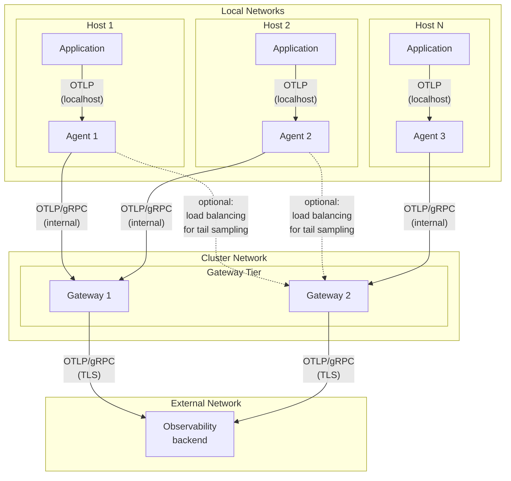
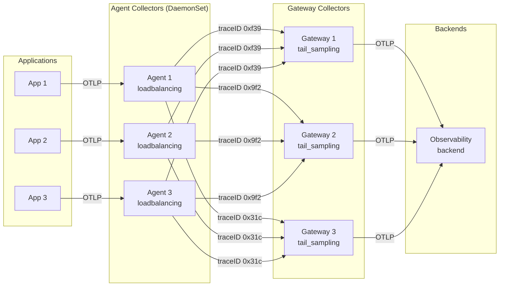

[Agents](/docs/collector/deploy/agent/) and
[gateways](/docs/collector/deploy/gateway/) solve different problems. By
combining them in your deployment, you can create an observability architecture
that addresses the following issues:

- Separation of concerns: Avoid placing complex configuration and processing
  logic on every machine or in every node. Agent configurations stay small and
  focused, while central processors handle the heavier collection tasks.
- Scalable cost control: Make better sampling and batching decisions in gateways
  that can receive telemetry from multiple agents. Gateways can see the full
  picture, including complete traces, and can be independently scaled.
- Security and stability: Send telemetry over local networks from agents to
  gateways. Gateways become a stable egress point that can handle retries and
  manage credentials.

## Example agent-to-gateway architecture

The following diagram shows an architecture for a combined agent-to-gateway
deployment:

- Agent collectors run on each host in a DaemonSet pattern and collect telemetry
  from services running on the host as well as the host's own telemetry, with
  optional load balancing.
- Gateway collectors receive data from agents, perform centralized processing,
  such as filtering and sampling, and then export the data to backends.
- Applications communicate with local agents using `localhost`, agents
  communicate with gateways over the internal cluster network, and gateways
  securely communicate with external backends using TLS.




## When to use this pattern

The agent-to-gateway pattern adds operational complexity compared to simpler
deployment options. Use this pattern when you need one or more of the following
capabilities:

- **Host-specific data collection**: You need to collect metrics, logs, or
  traces that are only available on the host where your applications run, such
  as host metrics, system logs, or resource detection. For example, receivers
  like the
  [`hostmetricsreceiver`](https://github.com/open-telemetry/opentelemetry-collector-contrib/tree/main/receiver/hostmetricsreceiver)
  or
  [`filelogreceiver`](https://github.com/open-telemetry/opentelemetry-collector-contrib/tree/main/receiver/filelogreceiver)
  must be unique per host instance. Running multiple instances of these
  receivers on the same host results in duplicate data. Similarly, the
  [`resourcedetectionprocessor`](https://github.com/open-telemetry/opentelemetry-collector-contrib/tree/main/processor/resourcedetectionprocessor)
  adds information about the host where both the Collector and the application
  are running. Running this processor in a Collector on a separate machine from
  the application results in incorrect data.

- **Centralized processing**: You want to perform complex processing operations,
  such as tail-based sampling, advanced filtering, or data transformation, in a
  central location rather than on every host.

- **Network isolation**: Your applications run in a restricted network
  environment where only specific egress points can communicate with external
  backends.

- **Cost optimization at scale**: You need to make sampling decisions based on
  complete trace data or perform aggregation across multiple sources before
  sending data to backends.

### When simpler patterns work better

You might not need the agent-to-gateway pattern if:

- Your applications can send telemetry directly to backends using OTLP.
- You don't need to collect host-specific metrics or logs.
- You don't require complex processing like tail-based sampling.
- You're running a small deployment where operational simplicity is more
  important than the benefits this pattern provides.

For simpler use cases, consider using only
[agents](/docs/collector/deploy/agent/) or only
[gateways](/docs/collector/deploy/gateway/).

## Configuration examples

The following examples show typical configurations for agents and gateways in an
agent-to-gateway deployment.

### Example agent configuration

This example shows an agent configuration that collects application telemetry
and host metrics, then forwards to a gateway:

```yaml
receivers:
  # Receive telemetry from applications
  otlp:
    protocols:
      grpc:
        endpoint: 0.0.0.0:4317
      http:
        endpoint: 0.0.0.0:4318

  # Collect host metrics
  hostmetrics:
    collection_interval: 30s
    scrapers:
      cpu:
      memory:
      disk:
      filesystem:
      network:

processors:
  # Detect and add resource attributes about the host
  resourcedetection:
    detectors: [env, system, docker]
    timeout: 5s

  # Prevent memory issues
  memory_limiter:
    check_interval: 1s
    limit_mib: 512
    spike_limit_mib: 128

  # Use smaller batches on agents
  batch:
    send_batch_size: 1024
    send_batch_max_size: 2048 # safety limit
    timeout: 1s

exporters:
  # Send to gateway
  otlp:
    endpoint: otel-gateway:4317
    tls:
      insecure: false
      ca_file: /etc/ssl/certs/ca.crt
    # Enable retry logic
    retry_on_failure:
      enabled: true
      initial_interval: 5s
      max_interval: 30s
      max_elapsed_time: 300s
    # Absorb short gateway outages
    sending_queue:
      enabled: true
      num_consumers: 2
      queue_size: 5000

service:
  pipelines:
    traces:
      receivers: [otlp]
      processors: [resourcedetection, memory_limiter, batch]
      exporters: [otlp]
    metrics:
      receivers: [otlp, hostmetrics]
      processors: [resourcedetection, memory_limiter, batch]
      exporters: [otlp]
    logs:
      receivers: [otlp]
      processors: [resourcedetection, memory_limiter, batch]
      exporters: [otlp]
```

### Example gateway configuration

This example shows a gateway configuration that receives data from agents,
performs sampling, and exports to backends:

```yaml
receivers:
  # Receive from agents
  otlp:
    protocols:
      grpc:
        endpoint: 0.0.0.0:4317
      http:
        endpoint: 0.0.0.0:4318

processors:
  # Prevent memory issues with higher limits
  memory_limiter:
    check_interval: 1s
    limit_mib: 2048
    spike_limit_mib: 512

  # Use larger batches for efficiency
  batch:
    send_batch_size: 10000
    send_batch_max_size: 20000 # safety limit
    timeout: 10s

  # Optional: tail-based sampling
  tail_sampling:
    decision_wait: 10s
    num_traces: 100000 # requires more memory
    policies:
      # Always sample traces with errors
      - name: errors-policy
        type: status_code
        status_code: { status_codes: [ERROR] }
      # Sample 10% of other traces
      - name: probabilistic-policy
        type: probabilistic
        probabilistic: { sampling_percentage: 10 }

exporters:
  # Export to your observability backend
  otlp:
    endpoint: your-backend:4317
    headers:
      api-key: ${env:BACKEND_API_KEY}
    # Enable retry logic
    retry_on_failure:
      enabled: true
      initial_interval: 5s
      max_interval: 60s
      max_elapsed_time: 0s # retry indefinitely
    # Absorb backend outages
    sending_queue:
      enabled: true
      num_consumers: 4
      queue_size: 20000

  # Optional: Export metrics to Prometheus
  prometheusremotewrite:
    endpoint: https://prometheus:9090/api/v1/write
    tls:
      insecure: false

service:
  pipelines:
    traces:
      receivers: [otlp]
      processors: [memory_limiter, tail_sampling, batch]
      exporters: [otlp]
    metrics:
      receivers: [otlp]
      processors: [memory_limiter, batch]
      exporters: [otlp, prometheusremotewrite]
    logs:
      receivers: [otlp]
      processors: [memory_limiter, batch]
      exporters: [otlp]
```

### Example tail-based sampling configuration

When using tail-based sampling across multiple gateway instances, configure
agents to use the load balancing exporter:

#### Agent configuration with load balancing

```yaml
receivers:
  otlp:
    protocols:
      grpc:
        endpoint: 0.0.0.0:4317

processors:
  memory_limiter:
    check_interval: 1s
    limit_mib: 512
  batch:
    send_batch_size: 1024
    timeout: 1s

exporters:
  # Load balance by trace ID
  loadbalancing:
    protocol:
      otlp:
        tls:
          insecure: false
    resolver:
      dns:
        hostname: otel-gateway-headless
        port: 4317
    routing_key: traceID

service:
  pipelines:
    traces:
      receivers: [otlp]
      processors: [memory_limiter, batch]
      exporters: [loadbalancing]
```

The gateway configuration remains the same as shown in the previous example,
with tail-based sampling configured in the processor.

#### Architecture for tail-based sampling

The following diagram shows how trace-ID-based load balancing works with
tail-based sampling across multiple gateway instances.

The `loadbalancingexporter` uses `traceID` to determine which gateway receives
the spans

- All spans from **traceID 0xf39** (from any agent) route to Gateway 1.
- All spans from **traceID 0x9f2** (from any agent) route to Gateway 2.
- All spans from **traceID 0x31c** (from any agent) route to Gateway 3.

This configuration ensures each gateway sees all spans for a trace, enabling
accurate tail-based sampling decisions.



## Processor configuration in agents and gateways

When deploying an agent-to-gateway pattern, configure processors differently
based on their role.

### Essential processors for production

Both agents and gateways should include:

- **Memory limiter processor**: This processor prevents out-of-memory issues by
  applying backpressure when memory usage is high. Configure this as the first
  processor in your pipeline. Agents typically need smaller limits (256-512 MB),
  while gateways require more memory (1-4 GB or higher) for batching and
  sampling operations.

- **Batch processor**: This processor improves efficiency by batching telemetry
  data before export. Configure agents with smaller batch sizes and shorter
  timeouts (for example, `send_batch_size: 1024`, `timeout: 1s`) to minimize
  latency and memory usage. Configure gateways with larger batch sizes and
  longer timeouts (for example, `send_batch_size: 10000`, `timeout: 10s`) for
  better throughput and backend efficiency.

### Sampling considerations

- **Probabilistic sampling**: You can configure this on either agents or
  gateways. When using probabilistic sampling across multiple collectors, ensure
  they use the same hash seed for consistent sampling decisions.

- **Tail-based sampling**: Configure tail-based sampling on gateways only
  because the processor must see all spans for a trace to make sampling
  decisions. When using tail-based sampling with multiple gateway instances, you
  need to ensure all spans for a given trace ID are routed to the same gateway
  instance. Use the
  [`loadbalancingexporter`](https://github.com/open-telemetry/opentelemetry-collector-contrib/tree/main/exporter/loadbalancingexporter)
  in your agents to distribute traces by trace ID to your gateway instances.

  > [!CAUTION] The tail-sampling processor can make accurate decisions only if
  > all spans for a trace arrive at the same Collector instance. While the load
  > balancing exporter supports routing by trace ID, running tail sampling
  > across multiple gateway instances is an advanced setup and has practical
  > caveats, such as re-splitting of routing when backends change and
  > cache/decision consistency. Test carefully and prefer a single
  > well-resourced tail-sampling gateway unless you have a robust sticky-routing
  > strategy.

## Communication between agents and gateways

Agents need to reliably send telemetry data to gateways. Configure the
communication protocol, endpoints, and security settings appropriately for your
environment.

### Protocol selection

Use the OTLP protocol for communication between agents and gateways. OTLP
provides the best performance and compatibility across the OpenTelemetry
ecosystem. Configure the OTLP exporter in your agents to send data to the OTLP
receiver in your gateways.

In Kubernetes environments, use service names for endpoint configuration. For
example, if your gateway service is named `otel-gateway`, configure your agent
exporter with `endpoint: otel-gateway:4317`.

### Retries

In production, configure exporter queue and retry settings (for example,
`retry_on_failure` or `sending_queue` settings) on agents and gateways to handle
temporary outages between agents and gateways or between gateways and backends.
Gateways often need larger queues and retry policies to handle backend outages.
Also consider `send_batch_max_size` to avoid transient backend rejections due to
oversized payloads.

### Security

For production deployments, secure the communication between agents and
gateways:

- Enable
  [TLS](https://pkg.go.dev/go.opentelemetry.io/collector/config/configtls) on
  OTLP receivers and exporters.
- Use mutual TLS
  ([mTLS](https://pkg.go.dev/go.opentelemetry.io/collector/config/configtls)) to
  authenticate both agents and gateways.
- Consider token-based authentication using the
  [`bearertokenauthextension`](https://github.com/open-telemetry/opentelemetry-collector-contrib/tree/main/extension/bearertokenauthextension)
  when mTLS is not practical.

In Kubernetes environments, automate certificate issuance and rotation (for
example, with [cert-manager](https://cert-manager.io/docs/)) and mount
certificates into Collector pods as Secrets. Certificate reload behavior can
vary by component, so plan rolling restarts if needed when certificates rotate.

## Scaling agents and gateways

As your telemetry volume grows, you need to scale your Collectors appropriately.
Agents and gateways have different scaling characteristics and requirements.

### Agents

Agents typically don't require horizontal scaling because they run on each host
(DaemonSet pattern in Kubernetes). Instead, scale agents vertically by adjusting
resource limits:

- Monitor CPU and memory usage through Collector internal metrics.
- Increase memory limits if you see memory pressure or memory limiter
  backpressure.
- Increase CPU limits if you experience CPU throttling.

### Gateways

You can scale gateways both vertically and horizontally:

- **Without tail-based sampling**: Use any load balancer or Kubernetes service
  with round-robin distribution. All gateway instances operate independently.

  > [!NOTE] When scaling gateway instances that export metrics, ensure your
  > deployment follows the single-writer principle to avoid multiple Collectors
  > writing the same time series concurrently. Some backends require consistent
  > time series ownership. See the
  > [gateway deployment documentation](/docs/collector/deploy/gateway/#multiple-collectors-and-the-single-writer-principle)
  > for details.

- **With tail-based sampling**: Deploy agents with the `loadbalancingexporter`
  to route spans by trace ID. The load balancing exporter ensures all spans for
  a trace go to the same gateway instance, which is required for tail-based
  sampling decisions.

For automatic scaling in Kubernetes, use
[Horizontal Pod Autoscaling (HPA)](https://kubernetes.io/docs/concepts/workloads/autoscaling/horizontal-pod-autoscale/)
based on CPU or memory metrics. Configure the HPA to scale gateways based on
your workload patterns.

## Resource planning

Properly sizing your Collectors prevents performance issues and ensures reliable
telemetry collection. Resource requirements differ significantly between agents
and gateways.

### Agent resource requirements

Agents typically require the following resources:

- **Memory**: 256-512 MB for standard workloads
- **CPU**: 0.5-1 core for standard workloads

Adjust these values based on your telemetry volume and processing requirements.
Always configure the memory limiter processor to prevent out-of-memory issues.

### Gateway resource requirements

Gateway resource requirements vary significantly based on workload:

- **Memory**: 1-4 GB base requirement, with more memory needed for:
  - Tail-based sampling (requires buffering spans)
  - High throughput (larger batches)
  - Complex processing (transforms, filtering)

- **CPU**: 1-4 cores, scaling with throughput

Monitor gateway resource usage and adjust based on observed patterns. Gateways
should have sufficient memory overhead to handle traffic spikes.

## Deployment considerations

Choose deployment patterns that match your infrastructure and operational
requirements. Different deployment options have trade-offs in terms of resource
usage, isolation, and management complexity.

### Agent deployment options

- **DaemonSet (Kubernetes)**: Recommended for most Kubernetes deployments. Runs
  one agent per node, automatically scaling with cluster size.

- **Sidecar**: Use only when you need isolated resource limits per application
  or application-specific configuration. Sidecars increase resource overhead and
  management complexity. Prefer DaemonSets when possible.

### Handling variable workloads

For workloads with significant variability (seasonal traffic, batch jobs):

- Configure memory limiter processor with appropriate limits and spike
  thresholds.
- Use queue settings in exporters to handle temporary traffic spikes.
- For gateways, configure HPA with appropriate scaling policies.
- Monitor queue sizes and retry counts to identify capacity issues.

## Troubleshooting

When telemetry isn't flowing as expected or Collectors are experiencing issues,
use these techniques to identify and resolve problems.

### Verify telemetry flow

To verify that telemetry is flowing correctly between agents and gateways:

1. Enable the
   [`debugexporter`](https://github.com/open-telemetry/opentelemetry-collector/tree/main/exporter/debugexporter)
   temporarily to see data flowing through the Collector.
2. Check Collector metrics to verify data is being received and exported.
3. Look for error logs indicating export failures or backpressure.

### Common issues

- **Memory pressure**: If you see memory limiter dropping data, increase memory
  limits or reduce batch sizes.

- **Queue full errors**: These errors indicate the gateway cannot keep up with
  incoming data. Scale gateways horizontally or vertically, or check backend
  connectivity.

- **CPU throttling**: In Kubernetes, CPU throttling can occur even when usage is
  below limits. Monitor the `container_cpu_cfs_throttled_periods_total` metric
  and adjust CPU limits if needed.

- **Missing spans in tail-based sampling**: Verify that the load balancing
  exporter is configured in agents and that all gateway instances are
  discoverable.

### Monitor Collector health

Monitor these key metrics from your Collectors:

- `otelcol_processor_refused_spans`: Indicates memory pressure or processing
  issues
- `otelcol_exporter_queue_size`: Watch for growing queues indicating export
  problems
- `otelcol_exporter_send_failed_spans`: Indicates backend connectivity or
  capacity issues
- Memory and CPU usage from the Kubernetes metrics API or Prometheus

## Additional resources

For more information, see the following documentation:

- [Collector benchmarks](/docs/collector/benchmarks/)
- [Collector configuration](/docs/collector/configuration/)
- [Memory limiter processor](https://github.com/open-telemetry/opentelemetry-collector/tree/main/processor/memorylimiterprocessor)
- [Batch processor](https://github.com/open-telemetry/opentelemetry-collector/tree/main/processor/batchprocessor)
- [Load balancing exporter](https://github.com/open-telemetry/opentelemetry-collector-contrib/tree/main/exporter/loadbalancingexporter)
- [Tail sampling processor](https://github.com/open-telemetry/opentelemetry-collector-contrib/tree/main/processor/tailsamplingprocessor)
