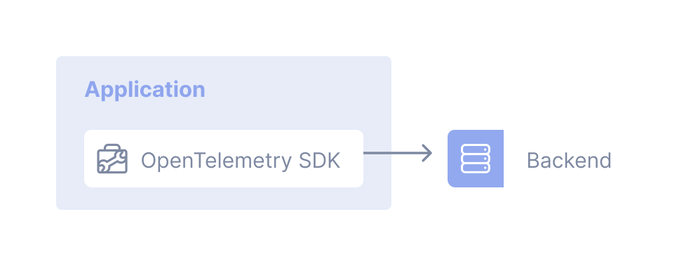

The most direct deployment pattern doesn't use a Collector at all. In this
approach, applications [instrumented][instrumentation] with an OpenTelemetry SDK
export telemetry signals (traces, metrics, and logs) straight to a backend:

## Example

See the [instrumentation documentation][instrumentation] for end-to-end examples
that show how to export signals directly from your application to a backend.

## Trade-offs

Here are the key pros and cons of skipping the Collector:

Pros:

- Straightforward to use, especially in development and test environments
- No additional moving parts to deploy or operate

Cons:

- Requires code changes if collection, processing, or ingestion needs change
- Strong coupling between application code and backend storage or visualization
- Each language implementation supports only a limited number of exporters

[instrumentation]: /docs/languages/
