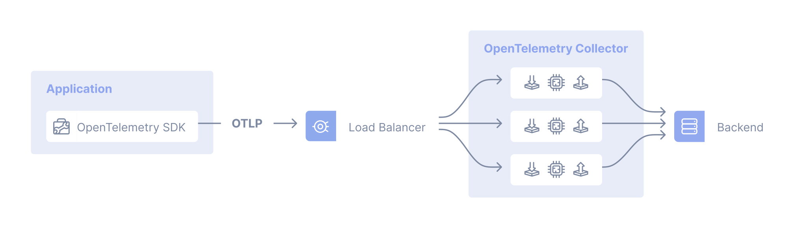
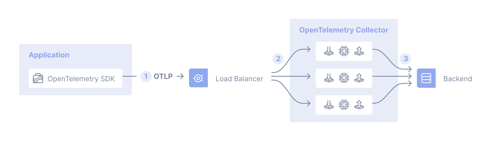
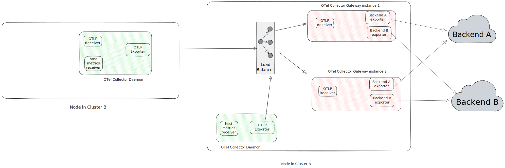

The gateway collector deployment pattern consists of applications (or other
collectors) sending telemetry signals to a single OTLP endpoint provided by one
or more collector instances running as a standalone service (for example, a
deployment in Kubernetes), typically per cluster, per data center or per region.

In the general case you can use an out-of-the-box load balancer to distribute
the load amongst the collectors:



For use cases where the processing of the telemetry data processing has to
happen in a specific collector, you would use a two-tiered setup with a
collector that has a pipeline configured with the [Trace ID/Service-name aware
load-balancing exporter][lb-exporter] in the first tier and the collectors
handling the scale out in the second tier. For example, you will need to use the
load-balancing exporter when using the [Tail Sampling
processor][tailsample-processor] so that all spans for a given trace reach the
same collector instance where the tail sampling policy is applied.

Let's have a look at such a case where we are using the load-balancing exporter:



1. In the app, the SDK is configured to send OTLP data to a central location.
2. A collector configured using the load-balancing exporter that distributes
   signals to a group of collectors.
3. The collectors are configured to send telemetry data to one or more backends.

## Examples

### NGINX as an "out-of-the-box" load balancer

Assuming you have three collectors (`collector1`, `collector2`, and
`collector3`) configured and you want to load balance traffic across them using
NGINX, you can use the following configuration:

```nginx
server {
    listen 4317 http2;
    server_name _;

    location / {
            grpc_pass      grpc://collector4317;
            grpc_next_upstream     error timeout invalid_header http_500;
            grpc_connect_timeout   2;
            grpc_set_header        Host            $host;
            grpc_set_header        X-Real-IP       $remote_addr;
            grpc_set_header        X-Forwarded-For $proxy_add_x_forwarded_for;
    }
}

server {
    listen 4318;
    server_name _;

    location / {
            proxy_pass      http://collector4318;
            proxy_redirect  off;
            proxy_next_upstream     error timeout invalid_header http_500;
            proxy_connect_timeout   2;
            proxy_set_header        Host            $host;
            proxy_set_header        X-Real-IP       $remote_addr;
            proxy_set_header        X-Forwarded-For $proxy_add_x_forwarded_for;
    }
}

upstream collector4317 {
    server collector1:4317;
    server collector2:4317;
    server collector3:4317;
}

upstream collector4318 {
    server collector1:4318;
    server collector2:4318;
    server collector3:4318;
}
```

### load-balancing exporter

For a concrete example of the centralized collector deployment pattern we first
need to have a closer look at the load-balancing exporter. It has two main
configuration fields:

- The `resolver`, which determines where to find the downstream collectors (or:
  backends). If you use the `static` sub-key here, you will have to manually
  enumerate the collector URLs. The other supported resolver is the DNS resolver
  which will periodically check for updates and resolve IP addresses. For this
  resolver type, the `hostname` sub-key specifies the hostname to query in order
  to obtain the list of IP addresses.
- With the `routing_key` field you tell the load-balancing exporter to route
  spans to specific downstream collectors. If you set this field to `traceID`
  (default) then the Load-balancing exporter exports spans based on their
  `traceID`. Otherwise, if you use `service` as the value for `routing_key`, it
  exports spans based on their service name which is useful when using
  connectors like the [Span Metrics connector][spanmetrics-connector], so all
  spans of a service will be send to the same downstream collector for metric
  collection, guaranteeing accurate aggregations.

The first-tier collector servicing the OTLP endpoint would be configured as
shown below:

 {}

```yaml
receivers:
  otlp:
    protocols:
      grpc:
        endpoint: 0.0.0.0:4317

exporters:
  loadbalancing:
    protocol:
      otlp:
        tls:
          insecure: true
    resolver:
      static:
        hostnames:
          - collector-1.example.com:4317
          - collector-2.example.com:5317
          - collector-3.example.com

service:
  pipelines:
    traces:
      receivers: [otlp]
      exporters: [loadbalancing]
```

{} {}

```yaml
receivers:
  otlp:
    protocols:
      grpc:
        endpoint: 0.0.0.0:4317

exporters:
  loadbalancing:
    protocol:
      otlp:
        tls:
          insecure: true
    resolver:
      dns:
        hostname: collectors.example.com

service:
  pipelines:
    traces:
      receivers: [otlp]
      exporters: [loadbalancing]
```

{} {}

```yaml
receivers:
  otlp:
    protocols:
      grpc:
        endpoint: 0.0.0.0:4317

exporters:
  loadbalancing:
    routing_key: service
    protocol:
      otlp:
        tls:
          insecure: true
    resolver:
      dns:
        hostname: collectors.example.com
        port: 5317

service:
  pipelines:
    traces:
      receivers: [otlp]
      exporters: [loadbalancing]
```

{} 

The load-balancing exporter emits metrics including
`otelcol_loadbalancer_num_backends` and `otelcol_loadbalancer_backend_latency`
that you can use for health and performance monitoring of the OTLP endpoint
collector.

## Combined deployment of Collectors as agents and gateways

Often a deployment of multiple OpenTelemetry collectors involves running both
Collector as gateways and as [agents](/docs/collector/deployment/agent/).

The following diagram shows an architecture for such a combined deployment:

- We use the Collectors running in the agent deployment pattern (running on each
  host, similar to Kubernetes daemonsets) to collect telemetry from services
  running on the host and host telemetry, such as host metrics and scrap logs.
- We use Collectors running in the gateway deployment pattern to process data,
  such as filtering, sampling, and exporting to backends etc.



This combined deployment pattern is necessary, when you use components in your
Collector that either need to be unique per host or that consume information
that is only available on the same host as the application is running:

- Receivers like the
  [`hostmetricsreceiver`](https://github.com/open-telemetry/opentelemetry-collector-contrib/tree/main/receiver/hostmetricsreceiver)
  or
  [`filelogreceiver`](https://github.com/open-telemetry/opentelemetry-collector-contrib/tree/main/receiver/filelogreceiver)
  need to be unique per host instance. Running multiple instances of these
  receivers will result in duplicated data.

- Processors like the
  [`resourcedetectionprocessor`](https://github.com/open-telemetry/opentelemetry-collector-contrib/tree/main/processor/resourcedetectionprocessor)
  are used to add information about the host, the collector and the application
  are running on. Running them within a Collector on a remote machine will
  result in incorrect data.

## Tradeoffs

Pros:

- Separation of concerns such as centrally managed credentials
- Centralized policy management (for example, filtering certain logs or
  sampling)

Cons:

- It's one more thing to maintain and that can fail (complexity)
- Added latency in case of cascaded collectors
- Higher overall resource usage (costs)

[lb-exporter]:
  https://github.com/open-telemetry/opentelemetry-collector-contrib/tree/main/exporter/loadbalancingexporter
[tailsample-processor]:
  https://github.com/open-telemetry/opentelemetry-collector-contrib/tree/main/processor/tailsamplingprocessor
[spanmetrics-connector]:
  https://github.com/open-telemetry/opentelemetry-collector-contrib/tree/main/connector/spanmetricsconnector

## Multiple collectors and the single-writer principle

All metric data streams within OTLP must have a
[single writer](/docs/specs/otel/metrics/data-model/#single-writer). When
deploying multiple collectors in a gateway configuration, it's important to
ensure that all metric data streams have a single writer and a globally unique
identity.

### Potential problems

Concurrent access from multiple applications that modify or report on the same
data can lead to data loss or degraded data quality. For example, you might see
inconsistent data from multiple sources on the same resource, where the
different sources can overwrite each other because the resource is not uniquely
identified.

There are patterns in the data that may provide some insight into whether this
is happening or not. For example, upon visual inspection, a series with
unexplained gaps or jumps in the same series may be a clue that multiple
collectors are sending the same samples. You might also see errors in your
backend. For example, with a Prometheus backend:

`Error on ingesting out-of-order samples`

This error could indicate that identical targets exist in two jobs, and the
order of the timestamps is incorrect. For example:

- Metric `M1` received at `T1` with a timestamp 13:56:04 with value `100`
- Metric `M1` received at `T2` with a timestamp 13:56:24 with value `120`
- Metric `M1` received at `T3` with a timestamp 13:56:04 with value `110`
- Metric `M1` received at time 13:56:24 with value `120`
- Metric `M1` received at time 13:56:04 with value `110`

### Best practices

- Use the
  [Kubernetes attributes processor](https://github.com/open-telemetry/opentelemetry-collector-contrib/tree/main/processor/k8sattributesprocessor)
  to add labels to different Kubernetes resources.
- Use the
  [resource detector processor](https://github.com/open-telemetry/opentelemetry-collector-contrib/blob/main/processor/resourcedetectionprocessor/README.md)
  to detect resource information from the host and collect resource metadata.
