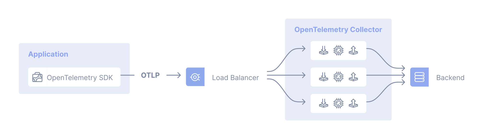
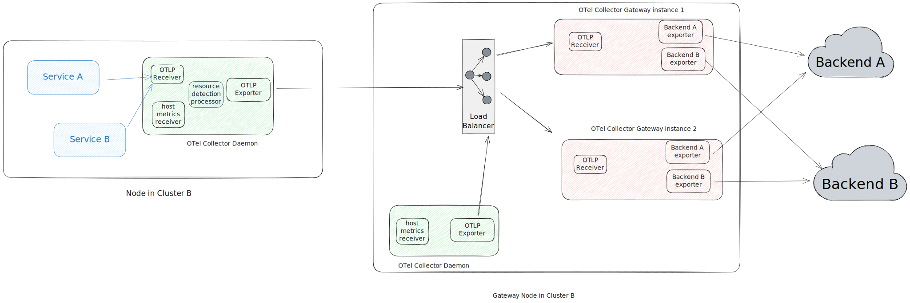

The gateway Collector deployment pattern consists of applications or other
Collectors sending telemetry signals to a single [OTLP](/docs/specs/otlp/)
endpoint. This endpoint is provided by one or more Collector instances running
as a standalone service, for example, in a Kubernetes deployment. Typically, an
endpoint is provided per cluster, per data center, or per region.

In general, you can use an out-of-the-box load balancer to distribute the load
among the Collectors:



For use cases where telemetry data must be processed in a specific Collector,
use a two-tiered setup. The first tier Collector has a pipeline configured with
the [Trace ID/service-name-aware load-balancing exporter][lb-exporter]. In the
second tier, each Collector receives and processes telemetry that can be
directed specifically to it. For example, you can use the load-balancing
exporter in your first tier to send data to a second-tier Collector configured
with the [tail sampling processor][tailsample-processor] so all spans for a
given trace reach the same Collector instance where the tail sampling policy is
applied.

The following diagram shows this setup using the load-balancing exporter:


1. In the app, the SDK is configured to send OTLP data to a central location.
2. A Collector is configured to use the load-balancing exporter to distribute
   signals to a group of Collectors.
3. The Collectors send telemetry data to one or more backends.

## Examples

The following examples show how to configure a gateway Collector with common
components.

### NGINX as an "out-of-the-box" load balancer

Assuming you have three collectors (`collector1`, `collector2`, and
`collector3`) configured and you want to load balance traffic across them using
NGINX, you can use the following configuration:

```nginx
server {
    listen 4317 http2;
    server_name _;

    location / {
            grpc_pass      grpc://collector4317;
            grpc_next_upstream     error timeout invalid_header http_500;
            grpc_connect_timeout   2;
            grpc_set_header        Host            $host;
            grpc_set_header        X-Real-IP       $remote_addr;
            grpc_set_header        X-Forwarded-For $proxy_add_x_forwarded_for;
    }
}

server {
    listen 4318;
    server_name _;

    location / {
            proxy_pass      http://collector4318;
            proxy_redirect  off;
            proxy_next_upstream     error timeout invalid_header http_500;
            proxy_connect_timeout   2;
            proxy_set_header        Host            $host;
            proxy_set_header        X-Real-IP       $remote_addr;
            proxy_set_header        X-Forwarded-For $proxy_add_x_forwarded_for;
    }
}

upstream collector4317 {
    server collector1:4317;
    server collector2:4317;
    server collector3:4317;
}

upstream collector4318 {
    server collector1:4318;
    server collector2:4318;
    server collector3:4318;
}
```

### Load-balancing exporter

For a concrete example of the centralized Collector deployment pattern, first
look at the load-balancing exporter. It has two main configuration fields:

- The `resolver` determines where to find the downstream Collectors or backends.
  If you use the `static` subkey here, you must manually enumerate the Collector
  URLs. The other supported resolver is the DNS resolver, which periodically
  checks for updates and resolves IP addresses. For this resolver type, the
  `hostname` subkey specifies the hostname to query to obtain the list of IP
  addresses.
- The `routing_key` field routes spans to specific downstream Collectors. If you
  set this field to `traceID`, the load-balancing exporter exports spans based
  on their `traceID`. Otherwise, if you use `service` for `routing_key`, it
  exports spans based on their service name. This routing is useful when using
  connectors like the [span metrics connector][spanmetrics-connector] because
  all spans of a service are sent to the same downstream Collector for metric
  collection, guaranteeing accurate aggregations.

The first-tier Collector that serves the OTLP endpoint is configured as follows:

 {}

```yaml
receivers:
  otlp:
    protocols:
      grpc:
        endpoint: 0.0.0.0:4317

exporters:
  loadbalancing:
    protocol:
      otlp:
        tls:
          insecure: true
    resolver:
      static:
        hostnames:
          - collector-1.example.com:4317
          - collector-2.example.com:5317
          - collector-3.example.com

service:
  pipelines:
    traces:
      receivers: [otlp]
      exporters: [loadbalancing]
```

{} {}

```yaml
receivers:
  otlp:
    protocols:
      grpc:
        endpoint: 0.0.0.0:4317

exporters:
  loadbalancing:
    protocol:
      otlp:
        tls:
          insecure: true
    resolver:
      dns:
        hostname: collectors.example.com

service:
  pipelines:
    traces:
      receivers: [otlp]
      exporters: [loadbalancing]
```

{} {}

```yaml
receivers:
  otlp:
    protocols:
      grpc:
        endpoint: 0.0.0.0:4317

exporters:
  loadbalancing:
    routing_key: service
    protocol:
      otlp:
        tls:
          insecure: true
    resolver:
      dns:
        hostname: collectors.example.com
        port: 5317

service:
  pipelines:
    traces:
      receivers: [otlp]
      exporters: [loadbalancing]
```

{} 

The load-balancing exporter emits
[metrics](https://github.com/open-telemetry/opentelemetry-collector-contrib/tree/main/exporter/loadbalancingexporter#metrics)
including `otelcol_loadbalancer_num_backends` and
`otelcol_loadbalancer_backend_latency` that you can use to monitor the health
and performance of the Collector serving the OTLP endpoint.

## Combined deployment of Collectors as agents and gateways

Often, a deployment of multiple OpenTelemetry Collectors runs both Collectors as
gateways and as [agents](/docs/collector/deployment/agent/).

The following diagram shows an architecture for such a combined deployment:

- Use Collectors running in the agent deployment pattern (running on each host,
  similar to Kubernetes DaemonSets) to collect telemetry from services running
  on the host as well as the host's own telemetry, such as host metrics and
  scraped logs.
- Use Collectors running in the gateway deployment pattern to process data, such
  as filtering, sampling, and exporting to backends.



This combined deployment pattern is necessary when you use components in your
Collector that either must be unique per host or consume information that is
available only on the same host where the application runs:

- Receivers like the
  [`hostmetricsreceiver`](https://github.com/open-telemetry/opentelemetry-collector-contrib/tree/main/receiver/hostmetricsreceiver)
  or
  [`filelogreceiver`](https://github.com/open-telemetry/opentelemetry-collector-contrib/tree/main/receiver/filelogreceiver)
  must be unique per host instance. Running multiple instances of these
  receivers on the same host results in duplicate data.

- Processors like the
  [`resourcedetectionprocessor`](https://github.com/open-telemetry/opentelemetry-collector-contrib/tree/main/processor/resourcedetectionprocessor)
  add information about the host where both the Collector and the application
  are running. Running the processor in a Collector on a separate machine from
  the application results in incorrect data.

## Trade-offs

Pros:

- Separation of concerns such as centrally managed credentials
- Centralized policy management (for example, filtering certain logs or
  sampling)

Cons:

- It's one more thing to maintain and that can fail (complexity)
- Added latency in case of cascaded collectors
- Higher overall resource usage (costs)

[lb-exporter]:
  https://github.com/open-telemetry/opentelemetry-collector-contrib/tree/main/exporter/loadbalancingexporter
[tailsample-processor]:
  https://github.com/open-telemetry/opentelemetry-collector-contrib/tree/main/processor/tailsamplingprocessor
[spanmetrics-connector]:
  https://github.com/open-telemetry/opentelemetry-collector-contrib/tree/main/connector/spanmetricsconnector

## Multiple Collectors and the single-writer principle

All metric data streams within OTLP must have a
[single writer](/docs/specs/otel/metrics/data-model/#single-writer). When
deploying multiple Collectors in a gateway configuration, ensure that all metric
data streams have a single writer and a globally unique identity.

### Potential problems

Concurrent access from multiple applications that modify or report on the same
data can lead to data loss or degraded data quality. For example, you might see
inconsistent data from multiple sources on the same resource, where the
different sources can overwrite each other because the resource is not uniquely
identified.

There are patterns in the data that may provide some insight into whether this
is happening or not. For example, upon visual inspection, a series with
unexplained gaps or jumps in the same series may be a clue that multiple
collectors are sending the same samples. You might also see errors in your
backend. For example, with a Prometheus backend:

`Error on ingesting out-of-order samples`

This error could indicate that identical targets exist in two jobs, and the
order of the timestamps is incorrect. For example:

- Metric `M1` received at `T1` with a timestamp 13:56:04 with value `100`
- Metric `M1` received at `T2` with a timestamp 13:56:24 with value `120`
- Metric `M1` received at `T3` with a timestamp 13:56:04 with value `110`
- Metric `M1` received at time 13:56:24 with value `120`
- Metric `M1` received at time 13:56:04 with value `110`

### Best practices

- Use the
  [Kubernetes attributes processor](https://github.com/open-telemetry/opentelemetry-collector-contrib/tree/main/processor/k8sattributesprocessor)
  to add labels to different Kubernetes resources.
- Use the
  [resource detector processor](https://github.com/open-telemetry/opentelemetry-collector-contrib/blob/main/processor/resourcedetectionprocessor/README.md)
  to detect resource information from the host and collect resource metadata.
